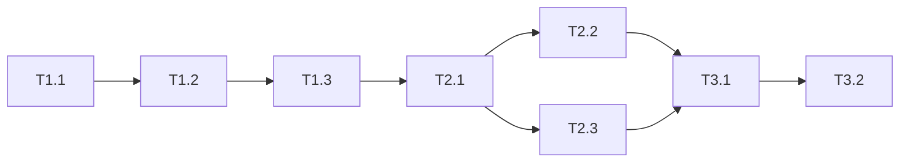

# IMPLEMENTATION_PLAN: vibex-mermaid-render-fix

> **项目**: vibex-mermaid-render-fix | **Architect**: Architect Agent | **版本**: v1.0

---

## Phase 1: MermaidManager 核心实现

### Task 1.1: 创建 MermaidManager 单例类

**功能点**: F1.1 - MermaidManager 单例

**验收标准**:
```typescript
// expect(MermaidManager.getInstance()).toBe(MermaidManager.getInstance())
const m1 = MermaidManager.getInstance();
const m2 = MermaidManager.getInstance();
expect(m1).toBe(m2);
```

**文件**: `src/lib/mermaid/MermaidManager.ts`

**检查清单**:
- [x] 类实现单例模式
- [x] getInstance() 返回同一实例
- [x] 导出类型 IMermaidManager

---

### Task 1.2: 实现 initialize() 方法

**功能点**: F1.2 - 预初始化调用

**验收标准**:
```typescript
// expect(() => { mermaidManager.initialize() }).not.toThrow()
await expect(manager.initialize()).resolves.not.toThrow();
```

**文件**: `src/lib/mermaid/MermaidManager.ts`

**检查清单**:
- [x] initialize() 返回 Promise
- [x] 幂等调用（多次调用只初始化一次）
- [x] 调用 mermaid.initialize() 配置 theme='dark', securityLevel='loose'

---

### Task 1.3: 实现 render() 方法

**功能点**: F1.3 - 统一配置

**验收标准**:
```typescript
// expect(await mermaidManager.render('graph TD; A-->B')).resolves.toContain('<svg>')
const svg = await manager.render('graph TD; A-->B');
expect(svg).toContain('<svg');
```

**文件**: `src/lib/mermaid/MermaidManager.ts`

**检查清单**:
- [x] render() 接收 code 参数
- [x] 返回包含 `<svg>` 的 Promise
- [x] 未初始化时自动调用 initialize()

---

### Task 1.4: Layout 预初始化集成

**功能点**: F1.2 - 预初始化调用

**验收标准**:
```typescript
// layout.tsx useEffect 中调用不抛出错误
```

**文件**: `src/app/layout.tsx`

**检查清单**:
- [x] useEffect 中调用 mermaidManager.initialize()
- [x] 添加 try-catch 防止初始化失败影响 UI

---

## Phase 2: MermaidPreview 组件重构

### Task 2.1: 重构 MermaidPreview 使用 MermaidManager

**功能点**: F2.1 - MermaidPreview 重构

**验收标准**:
```typescript
// expect(await mermaidManager.render('graph TD;A-->B')).resolves.toContain('<svg>')
```

**文件**: `src/components/ui/MermaidPreview.tsx`

**检查清单**:
- [x] 移除原有的 getMermaid() 方法
- [x] 使用 mermaidManager.render() 替代
- [x] 状态管理: idle → loading → success/error

---

### Task 2.2: 添加降级显示方案

**功能点**: F2.2 - 降级方案

**验收标准**:
```typescript
// 传入 invalid code 后 expect(screen.getByText('查看原始代码')).toBeTruthy()
render(<MermaidPreview code="invalid" />);
expect(screen.getByText('查看原始代码')).toBeInTheDocument();
```

**文件**: `src/components/ui/MermaidPreview.tsx`

**检查清单**:
- [x] 错误状态显示 `<details><summary>查看原始代码</summary><pre>{code}</pre></details>`
- [x] 保持用户可查看原始 Mermaid 代码

---

### Task 2.3: 改进错误消息

**功能点**: F2.3 - 错误消息改进

**验收标准**:
```typescript
// 语法错误时 expect(error).toMatch(/语法/)
expect(errorMessage).toMatch(/语法|Syntax/i);
```

**文件**: `src/components/ui/MermaidPreview.tsx`

**检查清单**:
- [x] 从 "图表渲染失败" 改为具体原因
- [x] 区分: 语法错误 / 初始化失败 / 渲染失败

---

## Phase 3: 清理与验证

### Task 3.1: 移除旧组件引用

**功能点**: F3.1 - 移除旧组件引用

**验收标准**:
```typescript
// PreviewArea 中不引用 MermaidRenderer
const previewAreaCode = fs.readFileSync('src/components/homepage/PreviewArea/PreviewArea.tsx', 'utf-8');
expect(previewAreaCode).not.toContain('MermaidRenderer');
```

**文件**: `src/components/homepage/PreviewArea/PreviewArea.tsx`

**检查清单**:
- [x] 移除 MermaidRenderer 导入
- [x] 替换为 MermaidPreview

---

### Task 3.2: 构建验证

**验收标准**:
```bash
npm run build
# 成功，无警告
```

**检查清单**:
- [ ] npm run build 通过
- [ ] 无 TypeScript 错误
- [ ] 无 ESLint 警告

---

## 任务依赖图



---

## 预估工时

| Phase | 任务数 | 预估工时 |
|-------|--------|----------|
| Phase 1 | 4 | 1.0h |
| Phase 2 | 3 | 1.5h |
| Phase 3 | 2 | 0.5h |
| **总计** | **9** | **3.0h** |

---

*IMPLEMENTATION_PLAN generated by Architect Agent | 2026-03-20*
