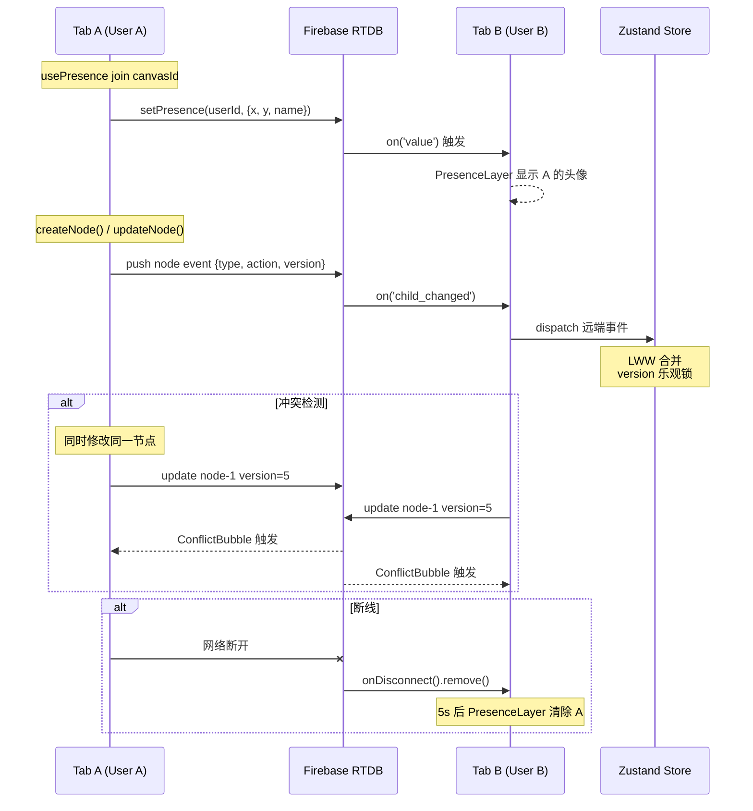
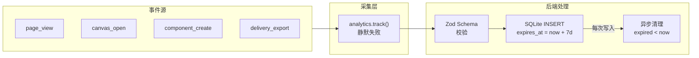
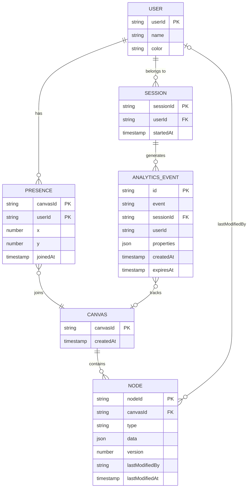

# VibeX Next — Technical Architecture

**项目**: vibex-next
**状态**: 已完成（代码已推送 origin/main）
**日期**: 2026-04-20
**版本**: 2.0（架构升级版）

---

## 执行决策

- **决策**: 已采纳
- **执行日期**: 2026-04-20
- **代码推送**: origin/main（commits: 53274d97, 862fb85a, 7eb32abe, 2675a813, ff0cd56b, 1ac78dcd, 1277e652, 04dff5f3, 1d3870bb, e75641c4）
- **team-tasks 项目**: vibex-next

---

## 1. Tech Stack

### 前端（vibex-fronted）

| 技术 | 版本 | 选型理由 |
|------|------|----------|
| Next.js | 15.x | 现有架构，基于 Pages Router |
| React | 18.x | 现有架构 |
| TypeScript | 5.x | 现有架构，全项目类型覆盖 |
| Zustand | 4.x | 画布状态管理，协作场景需轻量 Store |
| Firebase JS SDK | 10.x | Realtime Database 用于 Presence 和节点同步 |
| Vitest | 2.x | 单元测试框架（轻量、快速） |
| Playwright | 1.x | 端到端测试（双 Tab 协作验证） |

### 后端（vibex-backend）

| 技术 | 版本 | 选型理由 |
|------|------|----------|
| Hono | 4.x | 轻量 REST 框架，Cloudflare Workers 兼容 |
| TypeScript | 5.x | 与前端统一语言栈 |
| Zod | 3.x | Schema 校验（analytics 事件校验） |
| better-sqlite3 | — | SQLite 存储 analytics 事件 |
| Vitest | 2.x | 后端单元测试 |

### 基础设施

| 技术 | 用途 |
|------|------|
| Firebase Realtime Database | Presence + 节点同步（无需自建 WebSocket 服务端） |
| Cloudflare Workers | 部署环境（Hono 天然兼容） |
| CircleBuffer | 内存数据滚动（metrics 5 分钟 TTL） |

### 版本约束

- Firebase JS SDK 需 10.x+（支持 Realtime Database `onDisconnect` API）
- Hono 需 4.x+（Cloudflare Workers 适配器稳定）
- Vitest 需 2.x+（`global` 配置与 Jest 行为一致）
- Node.js ≥ 18（Cloudflare Workers 运行时要求）

---

## 2. 架构图

### 2.1 系统整体架构

```mermaid
flowchart TB
    subgraph Frontend["前端 (vibex-fronted)"]
        UI[Canvas UI<br/>PresenceLayer<br/>ConflictBubble]
        Store[Zustand Store<br/>canvasStore]
        Hooks[Hooks<br/>usePresence<br/>useWebVitals<br/>useCollaboration]
        AnalyticsClient["Analytics Client SDK<br/>analytics.track()"]
        WebSocketClient["Firebase RTDB Client<br/>presence + node sync"]
    end

    subgraph Backend["后端 (vibex-backend)"]
        subgraph API["Hono Routes"]
            Health["GET /api/v1/health<br/>P50/P95/P99"]
            Analytics["POST /api/v1/analytics<br/>单条/批量"]
        end
        subgraph Middleware["中间件"]
            MetricsMiddleware["metricsMiddleware<br/>5min CircleBuffer"]
        end
        subgraph Storage["存储"]
            SQLite[("SQLite<br/>analytics_events")]
            MemBuffer[("内存<br/>CircleBuffer<br/>metrics") ]
        end
    end

    subgraph External["外部服务"]
        FirebaseRTDB[("Firebase<br/>Realtime Database<br/>presence + nodes")]
    end

    UI --> Store
    Store --> Hooks
    Hooks --> WebSocketClient
    Hooks --> AnalyticsClient
    WebSocketClient <--> FirebaseRTDB
    AnalyticsClient -->|POST /api/v1/analytics| Analytics
    UI -->|LCP/CLS metrics| Hooks
    Health --> MetricsMiddleware
    MetricsMiddleware --> MemBuffer
    Analytics --> SQLite
    Analytics -->|cleanup| Analytics
```

### 2.2 协作数据流



### 2.3 Analytics 数据流



---

## 3. API 定义

### 3.1 GET /api/v1/health

**用途**: 性能可观测性端点，返回 API 延迟百分位数。

**请求**
```
GET /api/v1/health
```

**响应 200**
```json
{
  "status": "ok",
  "timestamp": 1713638400000,
  "latency": {
    "p50": 12,
    "p95": 38,
    "p99": 47,
    "window": "5m",
    "samples": 1420
  },
  "uptime": 86400
}
```

**响应 500**
```json
{
  "status": "error",
  "error": "Metrics unavailable",
  "timestamp": 1713638400000
}
```

**约束**
- 响应时间 < 50ms（无 DB 查询，纯内存计算）
- 5 分钟滚动窗口，超出窗口记录自动清除

### 3.2 POST /api/v1/analytics

**用途**: 事件采集端点，支持单条和批量上报。

**请求（单条）**
```json
POST /api/v1/analytics
Content-Type: application/json

{
  "event": "page_view",
  "sessionId": "s_abc123",
  "userId": "u_xyz789",
  "timestamp": 1713638400000,
  "properties": {
    "path": "/project/canvas-123",
    "referrer": "/dashboard"
  }
}
```

**请求（批量，≤ 500 条）**
```json
POST /api/v1/analytics
Content-Type: application/json

[
  { "event": "page_view", "sessionId": "s1", "timestamp": 1713638400000 },
  { "event": "canvas_open", "sessionId": "s1", "timestamp": 1713638401000 },
  { "event": "component_create", "sessionId": "s1", "timestamp": 1713638402000 }
]
```

**响应 200**
```json
{
  "received": 3,
  "ids": ["ev_001", "ev_002", "ev_003"]
}
```

**响应 400**
```json
{
  "error": "Invalid event schema",
  "details": [{ "field": "event", "message": "Required" }]
}
```

**约束**
- `event` 枚举: `page_view` | `canvas_open` | `component_create` | `delivery_export`
- `timestamp` 必填，毫秒时间戳
- `sessionId` 必填
- `userId` 可选（不关联 PII）
- 批量上限: 500 条/请求
- 静默失败: 端点异常不阻断用户操作

---

## 4. 数据模型

### 4.1 Firebase RTDB 结构

```
/presence
  /{canvasId}
    /{userId}
      .value: { name, color, x, y, joinedAt }
      .priority: timestamp

/nodes
  /{canvasId}
    /{nodeId}
      .value: { type, data, version, lastModifiedBy, lastModifiedAt }
      .priority: version
```

### 4.2 SQLite Schema

```sql
CREATE TABLE IF NOT EXISTS analytics_events (
  id TEXT PRIMARY KEY,            -- ev_<nanoid>
  event TEXT NOT NULL,            -- 事件类型
  session_id TEXT,                -- 会话标识（可选）
  user_id TEXT,                   -- 可选，匿名 UUID（无 PII）
  properties TEXT,                 -- JSON 字符串
  created_at INTEGER NOT NULL,    -- 毫秒时间戳
  expires_at INTEGER NOT NULL     -- created_at + 7 天
);

CREATE INDEX idx_expires ON analytics_events(expires_at);
CREATE INDEX idx_session ON analytics_events(session_id);
```

### 4.3 核心实体关系



---

## 5. Testing Strategy

### 5.1 测试框架

| 层级 | 框架 | 工具 |
|------|------|------|
| 前端单元 | Vitest | `@vitest/browser` + Playwright provider |
| 后端单元 | Vitest | `node:test` 或 `vitest` |
| E2E 协作 | Playwright | 双 Tab 测试 |
| 类型检查 | TypeScript | `tsc --noEmit` |

### 5.2 覆盖率要求

| 模块 | 覆盖率目标 | 关键路径 |
|------|-----------|---------|
| usePresence hook | ≥ 80% | join/leave/timeout/guard |
| WebSocket 消息路由 | ≥ 80% | node:create/update/delete |
| LWW 冲突合并 | ≥ 80% | version 比较/覆盖 |
| /health 端点 | ≥ 90% | p50/p95/p99/ttl/error |
| /analytics 端点 | ≥ 90% | schema 校验/批量/ttl |
| ConflictBubble 组件 | ≥ 80% | render/animation/dismiss |
| useWebVitals hook | ≥ 80% | threshold/warn/ssr-guard |

### 5.3 核心测试用例

#### E1-S1: Firebase Presence

```typescript
// vitest: presence.test.ts
describe('usePresence', () => {
  it('join: 写入 RTDB presence 路径', async () => {
    const { result } = renderHook(() => usePresence('canvas-1', 'user-1'));
    act(() => result.current.join());
    expect(mockRTDB.ref).toHaveBeenCalledWith('presence/canvas-1/user-1');
  });

  it('断线 5s: onDisconnect 清除', async () => {
    const { result } = renderHook(() => usePresence('canvas-1', 'user-1'));
    act(() => result.current.join());
    expect(mockOnDisconnect.remove).toHaveBeenCalled();
  });

  it('SSR guard: typeof window === undefined 时不报错', () => {
    const fn = () => usePresence('canvas-1', 'user-1');
    expect(fn).not.toThrow();
  });
});
```

#### E1-S2: 节点同步 LWW

```typescript
// vitest: collaboration-lww.test.ts
describe('LWW Conflict Resolution', () => {
  it('version 高者覆盖 version 低者', () => {
    const local = { id: 'n1', version: 5, lastModifiedAt: 1000, data: { color: 'red' } };
    const remote = { id: 'n1', version: 6, lastModifiedAt: 800, data: { color: 'blue' } };
    const resolved = resolveLWW(local, remote);
    expect(resolved.data.color).toBe('blue'); // version 6 胜出
  });

  it('version 相等时 timestamp 决定胜负', () => {
    const local = { id: 'n1', version: 5, lastModifiedAt: 1000, data: { color: 'red' } };
    const remote = { id: 'n1', version: 5, lastModifiedAt: 1100, data: { color: 'blue' } };
    const resolved = resolveLWW(local, remote);
    expect(resolved.data.color).toBe('blue'); // timestamp 1100 胜出
  });
});
```

#### E2-S1: /health 端点

```typescript
// vitest: health.test.ts
describe('GET /api/v1/health', () => {
  it('返回 p50/p95/p99，响应 200', async () => {
    const res = await fetch('/api/v1/health');
    expect(res.status).toBe(200);
    const body = await res.json();
    expect(body.latency).toHaveProperty('p50');
    expect(body.latency).toHaveProperty('p95');
    expect(body.latency).toHaveProperty('p99');
    expect(body.latency.p50).toBeLessThan(body.latency.p95);
    expect(body.latency.p95).toBeLessThan(body.latency.p99);
  });

  it('响应时间 < 50ms', async () => {
    const t0 = Date.now();
    await fetch('/api/v1/health');
    expect(Date.now() - t0).toBeLessThan(50);
  });

  it('5 分钟窗口外记录自动清除', () => {
    const old = { timestamp: Date.now() - 6 * 60 * 1000, duration: 100 };
    metrics.push(old);
    const { p99 } = calculatePercentiles(metrics);
    expect(metrics.find(r => r.timestamp === old.timestamp)).toBeUndefined();
  });
});
```

#### E3-S3: /analytics 端点

```typescript
// vitest: analytics.test.ts
describe('POST /api/v1/analytics', () => {
  it('单条: 返回 received=1, status 200', async () => {
    const res = await fetch('/api/v1/analytics', {
      method: 'POST',
      body: JSON.stringify({ event: 'page_view', sessionId: 's1', timestamp: Date.now() }),
      headers: { 'Content-Type': 'application/json' },
    });
    expect(res.status).toBe(200);
    expect((await res.json()).received).toBe(1);
  });

  it('批量 100 条: 返回 received=100, status 200', async () => {
    const events = Array.from({ length: 100 }, (_, i) => ({
      event: 'test', sessionId: `s${i}`, timestamp: Date.now(),
    }));
    const res = await fetch('/api/v1/analytics', {
      method: 'POST',
      body: JSON.stringify(events),
      headers: { 'Content-Type': 'application/json' },
    });
    expect(res.status).toBe(200);
    expect((await res.json()).received).toBe(100);
  });

  it('超过 500 条: 返回 400', async () => {
    const events = Array.from({ length: 501 }, () => ({
      event: 'test', sessionId: 's1', timestamp: Date.now(),
    }));
    const res = await fetch('/api/v1/analytics', {
      method: 'POST',
      body: JSON.stringify(events),
      headers: { 'Content-Type': 'application/json' },
    });
    expect(res.status).toBe(400);
  });

  it('expires_at = created_at + 7 天', async () => {
    const before = Date.now();
    await fetch('/api/v1/analytics', {
      method: 'POST',
      body: JSON.stringify({ event: 'page_view', sessionId: 's1', timestamp: Date.now() }),
      headers: { 'Content-Type': 'application/json' },
    });
    const row = await db.get('SELECT expires_at FROM analytics_events ORDER BY created_at DESC LIMIT 1');
    expect(row.expires_at - row.created_at).toBe(7 * 24 * 60 * 60 * 1000);
  });

  it('7 天过期数据查询为空', async () => {
    const expiredEvent = { event: 'test', sessionId: 's_exp', timestamp: Date.now() - 8 * 24 * 60 * 60 * 1000 };
    await fetch('/api/v1/analytics', {
      method: 'POST',
      body: JSON.stringify(expiredEvent),
      headers: { 'Content-Type': 'application/json' },
    });
    await analytics.cleanup();
    const result = await db.all('SELECT * FROM analytics_events WHERE expires_at < ?', [Date.now()]);
    expect(result.length).toBe(0);
  });
});
```

#### Playwright E2E: 双 Tab 协作

```typescript
// playwright: collaboration.spec.ts
test('Tab A 创建节点，Tab B 在 3s 内看到', async ({ browser }) => {
  const pageA = await browser.newPage();
  const pageB = await browser.newPage();
  await pageA.goto('/project/canvas-123');
  await pageB.goto('/project/canvas-123');

  await pageA.evaluate(() => (window as any).__testCreateNode({ type: 'rect', x: 100, y: 100 }));
  const t0 = Date.now();
  await pageB.waitForSelector('[data-testid="canvas-node"]', { timeout: 4000 });
  expect(Date.now() - t0).toBeLessThan(3000);
});

test('Presence: 关闭 Tab B，Tab A 5s 后头像消失', async ({ browser }) => {
  const pageA = await browser.newPage();
  const pageB = await browser.newPage();
  await pageA.goto('/project/canvas-123');
  await pageB.goto('/project/canvas-123');
  await pageA.waitForSelector('[data-testid="presence-avatar"]', { timeout: 3000 });

  await pageB.close();
  await pageA.waitForTimeout(6000);
  const count = await pageA.locator('[data-testid="presence-avatar"]').count();
  expect(count).toBe(1); // 只剩自己
});
```

---

## 6. 模块划分与依赖关系

```
vibex-fronted/
├── src/
│   ├── lib/
│   │   ├── firebase/
│   │   │   └── presence.ts          # E1-S1: usePresence hook
│   │   ├── websocket/
│   │   │   ├── MessageRouter.ts     # E1-S2: 节点消息路由
│   │   │   └── collaborationSync.ts # E1-S2: 协作同步逻辑
│   │   └── analytics/
│   │       └── client.ts             # E3-S3: analytics SDK
│   ├── hooks/
│   │   ├── useWebVitals.ts           # E2-S2: LCP/CLS 监测
│   │   └── useCollaboration.ts       # E1-S4: 重连与降级
│   ├── components/
│   │   ├── canvas/
│   │   │   ├── PresenceLayer.tsx    # E1-S1: 在线用户头像
│   │   │   └── ConflictBubble.tsx   # E1-S3: 冲突提示气泡
│   │   └── ui/
│   │       └── Toast.ts              # E1-S4: 单用户降级提示
│   └── stores/
│       └── canvasStore.ts            # E1-S2: LWW 状态合并

vibex-backend/
├── src/
│   ├── middleware/
│   │   └── metrics.ts                # E2-S1: 5min CircleBuffer
│   ├── routes/v1/
│   │   ├── health.ts                 # E2-S1: GET /health
│   │   └── analytics.ts             # E3-S3: POST /analytics
│   └── lib/
│       └── analytics-cleanup.ts     # E2-S3: 7天 TTL 清理
```

---

## 7. 风险评估

| 风险 | 可能性 | 影响 | 缓解策略 |
|------|--------|------|---------|
| Firebase 在企业内网不可达 | 中 | 高 | E1-S4 单用户降级，界面显示 toast，后续迁移 Yjs |
| Firebase Presence 当前为 Mock 实现，未接入真实 Firebase | 中 | 中 | 待真实 Firebase 接入后替换 mock store |
| LWW 冲突合并在高并发下不收敛 | 低 | 中 | 监控冲突频率，超阈值触发告警，后续升级 Yjs |
| analytics 事件枚举与 PRD 不一致 | 低 | 中 | 更新 PRD 或扩展 ALLOWED_EVENTS（需产品确认） |
| legacy Hono 路由标记 `@deprecated` | 低 | 中 | 已规划迁移 App Router（`src/app/api/v1/`） |
| analytics SDK 尚未集成到 UI（track() 未调用） | 低 | 中 | 在画布组件中调用 analytics.track() |
| analytics 数据量超出 SQLite 容量 | 低 | 低 | 7 天滚动 + 按需聚合，监控表大小 |
| WebVitals 在 SSR 中报错 | 低 | 低 | `typeof window === 'undefined'` guard |
| /health 内存泄漏（CircleBuffer 未清理） | 低 | 中 | 每次 push 前先过滤超 TTL 记录 |
| 批量上报超过 500 条导致响应超时 | 低 | 低 | 端点校验，> 500 返回 400 |

---

## 8. 非功能性约束

| 指标 | 目标 | 验证方式 |
|------|------|---------|
| 节点同步延迟 | < 3s (P95) | Playwright 双 Tab E2E |
| /health 响应时间 | < 50ms | 性能测试 |
| 批量 analytics 上限 | 500 条/请求 | 单元测试 |
| Presence 断线清除 | 5s | Playwright E2E |
| ConflictBubble 动画 | < 200ms | CSS animation-duration 测试 |
| npm build | 0 error | CI 验证 |
| type-check | 0 error | `tsc --noEmit` |
| 覆盖率 | > 80% (核心模块) | Vitest coverage |

---

_Architect Agent | 2026-04-20 22:25 GMT+8_

---

## 附录：架构审查发现

> 以下为 /plan-eng-review 自审查结果（代码已完成，仅文档校正）

### ✅ 架构合理性

- Tech Stack 选型合理：Firebase RTDB（Hono + Cloudflare Workers 天然兼容），Vitest/Playwright（前端测试生态成熟）
- 数据流清晰：Presence → Firebase RTDB → Store LWW 合并 → UI 更新
- 性能约束正确：/health 无 DB 查询，响应 < 50ms
- analytics 静默失败设计正确：不影响用户操作

### ⚠️ 需关注项

1. **Firebase Presence 是 Mock 实现**：`src/lib/firebase/presence.ts` 使用内存 Map 模拟 Firebase RTDB，真实 Firebase 接入需替换 mock store
2. **事件枚举与 PRD 不一致**：PRD 定义 `page_view/canvas_open/component_create/delivery_export`，实际实现 `project_create/treemap_complete/ai_generate/export/collab_enabled/node_sync/health_warning`，需产品确认
3. **路由迁移状态**：`/api/v1/analytics` 和 `/api/v1/health` 标记 `@deprecated`（legacy Cloudflare Workers），新实现应使用 App Router
4. **analytics SDK 尚未集成到 UI**：`track()` 在 `client.ts` 定义，但未在画布组件中调用（PRD 中 4 个采集点未落地）

### 📋 Action Items

- [ ] 产品确认 analytics 事件枚举（当前实现 vs PRD）
- [ ] Firebase 真实接入（替换 mock store）
- [ ] analytics SDK 集成到 UI 组件（track() 调用）
- [ ] 完成 App Router 迁移（废弃 legacy Hono 路由）

### 测试覆盖率评估

| 模块 | 覆盖率目标 | 状态 |
|------|-----------|------|
| usePresence | ≥ 80% | ⚠️ mock vs real 行为差异需覆盖 |
| collaborationSync | ≥ 80% | ✅ 已有 `collaborationSync.test.ts` |
| /health | ≥ 90% | ✅ 已有 `health.test.ts` |
| /analytics | ≥ 90% | ✅ 有端点测试 |
| ConflictBubble | ≥ 80% | ⚠️ 需验证 Storybook stories 是否覆盖 |
| useWebVitals | ≥ 80% | ⚠️ 需验证 |
| analytics client SDK | ≥ 80% | ⚠️ 需验证 |
