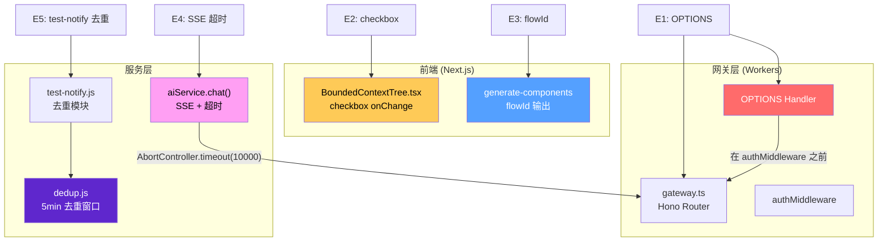
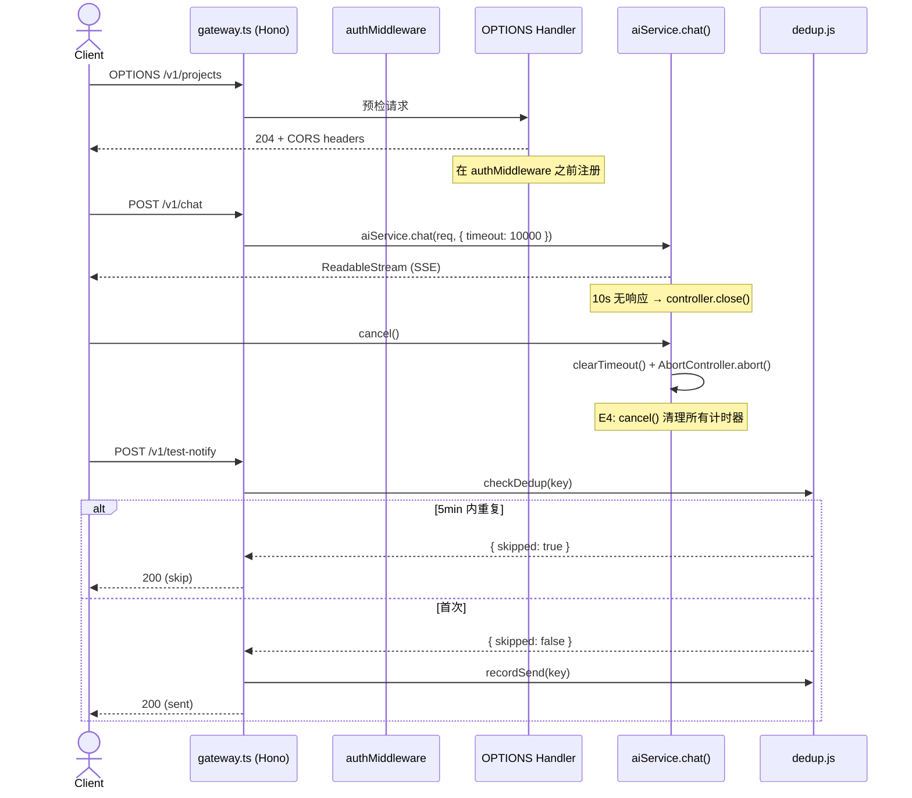

# VibeX P0 Bug 修复架构文档

> **项目**: vibex-p0-fixes-20260406  
> **作者**: architect  
> **日期**: 2026-04-06  
> **版本**: v1.0

---

## 执行决策

- **决策**: 已采纳
- **执行项目**: vibex-p0-fixes-20260406
- **执行日期**: 2026-04-06

---

## Tech Stack

| 层级 | 技术 | 版本 | 说明 |
|------|------|------|------|
| 后端 | Cloudflare Workers | stable | VibeX 线上环境 |
| API 框架 | Hono | ^4.0 | `/v1/*` 路由系统 |
| 前端 | Next.js 15 (App Router) | ^15.0 | React Server Components |
| 状态管理 | Zustand | ^5.0 | Canvas 子 store |
| 测试 | Jest + Playwright | latest | 单元 + E2E |
| 去重存储 | 文件系统 (.dedup-cache.json) | - | JS 版去重 |

---

## 架构图

### Epic 关系



### 数据流序列图（OPTIONS + SSE 超时）



---

## Epic 接口定义

### E1: OPTIONS 预检 CORS 修复

**涉及文件**: `gateway.ts`

```typescript
// gateway.ts 路由注册顺序（修复后）
app.options('/v1/*', optionsHandler)   // ← 在 authMiddleware 之前
app.use('/v1/*', authMiddleware)        // ← 鉴权中间件
app.post('/v1/*', protectedHandler)
```

**验收标准**:
- `OPTIONS /v1/projects` → `status: 204`
- `Access-Control-Allow-Origin: *`
- GET/POST/DELETE 请求不受影响

---

### E2: Canvas Context checkbox 修复

**涉及文件**: `BoundedContextTree.tsx`

```typescript
// BoundedContextTree.tsx (修复后)
<Checkbox
  checked={isSelected}
  onChange={() => onToggleSelect(node.id)}  // ✅ 正确
  // 不再调用 toggleContextNode
/>
```

**验收标准**:
- `expect(onToggleSelect).toHaveBeenCalledWith(nodeId)` ✓
- `expect(toggleContextNode).not.toHaveBeenCalled()` for checkbox ✓

---

### E3: generate-components flowId 修复

**涉及文件**: schema + prompt 文件

```typescript
// Component schema (修复后)
interface GeneratedComponent {
  id: string
  name: string
  type: string
  flowId: string   // ✅ 新增
}

// Prompt 明确要求
// "Output JSON with: id, name, type, flowId (format: flow-xxx)"
```

**验收标准**:
- `expect(component.flowId).toMatch(/^flow-/)` ✓
- `expect(flowId).not.toBe('unknown')` ✓

---

### E4: SSE 超时 + 连接清理

**涉及文件**: `aiService.ts`

```typescript
async function chat(req: ChatRequest): Promise<ReadableStream> {
  const controller = new AbortController()
  let timer: ReturnType<typeof setTimeout>

  const timeoutPromise = new Promise<never>((_, reject) => {
    timer = setTimeout(() => {
      controller.abort()
      reject(new Error('AI request timeout after 10s'))
    }, 10000)
  })

  try {
    const stream = await Promise.race([
      aiProvider.chat(req.messages, { signal: controller.signal }),
      timeoutPromise
    ])

    return new ReadableStream({
      cancel() {
        if (timer) clearTimeout(timer)  // ✅ 关键修复
        controller.abort()
      }
    })
  } catch (err) {
    if (timer) clearTimeout(timer)  // ✅ 异常时清理
    throw err
  }
}
```

**验收标准**:
- `expect(stream).toBeInstanceOf(ReadableStream)` ✓
- 10s 无响应 → `controller.close()` ✓
- `cancel()` → `clearTimeout` 被调用 ✓

---

### E5: test-notify 去重

**涉及文件**: `dedup.js`（新建）、`test-notify.js`

```typescript
// dedup.js
const CACHE_FILE = '.dedup-cache.json'
const DEDUP_WINDOW_MS = 5 * 60 * 1000

export function checkDedup(key: string): { skipped: boolean } {
  const cache = loadCache()
  const entry = cache[key]
  if (entry && Date.now() - entry.timestamp < DEDUP_WINDOW_MS) {
    return { skipped: true }
  }
  return { skipped: false }
}

export function recordSend(key: string): void {
  const cache = loadCache()
  cache[key] = { timestamp: Date.now() }
  saveCache(cache)
}

// test-notify.js 集成
import { checkDedup, recordSend } from './dedup'

export async function handleTestNotify(event: TestEvent): Promise<void> {
  const dedupKey = `test:${event.testId}:${event.status}`
  const { skipped } = checkDedup(dedupKey)
  if (skipped) return
  await sendWebhook(event)
  recordSend(dedupKey)
}
```

**验收标准**:
- `expect(checkDedup(key).skipped).toBe(true)` 5min 内重复 ✓
- 状态持久化到 `.dedup-cache.json` ✓
- `expect(webhookCalls).toBe(1)` for duplicate ✓

---

## 技术审查

| 风险 | 级别 | 缓解措施 |
|------|------|----------|
| OPTIONS 修改破坏其他中间件 | 中 | 仅调整顺序，完整回归测试 |
| SSE 超时破坏事件顺序 | 中 | 外层 try-catch |
| 去重文件损坏 | 低 | 启动时验证 JSON 有效性 |
| flowId 格式兼容性 | 低 | prompt 明确格式要求 |

---

## 测试策略

| 测试类型 | 框架 | 覆盖目标 |
|----------|------|----------|
| 单元测试 | Jest | 每个 Epic 核心逻辑 |
| API 测试 | Jest + supertest | E1 OPTIONS 路由 |
| 前端组件测试 | Jest + RTL | E2 Canvas checkbox |

**覆盖率要求**: > 80%

---

## 验收标准汇总

| ID | Given | When | Then |
|----|-------|------|------|
| AC1 | OPTIONS 请求 | `/v1/projects` | 204 + CORS headers |
| AC2 | Canvas checkbox | 点击 | selectedNodeIds 更新 |
| AC3 | generate-components | AI 输出 | flowId 不是 unknown |
| AC4 | SSE 流 | 10s 无响应 | 流关闭，Worker 不挂死 |
| AC5 | test-notify | 5min 内重复 | 跳过发送 |
