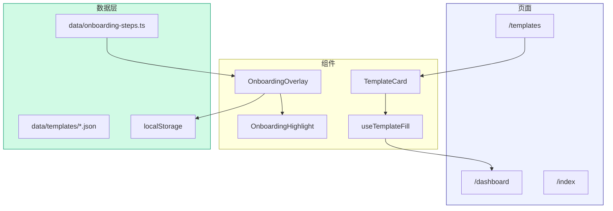
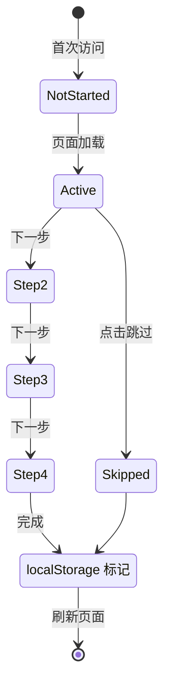

# Architecture: VibeX PM Features 2026-04-10

> **项目**: vibex-pm-features-20260410  
> **作者**: Architect  
> **日期**: 2026-04-10  
> **版本**: v1.0

---

## 执行决策

| 决策 | 状态 | 执行项目 | 执行日期 |
|------|------|----------|----------|
| 模板存储：静态 JSON 文件 | **已采纳** | vibex-pm-features-20260410 | 2026-04-10 |
| 引导实现：扩展现有 OnboardingOverlay | **已采纳** | vibex-pm-features-20260410 | 2026-04-10 |

---

## 1. Tech Stack

| 组件 | 技术选型 | 版本 | 说明 |
|------|----------|------|------|
| **框架** | Next.js | ^15.0 | App Router |
| **UI** | Tailwind CSS | ^3.4 | 样式 |
| **状态** | Zustand | ^4.5 | 本地状态 |
| **引导** | react-joyride | ^2.5 | 引导流程 |
| **测试** | Playwright | ^1.42 | E2E |
| **懒加载** | Next.js dynamic | — | 首屏优化 |

---

## 2. 架构图

### 2.1 模板系统架构



### 2.2 引导流程状态机



---

## 3. API 定义

### 3.1 模板数据结构

```typescript
// types/template.ts
export interface Template {
  id: string;
  name: string;
  industry: Industry;
  description: string;
  icon: string;
  entities: Entity[];
  boundedContexts: BoundedContext[];
  sampleRequirement: string;
  tags: string[];
  createdAt: string;
}

export type Industry = 'ecommerce' | 'social' | 'saas';

export interface Entity {
  name: string;
  type: 'aggregate' | 'entity' | 'value-object';
  attributes: Attribute[];
}

export interface BoundedContext {
  name: string;
  entities: string[]; // entity names
}

export interface Attribute {
  name: string;
  type: 'string' | 'number' | 'boolean' | 'date' | 'uuid' | 'array';
  optional?: boolean;
}
```

### 3.2 引导步骤配置

```typescript
// data/onboarding-steps.ts
export interface OnboardingStep {
  id: string;
  target: string;          // CSS selector
  title: string;
  content: string;
  placement?: 'top' | 'bottom' | 'left' | 'right';
  highlightPadding?: number;
}

export const ONBOARDING_STEPS: OnboardingStep[] = [
  {
    id: 'step-1',
    target: '[data-testid="requirement-input"]',
    title: '输入需求描述',
    content: '在这里输入您的产品需求描述',
    placement: 'top',
  },
  {
    id: 'step-2',
    target: '[data-testid="analyze-button"]',
    title: '发起分析',
    content: '点击按钮开始 AI 分析',
    placement: 'bottom',
  },
  {
    id: 'step-3',
    target: '[data-testid="domain-model"]',
    title: '查看结果',
    content: '分析完成后查看领域模型',
    placement: 'left',
  },
  {
    id: 'step-4',
    target: '[data-testid="export-button"]',
    title: '导出结果',
    content: '导出代码或继续编辑',
    placement: 'right',
  },
];
```

### 3.3 模板页面路由

| Method | Path | Description |
|--------|------|-------------|
| GET | `/templates` | 模板列表页 |
| GET | `/templates/:id` | 模板详情（可选） |

---

## 4. 数据模型

### 4.1 模板存储结构

```
data/
└── templates/
    ├── index.json          # 模板索引
    ├── ecommerce.json      # 电商模板
    ├── social.json         # 社交模板
    └── saas.json           # SaaS 模板
```

### 4.2 localStorage Keys

| Key | 类型 | 说明 |
|-----|------|------|
| `onboarding_v2_completed` | `boolean` | 引导是否完成 |
| `onboarding_v2_skipped` | `boolean` | 引导是否被跳过 |
| `last_template_used` | `string` | 最近使用的模板 ID |

---

## 5. 组件设计

### 5.1 TemplateCard

```typescript
// components/TemplateCard.tsx
interface TemplateCardProps {
  template: Template;
  onSelect: (template: Template) => void;
  isSelected?: boolean;
}

export function TemplateCard({ template, onSelect, isSelected }: TemplateCardProps) {
  return (
    <div
      data-testid={`template-card-${template.industry}`}
      className={cn(
        'rounded-lg border-2 p-4 cursor-pointer transition-all',
        isSelected ? 'border-blue-500 bg-blue-50' : 'border-gray-200 hover:border-blue-300'
      )}
      onClick={() => onSelect(template)}
    >
      <div className="flex items-center gap-2">
        <span className="text-2xl">{template.icon}</span>
        <div>
          <h3 className="font-semibold">{template.name}</h3>
          <p className="text-sm text-gray-500">{template.description}</p>
        </div>
      </div>
      <div className="mt-2 flex flex-wrap gap-1">
        {template.tags.map(tag => (
          <span key={tag} className="text-xs bg-gray-100 rounded px-1">{tag}</span>
        ))}
      </div>
    </div>
  );
}
```

### 5.2 OnboardingHighlight

```typescript
// components/OnboardingHighlight.tsx
interface OnboardingHighlightProps {
  target: string;        // CSS selector
  padding?: number;
  children?: React.ReactNode;
}

export function OnboardingHighlight({ target, padding = 8, children }: OnboardingHighlightProps) {
  const [rect, setRect] = useState<DOMRect | null>(null);

  useEffect(() => {
    const el = document.querySelector(target);
    if (el) {
      setRect(el.getBoundingClientRect());
    }
  }, [target]);

  if (!rect) return <>{children}</>;

  return (
    <>
      {/* Highlight overlay */}
      <div
        className="fixed pointer-events-none z-40"
        style={{
          top: rect.top - padding,
          left: rect.left - padding,
          width: rect.width + padding * 2,
          height: rect.height + padding * 2,
          boxShadow: `0 0 0 9999px rgba(0,0,0,0.5)`,
          borderRadius: 8,
        }}
      />
      {/* Tooltip */}
      {children}
    </>
  );
}
```

### 5.3 useOnboarding Hook

```typescript
// hooks/useOnboarding.ts
const ONBOARDING_KEY = 'onboarding_v2_completed';

export function useOnboarding() {
  const [isCompleted, setIsCompleted] = useState(false);
  const [isVisible, setIsVisible] = useState(false);

  useEffect(() => {
    const completed = localStorage.getItem(ONBOARDING_KEY) === 'true';
    setIsCompleted(completed);
    if (!completed) {
      setIsVisible(true);
    }
  }, []);

  const complete = useCallback(() => {
    localStorage.setItem(ONBOARDING_KEY, 'true');
    setIsCompleted(true);
    setIsVisible(false);
  }, []);

  const skip = useCallback(() => {
    localStorage.setItem('onboarding_v2_skipped', 'true');
    setIsVisible(false);
  }, []);

  return { isCompleted, isVisible, complete, skip };
}
```

---

## 6. 测试策略

### 6.1 E2E 测试

```typescript
// tests/e2e/onboarding.spec.ts

test('引导流程完整测试', async ({ page }) => {
  // 清除 localStorage
  await page.evaluate(() => localStorage.clear());
  await page.reload();

  // 验证引导弹出
  await expect(page.locator('[data-testid="onboarding-tooltip"]')).toBeVisible();

  // 验证 4 步引导
  const steps = page.locator('[data-testid="onboarding-step"]');
  await expect(steps).toHaveCount(4);

  // 点击完成
  await page.click('[data-testid="onboarding-complete"]');

  // 验证 localStorage
  const completed = await page.evaluate(() =>
    localStorage.getItem('onboarding_v2_completed')
  );
  expect(completed).toBe('true');

  // 刷新后引导不弹出
  await page.reload();
  await expect(page.locator('[data-testid="onboarding-tooltip"]')).not.toBeVisible();
});

test('跳过引导', async ({ page }) => {
  await page.evaluate(() => localStorage.clear());
  await page.reload();

  await page.click('[data-testid="onboarding-skip"]');

  const skipped = await page.evaluate(() =>
    localStorage.getItem('onboarding_v2_skipped')
  );
  expect(skipped).toBe('true');
});
```

---

## 7. 验收标准

| Story | 验收标准 | 测试 |
|--------|---------|------|
| S1.1 | 模板 JSON Schema 校验通过 | `pnpm test:unit` |
| S1.2 | /templates 显示 3 个行业模板 | `pnpm test:e2e` |
| S1.3 | 选择模板后输入框自动填充 | `pnpm test:e2e` |
| S2.1 | 引导步骤 ≤ 4，含跳过按钮 | `pnpm test:e2e` |
| S2.2 | Highlight 高亮正确，Tooltip 位置准确 | visual regression |
| S2.3 | 完成后 localStorage 标记，刷新不重复弹出 | `pnpm test:e2e` |

---

*文档版本: v1.0 | 最后更新: 2026-04-10*
