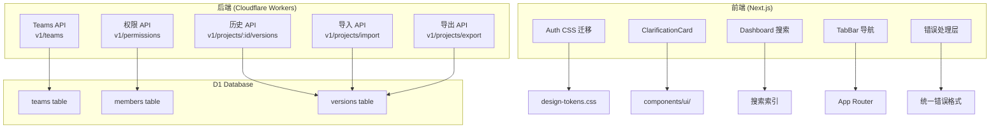
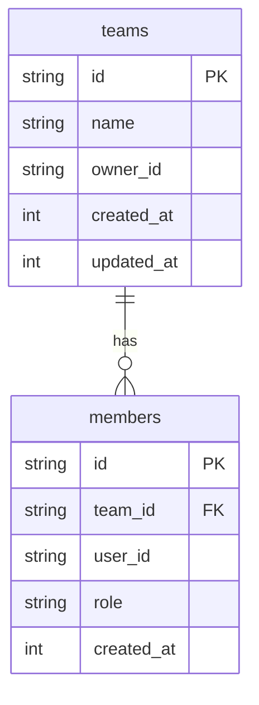

# Architecture: VibeX PM 提案 — 产品功能实现规划

> **类型**: Feature Implementation  
> **状态**: v1.0  
> **日期**: 2026-04-14  
> **依据**: prd.md (vibex-pm-proposals-20260414_143000)

---

## 1. Problem Frame

VibeX PM 提出 8 个产品改进 Epic：品牌一致性 (E1)、AI 澄清卡片 (E2)、Dashboard 搜索 (E3)、Canvas 导航 (E4)、错误体验 (E5)、团队协作 (E6)、版本历史 (E7)、导入导出 (E8)。本架构设计覆盖所有 Epic 的技术决策。

---

## 2. System Architecture

### 2.1 Architecture Diagram



### 2.2 模块划分

| Epic | 模块 | 路径 | 类型 |
|------|------|------|------|
| E1 | Auth CSS | `app/auth/` | 迁移 |
| E2 | ClarificationCard | `components/ui/ClarificationCard.tsx` | 新组件 |
| E3 | Dashboard Search | `components/dashboard/` | 新功能 |
| E4 | TabBar | `components/canvas/TabBar.tsx` | 修改 |
| E5 | Error Handler | `middleware.ts` + API routes | 全局 |
| E6 | Teams API | `routes/v1/teams/`, `routes/v1/permissions/` | 新 API |
| E7 | Version History | `routes/projects-snapshot.ts` + `components/` | 修改 |
| E8 | Import/Export | `routes/v1/projects/import.ts` | 新 API |

---

## 3. Technical Decisions

### 3.1 E1: Auth CSS Module 迁移

**决策**: 保持现有 `auth.module.css`，按 specs 逐项审计迁移。

**Trade-off**:  
- 当前 auth.module.css 已存在，说明之前已有迁移基础。完全重写风险高，按 spec 逐项迁移更稳妥。
- 不引入 CSS-in-JS（符合 DESIGN.md 规范）

**当前状态**: `app/auth/` 下已有 `auth.module.css`，仅需审计 `page.tsx` 中的内联样式（`validateReturnTo` 以外的内联 style={{}}）并迁移。

### 3.2 E2: ClarificationCard 组件

**决策**: 新建 `ClarificationCard.tsx`，参考 `ClarificationDialog.tsx` 的现有样式。

**Trade-off**:  
- `ClarificationDialog.tsx` 已实现对话式澄清卡片的基础样式，可复用
- ClarificationCard 需要独立使用（在 AI 对话流中内嵌），需从 Dialog 提取为独立组件

**组件设计**:
```typescript
interface ClarificationCardProps {
  question: string;
  options: ClarificationOption[];
  onSelect: (optionId: string) => void;
  onCustomInput?: (input: string) => void;
  variant?: 'inline' | 'modal';
}
```

### 3.3 E3: Dashboard Fuzzy Search

**决策**: 前端 debounce + 后端 D1 LIKE 查询，轻量实现（不引入外部搜索服务）。

**Trade-off**:  
- Pros: 无新依赖，与现有 D1 基础设施一致
- Cons: LIKE 查询在大数据集 (10k+ projects) 上性能差
- 缓解: 前端 debounce 300ms 减少查询频率；D1 自动索引 `name` 字段

**扩展路径**: 当 projects > 10k 时，迁移到 Cloudflare Search (Workers AI embedding)。

### 3.4 E4: Canvas TabBar Phase 导航

**决策**: 修改现有 `TabBar.tsx`，与 PhaseNavigator 行为对称。

**Trade-off**:  
- 现有 TabBar 和 PhaseNavigator 行为不一致是已知 bug，需要同时修改两处
- TabBar 负责切换 Phase，PhaseNavigator 负责 Phase 内导航，职责分离

### 3.5 E5: 统一错误处理（基于 architect-proposals 设计规范，自行实现）

**决策**: 参照 `vibex-architect-proposals-20260414_143000` 的 P1-3 **设计规范**，本项目自行实现 `lib/api-error.ts`。

**说明**: architect-proposals 的 P1-3 仅产出了**设计规范文档**（非代码），E5 需要自行实现。这是 **4h 实际工时**（工具函数 + 61 个后端路由全局替换），不是"复用"。

**Trade-off**: 参照设计规范而非复制代码，确保 E5 实现与 architect-proposals 的设计意图一致，同时由 PM 项目自主维护。

### 3.6 E6: 团队协作 API

**决策**: 新建 `routes/v1/teams/` 和 `routes/v1/permissions/`，D1 新增 `teams` 和 `members` 表。

**Schema**:
```sql
CREATE TABLE teams (
  id TEXT PRIMARY KEY,
  name TEXT NOT NULL,
  owner_id TEXT NOT NULL,
  -- owner_id 无 FK 到 users 表（users 表尚未迁移到 D1），暂为 TEXT
  created_at INTEGER DEFAULT (unixepoch()),
  updated_at INTEGER DEFAULT (unixepoch())
);

CREATE TABLE members (
  id TEXT PRIMARY KEY,
  team_id TEXT NOT NULL REFERENCES teams(id),
  user_id TEXT NOT NULL,
  role TEXT NOT NULL DEFAULT 'member',
  created_at INTEGER DEFAULT (unixepoch()),
  UNIQUE(team_id, user_id)
);

CREATE INDEX idx_members_team ON members(team_id);
CREATE INDEX idx_members_user ON members(user_id);
```

**API 路由**:
```
POST   /api/v1/teams           — 创建团队
GET    /api/v1/teams            — 列出我的团队
GET    /api/v1/teams/:id        — 获取团队详情
PUT    /api/v1/teams/:id        — 更新团队
DELETE /api/v1/teams/:id        — 删除团队（仅 owner）

POST   /api/v1/teams/:id/members — 添加成员
GET    /api/v1/teams/:id/members — 列出成员
PUT    /api/v1/teams/:id/members/:userId — 修改角色
DELETE /api/v1/teams/:id/members/:userId — 移除成员

GET    /api/v1/teams/:id/permissions/:resource — 检查权限
```

### 3.7 E7: 版本历史 + Diff

**决策**: 复用现有 `project-snapshot.ts` 路由，新增 `/versions` 子路由，修复 `projectId = null` 边界。

**Trade-off**:  
- 已有 snapshot 基础设施，扩展而非重建
- `projectId = null` 显示引导 UI 是前端路由逻辑，不需要 backend 改动

### 3.8 E8: 导入导出

**决策**: DDD schema 驱动的导入（解析 boundedContexts/domainModels），JSON/MD/YAML 通用解析器。

**DDD Import Schema** (V1 范围，仅 JSON/YAML):
```typescript
interface DDDImportSchema {
  boundedContexts: Array<{
    name: string;
    description?: string;
  }>;
  domainModels: Array<{
    name: string;
    boundedContext: string;
    attributes?: Array<{ name: string; type: string }>;
  }>;
}
// MD 格式作为 v2（PRD 和 specs 中的 MD 支持是范围蔓延，v1 仅实现 JSON/YAML）
```

---

## 4. API Design

### 4.1 E6 Teams API Contract

**POST /api/v1/teams**
```typescript
// Request
{ name: string }

// Response 201
{ id: string, name: string, owner_id: string, created_at: number }

// Response 400
{ error: { code: "VALIDATION_ERROR", message: string } }
```

**POST /api/v1/teams/:id/members**
```typescript
// Request
{ user_id: string, role: 'admin' | 'member' | 'viewer' }

// Response 201
{ id: string, team_id: string, user_id: string, role: string, created_at: number }

// Response 409
{ error: { code: "ALREADY_MEMBER", message: "User is already a member" } }
```

### 4.2 E8 Import/Export API Contract

**POST /api/v1/projects/import**
```typescript
// Request (multipart/form-data)
{ file: File, format: 'json' | 'md' | 'yaml' }

// Response 200
{
  bounded_contexts_count: number,
  domain_models_count: number,
  warnings: string[],
  data: ImportResult
}

// Response 400
{ error: { code: "PARSE_ERROR", message: string, line?: number } }
```

**POST /api/v1/projects/:id/export**
```typescript
// Request
{ format: 'json' | 'md' | 'yaml', include: ['boundedContexts', 'domainModels', 'businessFlows'] }

// Response 200
{ content: string, filename: string, content_type: string }
```

### 4.3 E5 统一错误格式（全局）

**Error Codes** (完整定义):
```typescript
const ERROR_CODES = {
  VALIDATION_ERROR: 400,
  UNAUTHORIZED: 401,
  FORBIDDEN: 403,
  NOT_FOUND: 404,
  CONFLICT: 409,
  RATE_LIMITED: 429,
  INTERNAL_ERROR: 500,
} as const;

// 使用方式
return apiError('VALIDATION_ERROR', 'name is required');
```

**apiError() 实现**:
```typescript
// vibex-backend/src/lib/api-error.ts
export function apiError(code: keyof typeof ERROR_CODES, message: string, details?: unknown) {
  const status = ERROR_CODES[code];
  return new Response(JSON.stringify({ error: { code, message, details } }), {
    status, headers: { 'Content-Type': 'application/json' }
  });
}
```

---

## 5. Data Models

### 5.1 E6 Teams Schema (D1)



### 5.2 E7 Version History Schema (复用现有)

```
versions table (已有) 字段: id, project_id, snapshot_json, created_at, message
```

---

## 6. Performance & Scale

| Epic | 性能关注点 | 缓解 |
|------|-----------|------|
| E3 | D1 LIKE 查询 10k+ 数据慢 | debounce 300ms；未来迁移 Search |
| E5 | 全局中间件每个请求多一次处理 | 中间件极轻量，无显著影响 |
| E6 | members 表 join 查询 | `user_id` 和 `team_id` 双索引 |
| E8 | 大文件解析内存 | Workers 50ms CPU 限制；限制文件大小 5MB |

---

## 7. Security Considerations

| Epic | 安全 | 措施 |
|------|------|------|
| E6 | 未授权访问团队 | 所有路由验证 JWT，检查 team membership |
| E6 | 权限提升 | 仅 owner 可删除团队；角色变更需 admin+ |
| E8 | XXE 注入 (XML) | 当前仅支持 JSON/MD/YAML，天然免疫 |
| E8 | 文件大小 DoS | 限制 5MB，Workers 请求体限制天然约束 |

---

## 8. Open Questions

| 问题 | 状态 | 处理 |
|------|------|------|
| E6 成员邀请方式（邮件/invite link） | 待定 | MVP 仅支持 user_id 直接添加 |
| E8 YAML 解析依赖 | 待定 | 评估 `yaml` npm 包 vs 纯手写 |
| E7 diff 可视化实现 | 待定 | 复用现有 VersionDiff 组件 |

---

## 9. Verification

- [ ] E1: `grep -rn "style={{" app/auth/page.tsx` 无结果
- [ ] E2: ClarificationCard 有 snapshot 测试
- [ ] E3: debounce 测试通过
- [ ] E4: TabBar 和 PhaseNavigator 行为对称测试
- [ ] E5: API 错误格式统一测试
- [ ] E6: Teams CRUD API 测试 + 权限测试
- [ ] E7: projectId=null 引导 UI 测试
- [ ] E8: 三种格式导入/导出 round-trip 测试

## 10. Testing Strategy

### 10.1 测试框架

| 层级 | 框架 | 位置 |
|------|------|------|
| 前端单元 | Vitest | vibex-fronted/src/__tests__/ |
| 前端 E2E | Playwright | vibex-fronted/playwright.config.ts |
| 后端单元 | Vitest | vibex-backend/src/__tests__/ |
| 后端 API | Vitest + Supertest | vibex-backend/src/__tests__/api/ |

### 10.2 覆盖率要求

| Epic | 覆盖率目标 | 测试类型 |
|------|-----------|----------|
| E1 Auth CSS | 回归覆盖 | Vitest snapshot |
| E2 ClarificationCard | > 80% | Vitest unit + snapshot |
| E3 Dashboard Search | E2E | Playwright E2E |
| E4 TabBar | 对称性测试 | Vitest 对称性测试 |
| E5 统一错误 | 集成覆盖 | API 集成测试 |
| E6 Teams API | > 70% | Vitest unit + API |
| E7 版本历史 | 边界覆盖 | Vitest 边界测试 |
| E8 Import/Export | 100% round-trip | Vitest 三格式 round-trip |

### 10.3 核心测试用例示例

#### E2 ClarificationCard (Vitest)

```typescript
// vibex-fronted/src/components/ui/ClarificationCard.test.tsx
describe('ClarificationCard', () => {
  it('renders question text', () => {
    render(<ClarificationCard question="What is the target audience?" options={[]} onSelect={() => {}} />);
    expect(screen.getByText('What is the target audience?')).toBeInTheDocument();
  });

  it('shows max 3 options', () => {
    const options = [{ id: '1', label: 'A' }, { id: '2', label: 'B' }, { id: '3', label: 'C' }, { id: '4', label: 'D' }];
    render(<ClarificationCard question="Q" options={options} onSelect={() => {}} />);
    expect(screen.getAllByRole('button')).toHaveLength(3); // max 3
  });

  it('triggers onSelect with option id', async () => {
    const onSelect = jest.fn();
    render(<ClarificationCard question="Q" options={[{ id: 'opt1', label: 'Option 1' }]} onSelect={onSelect} />);
    await userEvent.click(screen.getByText('Option 1'));
    expect(onSelect).toHaveBeenCalledWith('opt1');
  });
});
```

#### E5 API 错误格式 (Vitest Integration)

```typescript
// vibex-backend/src/__tests__/api/error-format.test.ts
describe('API Error Format', () => {
  it('returns { error: { code, message } } for VALIDATION_ERROR', async () => {
    const res = await api.post('/api/v1/projects', { name: '' });
    expect(res.status).toBe(400);
    expect(res.data).toMatchObject({
      error: { code: 'VALIDATION_ERROR', message: expect.any(String) }
    });
  });

  it('returns { error: { code, message } } for NOT_FOUND', async () => {
    const res = await api.get('/api/v1/projects/nonexistent-id');
    expect(res.status).toBe(404);
    expect(res.data).toMatchObject({ error: { code: 'NOT_FOUND' } });
  });
});
```

#### E8 Import/Export Round-trip (Vitest)

```typescript
// vibex-backend/src/__tests__/import-export.test.ts
describe('Import/Export Round-trip', () => {
  it('JSON: export -> import preserves boundedContexts', () => {
    const project = { name: 'Test', boundedContexts: [{ name: 'BC1' }], domainModels: [] };
    const exported = exportAsJSON(project);
    const imported = importFromJSON(exported);
    expect(imported.boundedContexts).toEqual(project.boundedContexts);
  });

  it('YAML: export -> import preserves domainModels', () => {
    const project = { name: 'Test', boundedContexts: [], domainModels: [{ name: 'DM1', boundedContext: 'BC1' }] };
    const exported = exportAsYAML(project);
    const imported = importFromYAML(exported);
    expect(imported.domainModels).toEqual(project.domainModels);
  });


  it('rejects files > 5MB', async () => {
    const largeFile = Buffer.alloc(6 * 1024 * 1024);
    const res = await api.post('/api/v1/projects/import', largeFile, {
      headers: { 'Content-Type': 'multipart/form-data' }
    });
    expect(res.status).toBe(413);
  });
});
```

### 10.4 CI 集成

- 所有 PR 必须通过 `pnpm test && pnpm playwright` 才能合并
- E2/E3 需要 snapshot 更新权限（需要 reviewer 手动 approval）
- 覆盖率低于阈值时 CI 失败

### 10.5 E2E 测试场景

| Epic | 测试场景 | 预期结果 |
|------|---------|----------|
| E3 | Dashboard 搜索 "project" | 返回匹配项目，响应 < 2s |
| E4 | TabBar 点击每个 tab | Phase 正确更新，刷新保持 |
| E5 | API 返回 401 | 前端显示人类可读 toast，有重试按钮 |
| E6 | 创建团队并添加成员 | 201 创建，成员列表正确 |
| E8 | 导出 JSON 后导入 | 内容一致，boundedContexts 不变 |

### 10.6 测试数据约定


- 使用 D1 fixture fixtures/teams.json 和 fixtures/projects.json
- Mock 外部 API（AI clarify）返回固定测试数据
- JWT 测试使用固定 test user token

---

## 10. Testing Strategy

### 10.1 测试框架

| 层级 | 框架 | 位置 |
|------|------|------|
| 前端单元 | Vitest | `vibex-fronted/src/__tests__/` |
| 前端 E2E | Playwright | `vibex-fronted/playwright.config.ts` |
| 后端单元 | Vitest | `vibex-backend/src/__tests__/` |
| 后端 API | Vitest + Supertest | `vibex-backend/src/__tests__/api/` |

### 10.2 覆盖率要求

| Epic | 覆盖率目标 | 测试类型 |
|------|-----------|---------|
| E1 Auth CSS | 回归覆盖 | Vitest snapshot |
| E2 ClarificationCard | > 80% | Vitest unit + snapshot |
| E3 Dashboard Search | E2E | Playwright E2E |
| E4 TabBar | 对称性测试 | Vitest 对称性测试 |
| E5 统一错误 | 集成覆盖 | API 集成测试 |
| E6 Teams API | > 70% | Vitest unit + API |
| E7 版本历史 | 边界覆盖 | Vitest 边界测试 |
| E8 Import/Export | 100% round-trip | Vitest 三格式 round-trip |

### 10.3 核心测试用例示例

#### E2 ClarificationCard (Vitest)


```typescript
// vibex-fronted/src/components/ui/ClarificationCard.test.tsx
describe('ClarificationCard', () => {
  it('renders question text', () => {
    render(<ClarificationCard question="What is the target audience?" options={[]} onSelect={() => {}} />);
    expect(screen.getByText('What is the target audience?')).toBeInTheDocument();
  });


  it('shows max 3 options', () => {
    const options = [{ id: '1', label: 'A' }, { id: '2', label: 'B' }, { id: '3', label: 'C' }, { id: '4', label: 'D' }];
    render(<ClarificationCard question="Q" options={options} onSelect={() => {}} />);
    expect(screen.getAllByRole('button')).toHaveLength(3); // max 3
  });


  it('triggers onSelect with option id', async () => {
    const onSelect = jest.fn();
    render(<ClarificationCard question="Q" options={[{ id: 'opt1', label: 'Option 1' }]} onSelect={onSelect} />);
    await userEvent.click(screen.getByText('Option 1'));
    expect(onSelect).toHaveBeenCalledWith('opt1');
  });
});
```


#### E5 API 错误格式 (Vitest Integration)


```typescript
// vibex-backend/src/__tests__/api/error-format.test.ts
describe('API Error Format', () => {
  it('returns { error: { code, message } } for VALIDATION_ERROR', async () => {
    const res = await api.post('/api/v1/projects', { name: '' });
    expect(res.status).toBe(400);
    expect(res.data).toMatchObject({
      error: { code: 'VALIDATION_ERROR', message: expect.any(String) }
    });
  });


  it('returns { error: { code, message } } for NOT_FOUND', async () => {
    const res = await api.get('/api/v1/projects/nonexistent-id');
    expect(res.status).toBe(404);
    expect(res.data).toMatchObject({ error: { code: 'NOT_FOUND' } });
  });
});
```

#### E8 Import/Export Round-trip (Vitest)


```typescript
// vibex-backend/src/__tests__/import-export.test.ts
describe('Import/Export Round-trip', () => {
  it('JSON: export -> import preserves boundedContexts', () => {
    const project = { name: 'Test', boundedContexts: [{ name: 'BC1' }], domainModels: [] };
    const exported = exportAsJSON(project);
    const imported = importFromJSON(exported);
    expect(imported.boundedContexts).toEqual(project.boundedContexts);
  });

  it('YAML: export -> import preserves domainModels', () => {
    const project = { name: 'Test', boundedContexts: [], domainModels: [{ name: 'DM1', boundedContext: 'BC1' }] };
    const exported = exportAsYAML(project);
    const imported = importFromYAML(exported);
    expect(imported.domainModels).toEqual(project.domainModels);
  });


  it('rejects files > 5MB', async () => {
    const largeFile = Buffer.alloc(6 * 1024 * 1024);
    const res = await api.post('/api/v1/projects/import', largeFile, {
      headers: { 'Content-Type': 'multipart/form-data' }
    });
    expect(res.status).toBe(413);
  });
});
```

### 10.4 CI 集成

- 所有 PR 必须通过 `pnpm test && pnpm playwright` 才能合并
- E2/E3 需要 snapshot 更新权限（需要 reviewer 手动 approval）
- 覆盖率低于阈值时 CI 失败

### 10.5 E2E 测试场景

| Epic | 测试场景 | 预期结果 |
|------|---------|---------|
| E3 | Dashboard 搜索 "project" | 返回匹配项目，响应 < 2s |
| E4 | TabBar 点击每个 tab | Phase 正确更新，刷新保持 |
| E5 | API 返回 401 | 前端显示人类可读 toast，有重试按钮 |
| E6 | 创建团队并添加成员 | 201 创建，成员列表正确 |
| E8 | 导出 JSON 后导入 | 内容一致，boundedContexts 不变 |

### 10.6 测试数据约定


- 使用 D1 fixture `fixtures/teams.json` 和 `fixtures/projects.json`
- Mock 外部 API（AI clarify）返回固定测试数据
- JWT 测试使用固定 test user token

---

## 执行决策
- **决策**: 已采纳
- **执行项目**: vibex-pm-proposals-20260414_143000
- **执行日期**: 2026-04-14

*Architect Agent | 2026-04-14*
