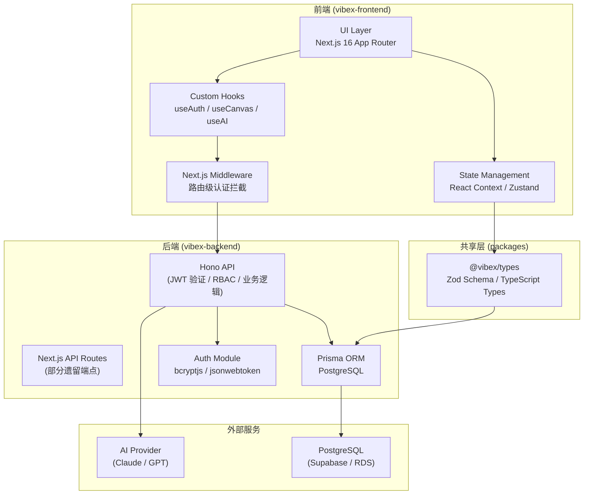
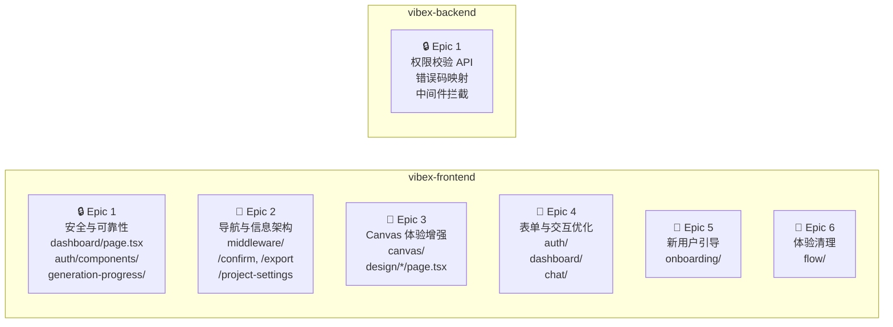

# VibeX 产品体验优化 — 技术架构设计

**项目**: vibex-pm-proposals-vibex-build-fixes-20260411
**角色**: Architect
**日期**: 2026-04-11
**状态**: 已完成

---

## 1. 技术栈

| 层级 | 技术选型 | 版本 | 选型理由 |
|------|---------|------|----------|
| 前端框架 | Next.js | 16.1.6 | App Router + Server Components，middleware 支持路由级认证拦截 |
| UI 库 | React | 19.2.3 | 搭配 Next.js 16 原生支持 |
| 语言 | TypeScript | 5.x | 严格模式，类型安全覆盖所有新代码 |
| 样式方案 | CSS Module | — | Auth 页面迁移目标，避免全局样式污染 |
| 后端 API | Hono | 4.12.5 | 轻量、高性能、中间件生态丰富，替代部分 Next.js API Routes |
| ORM | Prisma | 5.22.0 | 类型安全的数据库访问，migration 管理 |
| 数据校验 | Zod | 4.3.6 | 运行时 schema 校验，前后端共用类型定义 |
| 单元测试 | Vitest | — | Vite 原生集成，快速热重载 |
| E2E 测试 | Playwright | 1.58.2 | 多浏览器支持，CI 友好 |
| 变异测试 | Stryker | 9.6.0 | 核心逻辑防御性测试 |
| 包管理器 | pnpm | 10.32.1 | monorepo workspace 支持 |

---

## 2. 系统架构图



### 6 Epic 模块归属



---

## 3. 数据流设计

### 3.1 Auth 数据流

```
用户操作 (登录/注册)
    ↓
Next.js Middleware (未认证请求 → 307 重定向)
    ↓
Auth Form (实时校验 + 密码强度指示)
    ↓
POST /api/auth/login | /api/auth/register
    ↓
Hono Auth Module (bcryptjs 验证 → JWT 签发)
    ↓
返回 { token, user } + Set-Cookie
    ↓
前端存储 token → 更新 AuthContext
    ↓
重定向至 dashboard
```

**关键设计点**:
- JWT token 存储于 httpOnly Cookie，由 Hono 层 Set-Cookie，前端 JS 无法读取
- 前端 AuthContext 仅存储用户展示信息（name, avatar），不含权限信息
- 权限信息每次 API 请求由后端返回，前端不持有 ROLE_PERMISSIONS

### 3.2 Canvas 数据流

```
用户操作 (AI 输入 / 拖拽节点 / 缩放)
    ↓
CanvasProvider (React Context，全局状态)
    ↓
三树状态 (StructureTree / StyleTree / ContentTree)
    ↓
useAI Hook (300ms debounce → POST /api/generation)
    ↓
GenerationProgress 组件 (加载状态 + 取消按钮)
    ↓
AI 响应 → 错误码映射 → 友好提示 Toast
    ↓
Canvas 状态更新 → SaveIndicator 展示保存时间
```

**关键设计点**:
- Canvas 状态存储于 React Context，支持 undo/redo
- AI 输入防抖使用 `useDebouncedCallback` (自定义 Hook，不引入 lodash)
- SaveIndicator 每 30s 刷新，或 on blur 时更新

### 3.3 表单数据流

```
用户输入 → 实时校验 (Zod schema 前端实例)
    ↓
Blur / Submit → 触发完整校验
    ↓
校验失败 → 内联错误提示 (红色边框 + 错误文案)
    ↓
校验通过 → API 请求
    ↓
成功 → Toast.success + 页面跳转
失败 → 错误码映射 → Toast.error (友好文案)
```

---

## 4. API 设计约定

### 4.1 认证 API（新增/重构）

| Method | Path | 描述 | 鉴权 |
|--------|------|------|------|
| POST | `/api/auth/register` | 用户注册 | 公开 |
| POST | `/api/auth/login` | 用户登录 | 公开 |
| POST | `/api/auth/logout` | 登出 | 需要 |
| GET | `/api/auth/me` | 获取当前用户信息 | 需要 |

**响应格式（统一）**:
```typescript
// 成功
{ "success": true, "data": T }

// 错误（由错误码映射层统一处理）
{ "success": false, "error": { "code": "AUTH_TOKEN_EXPIRED", "message": "登录已过期，请重新登录" } }
```

### 4.2 AI 操作 API（统一）

| Method | Path | 描述 |
|--------|------|------|
| POST | `/api/generation/generate` | AI 生成内容 |
| POST | `/api/generation/cancel` | 取消生成任务 |
| GET | `/api/generation/status` | 查询任务状态 |

### 4.3 错误码映射表（Epic 1.3）

| 后端错误码 | 映射后中文提示 |
|-----------|---------------|
| `AI_QUOTA_EXCEEDED` | 您的 AI 配额已用完，请明天再试或联系客服升级 |
| `AI_TIMEOUT` | AI 生成超时，请检查网络后重试 |
| `AI_MODEL_UNAVAILABLE` | 当前 AI 模型暂时不可用，请稍后重试 |
| `PERMISSION_DENIED` | 您没有权限执行此操作 |
| `UNAUTHORIZED` | 登录已过期，请重新登录 |
| `VALIDATION_ERROR` | 输入数据格式有误，请检查后重试 |

---

## 5. 技术风险评估

### Epic 1: 安全与可靠性

| Story | 风险点 | 严重度 | 缓解策略 |
|-------|--------|--------|----------|
| **1.1** 权限后移 | ⚠️ **JWT 逻辑迁移期间存在安全空窗**：前端移除 RBAC 逻辑后、后端 API 上线前，权限校验存在断层 | 高 | 1. 后端 API 先上线并全量覆盖所有端点<br>2. 前端代码 review 必须包含安全审查<br>3. 部署顺序：后端 → 前端，禁止同时部署 |
| **1.2** AI 加载状态 | 低风险：纯前端 UI 增强 | 低 | — |
| **1.3** 错误信息 | 中风险：错误码映射遗漏导致未处理错误泄露原始信息 | 中 | 1. 定义 `UnknownError`兜底映射<br>2. 添加 Sentry 监控未映射错误码<br>3. E2E 测试覆盖所有已知错误场景 |
| **1.4** 删除确认 | 低风险：UI 交互逻辑 | 低 | — |
| **1.5** 认证中间件 | 中风险：middleware 重定向循环（`/auth → / → /auth`） | 中 | 1. 中间件只拦截 `/dashboard` `/canvas` `/design` 等受保护路径<br>2. `/auth` 页面本身不做认证检查<br>3. 添加 redirect chain 检测 |

### Epic 2: 导航与信息架构

| Story | 风险点 | 严重度 | 缓解策略 |
|-------|--------|--------|----------|
| **2.1** Confirm 标注 | 低风险：静态文案 | 低 | — |
| **2.2** Settings mock 标注 | 低风险：标签文案 | 低 | — |
| **2.3** 路由统一 | ⚠️ **重定向链断裂**：多个 page.tsx 重定向逻辑冲突，修复后产生新的无限 redirect | 高 | 1. 先在 staging 环境验证<br>2. 添加 Playwright 测试 `expect(redirectCount).toBeLessThanOrEqual(1)`<br>3. 部署后用浏览器 DevTools Network 检查 redirect chain |
| **2.4** Export 标注 | 低风险：disabled 状态 | 低 | — |
| **2.5** 注册入口 | 低风险：表单内切换 | 低 | — |

### Epic 3: Canvas 体验增强

| Story | 风险点 | 严重度 | 缓解策略 |
|-------|--------|--------|----------|
| **3.1** Canvas 引导 | ⚠️ **引导 Overlay 干扰核心流程**：首次用户被强制引导，关闭后不复现，但状态持久化逻辑复杂 | 中 | 1. 使用 `localStorage` 存储 `hasSeenGuide` 标志<br>2. 引导步骤可跳过（Skip 按钮）<br>3. `?` 快捷键帮助可随时打开，不强制 |
| **3.2** AI debounce | 低风险：防抖逻辑 | 低 | — |
| **3.3** 版本透明化 | ⚠️ **SaveIndicator 刷新频率影响性能**：频繁刷新增加 API 请求 | 中 | 1. 使用 `setInterval` 每 30s 刷新，非实时<br>2. 页面 blur 时主动刷新<br>3. 使用 SWR 缓存，避免重复请求 |
| **3.4** 移动端手势 | ⚠️ **手势库引入兼容性问题**：`hammerjs` 或 `@use-gesture/react` 与现有 Canvas 拖拽逻辑冲突 | 高 | 1. 优先使用 `@use-gesture/react`（React 生态，无依赖）<br>2. 手势事件和鼠标事件共存时做 e.stopPropagation 隔离<br>3. 在 iOS Safari / Chrome Android 真机测试 |

### Epic 4: 表单与交互优化

| Story | 风险点 | 严重度 | 缓解策略 |
|-------|--------|--------|----------|
| **4.1** 表单校验 | ⚠️ **Zod schema 重复定义**：前端 schema 和后端 schema 不同步导致校验行为不一致 | 中 | 1. 共享 `@vibex/types` 包中的 Zod schema<br>2. 前端校验仅做体验优化，后端校验是最终防线 |
| **4.2** 批量操作 | ⚠️ **乐观更新与并发冲突**：批量删除后快速刷新列表可能导致选中状态不同步 | 高 | 1. 使用 optimistic update + rollback 机制<br>2. 批量操作完成前禁用列表交互<br>3. 操作成功后刷新列表而非局部更新 |
| **4.3** Trash 体验 | 低风险：Toast 反馈 | 低 | — |
| **4.4** 样式迁移 | ⚠️ **CSS Module 迁移覆盖问题**：内联样式覆盖新 CSS Module 优先级 | 中 | 1. 先迁移结构，再迁移交互，避免中途样式断裂<br>2. 迁移前截图存档，迁移后逐一对比<br>3. 使用 `composes` 继承或 CSS specificity 覆盖 |

### Epic 5: 新用户引导

| Story | 风险点 | 严重度 | 缓解策略 |
|-------|--------|--------|----------|
| **5.1** Onboarding | ⚠️ **引导流程设计质量**：6h 内完成完整引导流程，UX 设计时间不足 | 高 | 1. 先输出高保真线框图 PM review 通过后再开发<br>2. 引导步骤不超过 5 步，每步聚焦单一目标<br>3. 引导状态存储于 localStorage，可手动重置 |

### Epic 6: 体验清理

| Story | 风险点 | 严重度 | 缓解策略 |
|-------|--------|--------|----------|
| **6.1** 延迟移除 | ⚠️ **删除 setTimeout 后动画/过渡效果丢失**：纯等待 timer 可能混合在复杂动画逻辑中 | 中 | 1. grep 确认每个 setTimeout 的用途（动画 vs 等待）<br>2. 动画 setTimeout 替换为 CSS transition/animation<br>3. PR review 逐行审查变更 |

---

## 6. 测试策略

### 6.1 测试金字塔

```
        ▲
       /E\      E2E Tests (Playwright) — 关键路径覆盖
      /---\
     /I   I\    Integration Tests — Epic 边界
    /-------\   Unit Tests (Vitest) — 工具函数/Hooks
   /  Unit  \
  /__________\
```

### 6.2 测试框架配置

| 测试类型 | 框架 | 配置文件 | 覆盖率目标 |
|---------|------|---------|-----------|
| 单元测试 | Vitest | `vitest.config.ts` | 核心 Hooks > 80% |
| E2E 测试 | Playwright | `tests/e2e/playwright.config.ts` | 关键用户路径 100% |
| 变异测试 | Stryker | `stryker.conf.json` | 核心逻辑 > 70% |
| 可访问性 | Playwright a11y | `playwright-a11y.config.ts` | WCAG 2.1 AA |

### 6.3 核心测试用例

#### Epic 1.1 — 权限后移
```typescript
// 单元测试
describe('RBAC Removal', () => {
  it('frontend should not contain JWT decode logic', async () => {
    const result = execSync(
      'grep -rn "parseJWT.*role\\|ROLE_PERMISSIONS" vibex-fronted/src --include="*.ts" --include="*.tsx"',
      { encoding: 'utf-8' }
    );
    expect(result.stdout.trim()).toBe('');
  });

  it('backend API should return 403 for unauthorized high-privilege operations', async () => {
    const res = await request(app)
      .post('/api/project/delete')
      .set('Authorization', 'Bearer invalid-token');
    expect(res.status).toBe(403);
    expect(res.body.error.code).toBe('PERMISSION_DENIED');
  });
});
```

#### Epic 3.2 — AI Debounce
```typescript
// Vitest Hook 测试
describe('useDebouncedAI', () => {
  it('should debounce AI input by 300ms', async () => {
    const { result } = renderHook(() => useDebouncedAI(), { wrapper });
    act(() => result.current.input('test1'));
    act(() => result.current.input('test2'));
    act(() => result.current.input('test3'));

    expect(mockApi).not.toHaveBeenCalled();
    await waitFor(() => expect(mockApi).toHaveBeenCalledTimes(1), { timeout: 400 });
  });
});
```

#### Epic 4.1 — 表单校验
```typescript
// Vitest 表单测试
describe('Auth Form Validation', () => {
  it('should show password strength indicator', async () => {
    render(<AuthForm />);
    const passwordInput = screen.getByLabelText('密码');
    await userEvent.type(passwordInput, 'Weak1');
    expect(screen.getByTestId('strength-bar')).toHaveAttribute('data-strength', 'weak');
  });

  it('should validate email format in real-time', async () => {
    render(<AuthForm />);
    const emailInput = screen.getByLabelText('邮箱');
    await userEvent.type(emailInput, 'not-an-email');
    await userEvent.tab(); // trigger blur
    expect(screen.getByText('请输入有效的邮箱地址')).toBeInTheDocument();
  });
});
```

#### Epic 6.1 — 延迟移除
```typescript
// Stryker 变异测试目标
describe('removePureWaitTimers', () => {
  // ⚠️ Stryker 会变异 setTimeout 调用，测试确保没有纯数字等待 timer
  it('should not have pure-wait setTimeout in flow steps', () => {
    const files = ['ProjectCreationStep.tsx', 'BusinessFlowStep.tsx'];
    files.forEach(file => {
      const content = readFileSync(`flow/${file}`, 'utf-8');
      const setTimeoutCalls = content.match(/setTimeout\([^,]+,\s*(\d+)\)/g) || [];
      setTimeoutCalls.forEach(call => {
        // 允许动画 timer，拒绝 > 1000ms 的纯数字等待
        expect(call).not.toMatch(/setTimeout\([^,]+,\s*\d{4,}\)/);
      });
    });
  });
});
```

### 6.4 CI 集成

```yaml
# .github/workflows/test.yml
test:
  steps:
    - run: pnpm run test:unit
    - run: pnpm run coverage:check  # 覆盖率门槛 > 80%
    - run: pnpm run test:e2e:ci
    - run: pnpm run lint            # 无新警告
    - run: pnpm run stryker        # 变异测试 (仅 trunk)
```

---

## 7. 模块结构

```
vibex-frontend/
├── src/
│   ├── app/                    # Next.js App Router 页面
│   │   ├── auth/               # Epic 2, 4: 登录/注册页 + CSS Module 迁移
│   │   ├── dashboard/         # Epic 1, 4: 权限校验后移 + 批量操作
│   │   ├── canvas/             # Epic 3: 三树联动 + 引导 + 手势
│   │   ├── design/[id]/        # Epic 1: AI 加载状态
│   │   ├── onboarding/        # Epic 5: 新用户引导
│   │   ├── middleware.ts       # Epic 1.5: 认证拦截
│   │   └── flow/               # Epic 6: setTimeout 清理
│   ├── components/
│   │   ├── generation-progress/  # Epic 1.2: 统一加载状态组件
│   │   ├── auth/                 # Epic 1, 4: 表单 + 校验
│   │   ├── canvas/               # Epic 3: 手势 + 引导
│   │   ├── dashboard/            # Epic 4: 批量操作
│   │   └── onboarding/           # Epic 5: 引导流程
│   ├── hooks/
│   │   ├── useDebouncedAI.ts     # Epic 3.2: 300ms 防抖
│   │   ├── useAuth.ts            # Epic 1: 认证上下文
│   │   └── useCanvas.ts          # Epic 3: Canvas 状态管理
│   └── lib/
│       ├── error-mapper.ts      # Epic 1.3: 错误码映射
│       └── api-client.ts        # 统一 API 客户端
└── tests/

vibex-backend/
├── src/
│   ├── auth/                   # Epic 1.1: JWT + RBAC 逻辑
│   ├── api/
│   │   ├── generation/          # Epic 1.2, 1.3: AI 操作 + 错误码
│   │   └── projects/           # Epic 1.1: 权限校验
│   └── middleware/
│       └── auth.ts             # Epic 1.5: JWT 验证中间件
└── prisma/
    └── schema.prisma           # 数据模型

@vibex/types/
├── auth.ts                     # 认证类型 + Zod schema
├── generation.ts               # AI 操作类型 + 错误码
└── project.ts                  # 项目操作类型
```

---

## 8. 执行决策

- **决策**: 已采纳
- **执行项目**: team-tasks 项目 ID（待主 agent 绑定）
- **执行日期**: 2026-04-11
