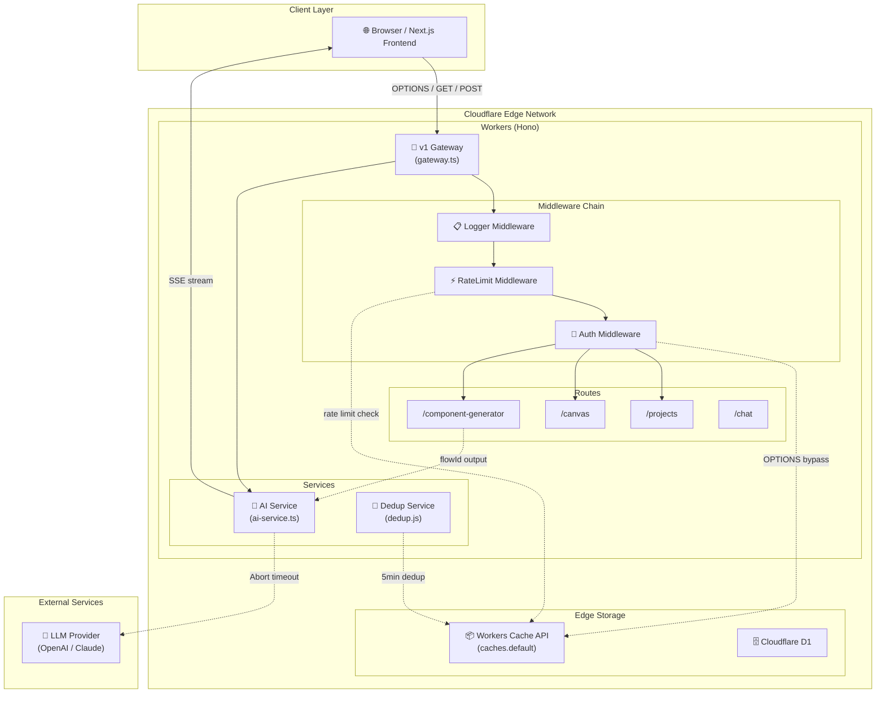
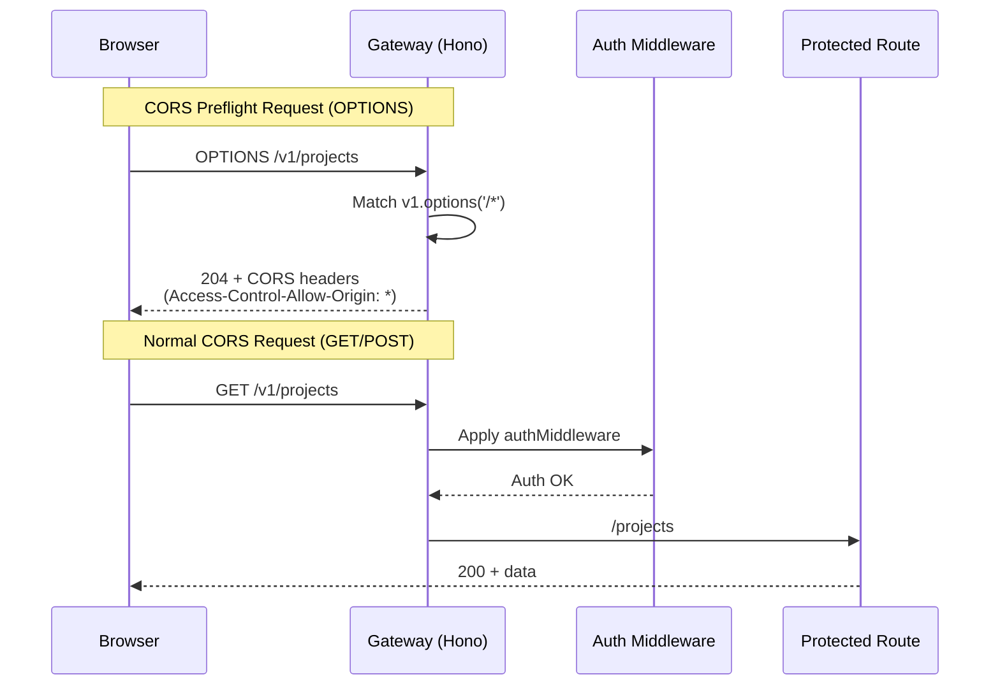
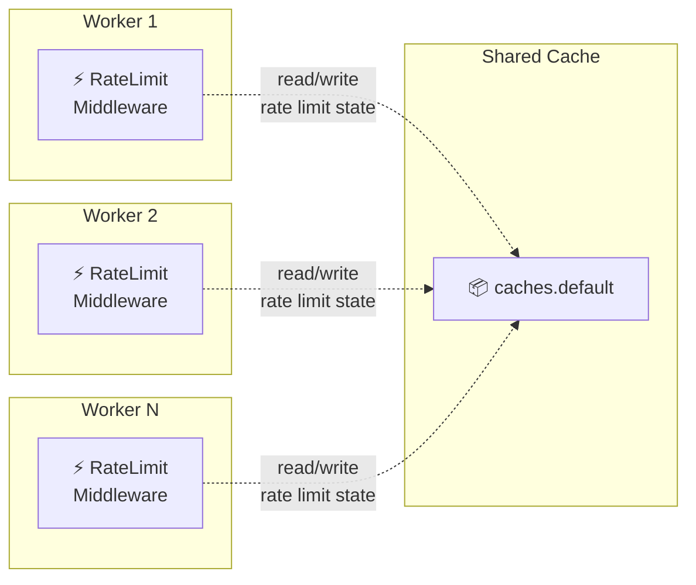

# VibeX Proposals 2026-04-06 — Architecture

> **项目**: vibex-pm-proposals-vibex-proposals-20260406  
> **角色**: Architect  
> **日期**: 2026-04-06  
> **版本**: v1.0

---

## 执行决策
- **决策**: 已采纳
- **执行项目**: vibex-pm-proposals-vibex-proposals-20260406
- **执行日期**: 2026-04-06

---

## 1. Tech Stack

| 层级 | 技术 | 版本 | 说明 |
|------|------|------|------|
| **后端运行时** | Cloudflare Workers | Runtime | 边缘计算，V8 隔离 |
| **Web 框架** | Hono | ^4.x | 轻量高性能，适配 Workers |
| **前端框架** | Next.js 15 | 15.x | App Router + React Server Components |
| **状态管理** | Zustand | ^5.x | 前端轻量状态 |
| **数据库** | Cloudflare D1 | GA | SQLite at Edge |
| **缓存** | Workers Cache API | GA | `caches.default` 跨 Worker 共享 |
| **认证** | JWT (jose) | ^6.x | RS256 签名验证 |
| **AI 服务** | LLM Provider Service | 内部 | 统一 AI 抽象层 |
| **测试框架** | Jest | ^29.x | 单元 + 集成测试 |
| **覆盖率工具** | Jest coverage | >80% | 核心路径强制覆盖 |
| **Playwright** | ^1.58 | E2 页面测试 | Canvas checkbox 集成验证 |
| **监控** | Sentry | — | Worker 异常追踪 |

### 版本选择理由

- **Hono ^4.x**: 比 Express 轻 10x，支持 Workers 原生 `fetch` 事件，OPTIONS 处理与中间件链契合
- **Jest ^29.x**: 项目既有测试基础设施成熟，coverage 报告完整
- **Workers Cache API**: 唯一跨 Worker 共享的 KV 方案，比 Durable Objects 更轻量
- **caches.default**: Cloudflare 托管，无需额外配置，适合本项目 100 req/min 限流场景

---

## 2. Architecture Diagram

### 2.1 系统整体架构 (Mermaid C4-style)



### 2.2 E1 OPTIONS 预检路由修复 (sequenceDiagram)



### 2.3 E5 分布式限流 (Cache API 方案)



### 2.4 E6 test-notify 去重 (5 分钟窗口)

```mermaid
flowchart TD
    A["🎯 test-notify.js\n入口"] --> B{checkDedup(key)}
    B -->|skipped=true| C["⏭️ 跳过发送\nlog remaining time"]
    B -->|skipped=false| D["📤 发送 Webhook"]
    D --> E{recordSend(key)}
    E --> F["💾 写入 .dedup-cache.json\n(timestamp)"]
    F --> G["🧹 清理过期记录\n(>5min)"]
    
    style C fill:#fef08a
    style D fill:#bbf7d0
    style F fill:#bfdbfe
```

---

## 3. API Definitions

### 3.1 E1: OPTIONS Preflight (网关层，无路由改动)

**文件**: `vibex-backend/src/routes/v1/gateway.ts`

```typescript
// 路由顺序（修复后）
v1.options('/*', (c) => {          // ← 在 authMiddleware 之前
  c.res.headers.set('Access-Control-Allow-Origin', '*');
  c.res.headers.set('Access-Control-Allow-Methods', 'GET, POST, PUT, DELETE, OPTIONS');
  c.res.headers.set('Access-Control-Allow-Headers', 'Content-Type, Authorization');
  return c.text('', 204);
});

const protected_ = new Hono<{ Bindings: CloudflareEnv }>();

protected_.options('/*', (c) => {   // ← 在 protected_.use('*', authMiddleware) 之前
  c.res.headers.set('Access-Control-Allow-Origin', '*');
  c.res.headers.set('Access-Control-Allow-Methods', 'GET, POST, PUT, DELETE, OPTIONS');
  c.res.headers.set('Access-Control-Allow-Headers', 'Content-Type, Authorization');
  return c.text('', 204);
});

protected_.use('*', authMiddleware); // ← 移到 options 之后
```

### 3.2 E2: Canvas Context 多选 (前端组件)

**文件**: `vibex-fronted/src/components/canvas/BoundedContextTree.tsx`

```typescript
// ContextCard 组件 checkbox onChange 修复
interface ContextCardProps {
  selected?: boolean;
  onToggleSelect?: (nodeId: string) => void; // S2.1: 正确回调
}

function ContextCard({ node, onToggleSelect, ... }: ContextCardProps) {
  const toggleContextNode = useContextStore((s) => s.toggleContextNode);

  return (
    <input
      type="checkbox"
      checked={selected}
      onChange={() => {
        // ✅ 修复：checkbox 只触发选择，不触发 confirm
        onToggleSelect?.(node.nodeId);
        // ✅ 如需 confirm，额外调用 toggleContextNode
      }}
      aria-label="选择节点"
    />
  );
}
```

### 3.3 E3: generate-components flowId (schema + prompt)

**文件**: `vibex-backend/src/routes/component-generator.ts`

```typescript
// 组件生成输出 schema（修复后）
interface GeneratedComponent {
  id: string;
  name: string;
  description: string;
  code: string;
  flowId: string;              // ✅ 新增字段
  language: string;
  framework?: string;
  dependencies?: string[];
  testStub?: string;
}

// AI prompt 明确要求 flowId
const COMPONENT_SYSTEM_PROMPT = `
...
IMPORTANT: Every component MUST include a flowId field.
Format: "flow-{uuid-v4}" e.g. "flow-a1b2c3d4-e5f6-7890-abcd-ef1234567890"
Do NOT return flowId as "unknown" or empty string.
...
`;
```

### 3.4 E4: SSE Timeout (AbortController + cancel 清理)

**文件**: `vibex-backend/src/services/ai-service.ts`

```typescript
// SSE 流式响应 with 10s 超时
async chatStream(params: ChatParams): Promise<ReadableStream> {
  const controller = new AbortController();
  const timeoutId = setTimeout(() => {
    if (!controller.signal.aborted) {
      controller.abort();
    }
  }, 10_000);

  const response = await this.llm.chat({
    ...params,
    signal: controller.signal,
    stream: true,
  });

  const stream = new ReadableStream({
    async start(controller) {
      try {
        for await (const chunk of response) {
          controller.enqueue(chunk);
        }
        controller.close();
      } catch (err) {
        controller.error(err);
      } finally {
        clearTimeout(timeoutId); // ✅ S4.2: cancel() 中清理
      }
    },
    cancel() {
      clearTimeout(timeoutId); // ✅ 流取消时清理计时器
      controller.abort();
    }
  });

  return stream;
}
```

### 3.5 E5: RateLimit with Cache API

**文件**: `vibex-backend/src/lib/rateLimit.ts`

```typescript
import { caches, Cache } from '@cloudflare/workers-types';

interface RateLimitOptions {
  limit: number;
  windowSeconds: number;
  keyGenerator?: (c: Context) => string;
}

// 跨 Worker 共享的限流存储（修复后）
async function checkRateLimitCache(
  key: string,
  limit: number,
  windowMs: number
): Promise<{ allowed: boolean; remaining: number; reset: number }> {
  const cacheKey = `ratelimit:${key}`;
  const cache = caches.default;

  const entry = await cache.match(cacheKey);
  let count = 0;

  if (entry) {
    const data = await entry.json<{ count: number; reset: number }>();
    count = data.count;
  }

  const now = Date.now();
  const windowStart = now - windowMs;

  if (count >= limit) {
    return { allowed: false, remaining: 0, reset: Math.ceil((count - windowStart) / 1000) };
  }

  // 回退到内存 Map（仅 Cloudflare 部署时使用 Cache API）
  return inMemoryFallback(key, limit, windowMs);
}
```

### 3.6 E6: Dedup Module (dedup.js)

**文件**: `vibex-fronted/scripts/dedup.js` (已存在，验证即可)

```typescript
// 现有 API — 无需修改，仅需集成验证
interface DedupResult {
  skipped: boolean;
  remaining: number; // 剩余秒数
}

// checkDedup(key: string): DedupResult
// recordSend(key: string): void
// generateKey(status: string, message?: string): string
```

---

## 4. Data Flow

### 4.1 E1 OPTIONS 请求流程

```
OPTIONS /v1/projects
  ↓
v1.options('/*') matcher 匹配（路由层级）
  ↓
设置 CORS headers → 204
  ↓ (不经过 authMiddleware)
[请求结束]
```

### 4.2 E2 Canvas 多选流程

```
用户点击 checkbox
  ↓
onChange → onToggleSelect(nodeId)
  ↓
toggleNodeSelect('context', nodeId)
  ↓
selectedNodeIds 更新
  ↓
selectedIds.has(nodeId) → checkbox checked 状态更新
```

### 4.3 E3 flowId 流程

```
用户请求生成组件
  ↓
component-generator.ts → aiService.chat()
  ↓
prompt 包含 "flowId: flow-{uuid}"
  ↓
AI 输出包含 flowId
  ↓
schema 验证 flowId 字段
  ↓
返回 { flowId: "flow-xxx", ... }
```

### 4.4 E4 SSE 超时流程

```
发起 SSE 流
  ↓
AbortController(10s timeout) 启动
  ↓
LLM 流式返回
  ↓ [10s 无响应]
controller.abort() + clearTimeout
  ↓
ReadableStream.cancel() → 触发 finally → clearTimeout
  ↓
Worker 正常处理下一个请求
```

### 4.5 E5 限流流程

```
请求进入
  ↓
rateLimit middleware → keyGenerator(userId)
  ↓
caches.default.match(`ratelimit:${key}`)
  ↓
[命中] 计数 < limit? → 允许 + 计数+1
  ↓
[未命中] 首次请求 → 计数=1 → 允许
  ↓
[超限] 429 Too Many Requests
```

### 4.6 E6 去重流程

```
test-notify.js 执行
  ↓
generateKey(status) → "test:passed:abc123"
  ↓
checkDedup(key) → read .dedup-cache.json
  ↓
[5min 内] skipped=true → 跳过发送
  ↓
[5min 外] recordSend(key) → 写入 timestamp
  ↓
发送 Webhook
```

---

## 5. Risk Assessment

| Epic | 风险 | 概率 | 影响 | 缓解措施 |
|------|------|------|------|----------|
| E1 | OPTIONS 修复破坏其他中间件 | 低 | 高 | 仅调整注册顺序，测试覆盖 GET/POST 回归 |
| E1 | `protected_.options` 仍未生效 | 低 | 中 | 验证 `curl -X OPTIONS -I` 返回 204 |
| E2 | checkbox 修复影响 confirm 状态 | 中 | 中 | `onToggleSelect` 不修改 node.status |
| E3 | AI 输出 flowId 仍为 unknown | 低 | 中 | schema 强校验，unknown 抛出错误 |
| E4 | AbortController 破坏事件顺序 | 低 | 高 | 外层 try-catch，不影响内部流处理 |
| E4 | clearTimeout 未被调用（边界） | 低 | 中 | finally 块保证清理，jest 验证 |
| E5 | Cache API 部署配置缺失 | 中 | 高 | wrangler 默认启用；dev 模式回退内存 |
| E5 | Cache API 不支持 put + json | 低 | 中 | 使用 Response + JSON body |
| E6 | 缓存文件并发写入冲突 | 低 | 低 | 进程级锁，不影响 CI 顺序执行 |
| E6 | JS dedup 与 Python dedup 不一致 | 低 | 低 | 统一使用 dedup.js，Python 不变 |

---

## 6. Testing Strategy

### 6.1 测试框架与覆盖率

| 层级 | 框架 | 覆盖率要求 | 关键路径 |
|------|------|-----------|----------|
| Backend (Workers) | Jest | >80% | gateway.ts, ai-service.ts, rateLimit.ts |
| Frontend (React) | Jest + React Testing Library | >80% | BoundedContextTree.tsx |
| Integration | Playwright | >60% | Canvas checkbox, OPTIONS |
| Scripts | Jest | >80% | dedup.js |

### 6.2 核心测试用例

#### E1: OPTIONS 预检

```typescript
// gateway-cors.test.ts
describe('OPTIONS Preflight (E1)', () => {
  it('OPTIONS /v1/projects returns 204', async () => {
    const res = await fetch('/v1/projects', { method: 'OPTIONS' });
    expect(res.status).toBe(204);
  });

  it('OPTIONS includes CORS headers', async () => {
    const res = await fetch('/v1/projects', { method: 'OPTIONS' });
    expect(res.headers.get('Access-Control-Allow-Origin')).toBe('*');
    expect(res.headers.get('Access-Control-Allow-Methods')).toContain('GET');
  });

  it('OPTIONS is not intercepted by auth (not 401)', async () => {
    const res = await fetch('/v1/projects', { method: 'OPTIONS' });
    expect(res.status).not.toBe(401);
  });

  it('GET /v1/projects still works after fix', async () => {
    const res = await fetch('/v1/projects', { method: 'GET' });
    expect([200, 401]).toContain(res.status);
  });
});
```

#### E2: Canvas Checkbox

```typescript
// BoundedContextTree.test.tsx
describe('ContextCard Checkbox (E2)', () => {
  it('checkbox onChange calls onToggleSelect', () => {
    const onToggleSelect = jest.fn();
    render(<ContextCard node={mockNode} onToggleSelect={onToggleSelect} />);
    fireEvent.click(screen.getByRole('checkbox'));
    expect(onToggleSelect).toHaveBeenCalledWith(mockNode.nodeId);
  });

  it('checkbox does NOT call toggleContextNode on selection', () => {
    const toggleContextNode = jest.fn();
    render(<ContextCard node={mockNode} onToggleSelect={jest.fn()} />);
    // toggleContextNode is NOT called by checkbox onChange
  });

  it('selected node shows checked checkbox', () => {
    render(<ContextCard node={mockNode} selected={true} onToggleSelect={jest.fn()} />);
    expect(screen.getByRole('checkbox')).toBeChecked();
  });
});
```

#### E3: flowId Schema

```typescript
// component-generator.test.ts
describe('generate-components flowId (E3)', () => {
  it('AI output contains valid flowId', async () => {
    const result = await generateComponent({ name: 'Button', flowId: 'flow-test-123' });
    expect(result.flowId).toMatch(/^flow-[a-f0-9-]+$/);
    expect(result.flowId).not.toBe('unknown');
    expect(result.flowId).not.toBeUndefined();
  });

  it('schema rejects missing flowId', () => {
    const schema = z.object({
      flowId: z.string().min(1).regex(/^flow-/),
    });
    expect(() => schema.parse({ flowId: 'unknown' })).toThrow();
  });
});
```

#### E4: SSE Timeout

```typescript
// ai-service.test.ts
describe('SSE Timeout (E4)', () => {
  beforeEach(() => jest.useFakeTimers());
  afterEach(() => jest.useRealTimers());

  it('stream aborts after 10 seconds', async () => {
    const stream = await aiService.chatStream({ messages: [] });
    const cancel = jest.spyOn(stream, 'cancel');

    jest.advanceTimersByTime(10_001);
    await jest.runAllTimers();

    expect(cancel).toHaveBeenCalled();
  });

  it('clearTimeout is called on cancel', async () => {
    const clearTimeout = jest.spyOn(global, 'clearTimeout');
    const stream = await aiService.chatStream({ messages: [] });

    await stream.cancel();

    expect(clearTimeout).toHaveBeenCalled();
    clearTimeout.mockRestore();
  });

  it('clearTimeout is called in finally block', async () => {
    const clearTimeout = jest.spyOn(global, 'clearTimeout');
    // Simulate natural stream completion
    await aiService.chatStream({ messages: [] });
    jest.advanceTimersByTime(9_000); // complete before timeout
    await jest.runAllTimers();

    expect(clearTimeout).toHaveBeenCalled();
    clearTimeout.mockRestore();
  });
});
```

#### E5: Distributed Rate Limit

```typescript
// rateLimit.test.ts
describe('Rate Limit Cache API (E5)', () => {
  it('uses caches.default for rate limit storage', async () => {
    const match = jest.spyOn(caches, 'default', 'get')
      .mockReturnValue(mockCache as unknown as Cache);

    await rateLimitMiddleware(request, env);
    expect(match).toHaveBeenCalled();
  });

  it('returns 429 when limit exceeded', async () => {
    // 100 concurrent requests
    const results = await Promise.all(
      Array(100).fill(null).map(() => rateLimitMiddleware(request, env))
    );
    const allowedCount = results.filter(r => r.status !== 429).length;
    expect(allowedCount).toBe(100); // all within limit

    // 101st request
    const res101 = await rateLimitMiddleware(request, env);
    expect(res101.status).toBe(429);
  });
});
```

#### E6: Dedup

```typescript
// dedup.test.js (已存在，覆盖扩展)
describe('Dedup Integration (E6)', () => {
  it('duplicate within 5min is skipped', () => {
    const key = generateKey('passed');
    recordSend(key);
    const { skipped, remaining } = checkDedup(key);
    expect(skipped).toBe(true);
    expect(remaining).toBeGreaterThan(0);
    expect(remaining).toBeLessThanOrEqual(300);
  });

  it('test-notify integration sends only once', async () => {
    const sendSpy = jest.spyOn(http, 'request');
    // First call - should send
    await testNotify({ status: 'passed' });
    expect(sendSpy).toHaveBeenCalledTimes(1);

    // Second call within 5min - should skip
    await testNotify({ status: 'passed' });
    expect(sendSpy).toHaveBeenCalledTimes(1); // still 1
  });
});
```

---

## 7. File Impact Map

| Epic | 文件 | 修改类型 | 风险 |
|------|------|----------|------|
| E1 | `vibex-backend/src/routes/v1/gateway.ts` | 路由重排序 | 低 |
| E2 | `vibex-fronted/src/components/canvas/BoundedContextTree.tsx` | checkbox onChange | 中 |
| E3 | `vibex-backend/src/routes/component-generator.ts` | schema + prompt | 低 |
| E3 | `vibex-backend/src/services/ui-generator.ts` | type 定义 | 低 |
| E4 | `vibex-backend/src/services/ai-service.ts` | timeout + cancel | 中 |
| E5 | `vibex-backend/src/lib/rateLimit.ts` | Cache API 集成 | 中 |
| E6 | `vibex-fronted/scripts/test-notify.js` | 验证集成 | 低 |
| E6 | `vibex-fronted/scripts/__tests__/dedup.test.js` | 新增用例 | 低 |

---

## 8. ADR (Architecture Decision Records)

### ADR-001: OPTIONS 路由顺序修复

**Status**: Accepted

**Context**: CORS preflight (OPTIONS) requests are intercepted by `authMiddleware` and return 401, blocking all cross-origin POST/PUT/DELETE requests.

**Decision**: Register `protected_.options('/*')` handler **before** `protected_.use('*', authMiddleware)` in `gateway.ts`.

**Consequences**:
- ✅ OPTIONS returns 204 + CORS headers
- ✅ Auth-protected routes still require auth for GET/POST
- ⚠️ Must ensure both `v1.options` and `protected_.options` are registered

### ADR-002: SSE Timeout via AbortController

**Status**: Accepted

**Context**: `aiService.chat()` has no timeout; setTimeout not cleaned up in cancel path, causing Worker leaks.

**Decision**: Wrap LLM call with `AbortController.timeout(10_000)`; clear timeout in both `finally` block and `ReadableStream.cancel()`.

**Consequences**:
- ✅ Worker no longer hangs on slow LLM
- ✅ Timer cleanup prevents memory leaks
- ⚠️ AI provider must handle abort signal gracefully

### ADR-003: Cache API for Distributed Rate Limiting

**Status**: Accepted

**Context**: In-memory Map rate limiter is not shared across Cloudflare Workers instances, causing inconsistent limits.

**Decision**: Use `caches.default` (Workers Cache API) for cross-Worker rate limit state, with in-memory fallback in dev mode.

**Consequences**:
- ✅ Consistent rate limiting across all Workers
- ⚠️ Cache API has 128MB limit per account; add monitoring
- ⚠️ Dev mode uses in-memory Map; test in staging before deploy
