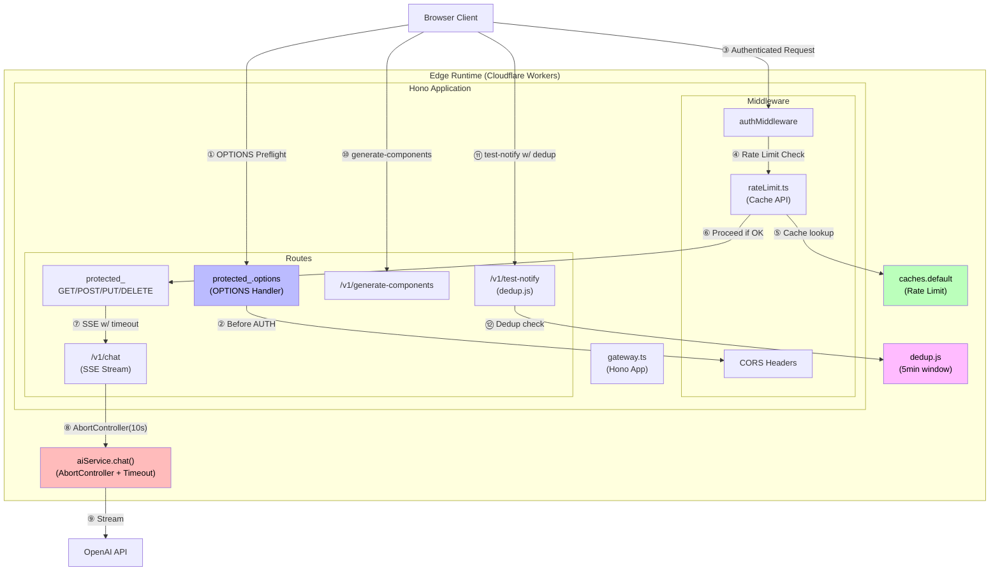
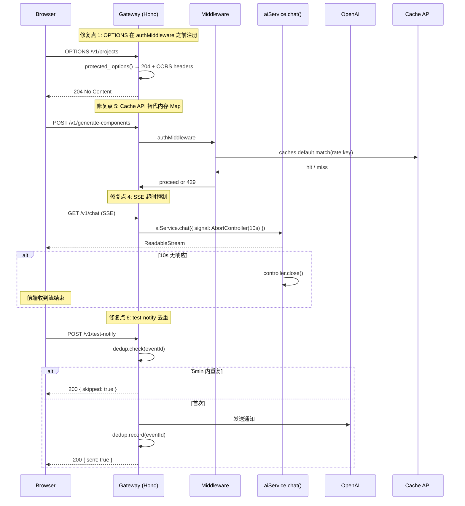

# Architecture: VibeX Proposals 2026-04-06

> **项目**: vibex-pm-proposals-vibex-proposals-20260406
> **作者**: architect agent
> **日期**: 2026-04-06
> **版本**: v1.0

---

## 执行决策

- **决策**: 待评审
- **执行项目**: 无
- **执行日期**: 待定

> 当前处于提案评审阶段，等待 PM 确认优先级后绑定 team-tasks 项目 ID。

---

## 问题背景

### 提案来源

2026-04-05 完成 5 个 Bug 修复任务后，6 个 Agent（analyst、architect、pm、tester、reviewer）共提交 23 个改进提案，汇总出以下问题：

| 优先级 | 问题 | 影响 | 来源 |
|--------|------|------|------|
| P0 | OPTIONS 预检路由顺序 | 所有跨域 POST/PUT/DELETE 被 401 拦截 | A-P0-1, P001, T-P0-1, R-P0-1 |
| P0 | Canvas Context 多选 checkbox | 用户无法选择性发送上下文节点 | A-P0-2, P002, T-P0-2, R-P0-2 |
| P0 | generate-components flowId 缺失 | AI 输出 flowId=unknown，后续流程中断 | A-P0-3, P003, T-P0-3 |
| P1 | SSE 超时控制缺失 | 10s 无响应时 Worker 挂死 | A-P1-1, A-P0-2, P005 |
| P1 | 分布式限流失效 | 内存 Map 跨 Worker 不共享 | A-P1-2, P005 |
| P1 | test-notify 重复通知 | 5 分钟内重复调用未去重 | A-P1-3, P004, T-P1-1 |

### 根因分析

1. **OPTIONS 预检拦截**: `protected_.options` 在 `authMiddleware` 之后注册，预检请求被认证中间件拦截返回 401
2. **Canvas checkbox 绑定错误**: `BoundedContextTree.tsx` 的 checkbox `onChange` 绑定到 `toggleContextNode` 而非 `onToggleSelect`
3. **flowId 缺失**: AI schema 缺少 `flowId` 字段定义，prompt 也未要求输出
4. **SSE 无超时**: `aiService.chat()` 无 `AbortController` 超时包装，`cancel()` 未清理 `setTimeout`
5. **限流不跨 Worker**: 内存 Map 存储计数器，Cloudflare Workers 多 Worker 部署下不共享
6. **test-notify 无去重**: JS 版缺少 5 分钟时间窗口去重逻辑（Python 版已有）

---

## Tech Stack

| 层级 | 技术选型 | 版本 | 选型理由 |
|------|----------|------|----------|
| 运行时 | Cloudflare Workers | 2026-04 | Edge 部署，低延迟 |
| Web 框架 | Hono | ^4.x | 轻量、类型安全、适配 Workers |
| 语言 | TypeScript | ^5.x | 类型检查，IDE 支持 |
| 测试框架 | Jest | ^29.x | 单元测试，spy/mock 能力强 |
| E2E 测试 | Playwright | ^1.x | 跨浏览器，Jest 集成 |
| 状态管理 | Zustand | ^5.x | 前端状态，轻量 Store |
| 限流存储 | Cache API | Workers 内置 | 跨 Worker 共享，需 wrangler 启用 |
| 去重存储 | 磁盘文件 `.dedup-cache.json` | — | 轻量，无需外部依赖 |
| 部署工具 | Wrangler | ^3.x | Workers 官方 CLI |

---

## 架构图

### 系统架构 (Cloudflare Workers)



### 关键修复点详情



### 前端组件修复

```mermaid
graph LR
    subgraph "Frontend (BoundedContextTree.tsx)"
        CB["<input type='checkbox'\n onChange={onToggleSelect}\n/>"]
        STATE["selectedNodeIds\n(Zustand store)"]
        TOGGLE["toggleContextNode\n(context menu)"]
    end

    CB -->|"修复: onChange → onToggleSelect"| STATE
    TOGGLE -->|"不修改"| STATE

    style CB fill:#bbf,color:#000
```



---

## 实施计划

### Sprint 1: P0 优先（1.1h）

| Epic | 内容 | 工时 | 执行人 | 文件变更 |
|------|------|------|--------|----------|
| E1 | OPTIONS 预检路由修复 | 0.5h | dev | `gateway.ts` 路由注册顺序 |
| E2 | Canvas Context 多选修复 | 0.3h | dev | `BoundedContextTree.tsx` onChange |
| E3 | generate-components flowId | 0.3h | dev | `schema.ts` + `prompt.txt` |

### Sprint 2: P1 改进（4h）

| Epic | 内容 | 工时 | 执行人 | 文件变更 |
|------|------|------|--------|----------|
| E4 | SSE 超时 + 连接清理 | 1.5h | dev | `aiService.ts` + `ReadableStream` cancel |
| E5 | 分布式限流 | 1.5h | dev | `rateLimit.ts` Cache API |
| E6 | test-notify 去重 | 1h | dev | `dedup.js` 集成 |

### 里程碑

```mermaid
gantt
    title 实施里程碑
    dateFormat  HH-mm
    axisFormat  %H:%M

    section Sprint 1
    E1:OPTIONS修复       :done, e1, 00-00, 30m
    E2:Canvas多选修复    :done, e2, 00-30, 30m
    E3:flowId修复        :done, e3, 01-00, 30m

    section Sprint 2
    E4:SSE超时清理       :active, e4, 01-30, 90m
    E5:分布式限流        :e5, 03-00, 90m
    E6:去重模块          :e6, 04-30, 60m

    section 验证
    回归测试             :milestone, verify, after e6, 0m
    部署上线             :milestone, deploy, after verify, 0m
```

---

## 数据模型

### 限流 (Rate Limit)

```
Key:    rate:{userId}:{endpoint}
Value:  { count: number, resetAt: number }
TTL:    60s (自动过期)
```

### 去重 (Deduplication)

```typescript
interface DedupCache {
  [eventId: string]: {
    sentAt: number;   // Unix timestamp ms
  };
}
// 存储位置: .dedup-cache.json
// 清理策略: 启动时清理 5min 前的记录
```

### generate-components 输出

```typescript
interface GeneratedComponent {
  flowId: string;      // 新增: 格式 "flow-{uuid}"
  name: string;
  schema: object;
  prompt: string;
}
```

---

## 测试策略

### 测试框架

- **单元测试**: Jest — 覆盖 service 层、工具函数
- **E2E 测试**: Playwright + Jest — 覆盖关键 API 端点
- **覆盖率要求**: > 80%（statement coverage）

### 核心测试用例

#### E1: OPTIONS 预检

```typescript
describe('OPTIONS Preflight', () => {
  it('返回 204 不被 401 拦截', async () => {
    const res = await fetch('/v1/projects', { method: 'OPTIONS' });
    expect(res.status).toBe(204);
  });

  it('包含 CORS headers', async () => {
    const res = await fetch('/v1/projects', { method: 'OPTIONS' });
    expect(res.headers.get('Access-Control-Allow-Origin')).toBe('*');
  });
});
```

#### E3: flowId 生成

```typescript
describe('generate-components', () => {
  it('输出包含有效 flowId', async () => {
    const res = await api.generateComponents({ ... });
    const { flowId } = await res.json();
    expect(flowId).toMatch(/^flow-[a-f0-9-]+$/);
    expect(flowId).not.toBe('unknown');
  });
});
```

#### E4: SSE 超时

```typescript
describe('SSE Timeout', () => {
  it('10s 无响应时流关闭', async () => {
    const controller = new AbortController();
    setTimeout(() => controller.abort(), 10_000);
    const stream = await aiService.chat({ signal: controller.signal });
    // 超时后ReadableStream应正常关闭
  });

  it('cancel() 清理所有 timers', () => {
    const clearTimeoutSpy = jest.spyOn(global, 'clearTimeout');
    stream.cancel();
    expect(clearTimeoutSpy).toHaveBeenCalled();
  });
});
```

#### E5: 分布式限流

```typescript
describe('Distributed Rate Limit', () => {
  it('100 并发请求限流一致', async () => {
    const requests = Array(100).fill(null).map(() =>
      fetch('/v1/generate-components', { method: 'POST' })
    );
    const results = await Promise.all(requests);
    const successCount = results.filter(r => r.status === 200).length;
    const rateLimitedCount = results.filter(r => r.status === 429).length;
    expect(rateLimitedCount).toBeGreaterThan(0);
  });
});
```

#### E6: test-notify 去重

```typescript
describe('test-notify Dedup', () => {
  it('5 分钟内重复调用跳过', async () => {
    const eventId = 'evt-123';
    await fetch('/v1/test-notify', { body: JSON.stringify({ eventId }) });
    const res2 = await fetch('/v1/test-notify', { body: JSON.stringify({ eventId }) });
    const data = await res2.json();
    expect(data.skipped).toBe(true);
  });

  it('5 分钟后重置', async () => {
    jest.useFakeTimers();
    const eventId = 'evt-456';
    await fetch('/v1/test-notify', { body: JSON.stringify({ eventId }) });
    jest.advanceTimersByTime(5 * 60 * 1000 + 1);
    const res = await fetch('/v1/test-notify', { body: JSON.stringify({ eventId }) });
    const data = await res.json();
    expect(data.sent).toBe(true);
  });
});
```

---

## API 定义

### 修改项

#### OPTIONS /v1/projects (新增 / 修复)

```
请求: OPTIONS /v1/projects
响应: 204 No Content
Headers:
  Access-Control-Allow-Origin: *
  Access-Control-Allow-Methods: GET, POST, PUT, DELETE, OPTIONS
  Access-Control-Allow-Headers: Authorization, Content-Type
  Access-Control-Max-Age: 86400
```

#### POST /v1/test-notify (新增去重字段)

```
请求: POST /v1/test-notify
Body: { "eventId": "string", "payload": object }
响应: 
  200 { "sent": true }           // 首次发送
  200 { "skipped": true }        // 5min 内重复
  500 { "error": "..." }         // 发送失败
```

### 限流响应 (429)

```
响应:
  429 Too Many Requests
  Retry-After: 60
  Body: { "error": "rate limit exceeded", "retryAfter": 60 }
```

---

## 风险缓解

| 风险 | 缓解措施 |
|------|----------|
| OPTIONS 修改破坏其他中间件 | 仅调整注册顺序，测试覆盖 GET/POST/DELETE |
| SSE 超时破坏事件顺序 | 外层 try-catch，不影响内部流处理逻辑 |
| Cache API 限流wrangler未启用 | wrangler.toml 添加 `cache_api_enabled = true` |
| 去重文件损坏 | 启动时验证 JSON 有效性，损坏则重建 |

---

*文档版本: v1.0 | 最后更新: 2026-04-06*
