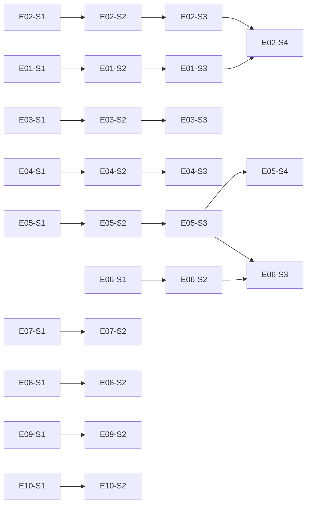

# VibeX PM Proposals 2026-04-10 — Implementation Plan

> **文档版本**: v1.0
> **作者**: Architect Agent
> **日期**: 2026-04-10
> **状态**: Draft
> **工作目录**: /root/.openclaw/vibex

---

## 1. Sprint Overview

| Sprint | 主题 | 工时 | 产出 | 目标指标 |
|--------|------|------|------|---------|
| Sprint 1 | 新用户激活 | 6h | 引导 + 模板库 | 首次引导完成率 > 70% |
| Sprint 2 | 核心体验提升 | 6h | 智能补全 + 搜索 | AI 质量 3.0→4.0 / 搜索 < 200ms |
| Sprint 3 | 企业场景铺垫 | 8h | 协作 + 版本对比 | 协作可用率 100% / 版本使用 > 40% |
| Sprint 4 | 效率优化 | 4h | 快捷键 + 离线 + 导入导出 + 评分 | P2 功能完整交付 |

**总工时**: 24h（缓冲 1h 内嵌于 Sprint 3）

---

## 2. Sprint 1 — 新用户激活（6h）

**目标**: 新用户首次访问引导完成率 > 70%

### 2.1 Epic E01: 需求模板库（3h）

#### E01-S1: 模板存储结构定义（0.5h）

**任务**:
- [ ] 创建 `/data/templates/` 目录
- [ ] 定义 `Template` TypeScript interface（参考 architecture.md Section 4.3）
- [ ] 编写 3 个模板 JSON 文件：`ecommerce.json`、`social.json`、`saas.json`
- [ ] 每个模板包含 ≥5 个 `example_requirements`

**交付物**:
- `/data/templates/ecommerce.json`
- `/data/templates/social.json`
- `/data/templates/saas.json`
- `/types/template.ts`

**验收**: `AC-001` — 模板字段完整，加载无报错

#### E01-S2: 模板库页面开发（1.5h）

**任务**:
- [ ] 创建 `/templates` 页面路由
- [ ] 开发 `<TemplateCard />` 组件（接收 Template 数据）
- [ ] 开发 `<TemplateFilter />` 组件（按行业过滤）
- [ ] 开发 `/templates` 页面：网格布局、模板卡片列表
- [ ] 响应式适配（Mobile 支持）

**交付物**:
- `/app/templates/page.tsx`
- `/components/TemplateCard.tsx`
- `/components/TemplateFilter.tsx`

**验收**: `AC-001` — `/templates` 可访问，模板卡片 ≥3，模板名称可见

#### E01-S3: 模板选择与填充（1h）

**任务**:
- [ ] 首页 `/` 接收 `?template=` query param
- [ ] 检测到 template 参数时，自动填充 `#requirement-input`
- [ ] 保留用户手动修改能力（覆盖模板内容）
- [ ] 引导提示：展示模板选择入口

**交付物**:
- `/app/page.tsx` 修改（处理 template param）
- `/components/RequirementInput.tsx` 增强

**验收**: `AC-002` — 点击模板后输入框自动填充，支持手动修改

---

### 2.2 Epic E02: 新手引导流程（3h）

#### E02-S1: 引导步骤配置（0.5h）

**任务**:
- [ ] 定义引导步骤配置 schema（step/highlight/action）
- [ ] 步骤数上限 ≤4
- [ ] 配置文件：`/config/onboarding-steps.ts`

**交付物**:
- `/config/onboarding-steps.ts`
- `/types/onboarding.ts`

#### E02-S2: Overlay 引导组件（1h）

**任务**:
- [ ] 复用 `<CanvasOnboardingOverlay />` 已有代码
- [ ] 开发 `<OnboardingOverlay />` 主组件（next/prev/skip 按钮）
- [ ] 开发 `<OnboardingTooltip />` 组件（highlight 指向）
- [ ] 使用 react-joyride 封装

**交付物**:
- `/components/OnboardingOverlay.tsx`
- `/components/OnboardingTooltip.tsx`
- `/hooks/useOnboarding.ts`

**验收**: `AC-003` — 引导 overlay 可见，步骤 ≤4

#### E02-S3: 引导状态持久化（0.5h）

**任务**:
- [ ] 引导状态写入 localStorage（`user:{userId}:onboarding`）
- [ ] 支持 'completed' | 'skipped' | 'in_progress' 三种状态
- [ ] 刷新页面后不重复弹出

**交付物**:
- `/hooks/useOnboardingStatus.ts`

**验收**: `AC-004` — 跳过引导后刷新不重复弹出

#### E02-S4: 引导完成流程（1h）

**任务**:
- [ ] 引导完成后跳转 Dashboard
- [ ] 清理所有引导残留 DOM
- [ ] 所有功能可用，无引导残留

**交付物**:
- `/app/dashboard/page.tsx` 增强

**验收**: `AC-003` + `AC-004`

---

## 3. Sprint 2 — 核心体验提升（6h）

**目标**: AI 生成质量评分 3.0 → 4.0，项目搜索响应 < 200ms

### 3.1 Epic E03: 需求智能补全（4h）

#### E03-S1: 关键词检测引擎（1h）

**任务**:
- [ ] 实现 `KeywordDetector` 服务（实体名/动词/业务术语识别）
- [ ] 输入 ≥50 字时触发检测
- [ ] 实现 `/api/v1/keyword-detect` API Route
- [ ] KV 写入检测日志（用于后续优化）

**交付物**:
- `/services/keyword-detector.ts`
- `/app/api/v1/keyword-detect/route.ts`

**验收**: `AC-005` — ≥50 字触发检测，返回关键词列表

#### E03-S2: 追问气泡 UI（1.5h）

**任务**:
- [ ] 开发 `<SmartHintBubble />` 组件（显示追问文案）
- [ ] 气泡定位：跟随输入框，响应时间 < 1s
- [ ] 动画过渡效果（framer-motion）
- [ ] 支持多追问文案列表展示

**交付物**:
- `/components/SmartHintBubble.tsx`

**验收**: `AC-006` — 追问响应 < 1s，气泡可见

#### E03-S3: 多轮澄清逻辑（1.5h）

**任务**:
- [ ] 维护多轮对话上下文状态
- [ ] 追问文案存储于 context
- [ ] 用户回复后继续追加关键词
- [ ] 达到澄清阈值后触发 AI 分析

**交付物**:
- `/hooks/useClarificationContext.ts`
- `/app/page.tsx` 增强（整合多轮逻辑）

---

### 3.2 Epic E04: 项目搜索过滤（2h）

#### E04-S1: 搜索栏组件（0.5h）

**任务**:
- [ ] 开发 `<ProjectSearchBar />` 组件
- [ ] 实时搜索（debounce 300ms）
- [ ] 支持清空搜索

**交付物**:
- `/components/ProjectSearchBar.tsx`

#### E04-S2: 过滤逻辑实现（1h）

**任务**:
- [ ] 实现 `/api/v1/projects/search` API Route
- [ ] 支持按名称/创建时间/标签过滤
- [ ] 搜索响应 < 200ms 优化（KV 索引设计）
- [ ] 返回 `searchTimeMs` 性能指标

**交付物**:
- `/app/api/v1/projects/search/route.ts`

**验收**: `AC-007` — 搜索响应 < 200ms

#### E04-S3: 分类视图（0.5h）

**任务**:
- [ ] 开发 `<ProjectFilter />` 组件（时间/类型/状态）
- [ ] 分类视图：网格 / 列表切换
- [ ] 最近项目快捷入口

**交付物**:
- `/components/ProjectFilter.tsx`
- `/app/projects/page.tsx`

---

## 4. Sprint 3 — 企业场景铺垫（8h）

**目标**: 团队协作功能可用，版本对比功能使用率 > 40%

### 4.1 Epic E05: 团队协作空间（6h）

#### E05-S1: 团队创建（1h）

**任务**:
- [ ] 实现 `/api/v1/teams` POST API Route
- [ ] KV 写入 `team:{teamId}` 和 `team:{teamId}:members`
- [ ] 开发 `/teams` 页面（团队列表）
- [ ] 开发 `<TeamList />` 组件

**交付物**:
- `/app/api/v1/teams/route.ts`
- `/app/teams/page.tsx`
- `/components/TeamList.tsx`

**验收**: `AC-008` — 团队创建成功，列表显示

#### E05-S2: 成员邀请与权限（2h）

**任务**:
- [ ] 实现 `/api/v1/teams/:id/invite` API Route
- [ ] 权限类型：owner/member/viewer
- [ ] 开发 `<MemberInvite />` 组件（邮箱邀请）
- [ ] 开发 `<PermissionGate />` 组件（权限控制）

**交付物**:
- `/app/api/v1/teams/[id]/invite/route.ts`
- `/components/MemberInvite.tsx`
- `/components/PermissionGate.tsx`

**验收**: `AC-009` — 成员邀请成功，权限设置生效

#### E05-S3: 项目共享管理（2h）

**任务**:
- [ ] 实现项目共享 API（将项目共享给团队）
- [ ] KV schema 扩展：`team:{teamId}:projects`、`TEAM_PROJECT`
- [ ] 开发项目设置页的团队共享入口
- [ ] 权限控制生效（viewer 不可编辑）

**交付物**:
- `/app/api/v1/projects/[id]/share/route.ts`
- `/components/ProjectShareSettings.tsx`

**验收**: `AC-009` — viewer 角色无编辑权限（`#edit-btn` disabled）

#### E05-S4: 协作状态展示（1h）

**任务**:
- [ ] 团队成员列表展示（在线/离线状态）
- [ ] 实时光标（**MVP 跳过**，见 Out of Scope）
- [ ] 协作视图 UI 完善

**交付物**:
- `/components/TeamMembersList.tsx`

---

### 4.2 Epic E06: 项目版本对比（3h）

#### E06-S1: 版本快照生成（1h）

**任务**:
- [ ] 实现 `/api/v1/versions` POST API Route
- [ ] 每次保存自动生成快照（nanoid 生成版本 ID）
- [ ] KV 写入 `project:{projectId}:versions` 和 `project:{projectId}:version:{vid}`
- [ ] 支持版本描述输入

**交付物**:
- `/app/api/v1/versions/route.ts`

**验收**: `AC-010` — 保存后版本列表显示新快照

#### E06-S2: 版本历史列表（1h）

**任务**:
- [ ] 实现 `/api/v1/versions` GET API Route（分页）
- [ ] 开发 `<VersionList />` 组件（时间/描述/作者）
- [ ] 开发 `/projects/:id/history` 页面

**交付物**:
- `/app/api/v1/versions/route.ts` (GET)
- `/app/projects/[id]/history/page.tsx`
- `/components/VersionList.tsx`

**验收**: `AC-010` — 版本历史可查看

#### E06-S3: 版本对比视图（1h）

**任务**:
- [ ] 实现两版本选择逻辑（最多选 2 个）
- [ ] 使用 `diff` 库计算差异
- [ ] 开发 `<DiffViewer />` 组件（side-by-side + unified 模式）
- [ ] 高亮 `diff-highlight-add` / `diff-highlight-remove`

**交付物**:
- `/components/DiffViewer.tsx`

**验收**: `AC-011` — 差异内容高亮可见

---

## 5. Sprint 4 — 效率优化（4h）

**目标**: P2 功能完整交付，高级用户效率提升

### 5.1 Epic E07: 快捷键系统（1h）

#### E07-S1: 快捷键注册（0.5h）

**任务**:
- [ ] 开发 `<ShortcutProvider />`（React Context）
- [ ] 注册 `Ctrl+S`（保存）、`Ctrl+Z`（撤销）、`Ctrl+/`（帮助面板）
- [ ] 与浏览器默认快捷键不冲突

**交付物**:
- `/components/ShortcutProvider.tsx`
- `/hooks/useShortcuts.ts`

**验收**: `AC-012` — Ctrl+S 保存生效

#### E07-S2: 快捷键面板（0.5h）

**任务**:
- [ ] 开发 `<ShortcutsPanel />` 组件
- [ ] 展示所有可用快捷键
- [ ] `Ctrl+/` 触发显示

**交付物**:
- `/components/ShortcutsPanel.tsx`

**验收**: `AC-012` — 快捷键面板可见，条目 ≥3

---

### 5.2 Epic E08: 离线模式提示（1h）

#### E08-S1: 网络状态检测（0.5h）

**任务**:
- [ ] 使用 `navigator.onLine` + `online/offline` 事件
- [ ] 开发 `<OfflineBanner />` 组件

**交付物**:
- `/components/OfflineBanner.tsx`

**验收**: `AC-013` — 离线时提示条可见

#### E08-S2: 离线提示与恢复（0.5h）

**任务**:
- [ ] 开发 `<OperationQueue />` 组件（本地缓存操作）
- [ ] 恢复网络后自动同步
- [ ] 显示同步状态

---

### 5.3 Epic E09: 需求导入导出（1h）

#### E09-S1: 导入功能（0.5h）

**任务**:
- [ ] 开发 `<ImportModal />` 组件
- [ ] 支持 Markdown/JSON/YAML 格式解析
- [ ] 解析后填充 `#requirement-input`

**交付物**:
- `/components/ImportModal.tsx`

**验收**: `AC-014` — Markdown 导入成功

#### E09-S2: 导出功能（0.5h）

**任务**:
- [ ] 开发 `<ExportModal />` 组件
- [ ] 支持 Markdown/JSON 格式导出
- [ ] 导出内容包含完整分析结果

**交付物**:
- `/components/ExportModal.tsx`

---

### 5.4 Epic E10: AI 生成结果评分（1h）

#### E10-S1: 评分 UI（0.5h）

**任务**:
- [ ] 开发 `<StarRating />` 组件（1-5 星）
- [ ] 开发 `<FeedbackForm />` 组件（文字反馈）
- [ ] 集成到 `/analysis/result/:id` 页面

**交付物**:
- `/components/StarRating.tsx`
- `/components/FeedbackForm.tsx`

**验收**: `AC-015` — 评分提交成功

#### E10-S2: 评分数据存储（0.5h）

**任务**:
- [ ] 实现 `/api/v1/ratings` POST API Route
- [ ] KV 写入 `rating:{analysisId}` 和 `user:{userId}:ratings`
- [ ] 支持按时间/项目聚合查询

**交付物**:
- `/app/api/v1/ratings/route.ts`

---

## 6. Risk Register

| 风险 ID | 风险描述 | 影响 | 概率 | 缓解策略 |
|---------|---------|------|------|---------|
| R01 | KV 存储配额超限（版本快照过多） | 高 | 中 | 实现版本数量上限（每个项目最多 50 个），自动清理旧版本 |
| R02 | AI 服务调用延迟影响 E03 体验 | 中 | 低 | 实现本地关键词检测 fallback（不依赖 AI） |
| R03 | 协作功能并发冲突（E05） | 高 | 中 | 复用现有 CollaborationService KV，并发已验证 |
| R04 | diff 库选型不合适 | 低 | 低 | 提前评审 `diff` vs `fast-json-diff`，2026-04-11 完成 |
| R05 | 引导流程与现有组件冲突 | 中 | 中 | E02-S2 优先复用 `<CanvasOnboardingOverlay />` |

---

## 7. Dependency Graph

---

## 8. Definition of Done Checklist

### Sprint 1 DoD

- [ ] E01-S1 ~ E01-S3 代码合并至 main
- [ ] E02-S1 ~ E02-S4 代码合并至 main
- [ ] E2E 测试通过（AC-001, AC-002, AC-003, AC-004）
- [ ] Lighthouse Performance Score > 80
- [ ] 新用户引导完成率埋点上线

### Sprint 2 DoD

- [ ] E03-S1 ~ E03-S3 代码合并至 main
- [ ] E04-S1 ~ E04-S3 代码合并至 main
- [ ] E2E 测试通过（AC-005, AC-006, AC-007）
- [ ] `/api/v1/keyword-detect` 响应 < 1s
- [ ] `/api/v1/projects/search` 响应 < 200ms

### Sprint 3 DoD

- [ ] E05-S1 ~ E05-S4 代码合并至 main
- [ ] E06-S1 ~ E06-S3 代码合并至 main
- [ ] E2E 测试通过（AC-008, AC-009, AC-010, AC-011）
- [ ] 团队权限控制无 P0/P1 Bug
- [ ] 版本对比功能使用率 > 40%（埋点上线）

### Sprint 4 DoD

- [ ] E07 ~ E10 所有代码合并至 main
- [ ] E2E 测试通过（AC-012, AC-013, AC-014, AC-015）
- [ ] 新功能代码覆盖率 > 70%
- [ ] 无新增 console.error
- [ ] 无新增 accessibility 问题

---

## 执行决策

| 决策 | 状态 | 执行项目 | 日期 |
|------|------|---------|------|
| Sprint 顺序：E01→E02→E03→E04→E05→E06→E07~E10 | **已采纳** | vibex-proposals-20260410 | 2026-04-10 |
| E05-S4 实时光标 MVP 跳过 | **已采纳** | vibex-proposals-20260410 | 2026-04-10 |
| 协作功能复用现有 CollaborationService KV | **已采纳** | vibex-proposals-20260410 | 2026-04-10 |
| 本地关键词检测 fallback（不依赖 AI） | **已采纳** | vibex-proposals-20260410 | 2026-04-10 |

