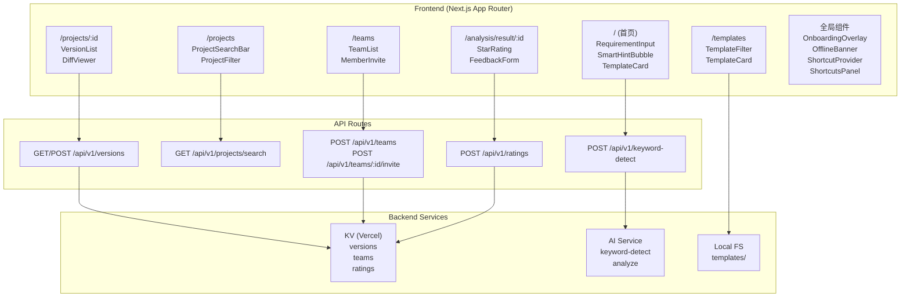
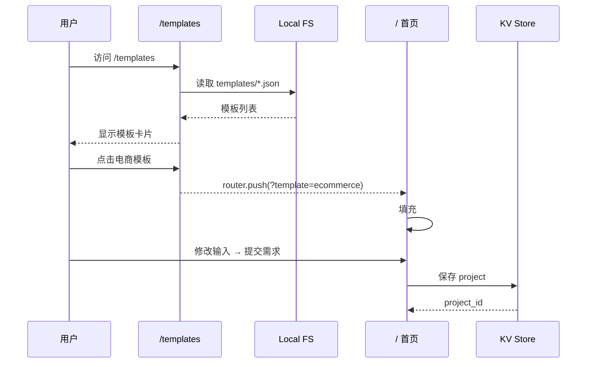
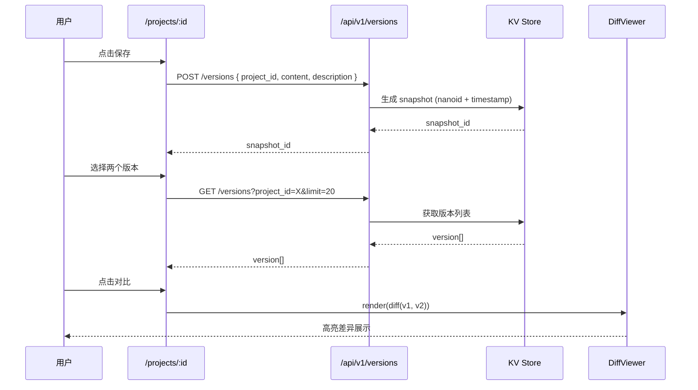
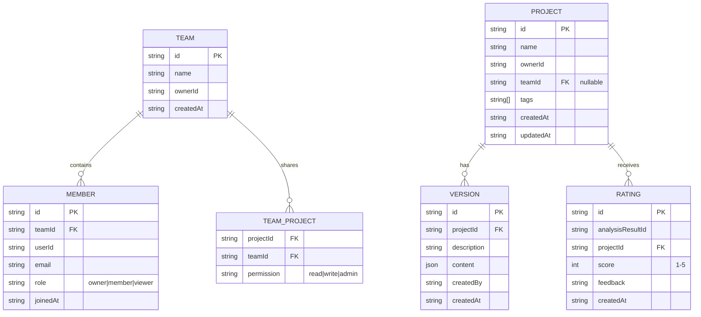

# VibeX PM Proposals 2026-04-10 — Architecture

> **文档版本**: v1.0
> **作者**: Architect Agent
> **日期**: 2026-04-10
> **状态**: Draft
> **工作目录**: /root/.openclaw/vibex

---

## 1. Tech Stack

### 1.1 Frontend

| 技术 | 版本 | 选型理由 |
|------|------|---------|
| **Next.js** | 14+ (App Router) | 路由系统成熟，SSR/CSR 灵活，API Routes 内置 |
| **TypeScript** | 5.x | 类型安全，PRD 要求严格类型覆盖 |
| **Tailwind CSS** | 3.x | 快速 UI 迭代，组件化样式 |
| **React Hook Form + Zod** | latest | 表单验证与 schema 管理 |
| **@tanstack/react-query** | 5.x | 服务端状态管理，缓存策略 |
| **diff** (npm) | 3.x | 版本对比核心库 |
| **react-joyride** | 2.x | 新手引导 overlay 框架 |
| **framer-motion** | 11.x | 过渡动画与微交互 |

### 1.2 Backend

| 技术 | 版本 | 选型理由 |
|------|------|---------|
| **Next.js API Routes** | 14+ | 与前端同仓库，减少网络开销 |
| **KV (Vercel)** | — | 版本快照、团队数据、评分存储 |
| **Zod** | 3.x | 输入验证与 schema 校验 |
| **nanoid** | 3.x | 轻量 ID 生成 |

### 1.3 Infrastructure

| 技术 | 用途 |
|------|------|
| **Vercel** | 部署与 KV 绑定 |
| **Playwright** | E2E 测试（assertions 来自 PRD） |
| **Vitest** | 单元测试 |

### 1.4 Tech Stack 版本决策

| 决策 | 状态 | 说明 |
|------|------|------|
| 复用现有 Next.js 14 项目 | **已采纳** | 避免迁移成本，API Routes 覆盖新接口 |
| 复用现有 KV (Vercel) | **已采纳** | PM 提案确认 CollaborationService KV 已部署，直接复用 |
| 使用 react-joyride 而非自研 | **已采纳** | P002 引导流程已有 `<CanvasOnboardingOverlay />` 基础，joyride 可复用 |
| diff 库选型 | **待评审** | 评估 `diff` vs `fast-json-diff`，评审截止 2026-04-11 |

---

## 2. Architecture Diagram

### 2.1 High-Level System Context

```mermaid
C4Context
  title System Context — VibeX PM Proposals

  Person(user, "用户", "新用户/团队成员")
  System(vibex, "VibeX Platform", "AI 驱动的 DDD 领域建模平台")
  System_Ext(aiService, "AI Service", "外部 AI 服务")

  Rel(user, vibex, "输入需求 / 浏览项目 / 团队协作")
  Rel(vibex, aiService, "keyword-detect / analyze")
  Rel(vibex, kv, "read/write snapshots, teams, ratings")
```

### 2.2 Component Architecture



### 2.3 Data Flow: Template Selection



### 2.4 Data Flow: Version Comparison



---

## 3. API Definitions

### 3.1 新增 API

#### POST /api/v1/keyword-detect

**用途**: 需求智能补全 — 检测输入中的关键词并触发追问

**Request Body**:
```typescript
interface KeywordDetectRequest {
  text: string;       // 用户输入，≥50 字触发
  projectId?: string;
}
```

**Response**:
```typescript
interface KeywordDetectResponse {
  keywords: Array<{
    word: string;
    type: 'entity' | 'verb' | 'business_term';
    position: { start: number; end: number };
  }>;
  suggestions: string[];        // 追问文案列表
  shouldClarify: boolean;       // 是否需要澄清
  clarifyPrompt?: string;       // 追问提示
}
```

**Errors**:
- `400`: 输入为空或格式错误
- `429`: 速率限制（AI 服务调用）
- `500`: AI 服务异常

**断言**（来自 PRD E03-S1/S2）:
- 响应时间 < 1s
- 输入 ≥50 字时必须返回关键词列表

---

#### GET /api/v1/projects/search

**用途**: 项目搜索过滤

**Query Parameters**:
```typescript
interface ProjectSearchParams {
  q?: string;           // 搜索关键字
  filterBy?: 'name' | 'createdAt' | 'tag';
  filterValue?: string;
  sortBy?: 'createdAt' | 'name' | 'updatedAt';
  sortOrder?: 'asc' | 'desc';
  page?: number;
  limit?: number;       // 默认 20
}
```

**Response**:
```typescript
interface ProjectSearchResponse {
  projects: Array<{
    id: string;
    name: string;
    description: string;
    tags: string[];
    createdAt: string;  // ISO 8601
    updatedAt: string;
    ownerId: string;
  }>;
  total: number;
  page: number;
  limit: number;
  searchTimeMs: number;  // 性能指标
}
```

**断言**（来自 PRD E04-S2）:
- 搜索响应 < 200ms

---

#### POST /api/v1/versions

**用途**: 创建版本快照

**Request Body**:
```typescript
interface CreateVersionRequest {
  projectId: string;
  description: string;
  content: Record<string, unknown>;  // 领域模型快照内容
}
```

**Response**:
```typescript
interface CreateVersionResponse {
  id: string;
  projectId: string;
  description: string;
  content: Record<string, unknown>;
  createdAt: string;
  createdBy: string;
}
```

---

#### GET /api/v1/versions

**用途**: 获取版本历史列表

**Query Parameters**:
```typescript
interface GetVersionsParams {
  projectId: string;
  page?: number;
  limit?: number;  // 默认 20
}
```

**Response**:
```typescript
interface GetVersionsResponse {
  versions: Array<{
    id: string;
    description: string;
    createdAt: string;
    createdBy: string;
  }>;
  total: number;
  page: number;
}
```

---

#### POST /api/v1/ratings

**用途**: 提交 AI 生成结果评分

**Request Body**:
```typescript
interface CreateRatingRequest {
  analysisResultId: string;
  projectId: string;
  score: 1 | 2 | 3 | 4 | 5;
  feedback?: string;
}
```

**Response**:
```typescript
interface CreateRatingResponse {
  id: string;
  score: number;
  submittedAt: string;
}
```

---

#### POST /api/v1/teams

**用途**: 创建团队

**Request Body**:
```typescript
interface CreateTeamRequest {
  name: string;
  ownerId: string;
}
```

**Response**:
```typescript
interface CreateTeamResponse {
  id: string;
  name: string;
  ownerId: string;
  createdAt: string;
}
```

---

#### POST /api/v1/teams/:id/invite

**用途**: 邀请团队成员

**Request Body**:
```typescript
interface InviteMemberRequest {
  email: string;
  role: 'owner' | 'member' | 'viewer';
}
```

**Response**:
```typescript
interface InviteMemberResponse {
  memberId: string;
  teamId: string;
  role: string;
  invitedAt: string;
}
```

---

## 4. Data Model

### 4.1 KV Schema



### 4.2 KV Key Design

| Key Pattern | Value Type | 说明 | TTL |
|-------------|-----------|------|-----|
| `team:{teamId}` | JSON | 团队基本信息 | 无 |
| `team:{teamId}:members` | JSON Array | 成员列表 | 无 |
| `team:{teamId}:projects` | JSON Array | 团队共享的项目 ID | 无 |
| `project:{projectId}` | JSON | 项目基本信息 | 无 |
| `project:{projectId}:versions` | JSON Array | 版本快照列表 | 无 |
| `project:{projectId}:version:{vid}` | JSON | 单个版本内容 | 无 |
| `rating:{analysisId}` | JSON | 评分数据 | 无 |
| `user:{userId}:onboarding` | string | 引导完成状态 ('completed'/'skipped') | 无 |
| `user:{userId}:ratings` | JSON Array | 用户所有评分记录 | 无 |

### 4.3 Template File Structure (Local FS)

```
/data/templates/
  ecommerce.json
  social.json
  saas.json
```

**Template JSON Schema**:
```typescript
interface Template {
  id: string;
  title: string;
  industry: 'ecommerce' | 'social' | 'saas';
  description: string;
  entities: string[];           // 典型实体列表
  contexts: string[];          // 限界上下文
  example_requirements: Array<{
    id: string;
    text: string;
    domainModel?: string;
  }>;
}
```

**断言**（来自 PRD E01-S1）:
- 每个模板包含 ≥5 个 `example_requirements`
- 模板字段包含 title/industry/entities/contexts/example_requirements

---

## 5. Testing Strategy

### 5.1 Test Pyramid

```
        ┌─────────────────┐
        │   E2E (Playwright)  │  ← PRD assertions 直接转化
        │  覆盖率: 核心用户路径   │
        ├─────────────────┤
        │  Integration Tests   │  ← API Routes 测试
        ├─────────────────┤
        │    Unit Tests        │  ← 业务逻辑
        │  (Vitest)            │
        └─────────────────┘
```

### 5.2 Test Framework

| 层级 | 框架 | 断言来源 |
|------|------|---------|
| E2E | **Playwright** | PRD Section 4 assertions 直接转化 |
| Integration | **Vitest + supertest** | API 响应结构验证 |
| Unit | **Vitest** | 关键词检测、版本 diff、权限逻辑 |

### 5.3 Coverage Requirements

| Epic | E2E Coverage | Unit Coverage |
|------|-------------|---------------|
| E01 模板库 | 100% (assertions E01-S2/S3) | > 80% |
| E02 引导流程 | 100% (assertions E02-S2/S3) | > 80% |
| E03 智能补全 | 100% (assertions E03-S1/S2) | > 80% |
| E04 搜索过滤 | 100% (assertions E04-S2) | > 80% |
| E05 协作空间 | 100% (assertions E05-S1/S2/S4) | > 80% |
| E06 版本对比 | 100% (assertions E06-S1/S3) | > 80% |
| E07 快捷键 | 100% (assertions E07-S1/S2) | > 80% |
| E08 离线提示 | 100% (assertions E08-S1) | > 80% |
| E09 导入导出 | 100% (assertions E09-S1/S2) | > 80% |
| E10 AI 评分 | 100% (assertions E10-S1) | > 80% |

### 5.4 Core Test Cases (Examples)

**E03-S1: 关键词检测触发** (直接来自 PRD)
```typescript
import { test, expect } from '@playwright/test';

test('E03-S1: 关键词检测触发', async ({ page }) => {
  await page.fill('#requirement-input', '这是一个关于订单管理的系统，需要记录用户的购买记录和支付信息');
  await expect(page.locator('.smart-hint-bubble')).toBeVisible({ timeout: 1000 });
});
```

**E04-S2: 搜索响应 < 200ms** (直接来自 PRD)
```typescript
test('E04-S2: 搜索响应 < 200ms', async ({ page }) => {
  const start = Date.now();
  await page.fill('#project-search', '电商');
  const results = await page.locator('.project-item').all();
  expect(Date.now() - start).toBeLessThan(200);
});
```

**E05-S2: 成员邀请权限** (直接来自 PRD)
```typescript
test('E05-S2: viewer 角色无编辑权限', async ({ browser }) => {
  const memberUser = await browser.newPage();
  await memberUser.goto(`/project/${projectId}`);
  await expect(memberUser.locator('#edit-btn')).toBeDisabled();
});
```

### 5.5 CI/CD Integration

- **PR 阶段**: 运行 unit tests + integration tests
- **Main 分支**: 运行 full Playwright E2E suite
- **部署前**: Lighthouse audit (Performance Score > 80)

---

## 6. Acceptance Criteria Mapping

| Epic | Story | AC 编号 | 验收断言 |
|------|-------|---------|---------|
| E01 | E01-S2 | AC-001 | 模板库页面可访问，模板卡片 ≥3 |
| E01 | E01-S3 | AC-002 | 选择模板后自动填充，支持修改 |
| E02 | E02-S2 | AC-003 | 引导 overlay 可见，步骤 ≤4 |
| E02 | E02-S3 | AC-004 | 跳过不重复弹出 |
| E03 | E03-S1 | AC-005 | ≥50 字触发检测 |
| E03 | E03-S2 | AC-006 | 追问响应 < 1s |
| E04 | E04-S2 | AC-007 | 搜索响应 < 200ms |
| E05 | E05-S1 | AC-008 | 团队创建成功 |
| E05 | E05-S2 | AC-009 | 成员邀请和权限设置 |
| E06 | E06-S1 | AC-010 | 版本快照生成 |
| E06 | E06-S3 | AC-011 | 差异高亮可见 |
| E07 | E07-S1 | AC-012 | Ctrl+S 保存生效 |
| E08 | E08-S1 | AC-013 | 离线提示条可见 |
| E09 | E09-S1 | AC-014 | Markdown 导入成功 |
| E10 | E10-S1 | AC-015 | 评分提交成功 |

---

## 执行决策

| 决策 | 状态 | 执行项目 | 日期 |
|------|------|---------|------|
| 复用现有 Next.js 14 + KV 架构 | **已采纳** | 无（无需项目追踪） | 2026-04-10 |
| 使用 react-joyride 作为引导框架 | **已采纳** | 无 | 2026-04-10 |
| diff 库选型（`diff` vs `fast-json-diff`） | **待评审** | — | 2026-04-11 |
| Playwright 作为 E2E 测试框架 | **已采纳** | 无 | 2026-04-10 |

