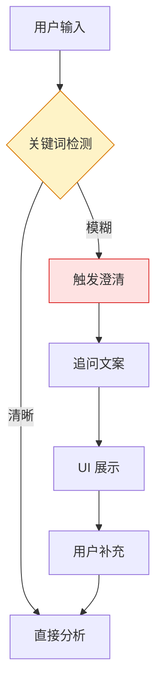
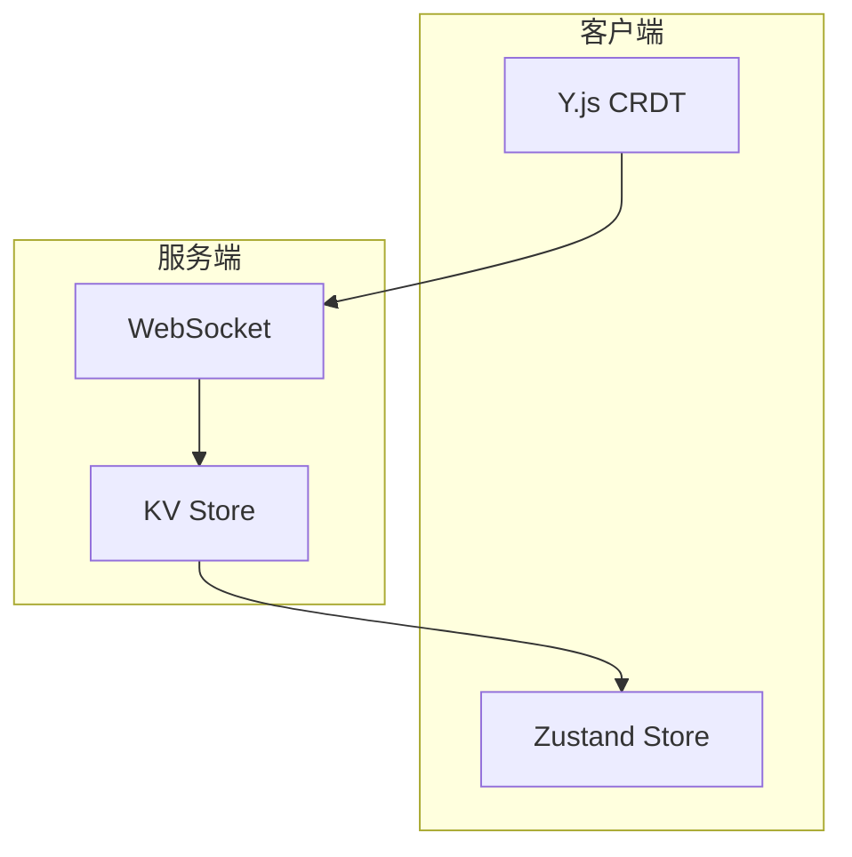

# Architecture: VibeX PM Proposals 2026-04-11

> **项目**: vibex-pm-proposals-vibex-proposals-20260411  
> **作者**: Architect  
> **日期**: 2026-04-11  
> **版本**: v1.0

---

## 执行决策

| 决策 | 状态 | 执行项目 | 执行日期 |
|------|------|----------|----------|
| AI 智能补全 | **已采纳** | vibex-pm-proposals-vibex-proposals-20260411 | 2026-04-11 |
| 团队协作 UI | **已采纳** | vibex-pm-proposals-vibex-proposals-20260411 | 2026-04-11 |

---

## 1. Tech Stack

| 组件 | 技术选型 | 说明 |
|------|----------|------|
| **AI 补全** | LLM API | 关键词检测 + 追问生成 |
| **搜索** | 客户端过滤 / 服务端索引 | <200ms |
| **协作** | Zustand + Y.js | CRDT 冲突解决 |
| **版本** | D1 + diff 算法 | 快照对比 |

---

## 2. 架构图

### 2.1 AI 智能补全



### 2.2 团队协作



---

## 3. 详细设计

### 3.1 AI 智能补全

```typescript
// hooks/useAIClarification.ts
interface ClarificationTrigger {
  keywords: string[];
  minLength: number;
  ambiguityScore: number;
}

const THRESHOLDS = {
  minLength: 10,
  ambiguityKeywords: ['大概', '可能', '一些', '某个', 'something'],
  ambiguityScore: 0.6,
};

export function useAIClarification() {
  const detectAmbiguity = (input: string): boolean => {
    const hasShortLength = input.length < THRESHOLDS.minLength;
    const hasAmbiguityWord = THRESHOLDS.ambiguityKeywords.some(k => input.includes(k));
    return hasShortLength || hasAmbiguityWord;
  };

  const generateClarification = async (input: string): Promise<string> => {
    const response = await fetch('/api/ai/clarify', {
      method: 'POST',
      body: JSON.stringify({ input }),
    });
    return response.json().then(r => r.clarification);
  };

  return { detectAmbiguity, generateClarification };
}
```

### 3.2 项目搜索

```typescript
// hooks/useProjectSearch.ts
export function useProjectSearch(projects: Project[]) {
  const [query, setQuery] = useState('');
  const [filter, setFilter] = useState<{ status?: string; date?: DateRange }>({});

  const results = useMemo(() => {
    return projects.filter(p => {
      const matchesQuery = !query || 
        p.name.toLowerCase().includes(query.toLowerCase()) ||
        p.description.toLowerCase().includes(query.toLowerCase());
      
      const matchesStatus = !filter.status || p.status === filter.status;
      const matchesDate = !filter.date || 
        (p.updatedAt >= filter.date.start && p.updatedAt <= filter.date.end);
      
      return matchesQuery && matchesStatus && matchesDate;
    });
  }, [projects, query, filter]);

  return { results, query, setQuery, filter, setFilter };
}
```

### 3.3 版本对比

```typescript
// components/VersionDiff.tsx
export function VersionDiff({ old: oldSnapshot, new: newSnapshot }: Props) {
  const diff = useMemo(() => {
    return computeDiff(oldSnapshot.content, newSnapshot.content);
  }, [oldSnapshot, newSnapshot]);

  return (
    <div className="version-diff">
      {diff.map((segment, i) => (
        <span
          key={i}
          className={cn(
            segment.type === 'added' && 'bg-green-100',
            segment.type === 'removed' && 'bg-red-100'
          )}
        >
          {segment.text}
        </span>
      ))}
    </div>
  );
}
```

---

## 4. 测试策略

```typescript
// tests/e2e/clarification.spec.ts
test('AI 补全触发', async ({ page }) => {
  await page.fill('[data-testid="requirement-input"]', '需要一个小程序');
  await expect(page.locator('[data-testid="clarification-panel"]')).toBeVisible();
});

test('项目搜索 < 200ms', async ({ page }) => {
  const start = Date.now();
  await page.fill('[data-testid="search-input"]', '电商');
  await page.waitForSelector('[data-testid="search-results"]');
  const duration = Date.now() - start;
  expect(duration).toBeLessThan(200);
});
```

---

## 5. 验收标准

| 检查项 | 验收 |
|--------|------|
| AI 补全触发率 | ≥ 80%（模糊输入时）|
| 项目搜索响应 | < 200ms |
| flowId E2E | 100% 通过 |
| 版本对比 | 差异高亮 |

---

*文档版本: v1.0 | 最后更新: 2026-04-11*
