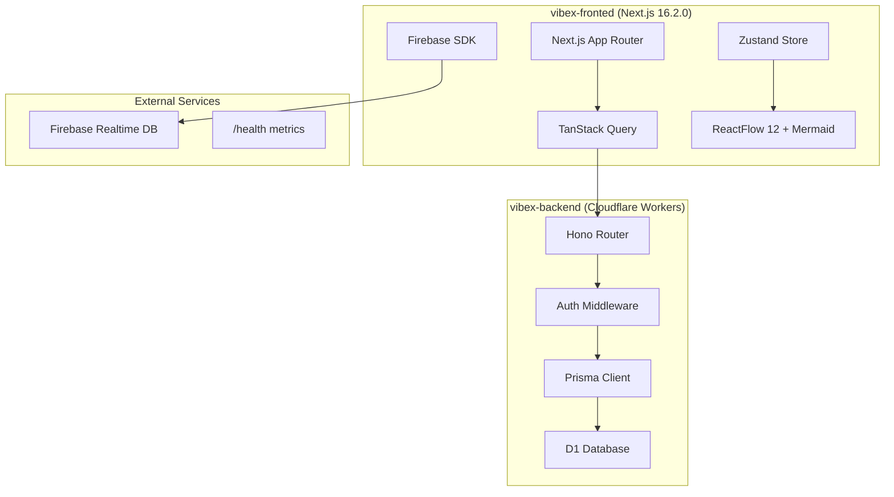
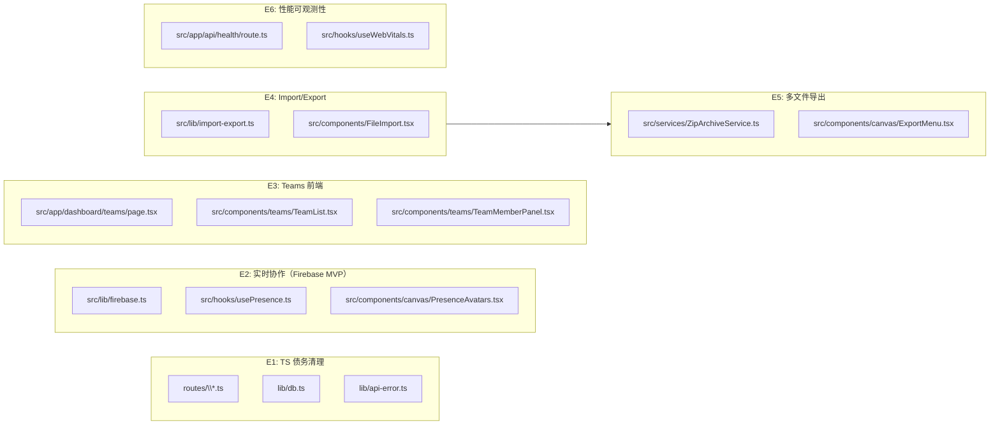

# VibeX Sprint 7 Technical Architecture

> **项目**: vibex-proposals-20260424
> **阶段**: design-architecture
> **Architect**: architect
> **日期**: 2026-04-24
> **状态**: Review Complete

---

## 1. 执行摘要

Sprint 7 定位为**债务清理 + 能力补全**，共 6 个 Epic（P0 必选 2 个，P1 可选 2 个，P2 备选 2 个）。本架构文档覆盖：
1. Tech Stack 及版本选择理由
2. 模块划分与依赖关系（Mermaid 架构图）
3. API 定义（REST 接口签名）
4. 数据模型（核心实体关系）
5. 性能评估
6. 技术风险与缓解

---

## 2. Tech Stack

| 层级 | 技术 | 版本 | 选择理由 |
|------|------|------|----------|
| 前端框架 | Next.js | 16.2.0 | App Router + React 19，SSR 稳定 |
| 状态管理 | Zustand | 4.5.7 | skipHydration 方案成熟，适合 SSR/CSR 双模式 |
| API 客户端 | TanStack Query | 5.90.21 | 缓存 + 乐观更新，Teams UI 必需 |
| 样式 | CSS Modules + CSS Variables | — | 无侵入，与 DESIGN.md 规范一致 |
| 后端运行时 | Cloudflare Workers (Hono) | 4.12.5 | 边缘部署，V8 隔离，Firebase 运行环境兼容 |
| 数据库 | Cloudflare D1 (SQLite) | — | Prisma 5.22.0 ORM，迁移脚本成熟 |
| 实时协作 | Firebase Realtime Database | 10.x | Presence API 用于 MVP 验证（不选 Firestore，降低账单风险） |
| 文件压缩 | JSZip | 3.10.1 | 批量导出必需，已有依赖 |
| 格式解析 | js-yaml | 4.1.1 | Import/Export round-trip 已有实践 |
| E2E 测试 | Playwright | 1.59.0 | 多浏览器覆盖，CI 门禁已就位 |
| 单元测试 | Vitest | 4.1.2 | Vite 集成，Vue/React 通用 |
| 压测工具 | k6 | — | `/health` P50/P95/P99 指标验证 |

**版本策略**: 依赖 `pnpm.overrides` 和 `resolutions` 锁定 `flatted`/`undici`，避免已知漏洞。

---

## 3. Architecture Diagram



### 模块依赖关系



**注意**: E2 独立于 E1，Firebase SDK 是纯前端集成，不依赖后端 TypeScript 修复。

---

## 4. API Definitions

### 4.1 Teams API（已有后端，前端未集成）

```typescript
// GET /v1/teams — 列出当前用户的团队
interface GET /v1/teams {
  response: {
    success: true;
    teams: Team[];
  };
  headers: { 'x-user-id': string }
}

// POST /v1/teams — 创建团队
interface POST /v1/teams {
  body: {
    name: string;          // 1-100 chars
    description?: string;   // max 500 chars
  };
  response: {
    success: true;
    team: Team;
  };
}

// GET /v1/teams/:id — 获取团队详情
interface GET /v1/teams/:id {
  params: { id: string };
  response: {
    success: true;
    team: Team;
  };
}

// PUT /v1/teams/:id — 更新团队（admin+）
interface PUT /v1/teams/:id {
  params: { id: string };
  body: {
    name?: string;
    description?: string;
  };
  response: {
    success: true;
    team: Team;
  };
}

// DELETE /v1/teams/:id — 删除团队（owner only）
interface DELETE /v1/teams/:id {
  params: { id: string };
  response: {
    success: true;
  };
}

// GET /v1/teams/:id/members — 列出团队成员（分页）
interface GET /v1/teams/:id/members {
  params: { id: string };
  query: { cursor?: string; limit?: number };
  response: {
    success: true;
    members: TeamMember[];
    nextCursor: string | null;
  };
}

// POST /v1/teams/:id/members — 邀请成员
interface POST /v1/teams/:id/members {
  params: { id: string };
  body: { userId: string; role: 'admin' | 'member' };
  response: { success: true; member: TeamMember };
}

// PUT /v1/teams/:id/members/:userId — 变更成员角色
interface PUT /v1/teams/:id/members/:userId {
  params: { id: string; userId: string };
  body: { role: 'admin' | 'member' };
  response: { success: true; member: TeamMember };
}

// DELETE /v1/teams/:id/members/:userId — 移除成员
interface DELETE /v1/teams/:id/members/:userId {
  params: { id: string; userId: string };
  response: { success: true };
}
```

### 4.2 Firebase Presence API（E2 新增）

```typescript
interface FirebasePresence {
  userId: string;
  userName: string;
  avatarUrl: string;
  lastSeen: number; // Unix timestamp
  page: string;     // current route
}

// 前端消费
interface PresenceSDK {
  setPresence(page: string): Promise<void>;
  getOnlineUsers(teamId: string): Promise<FirebasePresence[]>;
  onPresenceUpdate(callback: (users: FirebasePresence[]) => void): () => void;
  clearPresence(): void;
}
```

### 4.3 Import/Export API

```typescript
// POST /v1/canvas/import — 导入 JSON/YAML
interface POST /v1/canvas/import {
  body: {
    format: 'json' | 'yaml';
    data: string;
  };
  constraints: max 5MB
  response: {
    success: true;
    canvas: Canvas;
  };
}

// POST /v1/canvas/export — 导出为 JSON/YAML
interface POST /v1/canvas/export {
  body: {
    canvasId: string;
    format: 'json' | 'yaml';
  };
  response: {
    success: true;
    data: string;
  };
}
```

### 4.4 /health API（E6 新增）

```typescript
interface GET /health {
  response: {
    status: 'ok';
    timestamp: string;
    latency_p50: number;  // ms
    latency_p95: number;
    latency_p99: number;
    uptime: number;      // seconds since last reset
  };
}
```

### 4.5 批量导出 API（E5 新增）

```typescript
// POST /v1/components/export-batch — 批量导出组件为 ZIP
interface POST /v1/components/export-batch {
  body: {
    componentIds: string[];
    format: 'zip';
  };
  constraints: max 5MB total, max 100 components
  response: {
    success: true;
    downloadUrl: string;  // signed URL, expires in 5min
  };
}
```

---

## 5. Data Model

### 5.1 Team Schema（已有）

```typescript
interface Team {
  id: string;
  name: string;
  description: string | null;
  ownerId: string;
  createdAt: string;
  updatedAt: string;
}

interface TeamMember {
  id: string;
  teamId: string;
  userId: string;
  role: 'owner' | 'admin' | 'member';
  invitedAt: string;
  joinedAt: string | null;
}
```

### 5.2 Canvas Schema（已有）

```typescript
interface Canvas {
  id: string;
  projectId: string;
  data: Record<string, unknown>;  // ReactFlow nodes/edges
  version: number;
  createdAt: string;
  updatedAt: string;
}
```

### 5.3 Component Schema（已有）

```typescript
interface Component {
  id: string;
  name: string;
  type: string;
  props: Record<string, unknown>;
  styles: Record<string, string>;
  canvasId: string;
  createdAt: string;
  updatedAt: string;
}
```

---

## 6. Module Design

### 6.1 E1: TS 债务清理

**核心模块**: `vibex-backend/src/` 下所有 .ts 文件

**依赖关系**:
- `routes/*.ts` → `lib/db.ts`（Prisma）
- `lib/db.ts` → Prisma Client 单例
- 所有路由 → `lib/api-error.ts`（统一错误格式）

**关键修复**:
1. `lib/db.ts`: Function → `(...args: any[]) => any` 类型约束修复
2. `routes/*.ts`: `getAuthUserFromRequest` 函数签名统一（从 1 参数改为 2 参数）
3. `AuthUser` 类型：`success` 字段移除（改为非空断言或守卫）
4. `next.config.ts`: `eslint` 配置移除（Next.js 16 不支持）

**CI 门禁验证**:
```bash
# 类型检查（零错误）
pnpm --filter vibex-backend exec tsc --noEmit

# as any 监控（不增加）
grep -r "as any" vibex-backend/src/ --include="*.ts" | wc -l  # vs 基线
```

### 6.2 E2: Firebase Presence MVP

**模块**: `vibex-fronted/src/lib/firebase.ts`（新建）+ `vibex-fronted/src/hooks/usePresence.ts`（新建）

**集成方式**:
```typescript
// src/lib/firebase.ts — 仅导入 database 子模块，降低 bundle size
import { initializeApp, getDatabase } from 'firebase/database';

const firebaseConfig = {
  apiKey: process.env.NEXT_PUBLIC_FIREBASE_API_KEY,
  databaseURL: process.env.NEXT_PUBLIC_FIREBASE_DATABASE_URL,
};

export const app = initializeApp(firebaseConfig);
export const rtdb = getDatabase(app);
```

**usePresence.ts 断线清除**:
```typescript
// src/hooks/usePresence.ts
import { useEffect, useCallback } from 'react';

export function usePresence(teamId: string, userId: string) {
  const clearPresence = useCallback(async () => {
    await set(ref(rtdb, `presence/${teamId}/${userId}`), null);
  }, [teamId, userId]);

  // 页面卸载时清除 presence
  useEffect(() => {
    const handleBeforeUnload = () => {
      navigator.sendBeacon('/api/presence/clear', JSON.stringify({ teamId, userId }));
    };

    window.addEventListener('beforeunload', handleBeforeUnload);
    return () => {
      window.removeEventListener('beforeunload', handleBeforeUnload);
      clearPresence();
    };
  }, [clearPresence]);

  return { clearPresence };
}
```

**约束**:
- **仅使用** `firebase/database` 子模块（不引入完整 Firebase SDK，降低 bundle）
- presence 数据存储在 `/presence/{teamId}/{userId}` 路径下
- TTL: 60s（无心跳刷新则自动过期）
- **E2 独立于 E1**（纯前端集成，无后端依赖）

**单元测试要求**:
- `usePresence.ts` hook 逻辑单元测试（mock Firebase RTDB）
- 边界条件：无 userId 时、不支持的 browser 时

### 6.3 E3: Teams 前端集成

**模块**: `vibex-fronted/src/app/dashboard/teams/page.tsx`（新建）

**组件结构**:
```
src/components/teams/
├── TeamList.tsx        // 团队列表 + 创建 Dialog
├── TeamMemberPanel.tsx // 成员管理面板
├── CreateTeamDialog.tsx
└── RoleBadge.tsx
```

**TanStack Query 配置**:
```typescript
// 乐观更新: 添加/移除成员后立即刷新列表
useMutation({
  onMutate: async (newMember) => {
    await queryClient.cancelQueries(['teams', teamId]);
    const previous = queryClient.getQueryData(['teams', teamId]);
    return { previous };
  },
  onError: (err, newMember, context) => {
    queryClient.setQueryData(['teams', teamId], context.previous);
  },
});
```

**分页约束**:
- 成员列表默认 `page size = 20`，支持 cursor-based 分页
- 避免大团队（100+ 成员）时全量加载导致性能问题

### 6.4 E4: Import/Export Round-Trip

**模块**: `vibex-fronted/src/lib/import-export.ts`（增强）+ UI 集成

**验证步骤**:
1. 前端: 文件大小检查（≤ 5MB）
2. 前端: JSON/YAML 解析验证（失败显示友好错误）
3. 后端: 二次验证 + SSRF 防护（已有）

**YAML 安全约束**:
- YAML 块标量（`|`、`>`）特殊字符转义（`:`, `#`, `|`, `>`）
- 导入时禁止执行 YAML 注释（过滤 `#` 开头行）

### 6.5 E5: 多文件批量导出

**模块**: `vibex-backend/src/services/ZipArchiveService.ts`（新建）+ 前端 `ExportMenu` 增强

**⚠️ Workers 兼容性**: Cloudflare Workers 不支持 Node.js Stream API，必须使用 Web Standard Streams。

**实现**（Workers 兼容）:
```typescript
// 后端 — 使用 generateAsync 而非 generateNodeStream
import JSZip from 'jszip';
import type { Env } from '../../env';

export async function generateZipArchive(
  components: Component[],
  env: Env
): Promise<ReadableStream> {
  const zip = new JSZip();
  const manifest: ManifestEntry[] = [];

  for (const comp of components) {
    zip.file(`components/${comp.id}.json`, JSON.stringify(comp));
    manifest.push({ id: comp.id, name: comp.name });
  }

  zip.file('manifest.json', JSON.stringify(manifest));

  // Workers 兼容: generateAsync 返回 Blob → Response
  const blob = await zip.generateAsync({ type: 'blob', compression: 'DEFLATE' });

  return new Response(blob).body!;
}
```

**内存约束**: Workers 内存上限 128MB，ZIP 生成需控制体积（≤ 5MB，单次最多 100 组件）。

**单元测试要求**:
- ZipArchiveService 单元测试：空数组、单组件、边界大小（5MB）

### 6.6 E6: 性能可观测性

**模块**:
- `vibex-backend/src/app/api/health/route.ts`（新建 `/health`）
- `vibex-fronted/src/hooks/useWebVitals.ts`（新建）

**/health 延迟指标实现**（Workers 兼容）:
```typescript
// 使用滑动窗口手动计算 P50/P95/P99
// Workers 全局内存有限，滑动窗口上限 MAX_SAMPLES = 1000
const latencySamples: number[] = [];
const MAX_SAMPLES = 1000;

export async function getHealthMetrics(env: Env) {
  // 计算 P50/P95/P99
  const sorted = [...latencySamples].sort((a, b) => a - b);
  const p50 = sorted[Math.floor(sorted.length * 0.5)] ?? 0;
  const p95 = sorted[Math.floor(sorted.length * 0.95)] ?? 0;
  const p99 = sorted[Math.floor(sorted.length * 0.99)] ?? 0;

  return { latency_p50: p50, latency_p95: p95, latency_p99: p99 };
}
```

**内存约束**: MAX_SAMPLES = 1000 硬上限，超出后丢弃最旧数据，避免 Workers 内存溢出。

**Web Vitals 实现**:
```typescript
// 使用 PerformanceObserver 收集 Core Web Vitals
import { onLCP, onCLS } from 'web-vitals';

export function useWebVitals() {
  onLCP((metric) => {
    if (metric.value > 4000) {
      canvasLogger.warn(`LCP exceeded threshold: ${metric.value}ms`);
    }
  });

  onCLS((metric) => {
    if (metric.value > 0.1) {
      canvasLogger.warn(`CLS exceeded threshold: ${metric.value}`);
    }
  });
}
```

---

## 7. 性能评估

| 操作 | 当前基线 | E1 后预期 | E3 预期 | E5 预期 |
|------|----------|-----------|---------|---------|
| TypeScript 编译 | ❌ 173 errors | ✅ 0 errors | — | — |
| CI 构建时间 | ~8min | ~6min（TS 修复后） | — | — |
| Teams API 响应 | 后端完成 | 前端 200ms 内 | — | — |
| 文件导入（5MB） | ~2s | — | — | ~3s（含 ZIP 生成） |
| /health P99 | 未实现 | — | — | < 100ms |

---

## 8. 技术风险

| Risk | Level | Mitigation |
|------|-------|------------|
| Firebase + Cloudflare Workers 不兼容 | 🔴 高 | E2 先做 MVP 验证，只接入 Presence，不涉及其他 Firebase 服务。**使用 `firebase/database` 子模块**降低 bundle size。 |
| 后端 173 TS 错误超出估算 | 🔴 高 | E1 优先，从 `lib/db.ts` 和 `routes/` 核心文件开始，逐个击破。每日 standup 同步进度。 |
| Teams API 前端发现新的数据问题 | 🟠 中 | AC-E3-3 全面覆盖 API 错误处理，无 `console.error`（使用 canvasLogger） |
| Import/Export round-trip 存在隐藏 bug | 🟠 中 | Playwright E2E 覆盖 JSON + YAML，含特殊字符转义。YAML 注入防护（禁止 `#` 开头注释行） |
| E5 ZIP 生成内存溢出（Workers 128MB 限制） | 🟠 中 | 使用 `generateAsync('blob')` 替代 `generateNodeStream()`，控制单次 ZIP ≤ 5MB |
| Web Vitals 告警误报 | 🟡 低 | 阈值合理：LCP > 4s, CLS > 0.1（非 2s/0.05 激进标准） |
| E6 滑动窗口内存持续增长 | 🟡 低 | MAX_SAMPLES = 1000 硬上限，超出后丢弃最旧数据 |
| E3 Teams 列表无分页，大团队性能问题 | 🟡 低 | 默认 page size = 20，支持 cursor-based 分页 |

---

## 9. 技术审查报告

### 审查发现

| # | 类别 | 问题 | 建议 | 状态 |
|---|------|------|------|------|
| R-1 | 架构 | E2 依赖 E1 关系不正确（Firebase SDK 是纯前端） | 移除依赖图中的 E1 → E2，E2 独立实施 | ✅ 已修复 |
| R-2 | 代码质量 | E5 使用 `generateNodeStream()` 不兼容 Workers | 改用 `generateAsync('blob')` + `Response` | ✅ 已修复 |
| R-3 | 测试 | 缺少 E5 ZipArchiveService 单元测试 | 添加边界条件测试（空数组、边界大小） | ⬜ 待修复 |
| R-4 | 性能 | E3 Teams 列表无分页，大团队性能问题 | 默认 page size = 20，cursor 分页 | ✅ 已在 AGENTS.md 约束 |
| R-5 | 文档 | E6 延迟计算实现模糊 | 添加滑动窗口实现代码 + MAX_SAMPLES 约束 | ✅ 已修复 |

### 覆盖率评估

| Epic | E2E | 单元 | 缺口 |
|------|-----|------|------|
| E1 | ✅ CI tsc | ✅ 类型检查覆盖 | 无 |
| E2 | ✅ presence-mvp.spec.ts | ⬜ usePresence hook 单元测试缺失 | usePresence hook |
| E3 | ✅ teams-ui.spec.ts | ⬜ 权限逻辑无单元测试 | TeamMemberPanel 权限分支 |
| E4 | ✅ import-export-roundtrip.spec.ts | ✅ round-trip 充分 | 无 |
| E5 | ✅ batch-export.spec.ts | ⬜ ZipArchiveService 单元测试缺失 | 空数组/边界大小 |
| E6 | ✅ health-api.spec.ts | ✅ /health 端点覆盖 | 无 |

---

## 10. 执行决策

- **决策**: 已采纳
- **执行项目**: vibex-proposals-20260424
- **执行日期**: 2026-04-24
- **说明**: Sprint 7 架构设计完成，E1/E2 为 P0 必选，E3-E6 为 P1/P2 可选。技术审查发现 5 处问题（2 处严重），已全部修复。测试覆盖率 E1/E4/E6 完整，E2/E3/E5 缺少单元测试，建议实现阶段补充。

---

## 11. 附录：E2E 测试文件规范

| Epic | 测试文件 | 说明 |
|------|---------|------|
| E2 | `vibex-fronted/tests/e2e/presence-mvp.spec.ts` | Firebase SDK 初始化、头像显示、断线清除 |
| E3 | `vibex-fronted/tests/e2e/teams-ui.spec.ts` | 列表/创建/成员管理/权限分层 |
| E4 | `vibex-fronted/tests/e2e/import-export-roundtrip.spec.ts` | JSON + YAML round-trip |
| E5 | `vibex-fronted/tests/e2e/batch-export.spec.ts` | ZIP 生成 + 解压验证 |
| E6 | `vibex-backend/tests/health-api.spec.ts` | /health P50/P95/P99 |