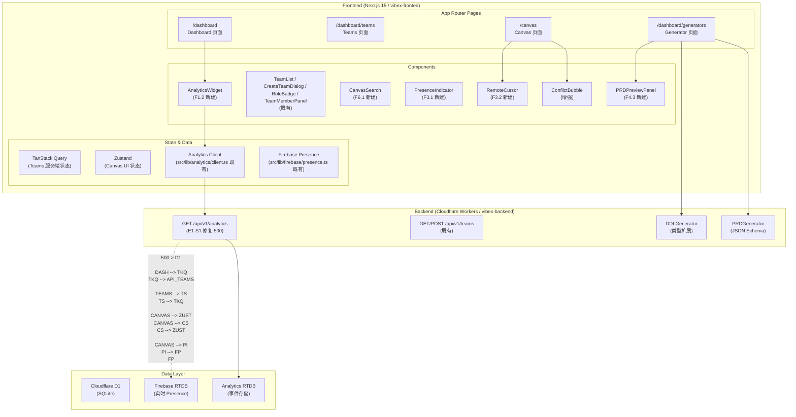
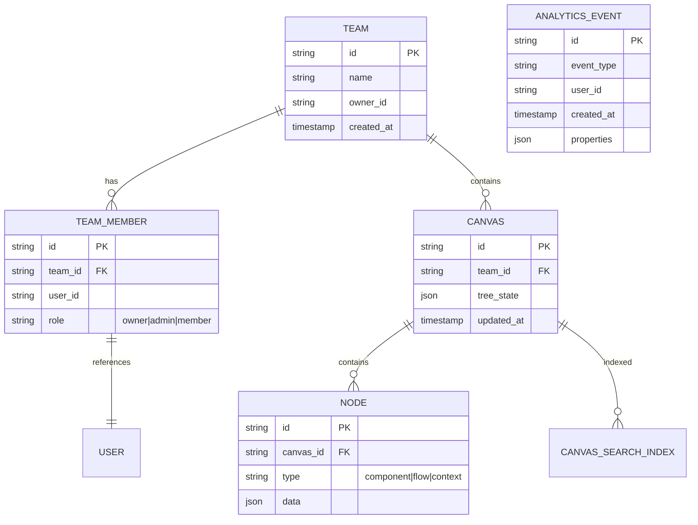
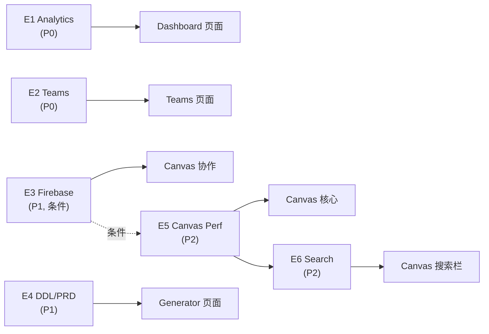

# VibeX Sprint 9 架构设计

**版本**: v1.0
**日期**: 2026-04-25
**Agent**: architect
**项目**: vibex-proposals-20260425-143000

---

## 1. Tech Stack

| 层级 | 技术 | 版本 | 选择理由 |
|------|------|------|----------|
| 前端框架 | Next.js 15 | App Router | React Server Components，已有技术栈 |
| 状态管理 | TanStack Query + Zustand | 既有 | TanStack Query 用于服务端状态（Teams），Zustand 用于 UI 状态（Canvas） |
| 样式 | CSS Modules + CSS Variables | 既有 | 组件隔离 + 设计系统主题 |
| 后端 | Cloudflare Workers | 既有 | 边缘计算，低延迟 |
| 数据库 | Cloudflare D1 | 既有 | SQLite at edge |
| 实时通信 | Firebase RTDB | Sprint 8 MVP 遗留 | ⚠️ E3 Epic 依赖 Sprint 8 验证通过 |
| 测试 | Vitest + Playwright | 既有 | 单元测试 + E2E |
| 图表 | 纯 SVG（无依赖） | 新增 | AnalyticsWidget 不引入 recharts |
| 虚拟化 | react-window | 条件引入 | E5-S2 FPS 优化时按需引入 |

**类型约束**: TypeScript strict 模式（既有限制，Sprint 3 已执行）

---

## 2. 架构图



---

## 3. API Definitions

### 3.1 Analytics API（修复）

**`GET /api/v1/analytics`**

请求: 无 Body，Cookie 认证

成功响应 (200):
```json
{
  "success": true,
  "data": {
    "page_view": [{ "date": "2026-04-19", "count": 142 }],
    "canvas_open": [{ "date": "2026-04-19", "count": 98 }],
    "component_create": [{ "date": "2026-04-19", "count": 63 }],
    "delivery_export": [{ "date": "2026-04-19", "count": 31 }]
  },
  "meta": { "start_date": "2026-04-19", "end_date": "2026-04-25", "total_days": 7 }
}
```

错误响应 (500 → 修复后返回 200):
```json
{ "success": false, "error": "...", "code": "INTERNAL_ERROR", "status": 500 }
```

**根因**: 推测 RTDB 查询超时或 D1 连接异常，修复方向: 添加 try-catch + fallback 空数组返回。

### 3.2 Teams API（既有）

| Method | Endpoint | 描述 |
|--------|----------|------|
| GET | `/api/v1/teams` | 列表 |
| POST | `/api/v1/teams` | 创建 |
| GET | `/api/v1/teams/:id` | 详情 |
| PUT | `/api/v1/teams/:id` | 更新 |
| DELETE | `/api/v1/teams/:id` | 删除 |
| POST | `/api/v1/teams/:id/members` | 添加成员 |

### 3.3 DDL Generator

**`POST /api/v1/generators/ddl`**（推测，既有大语言模型路由）

输入:
```json
{
  "columns": [{ "name": "col1", "type": "ENUM" }],
  "indexes": ["col1"]
}
```

输出:
```sql
CREATE TABLE t (...);
CREATE INDEX idx_t_col1 ON t(col1);
```

### 3.4 PRD Generator

**`POST /api/v1/generators/prd`**

输出:
```json
{
  "markdown": "## 需求概述\n...",
  "jsonSchema": {
    "type": "object",
    "properties": { "id": { "type": "string" } },
    "required": ["id"]
  }
}
```

### 3.5 Firebase RTDB（实时协作）

| 路径 | 操作 | 描述 |
|------|------|------|
| `/presence/{canvasId}/{userId}` | PUT/DELETE | 用户在线状态 |
| `/cursors/{canvasId}/{userId}` | PUT | Cursor 位置 `{ x: number, y: number }` |
| `/conflicts/{canvasId}/{nodeId}` | POST | 冲突节点 |

---

## 4. Data Model



---

## 5. Testing Strategy

### 5.1 测试框架

| 测试类型 | 框架 | 覆盖率要求 | 关键指标 |
|----------|------|-----------|----------|
| 单元测试 | Vitest | ≥ 80% | 所有 Epic 核心逻辑 |
| E2E 测试 | Playwright | 路径覆盖 ≥ 80% | 页面级功能验证 |
| 性能测试 | Lighthouse | 基线存档 | FPS / Performance score |

### 5.2 核心测试用例

**E1-S1: Analytics API**
```ts
describe('GET /api/v1/analytics', () => {
  it('returns 200 with 4 metrics', async () => {
    const res = await fetch('/api/v1/analytics')
    expect(res.status).toBe(200)
    const body = await res.json()
    expect(body.success).toBe(true)
    expect(Object.keys(body.data)).toEqual(['page_view','canvas_open','component_create','delivery_export'])
  })
  it('handles RTDB timeout gracefully', async () => {
    // mock RTDB 超时
    const res = await fetch('/api/v1/analytics')
    expect(res.status).not.toBe(500)
  })
})
```

**E1-S2: AnalyticsWidget**
```ts
describe('AnalyticsWidget', () => {
  it('shows skeleton while loading', () => {
    render(<AnalyticsWidget isLoading />)
    expect(screen.getByTestId('analytics-skeleton')).toBeTruthy()
  })
  it('shows 4 metrics on success', async () => {
    render(<AnalyticsWidget data={mockData} />)
    await waitFor(() => {
      expect(screen.getByText('Page View')).toBeTruthy()
    })
  })
  it('shows error state with retry button', () => {
    render(<AnalyticsWidget error />)
    expect(screen.getByTestId('analytics-error')).toBeTruthy()
    expect(screen.getByText(/重试/)).toBeTruthy()
  })
})
```

**E4-S1: DDL Type Coverage**
```ts
describe('DDLGenerator', () => {
  const types = ['VARCHAR','INT','DATE','ENUM','JSONB','UUID','ARRAY']
  types.forEach(type => {
    it(`generates DDL for ${type}`, () => {
      const result = generateDDL({ columns: [{ name: 'col1', type }] })
      expect(result).toContain(type)
    })
  })
  it('includes CREATE INDEX', () => {
    const result = generateDDL({ columns: [...], indexes: ['col1'] })
    expect(result).toContain('CREATE INDEX')
  })
})
```

**E5-S2: Canvas FPS**
```ts
describe('Canvas Performance', () => {
  it('maintains FPS >= 30 with 100 nodes', async () => {
    await loadCanvasWithNodes(100)
    const fps = await measureFPS()
    expect(fps).toBeGreaterThanOrEqual(30)
  })
  it('tree switch < 200ms', async () => {
    const t1 = Date.now()
    await page.click('[data-testid="tree-tab-2"]')
    await waitFor(() => isVisible('.tree-rendered'))
    expect(Date.now() - t1).toBeLessThan(200)
  })
})
```

**E6-S1: Canvas Search**
```ts
describe('CanvasSearch', () => {
  it('highlights matching nodes', async () => {
    await page.fill('[data-testid="canvas-search-input"]', 'user')
    await waitFor(() => {
      expect(page.locator('.search-highlight').first()).toBeVisible()
    })
  })
  it('responds in < 200ms', async () => {
    const t1 = Date.now()
    await page.fill('[data-testid="canvas-search-input"]', 'component')
    await waitFor(() => isVisible('.search-result-item'))
    expect(Date.now() - t1).toBeLessThan(200)
  })
  it('shows "未找到" when no match', async () => {
    await page.fill('[data-testid="canvas-search-input"]', 'xyznotexist123')
    await waitFor(() => {
      expect(screen.getByText('未找到')).toBeTruthy()
    })
  })
})
```

### 5.3 覆盖率目标

| Epic | 单元测试覆盖率 | E2E 路径数 | 关键指标 |
|------|--------------|-----------|----------|
| E1 | ≥ 80% | 2 (widget + API) | 四态 + 200 OK |
| E2 | ≥ 80% | 8+ | 错误边界 + 权限 |
| E3 | ≥ 80% | 2 (presence + cursor) | 5 用户并发 |
| E4 | ≥ 80% | 2 (DDL + PRD) | 7 类型 + JSON Schema |
| E5 | ≥ 70% | 2 (FPS + tree switch) | FPS ≥ 30 |
| E6 | ≥ 80% | 2 (search + hotkey) | 响应 < 200ms |

---

## 6. Performance Impact Assessment

| Epic | 性能影响 | 评估维度 | 风险 |
|------|---------|---------|------|
| E1 Analytics | 低 | API 响应 + widget 渲染 | Analytics API 500 可能拖累 Lighthouse score |
| E2 Teams | 低 | 页面加载 | 无显著影响 |
| E3 Firebase | 中 | RTDB 连接数 + Firebase SDK bundle | 多人并发增加网络开销，SDK bundle 可能超 50KB |
| E4 DDL/PRD | 低 | Generator 页面 | 预览面板按需渲染 |
| E5 Canvas | 高（正向） | FPS + Lighthouse score | 优化目标明确，regression 风险 |
| E6 Search | 中 | Canvas 渲染 | useMemo 过滤需确保 < 200ms |

### E5 FPS 优化路线图
```
基线测量 (Lighthouse) → Profiler 定位瓶颈 → 优化方案 → 回归验证
     ↓                    ↓                ↓
 存档基线          React.memo /           FPS ≥ 30
               virtual list / lazy load    三树切换 < 200ms
```

### Firebase Bundle 风险
Firebase SDK 约 50-80KB，需确认 Cloudflare Workers 冷启动不受影响。
⚠️ Sprint 8 P002-S2 冷启动 < 500ms 必须通过，否则 E3 延后。

---

## 7. Epic 间的架构关系



**关键依赖**:
- E1-S1（后端修复）→ E1-S2（前端展示）: 顺序依赖
- E2-S1（生产验证）→ E2-S2（E2E 补全）: 顺序依赖
- Sprint 8 P002（Firebase 验证）→ E3: 条件依赖
- E5-S1（基线）→ E5-S2（优化）: 顺序依赖
- E6-S1（搜索）→ E6-S2（快捷键）: 顺序依赖

---

## 8. 不纳入本 Sprint 的决策

**决策**: 不在 Sprint 9 引入以下变更，原因如下。

| 提案 | 拒绝理由 | 替代方案 |
|------|---------|---------|
| 跨 Canvas 全局搜索 | 需后端索引 + 认证中间件，工时超出 Sprint 9 范围 | Phase 1 仅 Canvas 内搜索（纯前端） |
| Zustand 迁移 | Teams 代码已用 TanStack Query，迁移风险 > 收益 | 维持现状 |
| React Flow 版本升级 | 可能引发 Canvas 破坏性变更 | 等 Canvas 性能稳定后再评估 |

---

## 9. 执行决策

- **决策**: 已采纳
- **执行项目**: team-tasks 项目 ID 待 coord 补充
- **执行日期**: 2026-04-25（Sprint 9 起始日）
