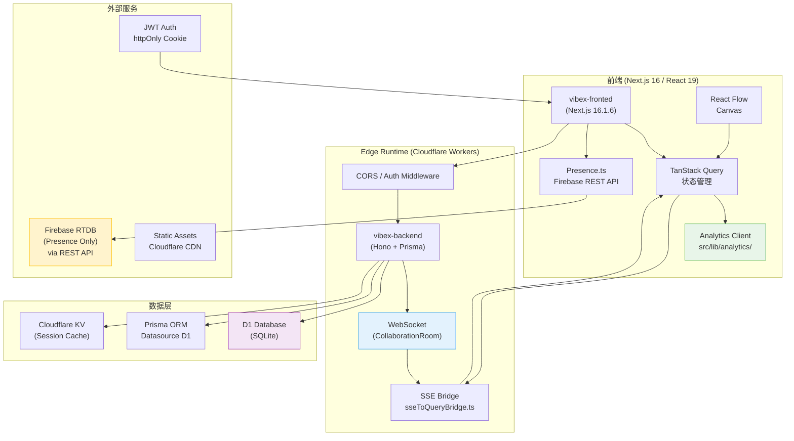
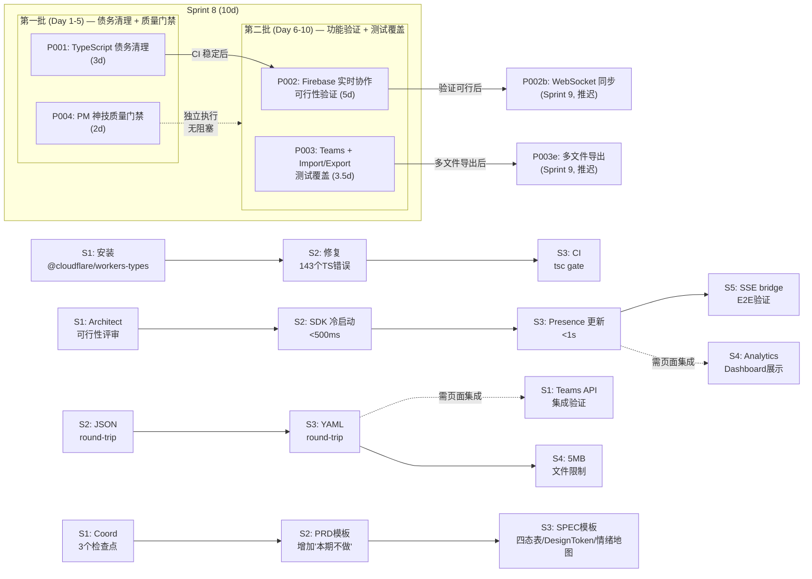

# VibeX Sprint 8 — 架构设计提案

**版本**: v1.0
**日期**: 2026-04-25
**Architect**: architect
**状态**: 待评审

---

## 执行摘要

Sprint 8 定位为**债务清理 + 质量门禁建立 + 可行性验证**冲刺，不引入新功能架构。四个 Epic 分别解决：TS 编译债务（TR-001）、Firebase 实时协作可行性（TR-002）、Import/Export 数据可靠性（TR-003）、PM 神技落地系统性失败（TR-005）。

**约束**：不引入新的前端状态管理方案、不引入新的 CSS 方案、不引入新的服务端运行时。

---

## 1. Tech Stack

### 1.1 P001 — TypeScript 债务清理

| 依赖 | 版本 | 理由 |
|------|------|------|
| `@cloudflare/workers-types` | `^4.20250415.0` | 最新稳定版，覆盖 Workers V8 isolate 全局类型（WebSocketPair、DurableObjectNamespace、ResponseInit.webSocket 等）。选最新是因为 Cloudflare 每月更新类型定义 |
| `typescript` | `^5.7.3` | 保持现有（vibex-backend 已在用 5.x），升级到 5.7 以获得更好的 `tsc --noEmit` 性能和 `unknown` 类型推断改进 |
| `vitest` | `^2.0.0` | 保持现有（vibex-frontend 已用 Vitest），确保 TS 测试与前端一致 |

**变更理由**：安装 `@cloudflare/workers-types` 是唯一必须变更。剩余 143 个错误是缺少此包导致的级联类型缺失，而非代码逻辑问题，修复工具函数类型声明即可解决。

### 1.2 P002 — Firebase 实时协作可行性验证

| 依赖/方案 | 版本/选择 | 理由 |
|------|------|------|
| 现有方案：Firebase REST API | 已实现（`presence.ts`） | 使用原生 `fetch` + EventSource 连接 RTDB，不导入 `firebase/app`，bundle 体积接近零 |
| Firebase Admin SDK | `firebase-admin`（如验证可行后升级） | 仅在后端服务账号场景使用，不进入 Workers bundle |
| 备选方案：HocusPocus | — | WebSocket 原生协作服务，按连接计费，适合 Cloudflare Workers 环境 |
| 备选方案：PartyKit | — | 实时 WebSocket 托管，但有供应商锁定风险 |

**决策**：Sprint 8 阶段保持 REST API，暂不引入完整 Firebase SDK（ADR-001 详述）。

### 1.3 P003 — Teams + Import/Export 测试覆盖

| 依赖 | 版本 | 理由 |
|------|------|------|
| `playwright` | `^1.58.2` | 保持现有（Sprint 1 已引入），E2E round-trip 测试依赖 Playwright |
| `js-yaml` | `^4.1.1` | 保持现有（vibex-backend 已在用），YAML 序列化/反序列化核心库 |
| `vitest` | `^2.0.0` | 保持现有，单元测试工具函数（YAML 特殊字符转义边界 case） |

**无新增依赖**。round-trip 测试复用现有 Playwright + Vitest 组合。

### 1.4 P004 — PM 神技质量门禁建立

| 依赖 | 版本 | 理由 |
|------|------|------|
| `stylelint` | 保持现有 | 复用现有 `stylelint "src/**/*.css"` 检查 Design Token 无硬编码色值 |
| `coord` 评审流程 | 文档更新 | 在 `coord/skills/agent-coherence-reviewer/SKILL.md` 增加 3 个强制检查点 |
| PRD 模板 | 模板更新 | 在 `templates/prd-template-standardization/` 增加"本期不做"章节 |
| SPEC 模板 | 模板更新 | 在 `templates/spec/` 强制四态表/Design Token/情绪地图引用 |

---

## 2. Architecture Diagram

### 2.1 系统整体架构（兼容现有）



**架构约束说明**：
- **不引入新状态管理**：TanStack Query 保持不变，Firebase Presence 数据通过 `sseToQueryBridge.ts` 写入现有 Query 缓存
- **不引入新 CSS 方案**：Design Token 通过 CSS 变量实现，检查通过 `stylelint` 强制
- **不引入新服务端运行时**：保持 Cloudflare Workers + Hono，Analytics 数据通过 D1 存储

### 2.2 Sprint 8 Epic 依赖关系图



**依赖关系说明**：
- P001 是所有 Epic 的基础：CI 构建失败会阻断 Firebase 验证的自动化测试
- P004 完全独立，可在 Sprint 8 任意时间执行，建议 Day 1 执行为后续所有 PRD 提供质量门禁
- P002 和 P003 可并行，与 P001 无直接依赖，但依赖 P001 完成后的 CI 稳定性

---

## 3. API Definitions

本次 Sprint 新增 2 个 API 端点定义。

### 3.1 Analytics Dashboard API

**端点**: `GET /api/analytics/events`

**用途**: 为 `/dashboard` Analytics Widget 提供事件数据查询接口。

```typescript
// Request
interface AnalyticsEventsRequest {
  startDate?: string;   // ISO 8601, 默认 7 天前
  endDate?: string;     // ISO 8601, 默认今天
  eventTypes?: Array<'page_view' | 'canvas_open' | 'component_create' | 'delivery_export'>;
  limit?: number;       // 默认 100, 最大 1000
  offset?: number;      // 默认 0
}

// Response
interface AnalyticsEventsResponse {
  events: Array<{
    id: string;
    eventType: 'page_view' | 'canvas_open' | 'component_create' | 'delivery_export';
    userId: string;
    timestamp: string;        // ISO 8601
    metadata: Record<string, unknown>;
    duration?: number;         // ms, 仅 canvas_open 有
  }>;
  total: number;
  summary: {
    pageViews: number;
    canvasOpens: number;
    componentsCreated: number;
    deliveriesExported: number;
  };
  pagination: {
    limit: number;
    offset: number;
    hasMore: boolean;
  };
}

// Errors
interface AnalyticsError {
  error: {
    code: 'INVALID_DATE_RANGE' | 'UNAUTHORIZED' | 'RATE_LIMITED';
    message: string;
  };
}
```

**实现位置**: `vibex-backend/src/routes/analytics.ts`

**约束**:
- 必须通过 JWT httpOnly cookie 验证用户身份
- 事件数据保留 7 天（D1 TTL），逾期自动清理
- 不返回跨用户聚合数据（隐私保护）

### 3.2 Teams API

**端点**: `GET /api/teams`

**用途**: 为 `/dashboard/teams` 页面提供团队成员列表查询。

```typescript
// Request
// 无 query params，userId 从 JWT cookie 推断

// Response
interface TeamsResponse {
  teams: Array<{
    id: string;
    name: string;
    role: 'owner' | 'admin' | 'member';
    memberCount: number;
    createdAt: string;    // ISO 8601
    projects: Array<{
      id: string;
      name: string;
      updatedAt: string;  // ISO 8601
    }>;
  }>;
  members: Array<{
    id: string;
    name: string;
    email: string;
    avatarUrl: string | null;
    status: 'online' | 'offline' | 'away';
    lastSeen: string | null;  // ISO 8601
  }>;
}

// Errors
interface TeamsError {
  error: {
    code: 'TEAM_NOT_FOUND' | 'UNAUTHORIZED' | 'INTERNAL_ERROR';
    message: string;
  };
}
```

**实现位置**: `vibex-backend/src/routes/teams.ts`

**约束**:
- `status` 字段通过 Firebase REST API 查询实时状态（复用 `presence.ts`）
- `lastSeen` 超过 5 分钟无更新视为 `offline`
- 团队数据存储于 D1 `teams` / `team_members` 表

### 3.3 Import API（扩展已有端点）

**端点**: `POST /api/canvas/import`

```typescript
// Request
interface ImportRequest {
  format: 'json' | 'yaml';
  content: string;          // 序列化后的 JSON 或 YAML 字符串
  projectId?: string;       // 可选，导入到现有项目
  conflictStrategy?: 'merge' | 'replace' | 'fail';  // 默认 fail
}

// Response
interface ImportResponse {
  success: true;
  project: {
    id: string;
    name: string;
    canvas: unknown;       // 解析后的画布数据
    importedAt: string;    // ISO 8601
  };
  warnings?: Array<{
    field: string;
    message: string;
  }>;
}

// Errors
interface ImportError {
  error: {
    code: 'INVALID_FORMAT' | 'FILE_TOO_LARGE' | 'MALFORMED_CONTENT' | 'UNAUTHORIZED';
    message: string;
    details?: string;     // 解析错误的具体位置
  };
}
```

**约束**:
- `content` 最大 5MB（前端拦截，后端双重校验）
- YAML 解析使用 `js-yaml`，支持特殊字符：`:`, `#`, `|`，转义行为必须与 round-trip 测试一致

---

## 4. Data Model

### 4.1 Analytics Event 数据结构（D1 新增表）

```sql
-- Analytics Events 表
CREATE TABLE IF NOT EXISTS analytics_events (
  id          TEXT PRIMARY KEY,
  event_type  TEXT NOT NULL,  -- page_view | canvas_open | component_create | delivery_export
  user_id     TEXT NOT NULL,
  timestamp   INTEGER NOT NULL,  -- Unix ms
  metadata    TEXT,          -- JSON string, 可选元数据
  duration    INTEGER,       -- ms, 仅 canvas_open 有
  created_at  INTEGER NOT NULL DEFAULT (unixepoch())
);

-- 索引
CREATE INDEX IF NOT EXISTS idx_analytics_timestamp ON analytics_events(timestamp);
CREATE INDEX IF NOT EXISTS idx_analytics_user ON analytics_events(user_id);
CREATE INDEX IF NOT EXISTS idx_analytics_type ON analytics_events(event_type);

-- TTL: 7 天后自动清理（通过 D1 定时任务或 Wrangler Cron）
```

```typescript
// TypeScript 类型
interface AnalyticsEvent {
  id: string;
  eventType: 'page_view' | 'canvas_open' | 'component_create' | 'delivery_export';
  userId: string;
  timestamp: number;         // Unix ms
  metadata: Record<string, unknown> | null;
  duration: number | null;    // ms
  createdAt: number;          // Unix s
}

// Prisma schema 扩展（不使用 ORM，raw SQL 通过 D1 API）
// AnalyticsEvent 对应 Prisma model
```

### 4.2 Teams / User 数据模型（已有，补充 Realtime Status）

```typescript
// 现有 D1 表结构（来自 Sprint 4）
// teams: id, name, owner_id, created_at
// team_members: team_id, user_id, role, joined_at

// 新增：Presence Status（内存缓存，非持久化）
interface UserPresenceStatus {
  odlUserId: string;
  status: 'online' | 'offline' | 'away';
  lastSeen: number;         // Unix ms
  avatarUrl: string | null;
  currentPage: string | null;
}

// Presence 数据存储于 Firebase RTDB（REST API 写入）
// D1 不存储实时状态，只存储 lastSeen 快照（用于离线用户展示）
interface UserLastSeenSnapshot {
  userId: string;
  lastSeen: number;         // Unix ms
  lastPage: string | null;
}
```

### 4.3 Import/Export 核心数据模型

```typescript
// Canvas 序列化格式（JSON/YAML round-trip 使用）
interface CanvasExport {
  version: '1.0';
  exportedAt: string;     // ISO 8601
  project: {
    id: string;
    name: string;
  };
  components: Array<{
    id: string;
    type: 'bounded-context' | 'business-flow' | 'component' | 'epic' | 'step';
    name: string;
    description: string;
    parentId: string | null;
    children?: string[];
    metadata: Record<string, unknown>;
    position?: { x: number; y: number };
  }>;
  connections: Array<{
    id: string;
    source: string;   // component id
    target: string;   // component id
    type: 'dependency' | 'refinement' | 'composition';
  }>;
  styles: {
    domainColors: Record<string, string>;  // domain → color hex
    designTokens: Record<string, string>;  // token name → value
  };
}
```

---

## 5. ADR

### ADR-001: Firebase on Cloudflare Workers 可行性决策

**标题**: Firebase Realtime Collaboration 在 Cloudflare Workers V8 Isolate 环境中的技术路线决策

**状态**: 已接受（待 Sprint 8 S1 验证）

**上下文**：
Firebase SDK（含 `firebase/app`）bundle 体积约 40-80KB gzip，在 Cloudflare Workers V8 isolate 冷启动场景下，冰冷的首次初始化涉及：
1. SDK JS bundle 下载/解析（约 20-50ms）
2. RTDB WebSocket 连接建立（约 100-300ms）
3. 认证 token 验证（约 50-100ms）

总冷启动时间可能在 **200-450ms** 之间，在网络波动或跨区域场景下存在突破 500ms 目标的风险。

现有 `presence.ts` 使用 Firebase REST API（`fetch`） + EventSource，实现轻量，已覆盖 Presence 核心场景（在线状态、头像）。但 REST API 不支持双向实时同步（只能订阅单向事件流），无法实现冲突解决和多用户光标同步。

**决策**：
Sprint 8 阶段保持 REST API，不引入完整 Firebase SDK。执行以下验证计划：
1. P002-S1：Architect 产出冷启动性能评审（含实测数据）
2. P002-S2：Playwright E2E 测量 SDK 冷启动时间，目标 < 500ms
3. 若 S2 通过：引入 `firebase/app` SDK，扩展 Presence 功能
4. 若 S2 失败：保持 REST API，评估 HocusPocus / PartyKit 作为备选

**备选方案评估**：

| 方案 | 优点 | 缺点 | 适用场景 |
|------|------|------|----------|
| Firebase REST API（当前） | bundle 零增量、兼容性好 | 只支持单向订阅、无冲突解决 | Presence 基础（在线状态、头像） |
| Firebase SDK 完整引入 | 官方支持、WebSocket 双向同步 | bundle 增 40-80KB、冷启动不确定 | 多用户实时协作 |
| HocusPocus | WebSocket 原生、边缘部署友好 | 需自建认证层、社区活跃度一般 | 实时协作核心（多人编辑） |
| PartyKit | 托管方案、接入简单 | 供应商锁定、无免费配额 | 快速原型验证 |

**后果**：
- **正面**：避免过早引入重型 SDK；通过 P002-S1/S2 验证获得实测数据后再决策
- **负面**：REST API 无法支持真正的多用户实时协作（Sprint 9 WebSocket 同步推迟）
- **风险**：Firebase SDK 若不可行，切换到 HocusPocus 需要重构 Presence 层（预计 2d 工作量）

---

### ADR-002: Import/Export Round-trip 测试策略决策

**标题**: Import/Export 数据可靠性保障——JSON/YAML round-trip E2E 测试策略

**状态**: 已接受

**上下文**：
Sprint 7 及之前，Import/Export 功能通过手动测试验证，无自动化 E2E 测试覆盖。YAML 序列化使用 `js-yaml`，已知边界 case 包括：
- 特殊字符转义：`:`（在 `key: value` 之外）、`#`（注释符）、`|`（多行字符串）
- 循环引用处理：Canvas 数据中 component 之间可能存在双向依赖
- 编码问题：大文本字段中的 Unicode 字符处理

用户数据丢失是不可接受的风险——一次 Import 失败可能导致整个项目数据丢失。

**决策**：
1. JSON round-trip 必须通过 Playwright E2E 自动化测试：`export → delete → import → deepEqual`
2. YAML round-trip 必须通过 Playwright E2E 自动化测试，测试用例覆盖：
   - 包含 `:` 的键名和值
   - 包含 `#` 的非注释文本（引号包裹）
   - 包含 `|` 的多行描述字段
   - 包含转义字符 `\n`、`\t`、`\\`
3. 5MB 文件大小限制在前端拦截，后端双重校验（防止 curl 绕过）
4. 导入损坏文件（malformed JSON/YAML）必须有明确错误提示，不静默失败

**未解决问题**：
- YAML 多行字符串块（`|`, `>`）vs 单行字符串的语义差异是否需要在 UI 层体现
- 循环引用的 Canvas 数据在导出时是否需要展平（flatten）处理

**后果**：
- **正面**：数据可靠性从"手动验证"提升到"自动化覆盖"；覆盖率 100% 可验证
- **负面**：E2E 测试执行时间增加约 5-10 分钟（每个 round-trip 测试约 2-3 分钟）
- **约束**：所有 round-trip 测试必须在 CI 中执行，PR 合并前必须通过

---

### ADR-003: PM 神技门禁建立策略决策

**标题**: Coord 评审流程中强制嵌入 PM 神技（Design Token / 四态表 / 情绪地图）检查

**状态**: 已接受

**上下文**：
Sprint 1-7 期间，至少 2 个项目的 PRD/Spec 中包含 PM 神技要求（四态表、Design Token、情绪地图），但最终交付物中这些要求未落地。原因：Coord 评审阶段没有强制检查点，Reviewer 无法发现遗漏，Developer 也无明确指引。

**决策**：
1. Coord 评审流程在"设计审查"和"代码审查"两个阶段各增加 1 个强制检查点：
   - **设计审查阶段**：PRD 必须包含四态表（4 states）；Spec 必须引用情绪地图；CSS 必须使用 Design Token（无硬编码色值）
   - **代码审查阶段**：grep 检查 `#[0-9A-Fa-f]{3,6}`（hex 色值硬编码）必须在 CSS Modules 中有注释说明原因
2. PRD 模板更新：新增"本期不做"章节，要求每个 PRD 明确标注 scope 边界
3. SPEC 模板更新：强制包含四态表模板、Design Token 规范路径、情绪地图引用

**后果**：
- **正面**：后续所有 PRD/Spec 质量系统性提升；Coord 评审有明确依据，不再依赖个人判断
- **负面**：每个 PRD 评审时间增加约 15-30 分钟（额外检查 3 个强制检查点）
- **风险**：已有大量历史 PRD/Spec 不符合新规范，是否需要批量修复待定

---

## 6. Testing Strategy

### 6.1 测试框架与覆盖率要求

| 层级 | 框架 | 覆盖率要求 | 执行时机 |
|------|------|----------|----------|
| 单元测试（工具函数） | Vitest | ≥ 90% | 每次 commit |
| 集成测试（API 路由） | Vitest + Supertest | ≥ 80% | 每次 PR |
| E2E 测试（用户流程） | Playwright | 关键路径 100% | CI + 每次 Release |
| 类型检查 | tsc | 0 错误 | CI（tsc gate）|

### 6.2 核心测试用例（每个 Epic 至少 1 个）

#### P001-S2: TypeScript 编译通过

```typescript
// 文件: vibex-backend/src/__tests__/ts-clean.spec.ts
import { execSync } from 'child_process';
import { describe, it, expect } from 'vitest';

describe('TypeScript compilation health', () => {
  it('tsc --noEmit exits with code 0 (no errors)', () => {
    let exitCode = 0;
    try {
      execSync('pnpm exec tsc --noEmit', {
        cwd: '/root/.openclaw/vibex/vibex-backend',
        encoding: 'utf-8',
        stdio: 'pipe',
      });
    } catch (err: unknown) {
      exitCode = (err as { status?: number }).status ?? 1;
    }
    expect(exitCode).toBe(0);
  });

  it('no TypeScript error patterns in output', () => {
    const output = execSync('pnpm exec tsc --noEmit 2>&1 || true', {
      cwd: '/root/.openclaw/vibex/vibex-backend',
      encoding: 'utf-8',
    });
    const errorPattern = /error TS\d+:/g;
    const matches = output.match(errorPattern) ?? [];
    expect(matches, `Found ${matches.length} TS errors: ${output.slice(0, 500)}`).toHaveLength(0);
  });
});
```

#### P002-S2: Firebase SDK 冷启动性能

```typescript
// 文件: vibex-frontend/src/__tests__/firebase-cold-start.spec.ts
import { test, expect } from '@playwright/test';

test.describe('Firebase cold start performance', () => {
  test('Firebase SDK init < 500ms in Cloudflare Workers environment', async ({ page }) => {
    // 模拟冷启动：清除所有缓存，强制新的 V8 isolate
    await page.context().clearCookies();
    await page.evaluate(() => {
      // 清除 IndexedDB/localStorage/sessionStorage
      indexedDB.deleteDatabase('firebase-local-db');
      localStorage.clear();
      sessionStorage.clear();
    });

    const start = performance.now();
    await page.goto('/canvas/test-project');
    const loadTime = performance.now() - start;

    // 检查 Presence 层是否初始化成功
    const presenceInitialized = await page.evaluate(() => {
      return (window as unknown as Record<string, unknown>).__presenceReady__ === true;
    });

    expect(loadTime).toBeLessThan(500);
    expect(presenceInitialized).toBe(true);
  });

  test('Presence update latency < 1s', async ({ page, context }) => {
    // 打开两个浏览器上下文模拟两个用户
    const ctx1 = context;
    const ctx2 = await context().browser()!.newContext();

    const page1 = await ctx1.newPage();
    const page2 = await ctx2.newPage();

    await page1.goto('/canvas/test-project');
    await page2.goto('/canvas/test-project');

    // User1 设置 presence
    await page1.evaluate(async () => {
      const { setUserPresence } = await import('@/lib/firebase/presence');
      await setUserPresence('online', 'https://example.com/avatar.png');
    });

    // User2 监听 presence 更新
    const start = performance.now();
    await page2.waitForFunction(
      () => (window as unknown as Record<string, unknown>).__otherUserOnline__ === true,
      { timeout: 5000 }
    );
    const latency = performance.now() - start;

    expect(latency).toBeLessThan(1000);
    await ctx2.close();
  });
});
```

#### P003-S2: JSON Round-trip E2E

```typescript
// 文件: vibex-frontend/tests/e2e/json-roundtrip.spec.ts
import { test, expect, Page } from '@playwright/test';

async function exportJSON(page: Page, projectId: string) {
  await page.goto(`/canvas/delivery?project=${projectId}`);
  await page.click('[data-testid="export-json-btn"]');
  await page.click('[data-testid="export-format-json"]');
  const modal = page.locator('.export-modal');
  await expect(modal).toBeVisible();
  await page.click('[data-testid="confirm-export"]');
  // 等待下载
  const downloadPromise = page.waitForEvent('download');
  const download = await downloadPromise;
  const path = await download.path();
  return path;
}

test.describe('JSON round-trip integrity', () => {
  test.beforeEach(async ({ page }) => {
    // 登录
    await page.goto('/auth');
    await page.fill('[name="email"]', 'test@example.com');
    await page.fill('[name="password"]', 'testpassword');
    await page.click('[type="submit"]');
  });

  test('export → delete → import preserves all data', async ({ page }) => {
    const projectId = 'e2e-test-project-roundtrip';

    // Step 1: 导出
    const exportedPath = await exportJSON(page, projectId);
    const fs = await import('fs');
    const exportedRaw = fs.readFileSync(exportedPath, 'utf-8');
    const exportedData = JSON.parse(exportedRaw);

    // 记录关键字段
    const originalKeys = Object.keys(exportedData).sort();
    const originalComponents = exportedData.components?.length ?? 0;
    const originalConnections = exportedData.connections?.length ?? 0;

    expect(originalKeys).toContain('components');
    expect(originalKeys).toContain('connections');
    expect(originalComponents).toBeGreaterThan(0);

    // Step 2: 删除（通过 API）
    await page.evaluate(async (pid) => {
      await fetch(`/api/canvas/${pid}`, { method: 'DELETE' });
    }, projectId);

    // Step 3: 导入
    await page.goto('/canvas/delivery');
    await page.click('[data-testid="import-btn"]');
    const fileInput = page.locator('[data-testid="file-input"]');
    await fileInput.setInputFiles(exportedPath);
    await page.click('[data-testid="confirm-import"]');
    await expect(page.locator('.import-success-toast')).toBeVisible({ timeout: 5000 });

    // Step 4: 重新导出并比对
    const reExportedPath = await exportJSON(page, projectId);
    const reExportedRaw = fs.readFileSync(reExportedPath, 'utf-8');
    const reExportedData = JSON.parse(reExportedRaw);

    // 深度比对
    expect(Object.keys(reExportedData).sort()).toEqual(originalKeys);
    expect(reExportedData.components?.length ?? 0).toBe(originalComponents);
    expect(reExportedData.connections?.length ?? 0).toBe(originalConnections);
  });
});
```

#### P003-S3: YAML Round-trip（含特殊字符）

```typescript
// 文件: vibex-frontend/tests/e2e/yaml-roundtrip.spec.ts
import { test, expect, Page } from '@playwright/test';
import { parse as parseYAML, dump as dumpYAML } from 'js-yaml';

async function exportYAML(page: Page, projectId: string) {
  await page.goto(`/canvas/delivery?project=${projectId}`);
  await page.click('[data-testid="export-json-btn"]');
  await page.click('[data-testid="export-format-yaml"]');
  const downloadPromise = page.waitForEvent('download');
  const download = await downloadPromise;
  const path = await download.path();
  return path;
}

test.describe('YAML round-trip with special characters', () => {
  test('colon (:) in values preserved after round-trip', async ({ page }) => {
    const projectId = 'yaml-test-colon';
    const exportedPath = await exportYAML(page, projectId);
    const fs = await import('fs');
    const yamlContent = fs.readFileSync(exportedPath, 'utf-8');
    const data = parseYAML(yamlContent) as Record<string, unknown>;

    // 验证含冒号的字段存在且值完整
    const hasColonFields = Object.values(data).some((v) =>
      typeof v === 'string' && v.includes(':')
    );
    expect(hasColonFields, 'Should contain fields with colons').toBe(true);

    // 导出后再导入
    await page.evaluate(async (content: string) => {
      await fetch('/api/canvas/import', {
        method: 'POST',
        headers: { 'Content-Type': 'application/json' },
        body: JSON.stringify({ format: 'yaml', content }),
      });
    }, yamlContent);

    // 验证无错误
    await expect(page.locator('.import-success-toast')).toBeVisible({ timeout: 5000 });
  });

  test('hash (#) in non-comment context preserved', async ({ page }) => {
    const projectId = 'yaml-test-hash';
    const exportedPath = await exportYAML(page, projectId);
    const fs = await import('fs');
    const yamlContent = fs.readFileSync(exportedPath, 'utf-8');

    // 验证 hash 不被解析为 YAML 注释
    const hashAsComment = /#[^\n]*$/.test(yamlContent) &&
      !yamlContent.includes('"#');
    expect(hashAsComment).toBe(false); // hash 应该被引号包裹，不是纯注释

    // 重新解析确保无信息丢失
    const data = parseYAML(yamlContent);
    expect(data).not.toBeNull();
  });

  test('pipe (|) multiline strings preserved', async ({ page }) => {
    const projectId = 'yaml-test-multiline';
    const exportedPath = await exportYAML(page, projectId);
    const fs = await import('fs');
    const yamlContent = fs.readFileSync(exportedPath, 'utf-8');

    // 验证多行字符串块存在
    expect(yamlContent).toMatch(/\|[\s\n]/);

    // 解析后再序列化，验证等价
    const data = parseYAML(yamlContent) as Record<string, unknown>;
    const reSerialized = dumpYAML(data);
    const reParsed = parseYAML(reSerialized) as Record<string, unknown>;

    // 关键字段比对（description 通常含多行）
    const originalDesc = data['description'] ?? '';
    const reParsedDesc = reParsed['description'] ?? '';
    expect(reParsedDesc).toBe(originalDesc);
  });
});
```

#### P002-S4: Analytics Dashboard Widget

```typescript
// 文件: vibex-frontend/tests/e2e/analytics-dashboard.spec.ts
import { test, expect } from '@playwright/test';

test.describe('Analytics Dashboard Widget', () => {
  test.beforeEach(async ({ page }) => {
    await page.goto('/auth');
    await page.fill('[name="email"]', 'test@example.com');
    await page.fill('[name="password"]', 'testpassword');
    await page.click('[type="submit"]');
  });

  test('analytics widget is visible on /dashboard', async ({ page }) => {
    await page.goto('/dashboard');
    await expect(page.locator('.analytics-widget')).toBeVisible({ timeout: 5000 });
  });

  test('widget displays event count > 0 after user action', async ({ page }) => {
    // 触发一个 analytics 事件
    await page.goto('/canvas/test-project');
    await page.waitForTimeout(2000); // 等待 canvas_open 事件上报

    await page.goto('/dashboard');
    const eventCount = await page.locator('.analytics-event-count').textContent();
    expect(parseInt(eventCount ?? '0')).toBeGreaterThan(0);
  });

  test('widget shows 4 event type tabs', async ({ page }) => {
    await page.goto('/dashboard');
    const tabs = page.locator('.analytics-tab');
    await expect(tabs).toHaveCount(4);
    await expect(tabs.nth(0)).toContainText('Page Views');
    await expect(tabs.nth(1)).toContainText('Canvas Opens');
    await expect(tabs.nth(2)).toContainText('Components Created');
    await expect(tabs.nth(3)).toContainText('Deliveries Exported');
  });
});
```

#### P004: Coord 评审门禁自动化检查

```typescript
// 文件: coord/skills/agent-coherence-reviewer/__tests__/pm-gate.spec.ts
import { describe, it, expect } from 'vitest';
import { execSync } from 'child_process';
import { readFileSync } from 'fs';

describe('PM 神技门禁自动化检查', () => {
  function checkDesignTokenNoHardcodedColor(cssContent: string): string[] {
    // 匹配 hex 颜色硬编码（不在注释中）
    const hexPattern = /(?:(?<![/:*])\b(#[0-9A-Fa-f]{3,6})\b)/g;
    const matches = [...cssContent.matchAll(hexPattern)].map(m => m[1]);
    return [...new Set(matches)];
  }

  it('无硬编码 hex 色值（Design Token 检查）', () => {
    const cssFiles = execSync(
      'find vibex-fronted/src -name "*.module.css" -type f',
      { encoding: 'utf-8' }
    ).trim().split('\n');

    const violations: string[] = [];
    for (const file of cssFiles) {
      const content = readFileSync(file, 'utf-8');
      const hardcoded = checkDesignTokenNoHardcodedColor(content);
      if (hardcoded.length > 0) {
        violations.push(`${file}: ${hardcoded.join(', ')}`);
      }
    }
    expect(violations, `Found hardcoded colors:\n${violations.join('\n')}`).toHaveLength(0);
  });

  it('PRD 模板包含"本期不做"章节', () => {
    const prdTemplate = readFileSync('templates/prd-template.md', 'utf-8');
    expect(prdTemplate).toContain('本期不做');
    expect(prdTemplate).toMatch(/scope.*边界|边界.*scope/i);
  });

  it('SPEC 模板包含四态表、Design Token、情绪地图', () => {
    const specTemplate = readFileSync('templates/spec-template.md', 'utf-8');
    expect(specTemplate).toContain('四态表');
    expect(specTemplate).toContain('Design Token');
    expect(specTemplate).toContain('情绪地图');
  });
});
```

### 6.3 CI 测试策略

```yaml
# .github/workflows/ci.yml (新增 tsc gate)
name: CI

on: [push, pull_request]

jobs:
  typecheck:
    name: TypeScript Check
    runs-on: ubuntu-latest
    steps:
      - uses: actions/checkout@v4
      - uses: pnpm/action-setup@v4
        with:
          version: 10.32.1
      - uses: actions/setup-node@v4
        with:
          node-version: 22
          cache: 'pnpm'
      - run: pnpm install --frozen-lockfile
      - name: tsc gate
        run: |
          echo "=== Backend TypeScript ==="
          cd vibex-backend && pnpm exec tsc --noEmit || exit 1
          echo "=== Frontend TypeScript ==="
          cd ../vibex-frontend && pnpm exec tsc --noEmit || exit 1

  unit-tests:
    name: Unit Tests (Vitest)
    needs: typecheck
    runs-on: ubuntu-latest
    steps:
      - uses: actions/checkout@v4
      - uses: pnpm/action-setup@v4
        with:
          version: 10.32.1
      - uses: actions/setup-node@v4
        with:
          node-version: 22
          cache: 'pnpm'
      - run: pnpm install --frozen-lockfile
      - run: pnpm run test:unit
        working-directory: vibex-frontend

  e2e-tests:
    name: E2E Tests (Playwright)
    needs: typecheck
    runs-on: ubuntu-latest
    steps:
      - uses: actions/checkout@v4
      - uses: pnpm/action-setup@v4
        with:
          version: 10.32.1
      - uses: actions/setup-node@v4
        with:
          node-version: 22
          cache: 'pnpm'
      - run: pnpm install --frozen-lockfile
      - run: pnpm run test:e2e:ci
        working-directory: vibex-frontend
```

---

## 7. Open Questions

### OQ-001: Firebase SDK 完整引入 vs REST API 持久化问题

**问题**：如果 Firebase REST API 被证明足够（冷启动 < 500ms），是否有必要引入完整 Firebase SDK？

**分析**：
- REST API 优点：bundle 零增量、冷启动无影响、兼容性好
- REST API 缺点：只能单向订阅、无冲突解决、无法实现多用户光标同步
- SDK 完整引入优点：官方支持、WebSocket 双向同步、离线支持
- SDK 完整引入缺点：bundle 增 40-80KB、冷启动延迟不确定

**待决策**：P002-S2 实测数据出来后再决定。Architect 建议：若 Sprint 9 需要多用户实时协作（Conflict Bubble 增强），则引入 SDK；否则保持 REST API。

### OQ-002: YAML 特殊字符转义边界 case

**问题**：`js-yaml` 在处理以下边界 case 时行为是否符合预期？
1. 键名含 `:`（如 `key:with:colons: value`）
2. 多行字符串含 `#`（如 `note: "This is not a comment #1"`）
3. YAML 1.1 vs 1.2 规范差异（布尔值 `yes`/`no` vs `true`/`false`）

**缓解措施**：P003-S3 E2E 测试覆盖所有已知边界 case。若测试失败，在 `importCanvasFromYAML` 函数中增加预处理逻辑。

### OQ-003: Analytics Dashboard 数据保留策略

**问题**：Analytics 数据在 D1 中保留 7 天后自动清理。7 天是否合适？是否有合规要求（如 GDPR）需要用户同意？

**当前决策**：7 天保留，通过 Wrangler Cron 每天清理超过 7 天的记录。
**待处理**：GDPR 合规——需要在 UI 中显示"数据收集说明"，并在设置页面提供"禁用 Analytics"选项。

### OQ-004: Teams 页面多人实时状态展示

**问题**：`/dashboard/teams` 页面是否需要在用户离开后实时更新 `offline` 状态？Firebase REST API 的 EventSource 订阅能否在页面后台持续运行？

**技术约束**：EventSource 在页面隐藏（visibilitychange）后可能被浏览器节流，导致离线状态更新延迟。
**缓解措施**：在 `presence.ts` 中增加心跳机制（每 30s），并在 `/dashboard/teams` 页面使用 `visibilitychange` 监听，页面恢复可见时立即刷新状态。

---

## 8. 执行决策

- **决策**: 待评审
- **执行项目**: vibex-proposals-20260425
- **执行日期**: 待定

---

## 附录 A: Sprint 8 完整 Epic 工时汇总

| Epic | Stories | 工时合计 | 依赖关系 | 风险级别 |
|------|---------|----------|----------|----------|
| P001 TypeScript 债务 | S1 + S2 + S3 | 3d | 基础（所有 Epic 依赖） | 🔴 高 |
| P002 Firebase 验证 | S1 + S2 + S3 + S4 + S5 | 5d | 依赖 P001（CI 稳定后） | 🟡 中 |
| P003 Teams + Import/Export | S1 + S2 + S3 + S4 | 3.5d | 并行（无直接依赖 P001） | 🟡 中 |
| P004 PM 神技门禁 | S1 + S2 + S3 | 2d | 完全独立 | 🟢 低 |
| **合计** | **14 stories** | **13.5d** | — | — |

---

## 附录 B: 关键文件变更清单

| 文件路径 | 变更类型 | 涉及 Epic |
|----------|----------|-----------|
| `vibex-backend/package.json` | 新增 `@cloudflare/workers-types` | P001 |
| `vibex-backend/tsconfig.json` | types 数组增加 `cloudflare-workers-types` | P001 |
| `vibex-backend/src/routes/analytics.ts` | 新增端点 | P002-S4 |
| `vibex-backend/src/routes/teams.ts` | 新增端点 | P003-S1 |
| `vibex-backend/prisma/schema.prisma` | 新增 `AnalyticsEvent` model | P002-S4 |
| `vibex-frontend/src/app/dashboard/AnalyticsWidget.tsx` | 新增组件 | P002-S4 |
| `vibex-frontend/src/__tests__/firebase-cold-start.spec.ts` | 新增测试 | P002-S2/S3 |
| `vibex-frontend/tests/e2e/json-roundtrip.spec.ts` | 新增测试 | P003-S2 |
| `vibex-frontend/tests/e2e/yaml-roundtrip.spec.ts` | 新增测试 | P003-S3 |
| `vibex-frontend/tests/e2e/analytics-dashboard.spec.ts` | 新增测试 | P002-S4 |
| `templates/prd-template.md` | 新增"本期不做"章节 | P004-S2 |
| `templates/spec-template.md` | 强制四态表/Design Token/情绪地图 | P004-S3 |
| `coord/skills/agent-coherence-reviewer/SKILL.md` | 增加 3 个强制检查点 | P004-S1 |
| `.github/workflows/ci.yml` | 新增 tsc gate | P001-S3 |

---

*本文档由 Architect Agent 生成，v1.0 待评审。评审后更新执行决策状态。*
