# VibeX Sprint 11 QA — Architecture Design

**Agent**: architect
**Date**: 2026-04-28
**Input**: prd.md / analysis.md
**Output**: architecture.md / IMPLEMENTATION_PLAN.md / AGENTS.md
**Status**: ✅ 完成

---

## 1. 执行决策

- **决策**: 有条件通过（Conditional Pass）
- **执行项目**: vibex-proposals-20260426-qa
- **执行日期**: 2026-04-28
- **通过条件**:
  1. E1 as any 基线：更新 CI 基线至 174 或清理非必要 as any
  2. E3 E2E 断言：F5.2 补充具体断言（搜索结果非空或无结果文案显示）

---

## 2. Tech Stack

| Epic | 技术组件 | 选型理由 |
|------|---------|---------|
| E1 | TypeScript 5.x + `tsc --noEmit` | 后端 TS 债务清理，零配置 type-check |
| E1 | `pnpm exec tsc` | 与 pnpm workspace 一致 |
| E1 | CI `typecheck-backend` job | GitHub Actions 门禁，merge gate |
| E1 | ESLint `no-explicit-any: warn` | 量化 as any 使用量 |
| E2 | React keydown 事件监听 | 与现有 React 事件系统一致 |
| E2 | Zustand store (`shortcutStore`) | DDS 已有 store 基础设施 |
| E2 | Playwright E2E | 跨浏览器键盘交互验证 |
| E3 | `useDDSCanvasSearch` hook | debounce 300ms，防抖节流 |
| E3 | `DDSSearchPanel` component | data-testid="dds-search-panel" |
| E3 | `scrollToCard()` + CSS pulse | smooth scrollIntoView + 视觉反馈 |
| E4 | Firebase JS SDK 10.x | Real-Time Database presence |
| E4 | `isFirebaseConfigured()` guard | 环境变量驱动降级 |
| E4 | Mock 内存存储（tab 内） | Firebase 未配置时的设计降级 |

---

## 3. Architecture Diagram (Mermaid)

```mermaid
flowchart TB
    subgraph E1["E1: Backend TS Debt Cleanup"]
        E1A["tsc --noEmit\n(vibex-backend)"]
        E1B["CI typecheck-backend job\n(GitHub Actions)"]
        E1C["ESLint no-explicit-any\n(as any ≤ 163/174)"]
        E1D["CHANGELOG E1 entry"]
    end

    subgraph E2["E2: Canvas Keyboard Shortcuts"]
        E2A["? → ShortcutEditModal\n(shortcutStore.startEditing)"]
        E2B["Delete/Backspace →\nddsChapterActions.deleteCard"]
        E2C["Esc → deselectAll()"]
        E2D["Ctrl+Z/Y → stub\n(returns false)"]
        E2E["Playwright F4.5/F4.6/F4.7\n(/design/dds-canvas)"]
    end

    subgraph E3["E3: Canvas Search"]
        E3A["Cmd+K/Ctrl+K →\nsetSearchPanelOpen(true)"]
        E3B["DDSSearchPanel\n(data-testid=dds-search-panel)"]
        E3C["useDDSCanvasSearch\n(debounce 300ms)"]
        E3D["scrollToCard()\n(smooth + pulse animation)"]
        E3E["5 chapters coverage\n(req/ctx/flow/api/br)"]
        E3F["Playwright F5.1/F5.2\n(/design/dds-canvas)"]
    end

    subgraph E4["E4: Firebase Real-time Collaboration"]
        E4A["isFirebaseConfigured()\n(env var check)"]
        E4B["NOT configured →\noreturn (no render)"]
        E4C["updateCursor mock\n(console.warn)"]
        E4D["usePresence hook\n(others/updateCursor/...)"]
        E4E["PresenceAvatars\n(conditional render)"]
        E4F["Playwright presence-mvp.spec.ts"]
    end

    E1 --> E1B
    E1 --> E1C
    E2 --> E2E
    E3 --> E3C
    E3 --> E3F
    E4 --> E4A
    E4 --> E4D
```



---

## 4. API Definitions

### E1: Backend TypeScript

```typescript
// File: vibex-backend/src/lib/env.ts
// Command: cd vibex-backend && pnpm exec tsc --noEmit
// Expected: exit code 0, no TS errors

// CI Gate (GitHub Actions)
typecheck-backend:
  runs-on: ubuntu-latest
  steps:
    - name: Check TypeScript
      run: cd vibex-backend && pnpm exec tsc --noEmit
```

### E2: Keyboard Shortcut Handlers

```typescript
// File: src/hooks/useKeyboardShortcuts.ts
type KeyboardShortcutHandler = (e: KeyboardEvent) => boolean | void;

// Handler signature (registered in DDSCanvasPage)
interface DDSShortcutHandlers {
  '?': () => void;  // shortcutStore.startEditing('go-to-canvas')
  'Delete' | 'Backspace': (chapter: Chapter, cardId: string) => void; // deleteCard
  'Escape': () => void; // deselectAll()
  'Ctrl+z': () => false; // stub: undoCallback returns false
  'Ctrl+y': () => false; // stub: redoCallback returns false
}
```

### E3: useDDSCanvasSearch Hook

```typescript
// File: src/hooks/dds/useDDSCanvasSearch.ts
interface DDSSearchResult {
  chapter: ChapterType;
  cardId: string;
  matchedText: string;
}

interface UseDDSCanvasSearch {
  query: string;
  results: DDSSearchResult[];
  isSearching: boolean;
  openSearchPanel: () => void;
  closeSearchPanel: () => void;
  scrollToCard: (chapter: ChapterType, cardId: string) => void;
  search: (q: string) => Promise<void>; // debounced 300ms
}

// DDSSearchPanel API
interface DDSSearchPanelProps {
  data-testid?: "dds-search-panel"; // set by component
  isOpen: boolean;
  results: DDSSearchResult[];
  onSelect: (chapter: ChapterType, cardId: string) => void;
  onClose: () => void;
}
```

### E4: Firebase Presence Hooks

```typescript
// File: src/lib/firebase/presence.ts
function isFirebaseConfigured(): boolean;
// Returns true if env FIREBASE_* vars are present

// File: src/components/canvas/Presence/PresenceAvatars.tsx
// Conditional render: only when isFirebaseConfigured() === true

interface UsePresenceReturn {
  others: FirebaseUser[];
  updateCursor: (x: number, y: number) => void;
  isAvailable: boolean;
  isConnected: boolean;
}

function usePresence(): UsePresenceReturn;
// Guards: returns safe defaults when Firebase not configured
// updateCursor: mock mode logs console.warn, no-op
```

---

## 5. Testing Strategy

### 5.1 测试框架

| 层级 | 框架 | 范围 |
|------|------|------|
| E2/E3/E4 E2E | Playwright | `tests/e2e/keyboard-shortcuts.spec.ts`, `tests/e2e/presence-mvp.spec.ts` |
| E3 Hook Unit | Vitest | `useDDSCanvasSearch` debounce timing |
| E1 Type Check | `tsc --noEmit` | vibex-backend 全量 |

### 5.2 覆盖率要求

**每个验收标准 ≥ 1 测试用例**：

| Epic | 验收标准 | 测试用例 |
|------|---------|---------|
| E1-V1 | backend tsc exit 0 | CI typecheck-backend job |
| E1-V2 | CI job 绿色 | GitHub Actions |
| E1-V3 | as any ≤ 163 | `pnpm exec eslint --no-eslintrc --parser-options --rule 'no-explicit-any: error'` |
| E1-V4 | CHANGELOG entry | 人工检查 |
| E2-V1 | ? 唤起 ShortcutEditModal | F4.5 |
| E2-V2 | Delete/Backspace 删除节点 | F4.6 |
| E2-V3 | Esc 清除选择 | F4.7 |
| E2-V4 | Ctrl+Z stub 不报错 | F4.5 smoke |
| E2-V5 | Ctrl+Y stub 不报错 | F4.5 smoke |
| E2-V6 | Playwright F4.5/F4.6/F4.7 | E2E |
| E2-V7 | data-testid 存在 | F4.5 assertion |
| E3-V1 | Cmd+K/Ctrl+K 打开搜索面板 | F5.1 |
| E3-V2 | 搜索结果显示 | F5.2 |
| E3-V3 | scrollIntoView | F5.2 click + wait |
| E3-V4 | Esc 关闭 | F5.1 Esc |
| E3-V5 | 5 chapters | F5.1 multi |
| E3-V6 | debounce 300ms | Vitest |
| E3-V7 | F5.1 E2E | E2E |
| E3-V8 | F5.2 E2E | E2E |
| E4-V1 | isFirebaseConfigured() false | presence-mvp.spec.ts |
| E4-V2 | 未配置时 PresenceAvatars 不渲染 | presence-mvp.spec.ts |
| E4-V3 | updateCursor mock | presence-mvp.spec.ts |
| E4-V4 | presence-mvp.spec.ts 通过 | E2E |
| E4-V5 | usePresence hook 签名 | Vitest |
| E4-V6 | configured 时条件渲染 | presence-mvp.spec.ts |

### 5.3 核心测试用例代码示例

#### E2 — F4.5: ? 唤起 ShortcutEditModal (Playwright)

```typescript
// tests/e2e/keyboard-shortcuts.spec.ts
test('F4.5 — ? opens DDS ShortcutEditModal with "切换到画布" text', async ({ page }) => {
  await page.goto('/design/dds-canvas');
  await page.waitForSelector('[data-testid="dds-canvas-page"]');

  await page.keyboard.press('Shift+?');
  await expect(page.locator('[data-testid="dds-shortcut-modal"]')).toBeVisible();
  await expect(page.locator('[data-testid="dds-shortcut-modal"]')).toContainText('切换到画布');
});
```

#### E3 — F5.2: 搜索结果断言 (Playwright) ⚠️ 断言补强

```typescript
// tests/e2e/keyboard-shortcuts.spec.ts
test('F5.2 — search shows results OR no-results message', async ({ page }) => {
  await page.goto('/design/dds-canvas');
  await page.waitForSelector('[data-testid="dds-canvas-page"]');

  // Open search panel
  await page.keyboard.press('Control+k');
  await expect(page.locator('[data-testid="dds-search-panel"]')).toBeVisible();

  // Type search query
  await page.keyboard.type('requirement');
  await page.waitForTimeout(400); // debounce 300ms + buffer

  // Assert: either results OR no-results message (concrete assertion)
  const results = page.locator('[data-testid="dds-search-panel"] [data-testid="dds-search-result"]');
  const noResults = page.locator('[data-testid="dds-search-panel"]').filter({ hasText: '无结果' });

  const hasResults = await results.count() > 0;
  const hasNoResultsMsg = await noResults.count() > 0;
  expect(hasResults || hasNoResultsMsg).toBeTruthy();

  if (hasResults) {
    // Verify result is interactive
    await expect(results.first()).toBeVisible();
  }
});
```

#### E4 — presence-mvp.spec.ts (Firebase mock)

```typescript
// tests/e2e/presence-mvp.spec.ts
test('E4-V2 — PresenceAvatars does NOT render when Firebase is NOT configured', async ({ page }) => {
  // Ensure no Firebase env vars
  delete process.env.FIREBASE_API_KEY;
  delete process.env.FIREBASE_PROJECT_ID;

  await page.goto('/design/dds-canvas');
  await expect(page.locator('[data-testid="presence-avatars"]')).not.toBeAttached();
});

test('E4-V6 — PresenceAvatars renders when Firebase IS configured', async ({ page }) => {
  // Set dummy Firebase env vars
  await page.context().addInitScript(() => {
    window.FIREBASE_API_KEY = 'test-key';
    window.FIREBASE_PROJECT_ID = 'test-project';
  });

  await page.goto('/design/dds-canvas');
  await expect(page.locator('[data-testid="presence-avatars"]')).toBeVisible();
});
```

#### E3 — Vitest: debounce timing

```typescript
// src/hooks/dds/__tests__/useDDSCanvasSearch.test.ts
import { test, expect, vi } from 'vitest';
import { renderHook, act } from '@testing-library/react';
import { useDDSCanvasSearch } from '../useDDSCanvasSearch';

test('E3-V6 — debounce 300ms before firing search', async () => {
  const { result } = renderHook(() => useDDSCanvasSearch());

  const searchSpy = vi.spyOn(result.current, 'search');

  act(() => { result.current.search('test'); });
  act(() => { result.current.search('test2'); });
  act(() => { result.current.search('test3'); });

  expect(searchSpy).not.toHaveBeenCalled(); // not yet (within 300ms)

  await act(async () => {
    await new Promise(r => setTimeout(r, 350));
  });

  expect(searchSpy).toHaveBeenCalledTimes(1); // only last call after debounce
});
```

---

## 6. Performance Impact

| Epic | 指标 | 影响 | 说明 |
|------|------|------|------|
| E1 | backend `tsc --noEmit` 时间 | 🟢 可忽略 | 纯类型检查，无运行时开销 |
| E1 | CI `typecheck-backend` job | 🟢 ~30s/job | 并行于 test job，不阻塞 merge |
| E1 | ESLint `no-explicit-any` | 🟢 ~5s | 单次扫描，无 build 依赖 |
| E2 | keyboard listener overhead | 🟢 可忽略 | React 原生事件，零额外 bundle |
| E3 | debounce 300ms | 🟢 可接受 | 避免频繁搜索请求，用户感知不到延迟 |
| E3 | scrollIntoView | 🟢 ~50ms | 原生 browser API，CSS pulse 动画 300ms |
| E4 | Firebase SDK bundle | 🟡 需监控 | Firebase JS SDK ~120KB gzip。guard 减少未配置环境的加载 |
| E4 | updateCursor mock | 🟢 无网络 | console.warn 日志，无 RTDB 调用 |

---

## 7. Risk Summary

| # | 风险 | 级别 | 缓解 |
|---|------|------|------|
| R1 | E1 前端 `as any` 174 处 > CI 基线 163，merge gate 会失败 | 🟠 中 | 更新 CI 基线至 174，或清理非必要 as any（估算 1h）|
| R2 | E2 Ctrl+Z/Y undo/redo 为 placeholder stub，无实际行为 | 🟡 低 | 设计已知 limitation。E2E smoke test 验证不报错即可；完整实现需 ~3h |
| R3 | E3 F5.2 断言过宽（`expect(true).toBe(true)`） | 🟡 低 | 补充具体断言：搜索结果数量 > 0 或无结果文案可见（估算 1h）|
| R4 | E4 Firebase mock 降级，tab 间不共享状态 | 🟢 低 | 架构决策，非缺陷。E2E 测试覆盖 mock 路径 |

---

## 附录：测试用例路径映射

| 用例 | 页面 | 是否正确 |
|------|------|---------|
| F4.1 Ctrl+Shift+C | `/canvas` | ❌ 旧版（旧版 canvas，非 DDS）|
| F4.2 Ctrl+Shift+G | `/canvas` | ❌ 旧版 |
| F4.3 / command panel | `/canvas` | ❌ 旧版 |
| F4.4 ? hint panel | `/canvas` | ❌ 旧版 |
| **F4.5 ? DDS ShortcutEditModal** | `/design/dds-canvas` | ✅ |
| **F4.6 Delete DDS** | `/design/dds-canvas` | ✅ |
| **F4.7 Escape DDS** | `/design/dds-canvas` | ✅ |
| **F5.1 Ctrl+K DDS search** | `/design/dds-canvas` | ✅ |
| **F5.2 Search DDS** | `/design/dds-canvas` | ✅ |
| **presence-mvp.spec.ts** | `/design/dds-canvas` | ✅ |

---

*e-signature: architect | 2026-04-28 06:18*
