# VibeX Sprint 12 QA — Architecture Design

**Agent**: architect
**Date**: 2026-04-28
**Input**: prd.md + analysis.md
**Output**: docs/vibex-proposals-20260426-sprint12-qa/architecture.md

---

## 1. 执行决策

- **决策**: 有条件通过
- **执行项目**: vibex-proposals-20260426-sprint12-qa
- **执行日期**: 2026-04-28
- **附加条件**: E10 UI 需浏览器验证（gstack /qa）+ E9 MCP tool 需真实配置验证

---

## 2. Tech Stack

| Epic | 关键技术 | 选型理由 |
|------|---------|---------|
| E6 | `@babel/parser` + 手写 AST walker | 零依赖 AST，性能 18-24ms/5000行 |
| E7 | pino logger + sanitize-html | 日志可观测性，敏感字段自动过滤 |
| E8 | Firebase Realtime DB + LWW conflict resolution | 实时协作锁，60s timeout |
| E9 | AST 分析 + WCAG 2.1 AA | AI 设计合规性检测 |
| E10 | JSZip + framework selector | 设计稿代码生成，多框架支持 |

---

## 3. Architecture Diagram

```mermaid
flowchart TB
    subgraph E6["E6: AST Security Scanner"]
        CA["codeAnalyzer.ts"]
        WN["walkNode() AST walker"]
        FP["false-positive-samples.ts"]
    end

    subgraph E7["E7: MCP Observability"]
        LG["logger.ts"]
        HL["health.ts"]
        SAN["sanitize()"]
        MCP["MCP Server"]
    end

    subgraph E8["E8: Conflict Resolution"]
        CS["conflictStore.ts"]
        CD["ConflictDialog.tsx"]
        LWW["LWW resolver"]
        FB["Firebase lock (60s)"]
    end

    subgraph E9["E9: AI Design Review"]
        DC["designCompliance.ts"]
        A11["a11yChecker.ts"]
        CR["componentReuse.ts"]
        MCP9["review_design MCP tool"]
    end

    subgraph E10["E10: Code Generation"]
        CG["codeGenerator.ts"]
        CGP["CodeGenPanel.tsx"]
        ZIP["JSZip packaging"]
        FS["framework selector\n(React/Vue/Solid)"]
    end

    E6 -->|"detect innerHTML/outerHTML"| CA
    WN -->|"walk all nodes"| CA
    CA -->|"warning"| FP

    MCP -->|"logToolCall"| LG
    LG -->|"sanitize"| SAN
    HL -->|"health check"| MCP

    CS -->|"conflict detected"| CD
    CD -->|"user choice"| LWW
    LWW -->|"auto-adopt"| CS
    CS -->|"lock 60s"| FB

    A11 -->|"WCAG 2.1 AA"| DC
    CR -->|"similarityScore"| DC
    DC -->|"MCP tool"| MCP9

    CGP -->|"code blocks"| CG
    CG -->|"TS/JS/Vue/Solid"| FS
    FS -->|"ZIP download"| ZIP
```



---

## 4. API Definitions

### E6: AST Security Scanner

```typescript
// src/lib/ast/codeAnalyzer.ts
interface AnalyzerResult {
  warnings: Warning[];
  stats: { totalNodes: number; scanTimeMs: number };
}

interface Warning {
  severity: 'error' | 'warning';
  rule: string;
  nodeType: string;
  location: { line: number; column: number };
  suggestion?: string;
}

// walkNode.ts — 手写 AST walker
function walkNode(node: babel.types.Node, visitor: Visitor): void;
```

### E7: MCP Observability

```typescript
// logger.ts
interface LogEntry {
  tool: string;
  duration: number;  // ms
  success: boolean;
  timestamp: string;
  [key: string]: unknown;
}

function logToolCall(entry: LogEntry): void;
function sanitize(obj: object): object;  // 过滤 8 种敏感 key

// health.ts
interface HealthStatus {
  status: 'healthy' | 'unhealthy';
  uptime: number;
  version: string;
}
```

### E8: Conflict Resolution

```typescript
// conflictStore.ts
interface ConflictState {
  hasConflict: boolean;
  localChanges: CanvasDelta;
  remoteChanges: CanvasDelta;
  resolvedAt?: Date;
}

// ConflictDialog.tsx — 三选项
type ConflictResolution = 'keep-local' | 'keep-remote' | 'merge';
// data-testid="conflict-dialog"

// Firebase lock
const LOCK_DURATION = 60_000; // 60s timeout
```

### E9: AI Design Review

```typescript
// designCompliance.ts
interface ComplianceResult {
  issues: ComplianceIssue[];
  score: number;
}

// a11yChecker.ts — WCAG 2.1 AA
interface A11yResult {
  level: 'A' | 'AA' | 'AAA';
  checks: A11yCheck[];
}

// componentReuse.ts
interface ReuseResult {
  duplicateComponents: Component[];
  similarityScore: number;
}

// review_design MCP tool schema
{
  name: "review_design",
  description: "AI design compliance review",
  inputSchema: { type: "object", properties: {...} }
}
```

### E10: Code Generation

```typescript
// codeGenerator.ts
interface CodeGenConfig {
  framework: 'react' | 'vue' | 'solid';
  nodeLimit: number;  // 200
  includeTests: boolean;
}

interface GeneratedCode {
  files: File[];
  metadata: { nodeCount: number; framework: string };
}

interface File {
  path: string;
  content: string;
  language: string;
}

// CodeGenPanel data-testid
data-testid="codegen-panel"
data-testid="codegen-framework-selector"
```

---

## 5. Testing Strategy

### 测试框架: Jest (Unit) + Playwright (E2E)

### 覆盖率: E6-E10 全覆盖，~98 个单元测试

### 核心测试用例

```typescript
// E6: AST Scanner
describe('codeAnalyzer', () => {
  it('E6-V1: 21 tests pass', () => {
    // npx jest --testPathPatterns=codeAnalyzer
  });

  it('E6-V2: < 50ms/5000行', () => {
    const start = Date.now();
    analyze(code);
    expect(Date.now() - start).toBeLessThan(50);
  });

  it('E6-V3: innerHTML/outerHTML triggers warning', () => {
    const result = analyze('<div innerHTML="<script>"/>');
    expect(result.warnings.some(w => w.rule === 'innerHTML')).toBe(true);
  });
});

// E7: MCP Observability
describe('logger', () => {
  it('E7-V1: 12 tests pass', () => { /* ... */ });
  it('E7-V4: sanitize filters 8 sensitive keys', () => {
    const result = sanitize({ password: 'x', token: 'y', __proto__: 'z' });
    expect(result).not.toHaveProperty('password');
    expect(result).not.toHaveProperty('token');
    expect(result).not.toHaveProperty('__proto__');
  });
});

// E8: Conflict Resolution
describe('ConflictDialog', () => {
  it('E8-V2: 28 tests pass', () => { /* ... */ });
  it('E8-V5: LWW auto-adopt correct', () => { /* ... */ });
  it('E8-V8: data-testid exists', () => {
    expect(screen.getByTestId('conflict-dialog')).toBeDefined();
  });
});

// E9: AI Design Review
describe('designCompliance', () => {
  it('E9-V1: 11/11 designCompliance tests pass', () => { /* ... */ });
  it('E9-V6: WCAG 2.1 AA checks pass', () => { /* ... */ });
});

// E10: Code Generation
describe('codeGenerator', () => {
  it('E10-V1: 25 tests pass', () => { /* ... */ });
  it('E10-V7: TS null check passes', () => { /* ... */ });
  it('E10-V8: data-testid present', () => {
    expect(screen.getByTestId('codegen-panel')).toBeDefined();
  });
});
```

### 测试命令

```bash
# E6
npx jest --testPathPatterns=codeAnalyzer --no-coverage

# E7
npx jest --testPathPatterns=logger|health --no-coverage
pnpm exec tsc --noEmit

# E8
npx jest --testPathPatterns=conflictStore|ConflictDialog --no-coverage
pnpm exec playwright test --grep "conflict-resolution"

# E9
npx jest --testPathPatterns=designCompliance|a11yChecker|componentReuse --no-coverage

# E10
npx jest --testPathPatterns=codeGenerator --no-coverage
pnpm exec tsc --noEmit
```

---

## 6. Performance Impact

| Epic | 影响 | 评估 |
|------|------|------|
| E6 | AST scan 18-24ms/5000行 | 极轻量，CI gate 无感知 |
| E7 | pino logger overhead < 1ms/call | 无感知 |
| E8 | Firebase lock 60s timeout | 网络延迟，协作场景 |
| E9 | AST analysis + WCAG 20-30ms | 前端计算，无网络 |
| E10 | code generation ~1-3s/200 nodes | 生成时间可接受，无阻塞 UI |

**bundle 总影响**: 无新增依赖（均为已有工具链）

---

## 7. Risk Summary

| Risk | Level | Mitigation |
|------|-------|------------|
| E6 后端单元测试缺失 | 🟡 低 | 逻辑主要在前端，可接受 |
| E8 merge 策略为 placeholder | 🟡 低 | keep-local 是占位，smoke 不报错即可 |
| E9 MCP tool 需真实 MCP env | 🟡 中 | 条件通过，配置后验证 |
| E10 UI 需浏览器验证 | 🟡 中 | gstack /qa 验证 CodeGenPanel |
| E10 200 节点限制超时不处理 | 🟡 低 | 警告提示用户，不阻断 |

---

## 8. Test Coverage

| Epic | 验证标准 | 测试 |
|------|---------|------|
| E6 | 5 VCs (V1-V5) | 21 unit tests |
| E7 | 6 VCs (V1-V6) | 14 tests |
| E8 | 8 VCs (V1-V8) | 40 tests + E2E |
| E9 | 7 VCs (V1-V7) | 40 tests |
| E10 | 8 VCs (V1-V8) | 25 tests |
| **合计** | **34** | **~98 unit + E2E** |

---

## 9. 执行决策

- **决策**: 有条件通过
- **执行项目**: vibex-proposals-20260426-sprint12-qa
- **执行日期**: 2026-04-28
- **附加条件**: E10 CodeGenPanel UI 需 gstack /qa 浏览器验证 + E9 MCP tool 真实环境验证
