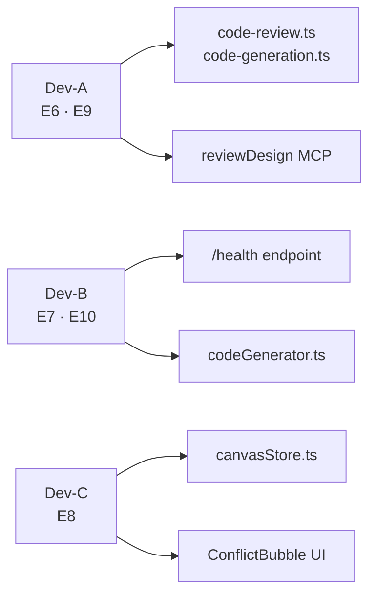

# AGENTS.md — VibeX Sprint 12 开发约束

**项目**: vibex-proposals-20260426-sprint12
**版本**: 1.0
**日期**: 2026-04-26

---

## 1. Agent 职责

| Agent | 负责 Epic | 主要工作 |
|-------|----------|---------|
| Dev-A | E6, E9 | AST 扫描引擎 + AI 设计评审 MCP 工具 |
| Dev-B | E7, E10 | MCP 可观测性 + 设计稿代码生成 |
| Dev-C | E8 | Canvas 协作冲突解决（LWW + ConflictBubble） |
| QA | 全 Epic | E2E 测试覆盖，验收标准把关 |

---

## 2. Epic 所有权



---

## 3. 代码规范

### 3.1 TypeScript 严格模式

- 所有新文件启用 `strict: true`
- **禁止新增 `as any`**，Sprint 11 遗留 28 处需逐步消除
- CI `typecheck` gate 必须通过

### 3.2 文件命名

```
PascalCase: *.test.ts, *.spec.ts, *.tsx, *.ts (components/tools)
camelCase:  *.ts (lib, utils)
kebab-case: directories
```

### 3.3 Git 分支命名

```
feature/E6-ast-scan
feature/E7-mcp-observability
feature/E8-conflict-resolution
feature/E9-ai-design-review
feature/E10-design-to-code
bugfix/<description>
```

### 3.4 PR 要求

- 每个 Epic 一个 PR
- PR 描述包含：Epic ID、DoD 完成情况、测试覆盖率截图
- 必须通过 CI（typecheck + test + lint）
- Reviewer 至少 1 人
- 合入前 squash merge

### 3.5 CI Gates

```
1. typecheck    — tsc --noEmit，无新增错误
2. test         — jest --coverage，覆盖率 > 80%（Epic 关键路径 > 90%）
3. lint         — eslint --max-warnings 0
4. (E8 额外) e2e — playwright test --project=chromium
```

---

## 4. 环境配置

### 4.1 依赖安装

```bash
# monorepo 根目录
cd /root/.openclaw/vibex
pnpm install

# E6 依赖
pnpm add @babel/parser @babel/traverse @babel/types --filter vibex-backend

# E7 无新增依赖（Express 已在 mcp-server）
# E10 依赖
pnpm add jszip file-saver --filter vibex-frontend
```

### 4.2 环境变量

```bash
# vibex-frontend .env.local
NEXT_PUBLIC_FIREBASE_API_KEY=
NEXT_PUBLIC_FIREBASE_AUTH_DOMAIN=
NEXT_PUBLIC_FIREBASE_RTDB_URL=

# packages/mcp-server .env
MCP_SERVER_PORT=3100
LOG_LEVEL=info
SDK_VERSION_WHITELIST="^0.5.0,^0.6.0"
```

### 4.3 本地运行

```bash
# Backend (E6)
cd vibex-backend && pnpm dev

# MCP Server (E7)
cd packages/mcp-server && pnpm dev

# Frontend (E8, E10)
cd vibex-frontend && pnpm dev
```

---

## 5. 通信协议

### 5.1 每日站会

- 地点: #sprint-12 Slack channel
- 时间: 每日 10:00 (若有时差自行协商)
- 内容: 完成项 / 进行中 / 阻塞项

### 5.2 阻塞升级

当遇到以下情况时，立即在 #sprint-12 报告：
- 依赖项未就绪（如 E7 /health 未上线，阻塞 E9）
- 接口定义与实现不符
- 测试无法通过且无法自行解决

### 5.3 接口变更

任何 Epic 间的接口变更（如 `analyzeCodeSecurity` 签名调整），必须：
1. 在 #sprint-12 通知受影响方
2. 更新本文档接口定义
3. 确认兼容性后再合入

---

## 6. 跨 Epic 约定

### 6.1 E6 共享接口

```typescript
// E9 复用 E6 的 SecurityAnalysisResult
import type { SecurityAnalysisResult, UnsafePattern } from 'vibex-backend/src/lib/prompts/analyzeCodeSecurity'
```

### 6.2 E7 日志格式

```typescript
// E9 工具调用必须使用 StructuredLogger
import { logger } from '../logger'
logger.info('tool_call_start', { tool: 'review_design' })
```

### 6.3 E10 设计变量

```typescript
// E10 CSS 必须引用 DESIGN.md 变量
// 允许: var(--color-primary), var(--spacing-4)
// 禁止: #ffffff, rgba(0,0,0,0.5), 16px (字面量)
```

### 6.4 E8 Zustand Store

```typescript
// E8 store 必须导出类型供 E10 使用
export type { CanvasStore, LockInfo, ConflictResult }
```

---

## 7. 测试要求

### 7.1 单元测试

- 每个新函数必须有单元测试
- 覆盖率: E6 > 90%, E7 > 85%, E8 > 80%, E9 > 80%, E10 > 85%
- 性能基准测试: E6 AST 5000 行 < 50ms

### 7.2 E2E 测试

| Epic | 测试文件 | 关键场景 |
|------|---------|---------|
| E7 | `tests/e2e/health.spec.ts` | GET /health 返回 200 |
| E8 | `tests/e2e/conflict-resolution.spec.ts` | 双用户编辑 + 冲突仲裁 |
| E10 | `tests/e2e/code-gen.spec.ts` | ZIP 下载 + 内容验证 |

### 7.3 回归测试

- Sprint 11 已有功能不得因 Sprint 12 变更而破坏
- 特别关注: Firebase Presence cursor 展示、快捷键系统、画布搜索

---

## 8. 代码所有权

| 目录 | 所有权 | 修改需通知 |
|------|--------|-----------|
| `vibex-backend/src/lib/prompts/analyzeCodeSecurity.ts` | Dev-A | Dev-A |
| `packages/mcp-server/src/logger.ts` | Dev-B | Dev-B |
| `packages/mcp-server/src/health.ts` | Dev-B | Dev-B |
| `vibex-frontend/src/store/canvasStore.ts` | Dev-C | Dev-C |
| `vibex-frontend/src/lib/codeGenerator.ts` | Dev-B | Dev-B |
| `vibex-frontend/src/components/ConflictBubble/` | Dev-C | Dev-C |

---

## 9. Sprint 结束标准

- [ ] 5 个 Epic DoD 全部满足
- [ ] CI green (typecheck + test + lint)
- [ ] E2E 双路径（configured/unconfigured）全部通过
- [ ] 零新增 `as any`
- [ ] CHANGELOG.md 更新
- [ ] Sprint 12 总结报告

---

## 10. 紧急联系人

| 事项 | 负责人 |
|------|--------|
| 架构问题 | Architect (本 agent) |
| Firebase / E8 问题 | Dev-C |
| MCP Server / E7/E9 问题 | Dev-B |
| E6 / E10 问题 | Dev-A |
| 测试 / CI 问题 | QA |
| Sprint 阻塞 | 升级到 coord |
