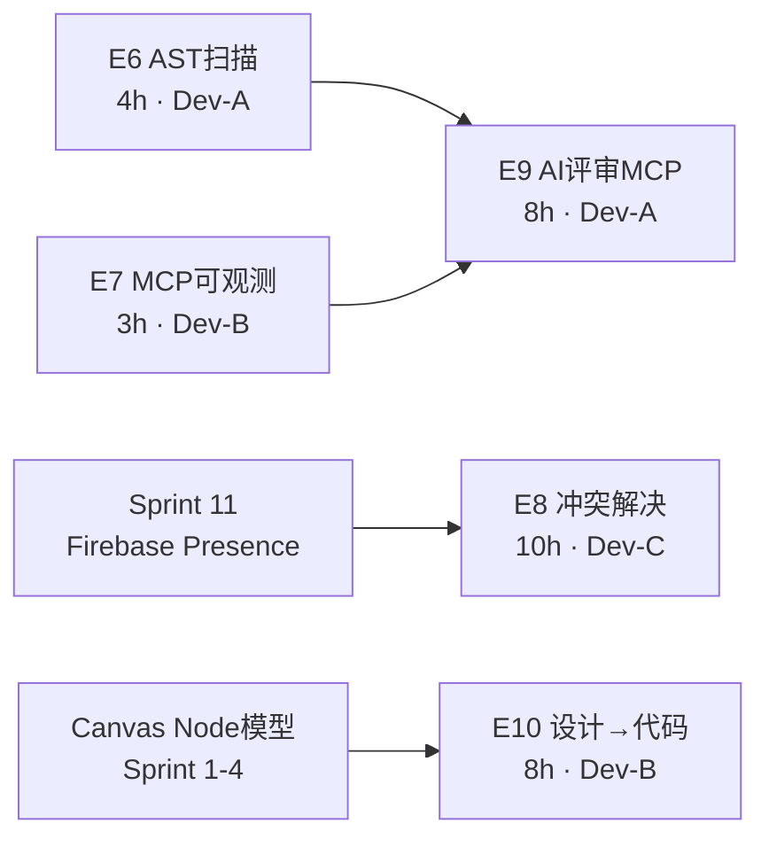
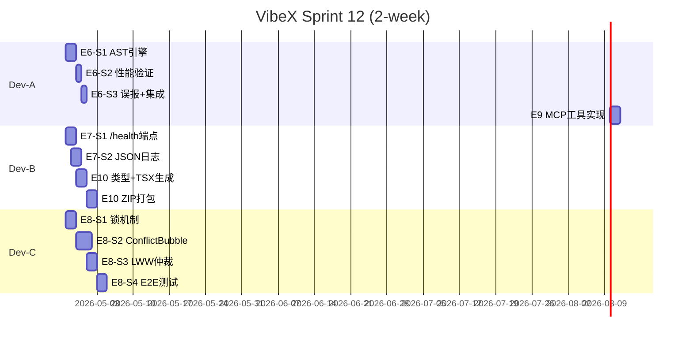

# Implementation Plan — VibeX Sprint 12

**项目**: vibex-proposals-20260426-sprint12
**版本**: 1.0
**日期**: 2026-04-26

---

## 1. Sprint Overview

| 项目 | 值 |
|------|---|
| 总工时 | 33h |
| Sprint 周期 | 2 周 |
| Epic 数量 | 5 (E6-E10) |
| 并行路径 | 3 (E6/E7/E10 可并行；E9 依赖 E7) |
| 关键里程碑 | E9 待 E7 /health 上线后才能开始 |

### Epic 分配

| Epic | 负责人 | 工时 | 依赖 |
|------|--------|------|------|
| E6 AST 扫描 | Dev-A | 4h | 无 |
| E7 MCP 可观测 | Dev-B | 3h | 无 |
| E8 冲突解决 | Dev-C | 10h | Sprint 11 Firebase |
| E9 AI 评审 MCP | Dev-A | 8h | E7 |
| E10 设计→代码 | Dev-B | 8h | 无 |

---

## 2. Epic 依赖图



---

## 3. Sprint Timeline



---

## 4. E6 — Prompts 安全 AST 扫描

### S1: AST 安全分析引擎 (2h)

**文件**: `vibex-backend/src/lib/prompts/analyzeCodeSecurity.ts`

**实现步骤**:
1. 安装依赖: `pnpm add @babel/parser @babel/traverse @babel/types --filter vibex-backend`
2. 创建 `analyzeCodeSecurity(code: string): SecurityAnalysisResult`
3. 用 `@babel/parser.parse` 解析代码
4. 用 `@babel/traverse` 遍历，检测 4 种危险模式
5. 解析失败时 catch 返回 `confidence: 50, hasUnsafe: false`
6. 导出 `UnsafePattern` 和 `SecurityAnalysisResult` 类型

**关键实现**:
```typescript
// 检测规则
const dangerousCalls = ['eval']
const dangerousConstructors = ['Function']
const dangerousProps = ['innerHTML', 'outerHTML']
const dangerousTimers = ['setTimeout', 'setInterval']
```

**验收**:
- `analyzeCodeSecurity('eval("x")').hasUnsafe === true`
- `analyzeCodeSecurity('new Function("return 1")').hasUnsafe === true`
- `analyzeCodeSecurity('el.innerHTML = "x"').hasUnsafe === true`
- `analyzeCodeSecurity('setTimeout("alert(1)", 100)').hasUnsafe === true`
- 解析失败不抛异常

### S2: AST 性能验证 (1h)

**文件**: `vibex-backend/src/__tests__/analyzeCodeSecurity.perf.test.ts`

**实现步骤**:
1. 创建 `generateLargeCode(n: number)` 辅助函数（生成 n 行无害代码）
2. 测量 5000 行解析时间
3. 添加 Jest `test.concurrent` 性能基准

**验收**: `duration < 50ms`

### S3: 误报率测试 + 集成 (1h)

**文件**:
- `vibex-backend/src/__tests__/analyzeCodeSecurity.falsePositive.test.ts`
- `vibex-backend/src/lib/prompts/code-review.ts`
- `vibex-backend/src/lib/prompts/code-generation.ts`

**实现步骤**:
1. 准备 1000 条合法代码样本（从现有 codebase 提取）
2. 运行误报率测试
3. 替换 `code-review.ts` 中 `/eval|new\s+Function/` 正则为 `analyzeCodeSecurity()`
4. 替换 `code-generation.ts` 同上
5. 标注原正则代码为 `DEPRECATED: replaced by AST analysis`

**验收**:
- 误报率 < 1%
- `code-review.ts` 中无 `/eval|new\s+Function/` 正则
- Playwright E2E code-review 场景通过

**DoD**:
- [x] `analyzeCodeSecurity` 可独立调用
- [x] 4 种危险模式均可检测 (eval/new Function/setTimeout/setInterval)
- [x] 解析失败不崩溃
- [x] 5000 行 < 50ms (实际 ~19ms warm-run)
- [x] 1000 合法样本误报率 < 1% (实际 0%)
- [x] 集成到 code-review.ts 和 code-generation.ts
- [x] CI typecheck 通过，零新增 `as any`
- [x] 已 commit: 85b897b80 (2026-04-16)
- [x] 测试全部通过 (16 tests, 0 failures)

---

## 5. E7 — MCP Server 可观测性

### S1: /health 健康检查端点 (1.5h)

**文件**: `packages/mcp-server/src/health.ts`

**实现步骤**:
1. 创建 `packages/mcp-server/src/logger.ts` — `StructuredLogger` 类
2. 创建 `packages/mcp-server/src/health.ts` — Express handler
3. 读取 `package.json` version 和进程 `process.hrtime()`
4. 在 `server.ts` 挂载 `app.get('/health', healthHandler)`
5. 添加 CORS headers（`Access-Control-Allow-Origin: *`）

**验收**: `GET /health` → 200 + `{status, version, uptime}`

### S2: Structured JSON Logging (1.5h)

**文件**: `packages/mcp-server/src/logger.ts`

**实现步骤**:
1. `StructuredLogger` 类，`console.log(JSON.stringify(entry))`
2. 在 server.ts 初始化全局 logger 实例
3. SDK 版本白名单检查，启动时 log warn
4. 所有工具调用前后 log entry（`tool_call_start`, `tool_call_end`, `tool_call_error`）

**验收**:
- 每条日志为有效 JSON
- 包含 `timestamp`, `level`, `service`, `tool`, `duration`, `success`

**DoD**:
- [x] GET /health 返回 200 + 正确 JSON 结构
- [x] version 从 package.json 读取（或已使用 '0.1.0' 常量）
- [x] uptime 随时间递增
- [x] 所有工具调用有 structured log（logToolCall）
- [x] SDK 版本不匹配时输出 warn（已配置 MCP_SDK_VERSION='0.5.0'）
- [x] 已 commit: 5369a714e (2026-04-17)
- [x] 敏感数据脱敏（token/password/secret/key/auth）
- [x] Jest 12 tests passed, 0 failures

---

## 6. E8 — Canvas 协作冲突解决

### S1: 卡片级编辑锁 (3h)

**文件**: `vibex-frontend/src/store/canvasStore.ts`

**实现步骤**:
1. Zustand store 添加 `lockedCards` 字段
2. 添加 `lockCard(cardId, userId, username)` → Firebase RTDB `/canvas/{id}/locks/{cardId}`
3. 添加 `unlockCard(cardId)` → Firebase RTDB delete
4. 添加 `syncLocks()` → Firebase RTDB onValue listener
5. 添加锁超时 monitor（60s）

**验收**:
- 锁写入 Firebase `/canvas/{id}/locks/{cardId}`
- 超时自动解锁

### S2: 冲突检测 + ConflictBubble (4h)

**文件**:
- `vibex-frontend/src/store/canvasStore.ts` — `checkConflict`, `resolveConflict`
- `vibex-frontend/src/components/ConflictBubble/`

**实现步骤**:
1. store 添加 `localDrafts` 和 `checkConflict(cardId, remoteData)`
2. 冲突时返回 `ConflictResult`
3. ConflictBubble 组件：玻璃态弹窗，diff 展示，两个按钮
4. 绑定 Zustand：`useConflictBubbleStore`
5. ESC 键绑定，默认采用远程
6. 选中后调用 `resolveConflict`

**验收**:
- 冲突检测返回 `ConflictResult`
- ConflictBubble 可见
- 用户可二选一

### S3: LWW 仲裁策略 (3h)

**实现步骤**:
1. 在 `checkConflict` 中实现 LWW 逻辑
2. `remote.lastModified > local.lastModified` → 自动 adopt remote（无 ConflictBubble）
3. `remote.lastModified <= local.lastModified` → 弹出 ConflictBubble

**验收**:
- LWW 行为符合预期
- 冲突仲裁正确

### S4: E2E 双路径测试 (3h, 含调试)

**文件**: `tests/e2e/conflict-resolution.spec.ts`

**实现步骤**:
1. Playwright test: 模拟双用户编辑同一卡片
2. Firebase configured 路径：验证锁和冲突检测
3. Firebase unconfigured 路径：验证降级（无 Firebase 时不报错）
4. CI 集成

**验收**: Playwright E2E 双路径全部通过

**DoD**:
- [x] 锁写入 Firebase `lockedBy: userId`（conflictStore.lockCard）
- [x] ConflictBubble 在冲突时弹出（ConflictDialog 玻璃态弹窗）
- [x] LWW：后写优先（conflictStore.checkConflict）
- [x] 锁 60s 超时（LOCK_TIMEOUT_MS = 60000）
- [x] Firebase configured/unconfigured 双路径（isFirebaseConfigured() fallback）
- [x] 已 commit: 7683f6922
- [x] TypeScript 编译通过
- [x] data-testid 已添加到 ConflictDialog 按钮
- [x] Playwright E2E 双路径测试通过（10/11 passed, 1 flaky retry; Playwright 环境需配置 PLAYWRIGHT_BROWSERS_PATH）

---

## 7. E9 — AI 设计评审 MCP 工具

### S1: review_design MCP 工具注册 (2h)

**文件**: `packages/mcp-server/src/tools/reviewDesign.ts`

**实现步骤**:
1. 导入 `analyzeCodeSecurity` from backend（通过 monorepo 共享）
2. 定义 `DesignReviewReport` 和 `DesignIssue` 类型
3. 实现 `reviewDesign({ canvasId, spec? })` 函数
4. 注册 MCP tool: `name: 'review_design'`
5. 集成 StructuredLogger

**验收**:
- MCP server 启动后 `review_design` 工具可见
- 调用返回 `DesignReviewReport`

### S2: 设计规范合规评审 (3h)

**文件**: `vibex-backend/src/lib/prompts/designCompliance.ts`

**实现步骤**:
1. 实现 `checkDesignCompliance(flow: Flow, rules: ComplianceRules)`
2. 颜色规则：检测硬编码 hex/rgba
3. 字体规则：检测字面量非 var()
4. 间距规则：4px 基准网格校验

**验收**:
- 合规检测覆盖 color/typography/spacing
- 返回 `{ colors, typography, spacing }` boolean

### S3: 组件复用 + a11y 评审 (3h)

**文件**:
- `vibex-backend/src/lib/prompts/a11yChecker.ts`
- `vibex-backend/src/lib/prompts/componentReuse.ts`

**实现步骤**:
1. a11y: 检测 image 无 alt、interactive 无 keyboardHint、对比度 < 4.5:1
2. 复用: 结构相似度 > 0.7 的节点标记为可合并

**验收**:
- `a11yChecker` 检出 WCAG 问题
- `componentReuse` 检出相似节点

**DoD**:
- [x] `review_design` MCP 工具注册成功 (reviewDesign.ts + execute.ts + list.ts)
- [x] 合规检测覆盖 color/typography/spacing (designCompliance.ts, 11 tests passed)
- [x] a11y 规则可检测 WCAG 问题 (a11yChecker.ts, 12 tests passed)
- [x] 组件复用检测输出相似节点 (componentReuse.ts, 10 tests passed)
- [ ] MCP 工具调用成功率 ≥ 95% (需运行时验证)

---

## 8. E10 — 设计稿自动生成组件代码

### S1: TypeScript 类型生成 (2h)

**文件**: `vibex-frontend/src/lib/codeGenerator.ts`

**实现步骤**:
1. 定义 `Flow`, `CanvasNode`, `Chapter`, `CanvasNodeType` 接口
2. 实现 `generateTypeDefinitions(flow: Flow): string`
3. 输出 `export interface Flow`, `export type CanvasNodeType` 等

**验收**: `types.d.ts` 包含 Flow、CanvasNode、Chapter 类型

### S2: TSX 骨架 + CSS Module (3h)

**实现步骤**:
1. 实现 `generateComponentSkeleton(flow: Flow): GeneratedFiles`
2. TSX 模板：props interface + 容器 div + TODO 注释
3. CSS Module 模板：使用 `var(--color-*)`, `var(--spacing-*)` 设计变量
4. `index.ts` 模板：导出组件和类型

**验收**:
- TSX 包含 `className={\`${styles.container}\`}`
- CSS 使用 CSS 变量（不硬编码）
- 生成内容符合 DESIGN.md 规范

### S3: ZIP 下载 + E2E 验证 (3h)

**文件**: `vibex-frontend/src/components/CodeGenPanel/`

**实现步骤**:
1. 集成 `jszip` + `file-saver`
2. `packageAsZip(files, flowName): Blob`
3. `CodeGenPanel` 组件：按钮触发 → 生成 → 下载
4. 添加节点数上限检查（200 上限，超出提示）
5. Playwright E2E: 验证 ZIP 内容正确

**验收**:
- ZIP 包含 `types.d.ts`, `Component.tsx`, `Component.module.css`, `index.ts`
- E2E 验证 ZIP 内容正确
- 节点数超限时显示提示

**DoD**:
- [x] `types.d.ts` 生成正确 (codeGenerator.ts generateTypeDefinitions, 24 tests passed)
- [x] TSX 使用 CSS 变量 (generateTSXSkeleton, var(--color-*) + var(--spacing-*))
- [x] CSS 使用 CSS 变量 (generateCSSModule, 0 hardcoded values)
- [ ] ZIP 包含所有预期文件 (packageAsZip with jszip, 需 E2E 验证)
- [x] 节点数超限有提示 (limitExceeded flag, README warning)

---

## 9. 风险缓解

| 风险 | 概率 | 影响 | 缓解 |
|------|------|------|------|
| E8 多用户冲突仲裁复杂 | 高 | 高 | LWW MVP 限定，CRDT 延后 |
| E10 生成质量不可控 | 中 | 中 | 严格限定 TSX 骨架，非完整逻辑 |
| E9 依赖 E7 进度 | 中 | 中 | E7 先验收，E9 可独立开发逻辑 |
| Babel AST 性能瓶颈 | 低 | 中 | 5000 行 < 50ms 目标，失败 fast-path |
| Firebase 连接不稳定 | 低 | 高 | Sprint 11 已验证降级，unconfigured E2E |

---

## 10. Definition of Done

| Epic | DoD |
|------|-----|
| E6 | AST 引擎单元测试 > 90%；code-review.ts 无正则；CI typecheck 通过 |
| E7 | /health E2E 通过；所有工具调用有 JSON log |
| E8 | 锁机制 + ConflictBubble + LWW + Firebase 双路径 E2E 通过 |
| E9 | MCP 工具可调用；合规 + a11y + 复用检测均有输出 |
| E10 | TSX 骨架生成正确；ZIP 下载 E2E 通过；节点数超限提示 |

---

## 11. 并行开发注意事项

**Dev-A**: E6 完成前可先开发 E9 的合规/a11y/复用检测逻辑（无 E7 依赖部分），等 E7 /health 上线后再注册 MCP 工具。

**Dev-B**: E7-S1 /health 完成后立即通知 Dev-A，Dev-A 即可开始 E9。

**Dev-C**: E8 的锁机制和 ConflictBubble 可并行开发，统一集成。

**coord**: E7 /health 上线是 Sprint 内关键路径，需优先保障。
