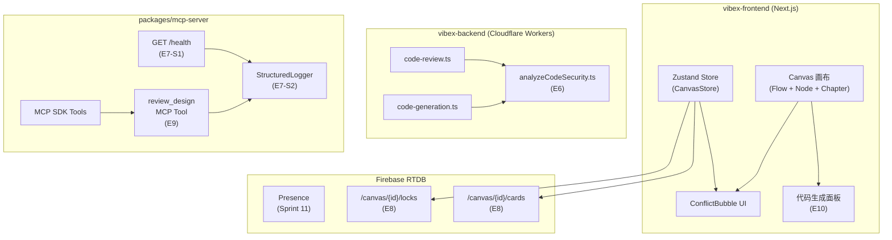
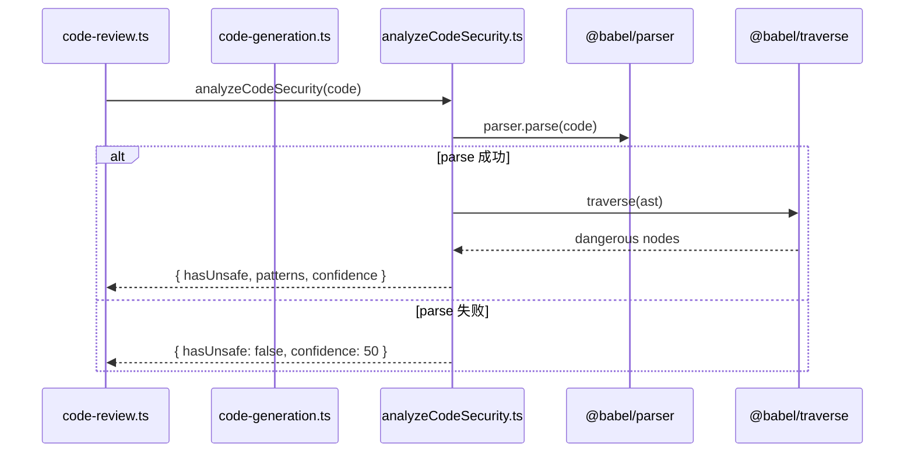
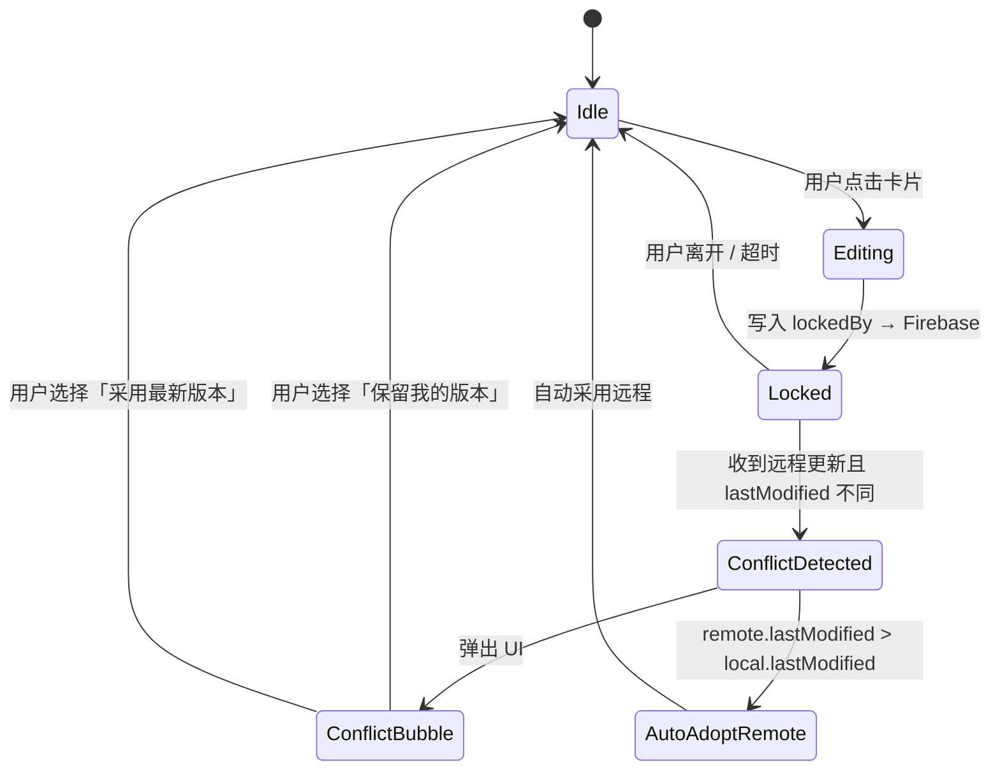
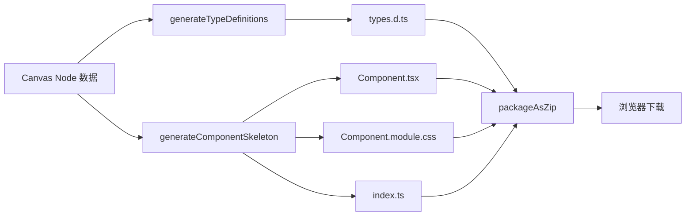
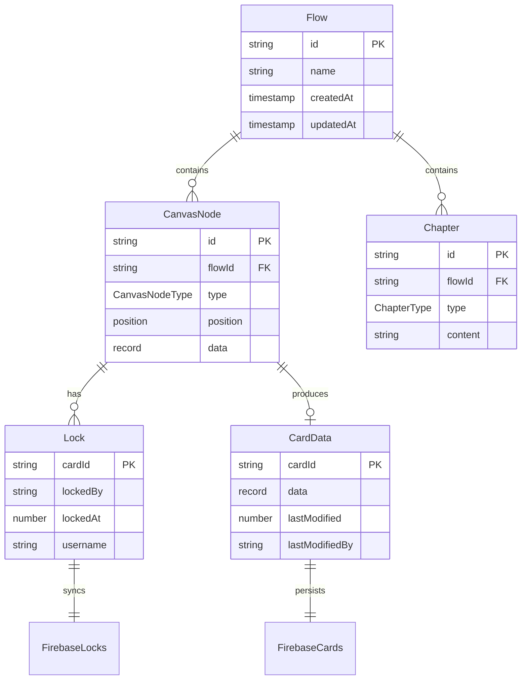
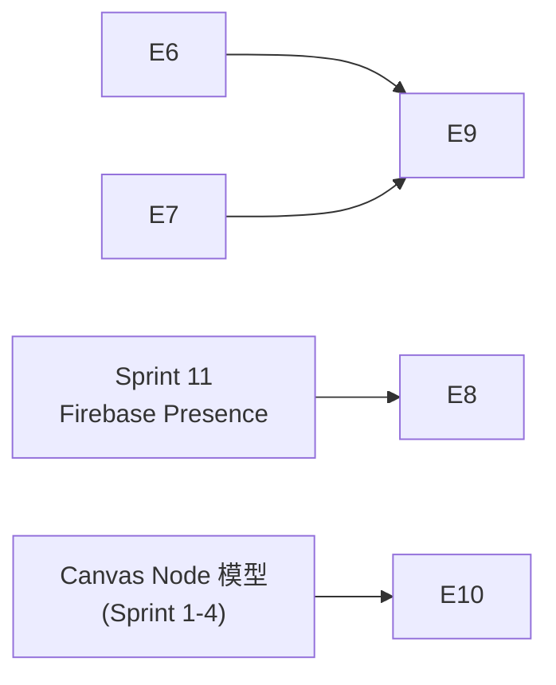

# Architecture — VibeX Sprint 12

**项目**: vibex-proposals-20260426-sprint12
**版本**: 1.0
**日期**: 2026-04-26
**角色**: Architect

---

## 1. Tech Stack

| 技术 | 版本 | 选型理由 |
|------|------|---------|
| @babel/parser | ^7.x | 成熟 AST 解析，code-review.ts 已依赖 |
| @babel/traverse | ^7.x | AST 遍历，与 parser 配套 |
| @babel/types | ^7.x | 类型定义 |
| Express | ^4.x | MCP Server 已有基础 |
| Firebase RTDB | — | Sprint 11 已集成，Presence MVP 已验证 |
| Zustand | ^4.x | Sprint 11 画布状态管理已用 |
| jszip | ^3.x | E10 ZIP 生成，业界标准 |
| file-saver | ^2.x | 浏览器端触发下载 |
| Playwright | ^1.x | Sprint 1+ E2E 基础设施已建立 |

**不引入**:
- Datadog / OpenTelemetry → E7 仅做 JSON stdout logging，聚合延后到独立 Epic
- CRDT 库 → E8 采用 LWW MVP，CRDT 延后 backlog
- LLM 服务 → E9 复用现有 code-review.ts prompt engineering，无新外部依赖

---

## 2. 架构图

### 2.1 系统全景



### 2.2 E6 AST 安全扫描数据流



### 2.3 E8 冲突解决状态机



### 2.4 E10 代码生成管道



---

## 3. API 定义

### 3.1 E6 — `analyzeCodeSecurity`

```typescript
// vibex-backend/src/lib/prompts/analyzeCodeSecurity.ts

interface UnsafePattern {
  type: 'eval' | 'newFunction' | 'innerHTML' | 'setTimeout-string'
  node: unknown
  line: number
  column: number
}

interface SecurityAnalysisResult {
  hasUnsafe: boolean
  unsafePatterns: UnsafePattern[]
  confidence: number // 0-100
}

/**
 * 分析代码安全性，检测危险 AST 模式
 * @param code - 待分析代码字符串
 * @returns 安全分析结果
 */
declare function analyzeCodeSecurity(code: string): SecurityAnalysisResult
```

**集成点**:
- `vibex-backend/src/lib/prompts/code-review.ts` — 替换 `/eval|new\s+Function/` 正则
- `vibex-backend/src/lib/prompts/code-generation.ts` — 替换同上正则

### 3.2 E7 — `GET /health`

```
GET /health
Host: localhost:3100
Response 200:
{
  "status": "ok" | "degraded",
  "version": "x.y.z",
  "uptime": 123
}
```

### 3.3 E7 — `StructuredLogger`

```typescript
// packages/mcp-server/src/logger.ts

interface LogEntry {
  timestamp: string   // ISO 8601
  level: 'debug' | 'info' | 'warn' | 'error'
  message: string
  service: 'mcp-server'
  tool?: string
  duration?: number   // ms
  success?: boolean
  error?: string
}

class StructuredLogger {
  info(message: string, meta?: Partial<LogEntry>): void
  warn(message: string, meta?: Partial<LogEntry>): void
  error(message: string, meta?: Partial<LogEntry>): void
}
```

### 3.4 E8 — Canvas Store 扩展

```typescript
// vibex-frontend/src/store/canvasStore.ts

interface LockInfo {
  lockedBy: string
  lockedAt: number
  username: string
}

interface ConflictResult {
  cardId: string
  localVersion: CardData
  remoteVersion: CardData
  remoteLastModified: number
  localLastModified: number
}

interface CanvasStore {
  // 锁管理
  lockedCards: Record<string, LockInfo>
  lockCard(cardId: string, userId: string, username: string): void
  unlockCard(cardId: string): void
  syncLocks(): void

  // 冲突处理
  localDrafts: Record<string, { data: CardData; lastModified: number }>
  checkConflict(cardId: string, remoteData: CardData): ConflictResult | null
  resolveConflict(cardId: string, strategy: 'keep-local' | 'use-remote'): void

  // 锁超时
  startLockTimeoutMonitor(): void
  stopLockTimeoutMonitor(): void
}
```

**Firebase RTDB 路径**:
```
/canvas/{canvasId}/locks/{cardId}     → { lockedBy, lockedAt, username }
/canvas/{canvasId}/cards/{cardId}     → { id, data, lastModified, lastModifiedBy }
```

### 3.5 E9 — `review_design` MCP Tool

```typescript
// packages/mcp-server/src/tools/reviewDesign.ts

interface DesignIssue {
  type: 'design-compliance' | 'a11y' | 'component-reuse' | 'security'
  severity: 'low' | 'medium' | 'high'
  description: string
  location?: string
}

interface DesignReviewReport {
  overall_score: number       // 0-100
  issues: DesignIssue[]
  suggestions: string[]
  compliance: {
    colors: boolean
    typography: boolean
    spacing: boolean
  }
}

const reviewDesignTool: MCPTool = {
  name: 'review_design',
  description: 'Review Canvas design for DESIGN.md compliance, a11y, and component reuse',
  inputSchema: {
    type: 'object',
    properties: {
      canvasId: { type: 'string', description: 'Canvas flow ID to review' },
      spec: {
        type: 'object',
        properties: {
          includeA11y: { type: 'boolean', default: true },
          includeReuse: { type: 'boolean', default: true }
        }
      }
    },
    required: ['canvasId']
  }
}
```

### 3.6 E10 — Code Generator

```typescript
// vibex-frontend/src/lib/codeGenerator.ts

interface GeneratedFiles {
  'types.d.ts': string
  'Component.tsx': string
  'Component.module.css': string
  'index.ts': string
}

interface Flow {
  id: string
  name: string
  nodes: CanvasNode[]
  chapters: Chapter[]
  createdAt: string
  updatedAt: string
}

interface CanvasNode {
  id: string
  type: CanvasNodeType
  position: { x: number; y: number }
  data: Record<string, unknown>
}

type CanvasNodeType =
  | 'chapter' | 'requirement' | 'context' | 'flow'
  | 'api' | 'business-rules' | 'image' | 'text' | 'connector'

interface Chapter {
  id: string
  type: 'requirement' | 'context' | 'flow' | 'api' | 'business-rules'
  content: string
  metadata?: Record<string, unknown>
}

/**
 * 从 Canvas Flow 数据生成 TypeScript 类型定义文件
 */
declare function generateTypeDefinitions(flow: Flow): string

/**
 * 生成完整的组件骨架文件集
 */
declare function generateComponentSkeleton(flow: Flow): GeneratedFiles

/**
 * 打包为 ZIP Buffer 供浏览器下载
 */
declare function packageAsZip(files: GeneratedFiles, flowName: string): Blob
```

---

## 4. 数据模型

### 4.1 核心实体关系



### 4.2 Firebase RTDB 结构

```
/canvas/{canvasId}/
  /locks/{cardId}        → { lockedBy: string, lockedAt: number, username: string }
  /cards/{cardId}        → { id, data, lastModified, lastModifiedBy }
  /presence/{userId}     → { cursor, online, lastSeen }  (Sprint 11 已有)
```

---

## 5. 测试策略

### 5.1 测试框架

| 层级 | 框架 | 范围 |
|------|------|------|
| 单元测试 | Jest | analyzeCodeSecurity, StructuredLogger, code generator |
| 集成测试 | Jest | code-review.ts 集成 AST 引擎 |
| E2E 测试 | Playwright | ConflictBubble, /health, ZIP 下载 |
| 性能基准 | Jest + bench | AST 5000 行 < 50ms |

### 5.2 E6 测试用例

```typescript
describe('analyzeCodeSecurity', () => {
  it('detects eval', () =>
    expect(analyzeCodeSecurity('eval("x")').hasUnsafe).toBe(true))
  it('detects new Function', () =>
    expect(analyzeCodeSecurity('new Function("return 1")').hasUnsafe).toBe(true))
  it('passes safe code', () =>
    expect(analyzeCodeSecurity('const x = 1; return x').hasUnsafe).toBe(false))
  it('detects innerHTML', () =>
    expect(analyzeCodeSecurity('el.innerHTML = "x"').hasUnsafe).toBe(true))
  it('detects setTimeout string arg', () =>
    expect(analyzeCodeSecurity('setTimeout("alert(1)", 100)').hasUnsafe).toBe(true))
  it('graceful parse failure', () => {
    const r = analyzeCodeSecurity('// broken }}}}')
    expect(r.confidence).toBe(50)
    expect(r.hasUnsafe).toBe(false)
  })
  it('5000 lines < 50ms', () => {
    const code = generateLargeCode(5000)
    const start = Date.now()
    analyzeCodeSecurity(code)
    expect(Date.now() - start).toBeLessThan(50)
  })
  it('1000 legal samples < 1% false positive', () => {
    const samples = loadLegalSamples(1000)
    const fps = samples.filter(s => analyzeCodeSecurity(s).hasUnsafe).length
    expect(fps / 1000).toBeLessThan(0.01)
  })
})
```

### 5.3 E7 测试用例

```typescript
describe('E7 MCP Observability', () => {
  it('GET /health returns 200', async () => {
    const res = await fetch('http://localhost:3100/health')
    expect(res.status).toBe(200)
    const body = await res.json()
    expect(body).toMatchObject({
      status: expect.stringMatching(/^(ok|degraded)$/),
      version: expect.any(String),
      uptime: expect.any(Number)
    })
    expect(body.uptime).toBeGreaterThan(0)
  })

  it('tool call emits structured log', () => {
    const logs: LogEntry[] = []
    const logger = new StructuredLogger((entry) => logs.push(entry))
    logger.info('tool_call_start', { tool: 'test' })
    expect(logs[0].level).toBe('info')
    expect(logs[0].service).toBe('mcp-server')
  })

  it('SDK version mismatch emits warn log', () => {
    // when SDK version not in whitelist
  })
})
```

### 5.4 E8 测试用例

```typescript
describe('E8 Conflict Resolution', () => {
  it('lockCard writes to Firebase', async () => {
    await store.lockCard('card-1', 'userA', 'Alice')
    expect(firebaseSet).toHaveBeenCalledWith(
      '/canvas/test/locks/card-1',
      expect.objectContaining({ lockedBy: 'userA' })
    )
  })

  it('checkConflict returns null when no conflict', () => {
    const local = { data: { title: 'A' }, lastModified: 1000 }
    const remote = { data: { title: 'A' }, lastModified: 1000 }
    expect(store.checkConflict('card-1', remote, local)).toBeNull()
  })

  it('checkConflict returns result when timestamps differ', () => {
    const local = { data: { title: 'A' }, lastModified: 1000 }
    const remote = { data: { title: 'B' }, lastModified: 2000 }
    const result = store.checkConflict('card-1', remote, local)
    expect(result).not.toBeNull()
    expect(result.remoteVersion.title).toBe('B')
  })

  it('LWW: later timestamp wins', () => {
    const local = { data: { title: 'A' }, lastModified: 1000 }
    const remote = { data: { title: 'B' }, lastModified: 2000 }
    const result = store.checkConflict('card-1', remote, local)
    // Auto-adopt remote when remote.lastModified > local.lastModified
    expect(result.remoteLastModified).toBeGreaterThan(result.localLastModified)
  })
})
```

### 5.5 E10 测试用例

```typescript
describe('E10 Code Generator', () => {
  it('generates types.d.ts', () => {
    const types = generateTypeDefinitions(mockFlow)
    expect(types).toContain('export interface Flow')
    expect(types).toContain('export type CanvasNodeType')
  })

  it('generates TSX with CSS variable references', () => {
    const { 'Component.tsx': tsx, 'Component.module.css': css } =
      generateComponentSkeleton(mockFlow)
    expect(tsx).toContain('className={`${styles.container}')
    expect(css).toContain('var(--color-')
    expect(css).toContain('var(--spacing-')
  })

  it('ZIP contains all expected files', async () => {
    const zip = packageAsZip(files, 'TestFlow')
    const entries = await JSZip.loadAsync(zip)
    expect(Object.keys(entries)).toEqual(expect.arrayContaining([
      'types.d.ts', 'Component.tsx', 'Component.module.css', 'index.ts'
    ]))
  })
})
```

### 5.6 覆盖率要求

| Epic | 覆盖率目标 | 关键路径 |
|------|-----------|---------|
| E6 | > 90% | AST 解析 → 危险模式检测 → 集成替换 |
| E7 | > 85% | /health → StructuredLogger → 工具调用日志 |
| E8 | > 80% | 锁获取 → 冲突检测 → LWW 仲裁 → UI 交互 |
| E9 | > 80% | MCP 工具注册 → 设计合规 → a11y 检测 |
| E10 | > 85% | Flow → 类型生成 → TSX 骨架 → ZIP 打包 |

---

## 6. 性能影响评估

| Epic | 性能影响 | 缓解措施 |
|------|---------|---------|
| E6 | Babel AST 解析额外 CPU 开销；5000 行目标 < 50ms | 缓存已解析 AST；失败快速返回 |
| E7 | StructuredLogger 每工具调用写 stdout；可忽略 | JSON 序列化开销 < 1ms |
| E8 | Firebase listener 持续连接；额外 RTDB 读取 | 仅在活跃编辑时订阅；锁超时自动清理 |
| E9 | 依赖 E6 + E7；Canvas 数据加载 O(n) | Canvas 数据已在内存；设计规范加载一次缓存 |
| E10 | ZIP 打包 O(n) 文件内容生成；大 Flow 可能 > 1s | 分批生成；进度条 UI；ZIP 使用 streaming |

**E10 特别注意**: Canvas Node 数量不可控，需：
- 限制单个 Flow 生成上限（待定，建议 200 nodes）
- 超出时提示用户分批导出
- streaming ZIP 生成避免大文件 OOM

---

## 7. Epic 依赖关系



**并行路径**:
- 路径1: E6 (4h) — Dev-A
- 路径2: E7 (3h) — Dev-B
- 路径3: E8 (10h, 需 Sprint 11) — Dev-C
- 路径4: E10 (8h, 独立) — Dev-B
- E9 (8h) 待 E7 完成后 — Dev-A

---

## 8. 关键架构决策

| ID | 决策 | 权衡 | 状态 |
|----|------|------|------|
| ADR-12-01 | E6 用 Babel AST 替代正则 | 精确度↑，性能略↓，包体积 +5MB | 已采纳 |
| ADR-12-02 | E8 用 LWW MVP 而非 CRDT | 用户需手动确认冲突，但工时可控 | 已采纳 |
| ADR-12-03 | E7 仅 stdout JSON log，不上 Datadog | 可观测但无聚合，简化 Sprint 范围 | 已采纳 |
| ADR-12-04 | E10 仅生成 TSX 骨架，不含业务逻辑 | 生成质量可控，避免 AI 幻觉风险 | 已采纳 |
| ADR-12-05 | E10 限制单 Flow 节点数 ≤ 200 | 防止 ZIP 打包 OOM，保证生成时间 | 待采纳 |

---

## 9. 目录结构

```
vibex-backend/src/lib/prompts/
  analyzeCodeSecurity.ts        # E6 新增
  code-review.ts                # E6 修改：替换正则
  code-generation.ts            # E6 修改：替换正则
  designCompliance.ts           # E9 新增
  a11yChecker.ts                # E9 新增
  componentReuse.ts             # E9 新增

packages/mcp-server/src/
  logger.ts                     # E7 新增
  health.ts                     # E7 新增
  server.ts                     # E7 修改：挂载 /health
  tools/reviewDesign.ts         # E9 新增

vibex-frontend/src/
  store/canvasStore.ts         # E8 修改：锁 + 冲突
  components/ConflictBubble/   # E8 新增
  lib/codeGenerator.ts          # E10 新增
  components/CodeGenPanel/      # E10 新增
```

---

## 10. 验收检查单

- [ ] E6 `analyzeCodeSecurity` 可独立调用，检测 4 种危险模式
- [ ] E6 Babel 解析失败 fallback 返回 confidence=50
- [ ] E6 集成到 code-review.ts 和 code-generation.ts
- [ ] E7 GET /health 返回 200 + {status, version, uptime}
- [ ] E7 所有工具调用输出 JSON structured log
- [ ] E8 锁写入 Firebase RTDB，60s 超时释放
- [ ] E8 ConflictBubble 在冲突时弹出，用户二选一
- [ ] E8 LWW 仲裁：后写优先
- [ ] E9 review_design MCP 工具注册成功
- [ ] E9 合规检测覆盖 color/typography/spacing
- [ ] E10 types.d.ts + Component.tsx + CSS Module 生成正确
- [ ] E10 ZIP 下载 E2E 通过
- [ ] 所有 Epic 零新增 `as any`
- [ ] TypeScript typecheck 通过
