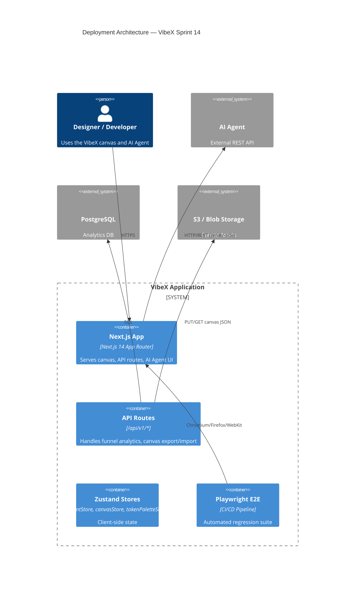
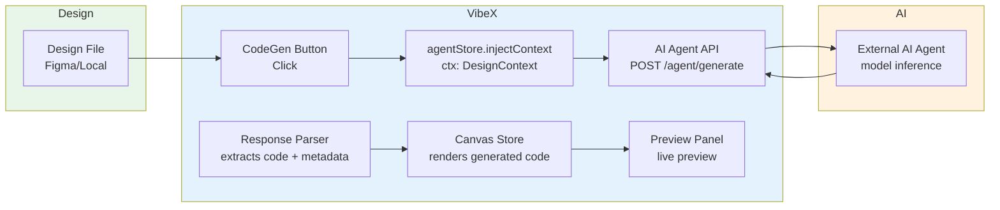
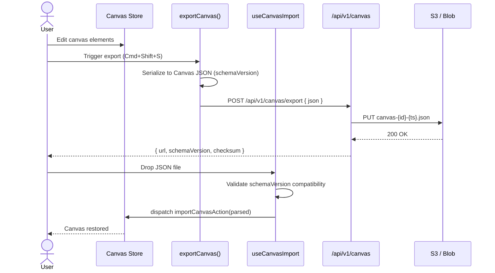

# VibeX Sprint 14 — System Architecture

**Version:** 1.0
**Date:** 2026-04-27
**Status:** Proposed
**Sprint:** 14
**Author:** Architect

---

## 执行决策

- **决策**: 待评审
- **执行项目**: 无
- **执行日期**: 待定

---

## 1. Tech Stack

| Layer | Technology | Rationale |
|-------|-----------|-----------|
| Framework | Next.js 14+ (App Router) | Server Components, streaming, RSC-first |
| Language | TypeScript 5.x (strict) | Type safety across client/server boundary |
| State Management | Zustand 4.x | Lightweight, hooks-native, serializable stores |
| E2E Testing | Playwright 1.x | Cross-browser, CI-friendly, built-in trace viewer |
| Styling | CSS Modules + CSS Variables | No runtime overhead; design tokens as CSS vars |
| SVG Rendering | Pure SVG (no chart libs) | Bundle size, full control, zero dep on recharts/d3 |
| Feature Flags | LaunchDarkly or in-app flag store | Gate E1–E5 independently per rollout phase |
| AI Integration | External AI Agent API (REST/gRPC) | CodeGen calls agent; agent responds with design context |
| Canvas Serialization | JSON (versioned schema) | Human-readable, easy diff, reproducible |
| Analytics Backend | Next.js API Routes + Postgres | Same deployment unit, no extra microservice |

**Trade-off note:** Pure SVG funnel replaces a charting library. Benefit: ~0 KB extra dep, full style control. Cost: hand-rolled math for trapezoid coordinates and responsive scaling.

---

## 2. Architecture Diagrams

### 2.1 Deployment Architecture



### 2.2 Data Flow — Design-to-Code Pipeline (E1)



**Flow description:**
1. Designer clicks "Generate Code" in CodeGen panel
2. `agentStore.injectContext(ctx)` bundles current canvas state + selection as a `DesignContext` payload
3. API route proxies to AI Agent; agent responds with structured `{ code, language, assets }`
4. Response parser validates schema and dispatches to `canvasStore`
5. Preview panel re-renders with generated code in an isolated sandbox iframe

### 2.3 Canvas Import/Export Flow (E2)



### 2.4 Component Interaction — Analytics Dashboard (E4)

```mermaid
flowchart TD
  subgraph Client
    F[FunnelWidget<br/>SVG component]
    R[range selector<br/>7d | 30d]
    SZ[Zustand<br/>analyticsStore]
  end

  subgraph Server
    AR[API Route<br/>/api/v1/analytics/funnel]
    DB[(PostgreSQL<br/>funnel_events)]
  end

  R -->|range param| SZ
  SZ -->|fetch range| AR
  AR -->|SELECT with<br/>window fn| DB
  DB -->|rows| AR
  AR -->|{ steps[]<br/>counts[] }| SZ
  SZ -->|data| F

  style Client fill:#e8eaf6
  style Server fill:#fce4ec
```

### 2.5 Token Versioning Data Flow (E5)

```mermaid
flowchart LR
  T[TokenPaletteStore<br/>current tokens]
  V[versions[]<br/>history array]
  S[Save Version<br/>button]
  L[List Versions<br/>dropdown]
  D[Diff View<br/>side-by-side]
  R[Restore<br/>action]

  T --> S
  S --> V
  V --> L
  L --> D
  D --> R
  R --> T

  style TokenPaletteStore fill:#f3e5f5
  style versions fill:#e1f5fe
```

---

## 3. API Definitions

### 3.1 Analytics — Funnel Data

```
GET /api/v1/analytics/funnel
```

**Query Parameters:**

| Param | Type | Required | Description |
|-------|------|----------|-------------|
| `range` | `7d` \| `30d` | Yes | Lookback window |
| `workspaceId` | `string` | No | Filter by workspace (default: all) |

**Response `200`:**

```typescript
// Request
type FunnelRequest = {
  range: '7d' | '30d';
  workspaceId?: string;
};

// Response
type FunnelResponse = {
  schemaVersion: '1.0';
  range: '7d' | '30d';
  generatedAt: string; // ISO 8601
  steps: FunnelStep[];
};

type FunnelStep = {
  name: string;        // e.g. "Canvas Opened", "Code Generated", "Exported"
  count: number;      // absolute unique users/events
  dropoff: number;    // percentage lost from previous step (0–100)
  conversionRate: number; // percentage of total (0–100)
};
```

**Example:**

```json
{
  "schemaVersion": "1.0",
  "range": "7d",
  "generatedAt": "2026-04-27T04:00:00Z",
  "steps": [
    { "name": "Canvas Opened", "count": 1240, "dropoff": 0, "conversionRate": 100 },
    { "name": "Code Generated", "count": 380, "dropoff": 69.4, "conversionRate": 30.6 },
    { "name": "Exported", "count": 95, "dropoff": 75.0, "conversionRate": 7.7 }
  ]
}
```

**Error responses:**

| Status | Body | Cause |
|--------|------|-------|
| 400 | `{ error: "INVALID_RANGE", message: "range must be 7d or 30d" }` | Invalid param |
| 500 | `{ error: "DB_ERROR", message: string }` | Postgres unavailable |

---

### 3.2 Canvas Export

```
POST /api/v1/canvas/export
```

**Request body:**

```typescript
type CanvasExportRequest = {
  canvasId: string;
  schemaVersion: string;  // must match current supported version
  payload: CanvasJSON;   // full canvas serialization
};
```

**Response `200`:**

```typescript
type CanvasExportResponse = {
  exportId: string;       // UUID
  schemaVersion: string;
  url: string;            // S3 presigned URL or public URL
  checksum: string;       // SHA-256 of JSON
  exportedAt: string;     // ISO 8601
  sizeBytes: number;
};
```

---

### 3.3 Canvas Import

```
POST /api/v1/canvas/import
```

**Request:** `multipart/form-data` or JSON body with `payload: CanvasJSON`

**Response `200`:**

```typescript
type CanvasImportResponse = {
  canvasId: string;
  schemaVersion: string;
  validationResult: {
    valid: boolean;
    errors: ValidationError[];
    warnings: ValidationWarning[];
  };
  importedAt: string;
};
```

**Schema validation rules:**
- `schemaVersion` must be in supported range `[minSupported, current]`
- All `nodeId` references must resolve to defined nodes
- Design tokens referenced must exist in `tokenPaletteStore`

---

### 3.4 AI Agent — CodeGen Context Injection

```
POST /api/v1/agent/generate
```

**Request:**

```typescript
type AgentGenerateRequest = {
  action: 'generate' | 'regenerate';
  context: DesignContext;
  options: {
    language?: 'tsx' | 'css' | 'html';
    style?: 'component' | 'page' | 'widget';
  };
};

type DesignContext = {
  canvasId: string;
  selectedNodeIds: string[];
  tokens: TokenPalette;          // snapshot at time of generation
  frameDimensions?: { w: number; h: number };
  language?: 'en' | 'zh';        // for AI prompt localization
};
```

**Response `200`:**

```typescript
type AgentGenerateResponse = {
  requestId: string;
  status: 'success' | 'partial' | 'failed';
  result: {
    code: string;
    language: string;
    dependencies: string[];     // e.g. ["react", "lucide-react"]
    assets: AssetRef[];
    metadata: {
      generatedNodes: string[]; // nodeIds added to canvas
      tokenUsage: { promptTokens: number; completionTokens: number };
    };
  };
  warnings?: string[];
};
```

---

## 4. Data Models

### 4.1 Canvas Export JSON Schema

```typescript
// Stored as JSON, versioned, checksummed
type CanvasJSON = {
  schemaVersion: string;       // e.g. "2.4.0" — semantic versioning
  minSupportedVersion: string;  // earliest importable version
  exportedAt: string;           // ISO 8601
  canvasId: string;
  metadata: {
    name: string;
    description?: string;
    createdAt: string;
    updatedAt: string;
    author?: string;
    tags?: string[];
  };
  viewport: {
    width: number;
    height: number;
    backgroundColor: string;
  };
  nodes: CanvasNode[];
  connections: Connection[];
  groups: Group[];
  tokenPalette: TokenPaletteRef; // reference by version ID
  viewportConfig?: ViewportConfig;
};

type CanvasNode = {
  id: string;                   // stable UUID
  type: NodeType;               // 'frame' | 'shape' | 'text' | 'image' | 'component' | 'instance'
  position: { x: number; y: number };
  size: { width: number; height: number };
  rotation?: number;
  style: NodeStyle;
  content?: NodeContent;        // text, image src, component ref
  children?: string[];          // child node IDs (for frames/components)
  constraints?: LayoutConstraints;
  visible: boolean;
  locked: boolean;
  metadata?: Record<string, unknown>;
};

type Connection = {
  id: string;
  sourceNodeId: string;
  targetNodeId: string;
  sourceAnchor: AnchorPoint;
  targetAnchor: AnchorPoint;
  style: ConnectionStyle;
  label?: string;
};

type Group = {
  id: string;
  nodeIds: string[];
  name: string;
};

type TokenPaletteRef = {
  versionId: string;            // points to TokenPaletteStore.versions[].id
  snapshot: TokenPalette;       // inline copy for self-contained portability
};

type NodeType =
  | 'frame' | 'shape' | 'text' | 'image'
  | 'component' | 'instance' | 'svg' | 'video';

type NodeStyle = {
  fill?: Fill | Fill[];
  stroke?: Stroke;
  effect?: Effect[];
  opacity?: number;
  blendMode?: BlendMode;
  borderRadius?: number | BorderRadiusObj;
  shadows?: Shadow[];
  // Design token references
  tokenRefs?: Record<string, string>; // e.g. { fill: "color.brand.500" }
};

// Schema version history for forward/backward compatibility
const SUPPORTED_SCHEMA_VERSIONS = ['2.0.0', '2.1.0', '2.2.0', '2.3.0', '2.4.0'] as const;
```

**Schema versioning strategy:**
- `schemaVersion` increments on breaking changes
- `minSupportedVersion` tells importers the minimum version they can upgrade from
- Non-breaking additive changes bump minor version; breaking changes bump major
- Validation middleware rejects imports outside `[minSupported, current]`

---

### 4.2 Token Palette — Version History

```typescript
type TokenPalette = {
  id: string;                   // UUID
  versionId: string;            // semantic version within palette history
  name: string;
  createdAt: string;
  createdBy?: string;
  tokens: DesignTokens;
};

type DesignTokens = {
  color: ColorTokenGroup;
  typography: TypographyTokenGroup;
  spacing: SpacingTokenGroup;
  shadow: ShadowTokenGroup;
  border: BorderTokenGroup;
  motion: MotionTokenGroup;
  // extensible: zIndex, grid, breakpoint, etc.
};

type ColorTokenGroup = {
  [category: string]: {        // e.g. "brand", "semantic", "neutral"
    [token: string]: ColorValue;
  };
};

type ColorValue = {
  value: string;               // hex, hsl, rgb, or CSS variable ref
  tokenRef?: string;           // e.g. "color.semantic.primary.500"
  description?: string;
};

// TokenPaletteStore internal shape
type TokenPaletteStore = {
  current: TokenPalette;                    // active palette
  versions: TokenVersion[];                  // immutable history
  pending: TokenPalette | null;              // uncommitted edits
  selectedVersionId: string | null;

  // Actions
  saveVersion: (name?: string) => TokenVersion;
  restoreVersion: (versionId: string) => void;
  diff: (v1: string, v2: string) => TokenDiff;
  setPending: (palette: Partial<TokenPalette>) => void;
  commitPending: () => TokenVersion;
};

type TokenVersion = {
  id: string;                   // UUID, immutable once saved
  versionLabel: string;         // e.g. "v1.2.3" or "Before redesign"
  createdAt: string;
  createdBy?: string;
  palette: TokenPalette;        // full snapshot
  parentVersionId?: string;     // for diff tree
  diffFromParent?: TokenDiff;   // computed diff for quick lookup
};

type TokenDiff = {
  added: Record<string, TokenChange>;
  removed: Record<string, TokenChange>;
  changed: Record<string, { from: ColorValue; to: ColorValue }>;
};
```

**Versioning rules:**
- `versions[]` is append-only — past versions are immutable
- `saveVersion()` creates a snapshot, does not mutate the palette
- `restoreVersion()` loads a snapshot into `current`; does not delete forward history
- `diff(v1, v2)` computes the semantic diff between any two versions

---

### 4.3 Analytics Store (Client-side)

```typescript
type AnalyticsStore = {
  funnelData: FunnelResponse | null;
  isLoading: boolean;
  error: string | null;
  range: '7d' | '30d';

  fetchFunnel: (range: '7d' | '30d') => Promise<void>;
  clearCache: () => void;
};
```

---

## 5. Key Interfaces

### 5.1 agentStore.injectContext

```typescript
// src/stores/agentStore.ts

type DesignContext = {
  canvasId: string;
  selectedNodeIds: string[];
  tokens: TokenPalette;
  frameDimensions?: { w: number; h: number };
  language?: 'en' | 'zh';
};

type AgentStore = {
  // State
  sessionId: string | null;
  status: 'idle' | 'loading' | 'success' | 'error';
  lastResponse: AgentGenerateResponse | null;
  pendingContext: DesignContext | null;

  // Actions
  injectContext: (ctx: DesignContext) => DesignContext; // returns validated ctx
  generate: (options?: GenerateOptions) => Promise<AgentGenerateResponse>;
  reset: () => void;
};

declare const agentStore: AgentStore;

// Usage
const ctx = agentStore.injectContext({
  canvasId: canvasStore.canvasId,
  selectedNodeIds: selectionStore.selectedIds,
  tokens: tokenPaletteStore.current,
  frameDimensions: viewportStore.dimensions,
  language: 'en',
});
```

**Validation rules in `injectContext`:**
- `canvasId` must be non-empty UUID
- `selectedNodeIds` must all exist in `canvasStore.nodes`
- `tokens` must have non-empty `color` group
- Returns validated context or throws `ValidationError`

---

### 5.2 exportCanvas()

```typescript
// src/utils/canvas/export.ts

type ExportOptions = {
  includeMetadata?: boolean;   // default: true
  includeConnections?: boolean; // default: true
  prettyPrint?: boolean;       // default: true (dev), false (prod)
  schemaVersion?: string;      // defaults to latest
};

declare function exportCanvas(options?: ExportOptions): CanvasJSON;

// Returns the serialized CanvasJSON with schemaVersion populated.
// The caller is responsible for sending this to /api/v1/canvas/export.
```

---

### 5.3 useCanvasImport hook

```typescript
// src/hooks/useCanvasImport.ts

type UseCanvasImportOptions = {
  onSuccess?: (result: CanvasImportResponse) => void;
  onError?: (error: ValidationError[]) => void;
  onWarning?: (warning: ValidationWarning[]) => void;
  strictMode?: boolean; // if true, reject on any warning
};

type UseCanvasImportReturn = {
  importCanvas: (file: File | CanvasJSON) => Promise<CanvasImportResponse | null>;
  validationResult: ValidationResult | null;
  isValidating: boolean;
  clearValidation: () => void;
};

declare function useCanvasImport(
  options?: UseCanvasImportOptions
): UseCanvasImportReturn;

// Validation pipeline:
// 1. Parse JSON (reject non-JSON gracefully)
// 2. Check schemaVersion is in supported range
// 3. Validate all node references
// 4. Validate token references
// 5. If all pass → dispatch to canvasStore → call onSuccess
// 6. If validation errors → call onError
// 7. If warnings only → call onWarning (unless strictMode)
// 8. If strictMode + any warning → treat as error
```

---

### 5.4 FunnelWidget (SVG)

```typescript
// src/components/analytics/FunnelWidget/FunnelWidget.tsx

type FunnelWidgetProps = {
  data: FunnelResponse;          // from analyticsStore.funnelData
  width?: number;               // default: container width
  height?: number;              // default: 400
  colorScheme?: ColorScheme;    // 'brand' | 'cool' | 'warm' | 'monochrome'
  showLabels?: boolean;          // default: true
  showPercentages?: ShowPercentages; // 'conversion' | 'dropoff' | 'both' | 'none'
  interactive?: boolean;        // default: false — hover tooltips when true
};

type ColorScheme = 'brand' | 'cool' | 'warm' | 'monochrome';
type ShowPercentages = 'conversion' | 'dropoff' | 'both' | 'none';

// SVG contract:
// - Root <svg> receives width/height props
// - Each funnel step is a <polygon> (trapezoid) calculated from data.steps
// - Trapezoid width at step N = proportional to data.steps[N].conversionRate
// - Trapezoid height = (totalHeight / steps.length)
// - Labels rendered as <text> inside/alongside each trapezoid
// - Dropoff connectors as dashed <line> elements between steps
// - All colors sourced from CSS variables for theming

// Pure SVG — no canvas, no foreignObject charts
```

**SVG trapezoid math:**

```typescript
// Each step's trapezoid top/bottom widths are proportional to its conversion rate
// relative to the top (first) step's conversion rate (always 100%)
function trapezoidForStep(
  step: FunnelStep,
  index: number,
  totalSteps: number,
  svgHeight: number,
  maxWidth: number
): { top: Point[]; bottom: Point[] } {
  const stepHeight = svgHeight / totalSteps;
  const y = index * stepHeight;
  const topWidth = (step.conversionRate / 100) * maxWidth;
  const bottomWidth = index + 1 < totalSteps
    ? (totalSteps[index + 1].conversionRate / 100) * maxWidth
    : topWidth * 0.5; // last step narrows to 50%
  const topLeft = { x: (maxWidth - topWidth) / 2, y };
  const topRight = { x: (maxWidth + topWidth) / 2, y };
  const bottomLeft = { x: (maxWidth - bottomWidth) / 2, y: y + stepHeight };
  const bottomRight = { x: (maxWidth + bottomWidth) / 2, y: y + stepHeight };
  return { top: [topLeft, topRight], bottom: [bottomLeft, bottomRight] };
}
```

---

## 6. Testing Strategy

### 6.1 Overview

| Test Type | Framework | Target | Coverage Goal |
|-----------|-----------|--------|--------------|
| E2E (Sprint 14 epics) | Playwright | `agent-session`, `codegen-pipeline`, `design-review` | Critical paths > 90% |
| Unit | Vitest | Store logic, export/import, validation | > 80% |
| Integration | Vitest + MSW | API routes with mock DB | Key happy paths |
| SVG rendering | Vitest + jsdom | FunnelWidget trapezoid math | 100% of calc paths |
| Schema validation | Vitest | Canvas JSON parse/validate | All edge cases |

### 6.2 E2E Test Coverage (E3) — Playwright

**Suite 1: `agent-session`**

```typescript
// e2e/agent-session.spec.ts
// Coverage: E1 one-click flow

test('CodeGen injects design context and receives code', async ({ page }) => {
  await page.goto('/canvas/new');
  // Draw a frame
  await page.click('[data-testid="tool-frame"]');
  await page.mouse.dblclick(300, 300);
  await page.fill('[data-testid="frame-name"]', 'Hero Card');

  // Inject context and generate
  await page.click('[data-testid="codegen-generate"]');
  
  // Assert: agentStore status transitions to loading then success
  await expect(page.locator('[data-testid="codegen-status"]')).toHaveText('loading');
  await expect(page.locator('[data-testid="codegen-output"]')).toBeVisible({ timeout: 30000 });
  await expect(page.locator('[data-testid="codegen-output"] code')).not.toBeEmpty();
});

test('agentStore.injectContext validates node references', async ({ page }) => {
  await page.goto('/canvas/new');
  // Generate with empty selection — should not throw but handle gracefully
  await page.click('[data-testid="codegen-generate"]');
  await expect(page.locator('[data-testid="codegen-error"]')).toBeHidden();
});
```

**Suite 2: `codegen-pipeline`**

```typescript
// e2e/codegen-pipeline.spec.ts
// Coverage: E1 full pipeline

test('exportCanvas produces valid CanvasJSON with schemaVersion', async ({ page }) => {
  await page.goto('/canvas/new');
  await page.keyboard.press('Meta+Shift+s'); // export shortcut
  
  const downloadPromise = page.waitForEvent('download');
  await page.click('[data-testid="export-confirm"]');
  const download = await downloadPromise;
  
  const json = JSON.parse(await download.path());
  expect(json.schemaVersion).toMatch(/^\d+\.\d+\.\d+$/);
  expect(json.nodes).toBeInstanceOf(Array);
  expect(json.metadata).toBeDefined();
});

test('useCanvasImport rejects incompatible schemaVersion', async ({ page }) => {
  await page.goto('/canvas/new');
  const badJson = { ...validCanvasJson, schemaVersion: '1.0.0' };
  await page.evaluate((data) => {
    // @ts-ignore — testing the hook directly
    window.__importBadSchema(data);
  }, badJson);
  await expect(page.locator('[data-testid="import-error"]')).toContainText('schemaVersion');
});
```

**Suite 3: `design-review`**

```typescript
// e2e/design-review.spec.ts
// Coverage: Token versioning UI + FunnelWidget

test('TokenPaletteStore.saveVersion creates immutable snapshot', async ({ page }) => {
  await page.goto('/canvas/new');
  await page.click('[data-testid="token-palette"]');
  await page.click('[data-testid="token-save-version"]');
  await page.fill('[data-testid="version-label"]', 'Pre-redesign');
  await page.click('[data-testid="save-confirm"]');
  
  // Verify version appears in dropdown
  await page.click('[data-testid="version-dropdown"]');
  await expect(page.locator('[data-testid="version-option"]')).toContainText('Pre-redesign');
  
  // Modify token
  await page.click('[data-testid="token-color-brand"]');
  await page.fill('[data-testid="token-value-input"]', '#FF0000');
  
  // Save new version
  await page.click('[data-testid="token-save-version"]');
  await page.click('[data-testid="save-confirm"]');
  
  // Restore old version
  await page.click('[data-testid="version-dropdown"]');
  await page.click('[data-testid="version-option"]', { hasText: 'Pre-redesign' });
  await page.click('[data-testid="restore-version"]');
  
  // Verify color reverted
  const tokenValue = await page.locator('[data-testid="token-color-brand"]').getAttribute('data-value');
  expect(tokenValue).not.toBe('#FF0000');
});

test('FunnelWidget renders correct trapezoid widths', async ({ page }) => {
  await page.goto('/analytics');
  await page.selectOption('[data-testid="funnel-range"]', '7d');
  
  const funnel = page.locator('[data-testid="funnel-widget"]');
  await expect(funnel).toBeVisible();
  
  // Check SVG structure
  const svg = funnel.locator('svg');
  await expect(svg).toBeVisible();
  const trapezoids = svg.locator('polygon');
  expect(await trapezoids.count()).toBeGreaterThan(0);
  
  // Verify labels
  const labels = svg.locator('text');
  await expect(labels.first()).toContainText('Canvas Opened');
});
```

### 6.3 Unit Tests

```typescript
// src/utils/canvas/export.test.ts
describe('exportCanvas', () => {
  it('includes schemaVersion in output', () => { ... });
  it('includes all node types', () => { ... });
  it('excludes connections when option set', () => { ... });
  it('pretty-prints in dev', () => { ... });
});

// src/hooks/useCanvasImport.test.ts
describe('useCanvasImport', () => {
  it('rejects schemaVersion below minSupported', () => { ... });
  it('rejects orphaned node references', () => { ... });
  it('calls onWarning for non-critical issues', () => { ... });
  it('strictMode treats warnings as errors', () => { ... });
  it('imports valid JSON without errors', () => { ... });
});

// src/components/analytics/FunnelWidget/FunnelWidget.test.tsx
describe('FunnelWidget trapezoid math', () => {
  it('computes correct top/bottom widths for each step', () => { ... });
  it('last step narrows to 50% width', () => { ... });
  it('handles single-step funnel (100% conversion)', () => { ... });
  it('zero dropoff step keeps same width as previous', () => { ... });
});

// src/stores/agentStore.test.ts
describe('agentStore.injectContext', () => {
  it('throws on empty canvasId', () => { ... });
  it('throws on missing node references', () => { ... });
  it('returns validated DesignContext on success', () => { ... });
  it('default language is "en"', () => { ... });
});
```

### 6.4 Coverage Requirements

| Epic | E2E Coverage | Unit Coverage |
|------|-------------|---------------|
| E1 Design-to-Code | `codegen-generate`, `agent-status`, error states | `injectContext`, export pipeline |
| E2 Canvas Import/Export | full round-trip, error handling, schema validation | schema parse/validate |
| E3 E2E Test Coverage | All Playwright suites fully automated | N/A |
| E4 Analytics Dashboard | funnel range toggle, SVG render | FunnelWidget math, store fetch |
| E5 Token Versioning | save/restore/diff lifecycle | store actions, diff computation |

**Minimum bar:** All critical paths in E1, E2, E4 must have automated Playwright tests. Unit coverage ≥ 80% for new utility/hook code. Zero uncaught console errors in E2E runs.

---

## 7. Feature Flags

| Flag Key | Default | Epic | Description |
|----------|---------|------|-------------|
| `s14-codegen-pipeline` | `beta` | E1 | Full CodeGen → AI Agent flow |
| `s14-canvas-export` | `on` | E2 | JSON export |
| `s14-canvas-import` | `on` | E2 | JSON import with validation |
| `s14-analytics-funnel` | `on` | E4 | Funnel API + widget |
| `s14-token-versioning` | `off` | E5 | Token version history (conditional on S13-E2) |

Flags gate UI components and API routes. When `s14-codegen-pipeline` is `off`, the generate button is hidden; API returns 404.

---

## 8. Non-Functional Requirements

| Requirement | Target | Notes |
|-------------|--------|-------|
| E2E test runtime | < 5 min / suite | Parallel workers in CI |
| Canvas export latency | < 500 ms | S3 presigned URL, client-side JSON stringify |
| Funnel API p99 | < 200 ms | Indexed queries, connection pooling |
| FunnelWidget render | < 16 ms | Pure SVG, no re-renders on resize |
| Bundle size delta (E4) | < 3 KB gzipped | No chart library — hand-rolled SVG only |
| Canvas JSON max size | 10 MB | Enforced server-side |

---

## 9. Open Questions

| # | Question | Impact | Owner |
|---|----------|--------|-------|
| 1 | Does S13-E2 token versioning ship on schedule? | E5 is blocked on this | Product |
| 2 | Which AI Agent API version is stable for E1? | Needs API contract sign-off | Backend |
| 3 | S3 or Blob Storage for canvas export? | Affects export API impl | DevOps |
| 4 | Funnel event schema — are we using Postgres only or adding an event bus? | Affects E4 data pipeline | Backend |
| 5 | Feature flag provider — LaunchDarkly or custom in-app store? | Affects flag implementation | Frontend |

---

_Architecture version 1.0 — 2026-04-27_
