# VibeX Sprint 15 QA — Architecture Design

**Agent**: architect
**Date**: 2026-04-28
**Input**: prd.md + analysis.md
**Output**: docs/vibex-proposals-20260428-sprint15-qa/architecture.md

---

## 1. 执行决策

- **决策**: 条件通过（含 BLOCKER）
- **执行项目**: vibex-proposals-20260428-sprint15-qa
- **执行日期**: 2026-04-28
- **附加条件**: P006 U1 BLOCKER 解除前 U2~U4 无法执行；P001/P005 需补充真实端到端验证

---

## 2. Tech Stack

| Epic | 关键技术 | 选型理由 |
|------|---------|---------|
| P001 | POST /api/v1/agent/generate + CodeGenPanel | 复用现有路由，agentStore 状态机 |
| P003 | bpmn-js + bpmn-moddle (dynamic import) | BPMN 2.0 schema 合规，动态 import 控 bundle |
| P004 | diffmatchpatch + CSS 高亮 + confirmationStore | 版本对比，backup 机制 |
| P005 | MCP Server + /api/delivery/snapshots REST API | MCP 5 tools + Snapshot API |
| P006 | ESLint + TypeScript | 已有工具链，lint/tsc CI gate |

---

## 3. Architecture Diagram

```mermaid
flowchart TB
    subgraph P001["P001: AI Coding Agent"]
        AG["/api/v1/agent/generate"]
        DC["DesignContext"]
        CP["CodeGenPanel"]
        AS["agentStore.injectContext()"]
    end

    subgraph P003["P003: BPMN Export"]
        BM["bpmn-js\n(dynamic import)"]
        MOD["bpmn-moddle"]
        FT["FlowTab\n(data-testid=bpmn-export-btn)"]
        BPMN["BPMN 2.0 XML"]
    end

    subgraph P004["P004: Version Compare UI"]
        SS["SnapshotSelector"]
        VD["VersionDiff\n(diff colors)"]
        RB["Restore Button"]
        CS["confirmationStore\n(backup snapshot)"]
    end

    subgraph P005["P005: MCP Server"]
        MCP["MCP Server\n(5 tools)"]
        SNAP["/api/delivery/snapshots\nGET/POST/DELETE"]
        CDP["Claude Desktop\nSetup Doc"]
        SS5["snapshotStore"]
    end

    subgraph P006["P006: Tech Debt Cleanup"]
        ESL["ESLint NEEDS FIX"]
        TSC["tsc --noEmit"]
    end

    AG -->|"DesignContext"| DC
    DC -->|"codeBlock"| CP
    CP -->|"injectContext"| AS
    FT -->|"flow → BPMN XML"| BM
    BM -->|"BPMN XML"| MOD
    MOD -->|"download"| BPMN
    SS -->|"compare"| VD
    VD -->|"highlighted"| SS
    RB -->|"restore"| CS
    CS -->|"backup"| SS5
    MCP -->|"executeTool"| SNAP
    SNAP -->|"persist"| SS5
    ESL -->|"lint gate"| TSC
```



---

## 4. API Definitions

### P001: AI Coding Agent

```typescript
// POST /api/v1/agent/generate
interface DesignContext {
  projectId: string;
  canvasData: CanvasDocument;
  tokens?: FigmaToken[];
}

interface CodeGenResponse {
  codeBlocks: CodeBlock[];
  status: 'idle' | 'loading' | 'success' | 'error';
  error?: string;
}

// agentStore
interface AgentStore {
  status: 'idle' | 'loading' | 'success' | 'error';
  injectContext(ctx: DesignContext): void;
  sessions: AgentSession[];
}
```

### P003: BPMN Export

```typescript
// dynamic import
const { BpmnModeler } = await import('bpmn-js');
const { moddle } = await createModdle();

// exportFlowToBpmn
interface FlowNode {
  id: string;
  type: 'startEvent' | 'endEvent' | 'serviceTask' | 'sequenceFlow';
  source?: string;
  target?: string;
}
// Output: BPMN 2.0 XML string
// data-testid="bpmn-export-btn"
```

### P004: Version Compare

```typescript
// SnapshotSelector
interface SnapshotSelectorProps {
  onCompare: (a: Snapshot, b: Snapshot) => void;
}

// VersionDiff colors
.diff-added   { color: #22c55e }  // green
.diff-removed { color: #ef4444 }  // red
.diff-modified { color: #eab308 }  // yellow

// confirmationStore
interface ConfirmationStore {
  addCustomSnapshot(label: string): Snapshot;
}

// restoreVersion(versionId) — backup before restore
```

### P005: MCP Server + Snapshots API

```typescript
// MCP executeTool — 5 tools registered
type MCPTool = 'tool-a' | 'tool-b' | 'tool-c' | 'tool-d' | 'tool-e';

// /api/delivery/snapshots
GET    /api/delivery/snapshots      → Snapshot[]
POST   /api/delivery/snapshots      → Snapshot
DELETE /api/delivery/snapshots/:id → void

// snapshotStore tests + confirmationStore tests
```

### P006: Tech Debt

```typescript
// ESLint NEEDS FIX files to fix
// src/lib/canvas/search/SearchIndex.ts
// src/components/chat/SearchFilter.tsx
// src/hooks/canvas/useCanvasExport.ts
// src/types/api-generated.ts
// src/stores/ddd/init.ts

// CI gates
// npm run lint  (ESLint NEEDS FIX = 0)
pnpm exec tsc --noEmit
```

---

## 5. Testing Strategy

### 测试框架: Vitest (Unit) + Playwright (E2E) + CI Gates

### 覆盖率: P001/P003/P004/P005/P006 全部覆盖（27 VCs）

### 核心测试用例

```typescript
// P001: AI Coding Agent
describe('AI Coding Agent', () => {
  it('P001-V1: /api/v1/agent/generate callable', async () => {
    const resp = await fetch('/api/v1/agent/generate', { method: 'POST' });
    expect(resp.status).not.toBe(404);
  });
  it('P001-V4: tsc --noEmit exits 0', () => {
    exec('pnpm exec tsc --noEmit', { cwd: 'vibex-fronted' });
  });
  it('P001-V6: agentStore status transitions', () => {
    // idle → loading → success/error
  });
});

// P003: BPMN Export
describe('BPMN Export', () => {
  it('P003-V2: exportFlowToBpmn maps 4 elements', () => {
    const xml = exportFlowToBpmn([...]);
    expect(xml).toContain('<bpmn:startEvent');
    expect(xml).toContain('<bpmn:endEvent');
    expect(xml).toContain('<bpmn:serviceTask');
    expect(xml).toContain('<bpmn:sequenceFlow');
  });
  it('P003-V4: .bpmn file downloadable', async () => {
    // download triggered, content-type: application/xml
  });
});

// P004: Version Compare
describe('Version Compare', () => {
  it('P004-V1: SnapshotSelector renders 2 dropdowns', () => {
    expect(screen.getAllByRole('combobox')).toHaveLength(2);
  });
  it('P004-V2: diff colors correct', () => {
    expect(screen.getByText('+added').css('color')).toBe('#22c55e');
  });
  it('P004-V5: backup snapshot before restore', () => {
    expect(confirmationStore.addCustomSnapshot).toHaveBeenCalled();
  });
});

// P005: MCP Server
describe('MCP Server', () => {
  it('P005-V1: 5 tools registered', () => {
    expect(tools.length).toBe(5);
  });
  it('P005-V4: snapshotStore + confirmationStore tests pass', () => {
    // Jest tests pass
  });
});

// P006: Tech Debt (BLOCKER)
describe('Tech Debt Cleanup', () => {
  it('P006-U1: ESLint NEEDS FIX = 0', () => {
    const output = exec('npm run lint');
    expect(output).not.toMatch(/NEEDS FIX/);
  });
  it('P006-U2: tsc --noEmit exits 0', () => {
    exec('pnpm exec tsc --noEmit');
  });
});
```

### 测试命令

```bash
# P001
pnpm exec tsc --noEmit

# P003
npx jest --testPathPatterns=export-bpmn --no-coverage

# P004
npx jest --testPathPatterns=version --no-coverage

# P005
npx jest --testPathPatterns=snapshot --no-coverage
pnpm exec tsc --noEmit

# P006 (BLOCKER)
npm run lint    # BLOCKER: NEEDS FIX > 0
pnpm exec tsc --noEmit
```

---

## 6. Performance Impact

| Epic | 影响 | 评估 |
|------|------|------|
| P001 | bundle 0, network latency | AI 服务响应时间，无新依赖 |
| P003 | bpmn-js +500KB (dynamic import) | 仅导出页面加载 |
| P004 | bundle +20KB (diffmatchpatch) | 轻量 |
| P005 | bundle +10KB (axios) | 轻量 |
| P006 | bundle 0 | 仅代码清理 |

**总 bundle**: ~530KB (dynamic import 控制)

---

## 7. Risk Summary

| Risk | Level | Mitigation |
|------|-------|------------|
| R-B1: P006 U1 BLOCKER（ESLint NEEDS FIX 未清零）| 🔴 BLOCKER | Dev 立即处理 9 个 NEEDS FIX 文件 |
| R-M1: P001 tester 报告为空 | 🟠 中 | 下次 sprint 补充真实 gstack /qa 验证 |
| R-M2: P005 MCP 真实配置未验证 | 🟠 中 | unit test 覆盖工具逻辑 |
| R-M3: P003 BPMN 下载无 E2E | 🟡 轻微 | 下次 sprint 补充 |
| R-L1: P004 无 E2E 测试 | 🟡 轻微 | unit test 覆盖 5 cases |

---

## 8. Test Coverage

| Epic | 验证标准 | 测试 | 状态 |
|------|---------|------|------|
| P001 | 6 VCs (V1-V6) | Unit + tsc | ✅ 通过（需端到端）|
| P003 | 6 VCs (V1-V6) | 11 unit tests | ✅ 通过 |
| P004 | 6 VCs (V1-V6) | 5 unit tests | ✅ 通过 |
| P005 | 5 VCs (V1-V5) | Unit + tsc | ✅ 通过（需真实配置）|
| P006 | 4 UCs (U1-U4) | lint + tsc | 🔴 BLOCKER |
| **合计** | **27** | **~40 tests** | **🔴 BLOCKER on P006** |

---

## 9. Known Issues

### 🔴 BLOCKER

**P006 U1 ESLint NEEDS FIX 未清零**：
- 9 个 NEEDS FIX 仍存在于 SearchIndex.ts / SearchFilter.tsx / useCanvasExport.ts / api-generated.ts / init.ts
- U2~U4 全部阻塞（依赖 U1）
- 后续 lint/tsc CI gate 无法通过

### 🟠 中等问题

**P001 tester 报告为空**：tester 报告为 AGENTS.md 模板，无实际 gstack /qa 验证结果。无法确认 AI Agent 端到端调用是否正常。

**P005 Claude Desktop 真实配置未验证**：文档存在但无真实 MCP server 环境验证。unit test 覆盖工具逻辑，但端到端未验证。

---

## 10. 执行决策

- **决策**: 条件通过（含 BLOCKER）
- **执行项目**: vibex-proposals-20260428-sprint15-qa
- **执行日期**: 2026-04-28
- **附加条件**:
  - 🔴 **P006 U1 BLOCKER 必须先解除**：9 个 NEEDS FIX 清零后 U2~U4 才可执行
  - 🟠 P001 需补充真实端到端 gstack /qa 验证
  - 🟠 P005 需真实 MCP server 环境验证
