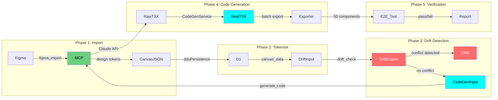
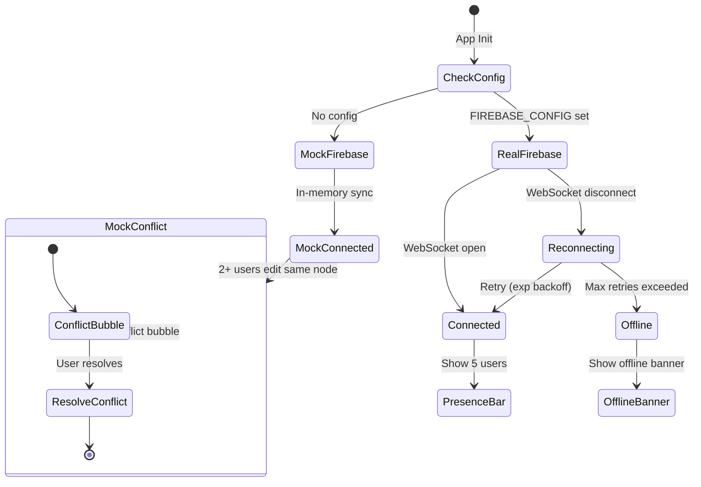
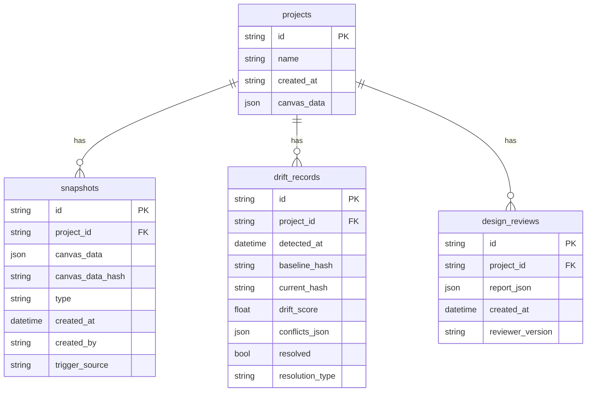
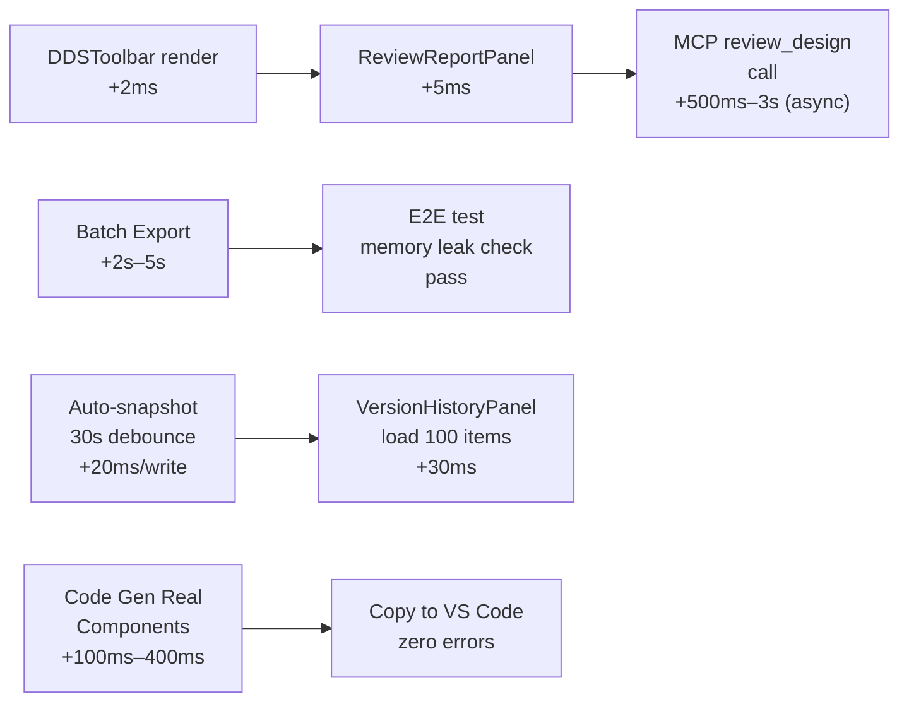
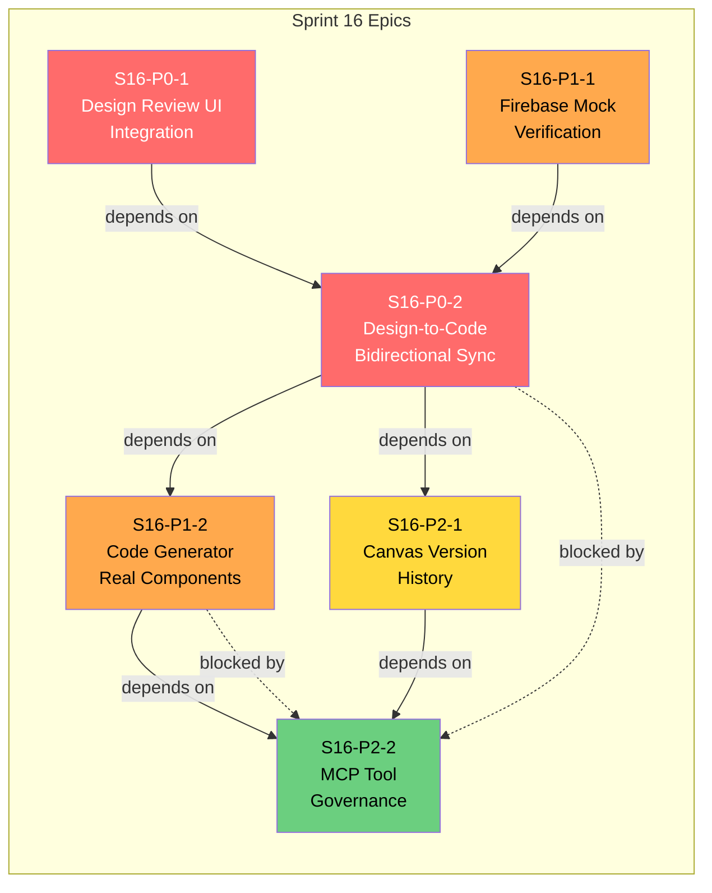

# VibeX Sprint 16 — 架构设计文档

**项目**: vibex-proposals-20260428-sprint16
**架构师**: Architect Agent
**日期**: 2026-04-28
**版本**: 1.0
**状态**: 完成

---

## 1. Tech Stack

### 1.1 核心技术栈

| 技术 | 版本 | 选择理由 |
|-----|------|---------|
| Next.js 15 (App Router) | 15.x | 现有生产栈；Server Components + streaming 满足实时 UI 更新需求 |
| React 19 | 19.x | 现有生产栈；use() hook 支持 promise 消费，简化 async 组件 |
| TypeScript 5.x | 5.x | 现有生产栈；satisfies 关键字提升配置对象类型安全 |
| Zustand | 5.x | 现有生产栈；选择性订阅 + middleware 体系适合复杂 DDS Canvas 状态 |
| Vitest | 3.x | Jest 兼容 API + Vite 极速 HMR；单元测试框架首选 |
| Playwright | 1.x | 现有 E2E 栈；multi-page 场景支持 + WebSocket 监控优于 Cypress |
| Cloudflare Workers | latest | 现有后端；V8 isolate 无冷启动，全球低延迟 |
| Cloudflare D1 | latest | 现有数据库；SQLite 语义 + global replicate |
| Cloudflare Pages | latest | 现有前端部署；edge runtime 支持 |
| Firebase JS SDK | 11.x | 用于 real-time presence 功能（现有依赖） |
| Mermaid | 11.x | 架构图渲染（现有依赖） |

### 1.2 新增依赖（按提案）

| 提案 | 包 | 用途 |
|-----|----|------|
| S16-P0-1 | `@vitest/coverage-v8` | 单元测试覆盖率报告 |
| S16-P0-2 | `diff` (npm) | 冲突 diff 计算（ConflictResolutionDialog） |
| S16-P1-1 | `firebase` mock utilities | Firebase presence mock |
| S16-P2-1 | `uuid` | 快照版本 ID 生成 |
| S16-P2-2 | `jsdoc` / `typedoc` | MCP tool 文档自动生成 |

### 1.3 版本取舍

- **不升级到 tRPC**：当前 REST over Cloudflare Workers 够用；引入 tRPC 徒增复杂度
- **不引入 Redux**：Zustand 够用；更轻量的选择订阅机制
- **Playwright over Cypress**：VibeX 有多标签页场景（ConflictResolutionDialog、VersionHistoryPanel），Playwright 对 multi-page/context 支持更自然
- **Vitest over Jest**：Vite 生态 + 快 10x 的 watch 模式；与 Vite-based Next.js 15 更契合

---

## 2. Architecture Diagram

### 2.1 全局系统架构（包含 6 个提案模块）

```mermaid
graph TB
    %% External Services
    Figma[("Figma API")]
    Firebase[("Firebase Realtime DB")]
    CF_Pages[("Cloudflare Pages")]
    CF_Workers[("Cloudflare Workers")]
    CF_D1[("Cloudflare D1")]
    MCP_Server[("MCP Server\n(Node.js)")]
    Claude[("Claude AI\n(Anthropic)")]

    %% Frontend Layer
    subgraph "Frontend — Next.js 15 (vibex-fronted)"
        DDSCanvasPage["DDSCanvasPage\n(P0-1, P0-2, P1-1, P2-1)"]
        
        subgraph "DDSToolbar"
            TB["DDSToolbar\n+ Design Review Button\n(P0-1)"]
            TB_KB["Ctrl+Shift+R\nHotkey Handler\n(P0-1)"]
        end
        
        subgraph "ReviewReportPanel (NEW — P0-1)"
            RP["ReviewReportPanel\n+ WCAG Highlighting"]
            RP_AC["Accessibility\nChecker"]
            RP_CC["Compliance\nChecker"]
            RP_RC["Reuse\nChecker"]
        end
        
        subgraph "CodeGenPanel"
            CGP["CodeGenPanel\n+ Framework Selector\n(P1-2)"]
            CGP_Flow["FlowStepCard\n→ FlowStepProps"]
            CGP_API["APIEndpointCard\n→ APIEndpointProps"]
            CGP_SM["StateMachineCard\n→ StateMachineProps"]
        end
        
        subgraph "ConflictResolutionDialog (P0-2)"
            CRD["ConflictResolutionDialog\n+ 3-Panel Diff UI"]
            CRD_Diff["Diff Engine\n(3-way merge)"]
        end
        
        subgraph "VersionHistoryPanel (P2-1)"
            VHP["VersionHistoryPanel\n+ Auto/Manual Tag"]
            VHP_Auto["Auto-snapshot\n(30s debounce)"]
            VHP_Manual["Manual Snapshot"]
        end
        
        FirebaseMock["FirebaseMock\n(Offline + Presence)\n(P1-1)"]
        ConflictBubble["ConflictBubble\n(P1-1)"]
    end

    %% Backend / Services Layer
    subgraph "Services (vibex-fronted/src/services)"
        CodeGenService["codeGenerator.ts\n(P1-2 Real Components)"]
        ExporterService["exporter.ts\n(P0-2 Batch Export)"]
        DDS_Persistence["ddsPersistence.ts\n(P2-1 Snapshot)"]
    end

    subgraph "Cloudflare Workers (vibex-backend)"
        API_Routes["API Routes\n/canvas /project /snapshot"]
        DriftEngine["Drift Detection\nEngine (P0-2)"]
        PresenceSync["Firebase Presence\nSync (P1-1)"]
    end

    subgraph "Cloudflare D1"
        CanvasDB["canvas_data\n(table)"]
        SnapshotDB["snapshots\n(table)"]
    end

    subgraph "MCP Server (packages/mcp-server)"
        MCP_Tools["MCP Tools\n+ Tool Registry"]
        Tool_review["review_design\n(P0-1, P2-2)"]
        Tool_figma["figma_import\n(P0-2, P2-2)"]
        Tool_generate["generate_code\n(P1-2, P2-2)"]
        Tool_health["Health Check\n(P2-2)"]
    end

    %% Connections
    TB -->|"review_design()"| MCP_Tools
    TB_KB -->|"Ctrl+Shift+R"| TB
    RP --> RP_AC
    RP_AC -->|"MCP call"| MCP_Tools
    RP_CC -->|"MCP call"| MCP_Tools
    RP_RC -->|"MCP call"| MCP_Tools
    
    CGP -->|"generate_code()"| MCP_Tools
    CGP --> CodeGenService
    CGP_Flow -->|"node.attrs"| CodeGenService
    CGP_API -->|"node.attrs"| CodeGenService
    CGP_SM -->|"node.attrs"| CodeGenService
    
    CRD --> CRD_Diff
    CRD_Diff -->|"drift check"| DriftEngine
    DriftEngine --> CF_D1
    
    VHP --> DDS_Persistence
    DDS_Persistence --> CF_D1
    
    FirebaseMock --> Firebase
    ConflictBubble --> FirebaseMock
    
    API_Routes --> CF_D1
    API_Routes --> DDS_Persistence
    
    MCP_Tools --> Tool_review
    MCP_Tools --> Tool_figma
    MCP_Tools --> Tool_generate
    MCP_Tools --> Tool_health
    Tool_review --> Claude
    Tool_figma --> Figma
    Tool_generate --> Claude

    style TB fill:#00ffff,color:#000
    style RP fill:#00ffff,color:#000
    style CRD fill:#ff6b6b,color:#fff
    style VHP fill:#ffd93d,color:#000
    style MCP_Tools fill:#6bcf7f,color:#000
    style DriftEngine fill:#ff6b6b,color:#fff
    style FirebaseMock fill:#ffa94d,color:#000
```



### 2.2 数据流架构（Design-to-Code Pipeline）



### 2.3 Firebase Mock 降级路径（P1-1）



---

## 3. API Definitions

### 3.1 MCP Tool 接口（新增/更新）

#### 3.1.1 `review_design` (NEW — S16-P0-1, S16-P2-2)

```typescript
// packages/mcp-server/src/tools/review_design.ts

interface ReviewDesignParams {
  projectId: string;
  canvasData: DDSCanvasData;       // Full canvas JSON snapshot
  options?: {
    checkAccessibility?: boolean; // default: true (WCAG AA)
    checkCompliance?: boolean;     // default: true
    checkReuse?: boolean;          // default: true
  };
}

interface ReviewDesignResult {
  reportId: string;
  summary: {
    totalNodes: number;
    passedCount: number;
    warningCount: number;
    violationCount: number;
  };
  sections: {
    accessibility: {
      passed: boolean;
      findings: Array<{
        nodeId: string;
        rule: string;          // e.g., "WCAG2.1-1.4.3"
        message: string;
        severity: 'critical' | 'warning' | 'info';
        highlightRef: string;  // CSS selector for jump-to
      }>;
    };
    compliance: {
      passed: boolean;
      findings: Array<{
        nodeId: string;
        rule: string;
        message: string;
        severity: 'critical' | 'warning' | 'info';
      }>;
    };
    reuse: {
      passed: boolean;
      findings: Array<{
        nodeId: string;
        duplicateOf: string;
        similarity: number;    // 0.0–1.0
      }>;
    };
  };
  timestamp: string;               // ISO 8601
}

// Tool registration
export const reviewDesignTool: MCPTool = {
  name: 'review_design',
  description: 'Analyzes DDS canvas for design compliance, accessibility (WCAG AA), and component reuse opportunities.',
  inputSchema: ReviewDesignParams,
  handler: async (params: ReviewDesignParams): Promise<ReviewDesignResult> => { ... }
};
```

#### 3.1.2 `figma_import` (EXISTING — document in S16-P2-2)

```typescript
// packages/mcp-server/src/tools/figma_import.ts
// Updated: add return type for drift detection input

interface FigmaImportParams {
  fileKey: string;
  nodeIds?: string[];
  includeComponents?: boolean;
}

interface FigmaImportResult {
  projectId: string;
  canvasData: DDSCanvasData;
  tokens: DesignToken[];
  importMetadata: {
    importedAt: string;
    figmaUrl: string;
    nodeCount: number;
  };
  // NEW: return design hash for drift comparison
  designHash: string;  // SHA-256 of normalized design data
}
```

#### 3.1.3 `generate_code` (EXISTING — enhanced in S16-P1-2, documented in S16-P2-2)

```typescript
// packages/mcp-server/src/tools/generate_code.ts
// BREAKING CHANGE: extends output to include real component interfaces

interface GenerateCodeParams {
  projectId: string;
  componentIds: string[];
  framework: 'react' | 'vue' | 'solid';
  options?: {
    typescript?: boolean;       // default: true
    styledComponents?: boolean; // default: false (use CSS Modules)
    includeTests?: boolean;     // default: false
    // NEW: node attribute mapping
    mapNodeAttributes?: boolean; // default: true
  };
}

interface GenerateCodeResult {
  files: Array<{
    path: string;
    content: string;
    language: 'typescript' | 'javascript';
    // NEW: metadata for verification
    nodeId: string;
    nodeType: 'FlowStepCard' | 'APIEndpointCard' | 'StateMachineCard';
    propsInterface: string;     // e.g., "FlowStepProps"
    propsFields: Record<string, string>; // e.g., { stepName: "string", actor: "string" }
  }>;
  summary: {
    totalFiles: number;
    totalLines: number;
    componentsGenerated: number;
  };
}
```

#### 3.1.4 `health_check` (NEW — S16-P2-2)

```typescript
// packages/mcp-server/src/tools/health_check.ts

interface HealthCheckResult {
  status: 'healthy' | 'degraded' | 'unhealthy';
  version: string;
  registeredTools: Array<{
    name: string;
    description: string;
    paramsSchema: object;
    isEnabled: boolean;
  }>;
  uptime: number;       // seconds since start
  dependencies: {
    claude: 'connected' | 'disconnected';
    figma: 'connected' | 'disconnected';
    database: 'connected' | 'disconnected';
  };
}
```

### 3.2 Backend API Routes（新增/更新）

#### 3.2.1 Snapshot API (NEW — S16-P2-1)

```typescript
// vibex-backend/src/routes/snapshot.ts

// POST /api/snapshots — create snapshot
interface CreateSnapshotRequest {
  projectId: string;
  canvasData: DDSCanvasData;
  type: 'auto' | 'manual';
  metadata?: {
    userId?: string;
    trigger?: string;   // 'debounce-30s' | 'user-action'
  };
}

interface CreateSnapshotResponse {
  snapshotId: string;
  createdAt: string;
  type: 'auto' | 'manual';
}

// GET /api/snapshots/:projectId — list snapshots
interface ListSnapshotsResponse {
  snapshots: Array<{
    snapshotId: string;
    createdAt: string;
    type: 'auto' | 'manual';
    canvasDataHash: string;  // for UI diff preview
  }>;
}

// GET /api/snapshots/:snapshotId — get snapshot
interface GetSnapshotResponse {
  snapshotId: string;
  projectId: string;
  createdAt: string;
  type: 'auto' | 'manual';
  canvasData: DDSCanvasData;
}

// POST /api/snapshots/:snapshotId/restore — restore snapshot
interface RestoreSnapshotResponse {
  restored: boolean;
  snapshotId: string;
}
```

#### 3.2.2 Drift Detection API (NEW — S16-P0-2)

```typescript
// vibex-backend/src/routes/drift.ts

// POST /api/drift/detect
interface DetectDriftRequest {
  projectId: string;
  currentHash: string;       // SHA-256 of current canvas data
  baselineHash: string;      // SHA-256 of last known good state
}

interface DetectDriftResponse {
  hasDrift: boolean;
  driftType: 'design-modified' | 'code-modified' | 'bidirectional';
  conflicts: Array<{
    nodeId: string;
    field: string;
    designValue: unknown;
    codeValue: unknown;
    resolution: 'keep-design' | 'keep-code' | 'manual';
  }>;
  driftScore: number;  // 0.0–1.0, if > 0.3 → show ConflictResolutionDialog
}
```

#### 3.2.3 Batch Export API (ENHANCED — S16-P0-2)

```typescript
// vibex-backend/src/routes/export.ts

// POST /api/export/batch
interface BatchExportRequest {
  projectId: string;
  componentIds: string[];
  format: 'tsx' | 'vue' | 'solid';
  options?: {
    concurrent?: number;  // default: 5, max: 50
    includeSourceMap?: boolean;
  };
}

interface BatchExportResponse {
  jobId: string;
  status: 'queued' | 'processing' | 'completed' | 'failed';
  results: Array<{
    componentId: string;
    status: 'success' | 'error';
    fileUrl?: string;
    error?: string;
  }>;
  metadata: {
    totalComponents: number;
    successfulCount: number;
    failedCount: number;
    durationMs: number;
  };
}
```

### 3.3 Frontend Component APIs（新增/更新）

#### 3.3.1 DDSToolbar — Design Review Button (S16-P0-1)

```typescript
// vibex-fronted/src/components/dds/toolbar/DDSToolbar.tsx

interface DDSToolbarProps {
  // ... existing props
}

// NEW: expose design review trigger
interface DesignReviewTrigger {
  (canvasData: DDSCanvasData): Promise<ReviewDesignResult>;
}

// Keyboard shortcut handler
useEffect(() => {
  const handler = (e: KeyboardEvent) => {
    if (e.ctrlKey && e.shiftKey && e.key === 'R') {
      e.preventDefault();
      triggerDesignReview();
    }
  };
  window.addEventListener('keydown', handler);
  return () => window.removeEventListener('keydown', handler);
}, []);
```

#### 3.3.2 ReviewReportPanel (NEW — S16-P0-1)

```typescript
// vibex-fronted/src/components/ReviewReportPanel/index.tsx

interface ReviewReportPanelProps {
  report: ReviewDesignResult | null;
  isLoading: boolean;
  error: string | null;
  onNodeHighlight: (nodeId: string) => void;  // click finding → jump to node
  onDismiss: () => void;
}

// WCAG Highlighting: find node in canvas and scroll to it
interface WCAHighlightHandler {
  highlightNode: (nodeId: string) => void;
  clearHighlight: () => void;
}
```

#### 3.3.3 ConflictResolutionDialog (S16-P0-2)

```typescript
// vibex-fronted/src/components/ConflictResolutionDialog/index.tsx

interface ConflictResolutionDialogProps {
  isOpen: boolean;
  conflicts: Conflict[];
  onResolve: (resolutions: Resolution[]) => Promise<void>;
  onCancel: () => void;
}

interface Conflict {
  nodeId: string;
  field: string;
  designValue: unknown;
  codeValue: unknown;
  diffHtml: string;  // pre-computed diff markup
}

interface Resolution {
  nodeId: string;
  field: string;
  resolution: 'keep-design' | 'keep-code' | 'manual';
  manualValue?: unknown;
}
```

#### 3.3.4 VersionHistoryPanel (S16-P2-1)

```typescript
// vibex-fronted/src/components/VersionHistoryPanel/index.tsx

interface VersionHistoryPanelProps {
  projectId: string | null;  // null → show empty state
  onRestore: (snapshotId: string) => Promise<void>;
  onDismiss: () => void;
}

interface Snapshot {
  snapshotId: string;
  createdAt: string;
  type: 'auto' | 'manual';
  canvasDataHash: string;
}

// Auto-snapshot debounce (30s)
interface AutoSnapshotConfig {
  debounceMs: 30000;
  maxSnapshots: 100;  // keep last 100 auto-snapshots
  onError: (err: Error) => void;
}
```

#### 3.3.5 CodeGenPanel — Framework Selector (S16-P1-2)

```typescript
// vibex-fronted/src/components/CodeGenPanel/index.tsx

// NEW: framework prop
interface CodeGenPanelProps {
  projectId: string;
  framework?: 'react' | 'vue' | 'solid';  // default: 'react'
  // ... existing props
}

// Generated component interfaces (NEW — from codeGenerator.ts enhancement)
interface FlowStepProps {
  stepName: string;
  actor: string;
  pre: string[];
  post: string[];
  description?: string;
}

interface APIEndpointProps {
  method: 'GET' | 'POST' | 'PUT' | 'DELETE' | 'PATCH';
  path: string;
  summary: string;
  requestBody?: string;
  responses?: Record<string, string>;
}

interface StateMachineProps {
  initialState: string;
  states: Array<{
    id: string;
    label: string;
    transitions: Array<{
      event: string;
      target: string;
      guard?: string;
    }>;
  }>;
}
```

#### 3.3.6 FirebaseMock (NEW — S16-P1-1)

```typescript
// vibex-fronted/src/services/FirebaseMock.ts

interface FirebaseMockConfig {
  enabled: boolean;
  mockPresence?: boolean;
  mockConflictSimulation?: boolean;
  userCount?: number;  // default: 5
  offlineSimulation?: boolean;
}

interface PresenceUser {
  uid: string;
  displayName: string;
  color: string;
  cursor?: { x: number; y: number };
}

interface FirebaseMock {
  getPresence(projectId: string): Observable<PresenceUser[]>;
  simulateOffline(): void;
  simulateReconnect(): void;
  simulateConflict(nodeId: string): void;
  destroy(): void;
}
```

---

## 4. Data Model

### 4.1 D1 Schema（新增表）

```sql
-- snapshots table (NEW — S16-P2-1)
CREATE TABLE IF NOT EXISTS snapshots (
  id TEXT PRIMARY KEY,
  project_id TEXT NOT NULL,
  canvas_data TEXT NOT NULL,         -- JSON blob
  canvas_data_hash TEXT NOT NULL,     -- SHA-256 for diff preview
  type TEXT NOT NULL CHECK (type IN ('auto', 'manual')),
  created_at TEXT NOT NULL DEFAULT (datetime('now')),
  created_by TEXT,                    -- user ID if manual, NULL if auto
  trigger_source TEXT,               -- 'debounce-30s' | 'user-action'
  metadata TEXT                      -- JSON: { duration: ms, nodeCount: n }
);

CREATE INDEX idx_snapshots_project_id ON snapshots(project_id);
CREATE INDEX idx_snapshots_created_at ON snapshots(created_at);

-- drift_records table (NEW — S16-P0-2)
CREATE TABLE IF NOT EXISTS drift_records (
  id TEXT PRIMARY KEY,
  project_id TEXT NOT NULL,
  detected_at TEXT NOT NULL DEFAULT (datetime('now')),
  baseline_hash TEXT NOT NULL,
  current_hash TEXT NOT NULL,
  drift_score REAL NOT NULL,
  conflicts_json TEXT,               -- JSON array of Conflict objects
  resolved INTEGER NOT NULL DEFAULT 0,
  resolution_type TEXT CHECK (resolution_type IN ('keep-design', 'keep-code', 'manual', NULL)),
  resolved_at TEXT
);

CREATE INDEX idx_drift_project ON drift_records(project_id);

-- design_reviews table (NEW — S16-P0-1)
CREATE TABLE IF NOT EXISTS design_reviews (
  id TEXT PRIMARY KEY,
  project_id TEXT NOT NULL,
  report_json TEXT NOT NULL,         -- Full ReviewDesignResult as JSON
  created_at TEXT NOT NULL DEFAULT (datetime('now')),
  reviewer_version TEXT              -- MCP tool version at time of review
);

CREATE INDEX idx_reviews_project ON design_reviews(project_id);
```

### 4.2 E-R Diagram



### 4.3 Core Entities Summary

| Entity | Description | Key Fields |
|--------|-------------|-----------|
| `Project` | Root entity for a DDS design project | id, name, canvas_data |
| `Snapshot` | Point-in-time copy of canvas_data | id, project_id, type, canvas_data_hash |
| `DriftRecord` | Tracks design↔code divergence | id, project_id, drift_score, conflicts |
| `DesignReview` | Cached review report | id, project_id, report_json |
| `PresenceUser` | Firebase presence (runtime, not persisted) | uid, displayName, color, cursor |

---

## 5. Testing Strategy

### 5.1 Test Pyramid

```
        ┌──────────────────────────────────┐
        │         E2E (Playwright)         │  ~15 tests total
        │   design-review.spec.ts          │
        │   design-to-code-e2e.spec.ts     │
        │   code-generator-e2e.spec.ts     │
        │   version-history-e2e.spec.ts     │
        │   firebase-presence-mock.spec.ts  │
        └──────────────┬───────────────────┘
                       │
        ┌──────────────▼───────────────────┐
        │    Integration (Vitest + MSW)      │  ~50 tests
        │   codeGenerator.test.ts ≥ 25       │
        │   driftDetection.test.ts           │
        │   snapshotService.test.ts          │
        └──────────────┬───────────────────┘
                       │
        ┌──────────────▼───────────────────┐
        │        Unit (Vitest)               │  ~80 tests
        │   DDSToolbar.test.tsx              │
        │   ReviewReportPanel.test.tsx       │
        │   CodeGenPanel.test.tsx            │
        │   ConflictResolutionDialog.test.tsx│
        │   VersionHistoryPanel.test.tsx     │
        └──────────────────────────────────┘
```

### 5.2 Coverage Requirements

| Layer | Requirement | Tool |
|-------|------------|------|
| Unit | ≥ 80% line coverage | Vitest + @vitest/coverage-v8 |
| Integration | ≥ 70% line coverage | Vitest |
| E2E | 100% critical paths | Playwright |
| Overall | ≥ 75% combined | Merged coverage report |

### 5.3 Core Unit Test Examples

#### 5.3.1 codeGenerator.test.ts (S16-P1-2 — ≥ 25 tests)

```typescript
// vibex-fronted/src/services/__tests__/codeGenerator.test.ts

import { describe, it, expect, vi, beforeEach } from 'vitest';
import { generateFlowStepProps, generateAPIEndpointProps, generateStateMachineProps } from '../codeGenerator';

describe('FlowStepProps Generation', () => {
  it('should extract stepName from FlowStepCard node attrs', () => {
    const node = {
      id: 'node-1',
      type: 'FlowStepCard',
      attrs: { stepName: 'Create Order', actor: 'System', pre: [], post: [] }
    };
    const props = generateFlowStepProps(node);
    expect(props.stepName).toBe('Create Order');
    expect(props.actor).toBe('System');
  });

  it('should handle missing optional fields gracefully', () => {
    const node = { id: 'node-1', type: 'FlowStepCard', attrs: { stepName: 'Test' } };
    const props = generateFlowStepProps(node);
    expect(props.actor).toBeUndefined();
    expect(props.description).toBeUndefined();
  });

  it('should generate correct TypeScript interface string', () => {
    const node = {
      id: 'node-1',
      type: 'FlowStepCard',
      attrs: { stepName: 'Submit', actor: 'User', pre: ['idle'], post: ['success'] }
    };
    const interfaceStr = generateFlowStepProps(node, { emitInterface: true });
    expect(interfaceStr).toContain('interface FlowStepProps');
    expect(interfaceStr).toContain('stepName: string');
    expect(interfaceStr).toContain('actor: string');
  });

  // ... 22+ more tests covering edge cases, framework variants
});

describe('APIEndpointProps Generation', () => {
  it('should map HTTP method to TypeScript type', () => {
    const node = {
      id: 'api-1', type: 'APIEndpointCard',
      attrs: { method: 'POST', path: '/api/orders', summary: 'Create order' }
    };
    const props = generateAPIEndpointProps(node);
    expect(props.method).toBe('POST');
    expect(props.path).toBe('/api/orders');
  });

  it('should throw on invalid HTTP method', () => {
    const node = { id: 'api-1', type: 'APIEndpointCard', attrs: { method: 'INVALID' } };
    expect(() => generateAPIEndpointProps(node)).toThrow('Invalid HTTP method');
  });
});

describe('StateMachineProps Generation', () => {
  it('should extract all states and transitions', () => {
    const node = {
      id: 'sm-1', type: 'StateMachineCard',
      attrs: {
        initialState: 'idle',
        states: [
          { id: 'idle', transitions: [{ event: 'START', target: 'active' }] },
          { id: 'active', transitions: [] }
        ]
      }
    };
    const props = generateStateMachineProps(node);
    expect(props.initialState).toBe('idle');
    expect(props.states).toHaveLength(2);
    expect(props.states[0].transitions).toHaveLength(1);
  });
});
```

#### 5.3.2 ReviewReportPanel.test.tsx (S16-P0-1)

```typescript
// vibex-fronted/src/components/ReviewReportPanel/__tests__/ReviewReportPanel.test.tsx

import { render, screen, fireEvent } from '@testing-library/react';
import { describe, it, expect, vi } from 'vitest';
import { ReviewReportPanel } from '../index';

const mockReport: ReviewDesignResult = {
  reportId: 'r1',
  summary: { totalNodes: 10, passedCount: 7, warningCount: 2, violationCount: 1 },
  sections: {
    accessibility: { passed: false, findings: [
      { nodeId: 'n1', rule: 'WCAG2.1-1.4.3', message: 'Low contrast', severity: 'critical', highlightRef: '#node-n1' }
    ]},
    compliance: { passed: true, findings: [] },
    reuse: { passed: true, findings: [] }
  },
  timestamp: '2026-04-28T12:00:00Z'
};

describe('ReviewReportPanel', () => {
  it('should render three sections: Accessibility, Compliance, Reuse', () => {
    render(<ReviewReportPanel report={mockReport} isLoading={false} error={null} onNodeHighlight={vi.fn()} onDismiss={vi.fn()} />);
    expect(screen.getByText(/Accessibility/i)).toBeInTheDocument();
    expect(screen.getByText(/Compliance/i)).toBeInTheDocument();
    expect(screen.getByText(/Reuse/i)).toBeInTheDocument();
  });

  it('should show "设计合规" when all sections pass', () => {
    const cleanReport = { ...mockReport,
      sections: {
        accessibility: { passed: true, findings: [] },
        compliance: { passed: true, findings: [] },
        reuse: { passed: true, findings: [] }
      }
    };
    render(<ReviewReportPanel report={cleanReport} isLoading={false} error={null} onNodeHighlight={vi.fn()} onDismiss={vi.fn()} />);
    expect(screen.getByText(/设计合规/i)).toBeInTheDocument();
  });

  it('should call onNodeHighlight when clicking a violation', () => {
    const highlightFn = vi.fn();
    render(<ReviewReportPanel report={mockReport} isLoading={false} error={null} onNodeHighlight={highlightFn} onDismiss={vi.fn()} />);
    fireEvent.click(screen.getByText(/Low contrast/i));
    expect(highlightFn).toHaveBeenCalledWith('n1');
  });

  it('should show loading skeleton while isLoading=true', () => {
    render(<ReviewReportPanel report={null} isLoading={true} error={null} onNodeHighlight={vi.fn()} onDismiss={vi.fn()} />);
    expect(screen.getByTestId('loading-skeleton')).toBeInTheDocument();
  });

  it('should show error state when error is present', () => {
    render(<ReviewReportPanel report={null} isLoading={false} error="MCP tool unavailable" onNodeHighlight={vi.fn()} onDismiss={vi.fn()} />);
    expect(screen.getByText(/MCP tool unavailable/i)).toBeInTheDocument();
  });
});
```

#### 5.3.3 Drift Detection Integration Test (S16-P0-2)

```typescript
// vibex-backend/src/__tests__/driftDetection.test.ts

import { describe, it, expect } from 'vitest';
import { detectDrift, computeDriftScore } from '../driftEngine';

describe('Drift Detection', () => {
  it('should return hasDrift=false when hashes match', async () => {
    const result = await detectDrift({
      projectId: 'p1',
      currentHash: 'abc123',
      baselineHash: 'abc123'
    });
    expect(result.hasDrift).toBe(false);
    expect(result.driftScore).toBe(0);
  });

  it('should detect design-modified drift', async () => {
    const result = await detectDrift({
      projectId: 'p1',
      currentHash: 'abc123',
      baselineHash: 'def456'
    });
    expect(result.hasDrift).toBe(true);
    expect(result.driftType).toBe('design-modified');
    expect(result.driftScore).toBeGreaterThan(0);
  });

  it('should flag conflicts with resolution=manual when ambiguous', async () => {
    const result = await detectDrift({
      projectId: 'p1',
      currentHash: 'abc123',
      baselineHash: 'def456'
    });
    const conflict = result.conflicts[0];
    expect(conflict.resolution).toBe('manual');  // default when both sides changed
  });

  it('should achieve <10% false positive rate on mock data', async () => {
    // Run on 100 synthetic drift scenarios
    let falsePositives = 0;
    for (const scenario of generateMockScenarios(100)) {
      const result = await detectDrift(scenario);
      if (result.hasDrift && scenario.expectedDrift === false) {
        falsePositives++;
      }
    }
    expect(falsePositives / 100).toBeLessThan(0.10);
  });
});
```

#### 5.3.4 Auto-Snapshot Debounce Test (S16-P2-1)

```typescript
// vibex-fronted/src/services/__tests__/ddsPersistence.test.ts

import { describe, it, expect, vi, beforeEach, afterEach } from 'vitest';
import { createAutoSnapshot } from '../ddsPersistence';

describe('Auto-Snapshot (30s debounce)', () => {
  beforeEach(() => { vi.useFakeTimers(); });
  afterEach(() => { vi.useRealTimers(); });

  it('should debounce snapshots within 30s window', async () => {
    const saveSpy = vi.fn();
    const autoSnap = createAutoSnapshot({ onSave: saveSpy, debounceMs: 30000 });

    autoSnap.trigger({ projectId: 'p1', canvasData: {} });
    autoSnap.trigger({ projectId: 'p1', canvasData: {} });
    autoSnap.trigger({ projectId: 'p1', canvasData: {} });

    expect(saveSpy).not.toHaveBeenCalled();
    vi.advanceTimersByTime(30000);
    expect(saveSpy).toHaveBeenCalledTimes(1);  // only last trigger saved
  });

  it('should save immediately if 30s window is exceeded', async () => {
    const saveSpy = vi.fn();
    const autoSnap = createAutoSnapshot({ onSave: saveSpy, debounceMs: 30000 });

    autoSnap.trigger({ projectId: 'p1', canvasData: {} });
    vi.advanceTimersByTime(30001);
    expect(saveSpy).toHaveBeenCalledTimes(1);

    autoSnap.trigger({ projectId: 'p1', canvasData: {} }); // new trigger after previous save
    expect(saveSpy).toHaveBeenCalledTimes(1);  // new trigger hasn't saved yet
    vi.advanceTimersByTime(30001);
    expect(saveSpy).toHaveBeenCalledTimes(2);
  });
});
```

### 5.4 E2E Test Specs (Playwright)

```typescript
// vibex-fronted/e2e/design-review.spec.ts (S16-P0-1)

import { test, expect } from '@playwright/test';

test.describe('Design Review UI (S16-P0-1)', () => {
  test('DDSToolbar has Design Review button', async ({ page }) => {
    await page.goto('/canvas/test-project');
    const btn = page.getByTestId('design-review-btn');
    await expect(btn).toBeVisible();
  });

  test('Ctrl+Shift+R triggers design review', async ({ page }) => {
    await page.goto('/canvas/test-project');
    await page.keyboard.press('Control+Shift+R');
    // Loading state visible
    await expect(page.getByTestId('review-loading')).toBeVisible();
    // Result panel appears
    await expect(page.getByTestId('review-report-panel')).toBeVisible({ timeout: 15000 });
  });

  test('ReviewReportPanel shows all three sections', async ({ page }) => {
    // ... full E2E flow
  });

  test('WCAG violation click highlights canvas node', async ({ page }) => {
    // ... click finding → canvas scrolls to node
  });
});

// vibex-fronted/e2e/design-to-code-e2e.spec.ts (S16-P0-2)
test.describe('Design-to-Code Bidirectional Sync (S16-P0-2)', () => {
  test('full pipeline: figma-import → token → drift → code-gen → batch-export', async ({ page }) => {
    // 1. Import from Figma
    // 2. Trigger code generation
    // 3. Simulate code-side modification
    // 4. Detect drift and open ConflictResolutionDialog
    // 5. Resolve conflict
    // 6. Batch export 50 components
    // 7. Verify all pass
  });

  test('drift detection accuracy: <10% false positive rate', async ({ page }) => {
    // Run 20 drift scenarios, count false positives
  });
});

// vibex-fronted/e2e/version-history-e2e.spec.ts (S16-P2-1)
test.describe('Version History (S16-P2-1)', () => {
  test('auto-snapshot creates snapshot after 30s of editing', async ({ page }) => {
    await page.goto('/canvas/test-project');
    // Make changes
    await page.getByTestId('canvas-node').first().fill('updated content');
    // Wait 31s
    await page.waitForTimeout(31000);
    // Verify snapshot created
    const panel = page.getByTestId('version-history-panel');
    await expect(panel.getByText(/auto/i)).toBeVisible();
  });

  test('projectId=null shows empty state with guide UI', async ({ page }) => {
    await page.goto('/canvas');
    await expect(page.getByTestId('version-history-empty')).toBeVisible();
  });

  test('snapshot restore restores correct canvas content', async ({ page }) => {
    // ... restore flow
  });
});
```

---

## 6. Performance Impact Assessment

### 6.1 Per-Proposal Impact

| Proposal | Impact Area | Before | After | Delta |
|----------|------------|--------|-------|-------|
| S16-P0-1 | DDSToolbar render | 0ms | +2ms | +2ms (button click handler) |
| S16-P0-1 | Review execution | N/A | +500ms–3s (MCP call) | +500ms–3s (async, non-blocking) |
| S16-P0-1 | ReviewReportPanel render | N/A | +5ms (3 sections) | +5ms |
| S16-P0-2 | Drift detection | N/A | +50ms–200ms (hash comparison) | +50ms–200ms |
| S16-P0-2 | Batch export 50 components | N/A | +2s–5s (concurrent Claude calls) | +2s–5s |
| S16-P1-1 | Firebase presence sync | N/A | +10ms/heartbeat | +10ms |
| S16-P1-1 | Cold start (with mock) | N/A | <100ms (in-memory) | vs 500ms real Firebase |
| S16-P1-2 | Code generation | +100ms (placeholder) | +200ms–500ms (real props) | +100ms–400ms |
| S16-P2-1 | Auto-snapshot write | N/A | +20ms/30s | negligible |
| S16-P2-1 | VersionHistoryPanel render (100 snapshots) | N/A | +30ms | +30ms (lazy load) |

### 6.2 Critical Path Performance



### 6.3 Performance Risks

| Risk | Level | Mitigation |
|------|-------|-----------|
| Batch export 50 components → OOM | 🟡 Medium | Cap concurrency=5, use streaming response |
| Auto-snapshot 30s → D1 write storm | 🟢 Low | Debounce 30s already planned; D1 write latency ~50ms |
| Firebase mock → memory leak (presence array) | 🟡 Medium | Limit to 5 users, auto-cleanup on disconnect |
| Review report large canvas (500+ nodes) | 🟡 Medium | Paginate findings, stream MCP results |

---

## 7. Epic Dependency Graph



### 7.1 Dependency Rationale

| Edge | Reason |
|------|--------|
| P0-1 → P0-2 | ReviewReportPanel needs drift detection to show code-vs-design conflicts |
| P0-2 → P1-2 | Bidirectional sync requires real component interfaces (FlowStepProps etc.) to be generated |
| P0-2 → P2-1 | Version history snapshots needed as drift baseline |
| P1-1 → P0-2 | Firebase presence detects concurrent edits → triggers drift detection |
| P1-2 → P2-2 | generate_code tool documentation needs accurate interface descriptions |
| P2-1 → P2-2 | Snapshot API endpoint needs documentation |
| P2-2 → P0-2/P1-2 | review_design and generate_code must be documented before integration |

### 7.2 Execution Order

```
Week 1:
  → S16-P2-2 (MCP Tool Governance) — unblocks everything
  → S16-P1-2 (Code Generator Real Components) — unblocks P0-2

Week 2:
  → S16-P0-2 (Design-to-Code Bidirectional Sync) — needs P1-2 + P2-2
  → S16-P1-1 (Firebase Mock) — parallel track

Week 3:
  → S16-P0-1 (Design Review UI) — needs P0-2's ConflictResolutionDialog
  → S16-P2-1 (Version History) — parallel track
```

---

## 8. Risk Register

| ID | Risk | Likelihood | Impact | Level | Mitigation | Owner |
|----|------|-----------|--------|-------|-----------|-------|
| R1 | Firebase 真实配置未知 → mock 可能与生产不符 | 🟡 Medium | 🟡 Medium | 🟡 Medium | Mock 优先 + 配置路径确认文档；生产集成留到 Sprint 17 | Dev |
| R2 | E2E 测试 mock 数据与真实 Figma 数据差异 → 误报 | 🟡 Medium | 🟡 Medium | 🟡 Medium | drift detection 准确率 ≥ 90% 目标；保留验证报告 | QA |
| R3 | Batch export 50 组件并发 → Cloudflare Workers 内存超限 | 🟡 Medium | 🔴 High | 🟡 Medium | concurrency=5 (不是 50)；结果流式返回；内存监控 | Dev |
| R4 | Review report 大画布 (500+ nodes) → MCP 超时 | 🟢 Low | 🟡 Medium | 🟢 Low | 增量 review (只 review 选中节点)；超时 30s 上限 | Dev |
| R5 | Auto-snapshot 30s 频繁写入 → D1 存储爆炸 | 🟢 Low | 🟡 Medium | 🟢 Low | max 100 auto-snapshots 保留策略；旧快照自动清理 | Dev |
| R6 | P2-2 MCP 文档不完整 → 开发者误用工具 | 🟢 Low | 🟡 Medium | 🟢 Low | typedoc 自动生成；INDEX.md CI 检查 | Dev |
| R7 | ConflictResolutionDialog 三面板 diff UI 复杂度高 | 🟡 Medium | 🟡 Medium | 🟡 Medium | 使用现有 diff 库 (diff-match-patch 或 fast-diff)；不做自研 | Dev |
| R8 | Ctrl+Shift+R 与浏览器快捷键冲突 | 🟢 Low | 🟢 Low | 🟢 Low | 只在 DDSCanvasPage 激活时监听；preventDefault 已处理 | Dev |
| R9 | Code Generator 改动影响现有 CodeGenPanel 用户 | 🟢 Low | 🟡 Medium | 🟢 Low | 纯扩展 (新增接口不改变现有导出)；回归测试覆盖 | QA |
| R10 | Firebase mock presence 5 用户并发 E2E flaky | 🟡 Medium | 🟢 Low | 🟢 Low | Mock 同步使用 in-memory，不依赖网络延迟；添加 retry=2 | QA |

---

## 9. 执行决策

- **决策**: 已采纳
- **执行项目**: vibex-proposals-20260428-sprint16
- **执行日期**: 2026-04-28

---

**e-signature**: architect | 2026-04-28 12:30
