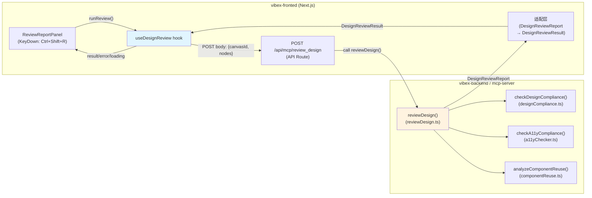

# VibeX Sprint 19 — Architecture Document

**版本**: v1.0
**日期**: 2026-04-30
**Agent**: architect
**状态**: 已采纳

---

## 1. 执行摘要

**Epic**: E19-1 — Design Review 真实 MCP 集成

**根因**: 前端 `useDesignReview` hook 使用 `setTimeout(1500)` + 硬编码假数据，从未调用真实 MCP tool `review_design`。用户按 Ctrl+Shift+R 看到的是伪造的评审报告，与真实设计状态无关。底层 MCP tool（`checkDesignCompliance`、`checkA11yCompliance`、`analyzeComponentReuse`）逻辑完整，缺的是前端连接层。

**目标**: 消除全链路 mock，接入真实 MCP 逻辑，优雅降级。

---

## 2. 架构图



**数据流**:

```
用户 Ctrl+Shift+R
  → ReviewReportPanel 触发 runReview()
    → useDesignReview.runReview()
      → fetch POST /api/mcp/review_design {canvasId, nodes}
        → API Route 调用 reviewDesign({canvasId, nodes})
          → reviewDesign() 调用 3 个 checker 函数
            → 返回 DesignReviewReport
              → 适配层转换为 DesignReviewResult
                → hook setResult(data) → ReviewReportPanel 渲染
```

---

## 3. 技术决策

### 3.1 方案选择：HTTP API Route 直调（无 MCP stdio）

**决策**: 直接从 Next.js API Route 调用 `reviewDesign()` 函数，不走 MCP stdio transport。

**理由**:
- `reviewDesign()` 是纯同步/异步函数，无状态依赖，直接 import 即可
- MCP stdio transport 需要 `child_process.spawn`，每次请求多一个进程开销
- 当前 `packages/mcp-server/src/tools/reviewDesign.ts` 已 import 后端 checker，API Route 复用同一路径
- 架构简单，零新依赖，TypeScript 类型一致

**备选方案（已排除）**:
- MCP SDK 客户端：引入新依赖，浏览器端支持未知，实施成本 1-2d
- child_process spawn：每次请求启动进程，性能差

### 3.2 Import 路径策略

**问题**: API Route 在 `frontend/src/app/api/mcp/review_design/route.ts`，backend checker 在 `backend/src/lib/prompts/`。

**方案**: 使用 monorepo 相对路径 from frontend to backend.

```
API Route 位置:  vibex-fronted/src/app/api/mcp/review_design/route.ts
import path:     ../../../../../../packages/mcp-server/src/tools/reviewDesign.js
               (frontend → vibex-fronted → packages → mcp-server → src → tools)
```

**验证**: `packages/mcp-server/src/tools/reviewDesign.ts` 已有 `../../../../vibex-backend/src/lib/prompts/*.js` import，monorepo 内相对路径可行。

**风险缓解**: 若 monorepo 相对 import 失败，改用 `tsconfig` path alias 或复制核心逻辑到 API route 内（PRD spec 允许）。

---

## 4. 接口定义

### 4.1 API Route: POST /api/mcp/review_design

**Request**:
```typescript
interface ReviewDesignRequest {
  canvasId: string;            // required
  nodes?: CanvasNode[];        // optional, default []
  checkCompliance?: boolean;   // default: true
  checkA11y?: boolean;         // default: true
  checkReuse?: boolean;        // default: true
}

interface CanvasNode {
  id: string;
  type: string;
  props?: Record<string, unknown>;
  styles?: Record<string, string>;
  [key: string]: unknown;
}
```

**Success Response (200)**:
```typescript
interface DesignReviewReport {
  canvasId: string;
  reviewedAt: string;
  summary: {
    compliance: 'pass' | 'warn' | 'fail';
    a11y: 'pass' | 'warn' | 'fail';
    reuseCandidates: number;
    totalNodes: number;
  };
  designCompliance?: {
    colors: boolean;
    colorIssues: unknown[];
    typography: boolean;
    typographyIssues: unknown[];
    spacing: boolean;
    spacingIssues: unknown[];
  };
  a11y?: {
    passed: boolean;
    critical: number;
    high: number;
    medium: number;
    low: number;
    issues: unknown[];
  };
  reuse?: {
    candidatesAboveThreshold: number;
    candidates: unknown[];
    recommendations: string[];
  };
}
```

**Error Response (400)**:
```json
{ "error": "canvasId is required" }
```

**Error Response (500)**:
```json
{ "error": "Design review failed", "details": "..." }
```

### 4.2 Hook 接口: useDesignReview

```typescript
// Result 映射: DesignReviewReport → DesignReviewResult
interface DesignReviewResult {
  compliance: DesignReviewIssue[];
  accessibility: DesignReviewIssue[];
  reuse: DesignReviewRecommendation[];
}

interface DesignReviewIssue {
  id: string;              // auto-generated uuid
  severity: 'critical' | 'warning' | 'info';
  category: 'compliance' | 'accessibility' | 'reuse';
  message: string;
  location?: string;
}

interface DesignReviewRecommendation {
  id: string;
  message: string;
  priority: 'high' | 'medium' | 'low';
}

// Hook return
interface UseDesignReviewReturn {
  isOpen: boolean;      // panel visible
  isLoading: boolean;    // fetching
  result: DesignReviewResult | null;
  error: string | null;
  runReview: (figmaUrl?: string) => Promise<void>;
  open: () => void;
  close: () => void;
}
```

---

## 5. 文件变更清单

| 文件 | 操作 | 说明 |
|------|------|------|
| `vibex-fronted/src/app/api/mcp/review_design/route.ts` | **新增** | API Route 桥接层 |
| `vibex-fronted/src/hooks/useDesignReview.ts` | **修改** | 移除 mock，调用 API Route，添加适配层 |
| `vibex-fronted/src/components/design-review/ReviewReportPanel.tsx` | **修改** | 优雅降级 UI（四状态） |
| `vibex-fronted/tests/e2e/design-review.spec.ts` | **修改** | E2E 真实路径覆盖 |

---

## 6. 依赖关系

```
S1: API Route 桥接层          [关键路径，基础依赖]
    ↑
S2: Hook 接入                [依赖 S1]
    ↑
S3: 优雅降级 UI              [依赖 S2，ReviewReportPanel 已存在]
    ↑
S4: E2E 测试                 [依赖 S2+S3]
```

S1 为关键路径，必须先完成。

---

## 7. 性能影响评估

| 场景 | 影响 | 评估 |
|------|------|------|
| API Route 调用 | 网络延迟 +50–200ms | 用户感知到 Ctrl+Shift+R 后有加载过程，可接受 |
| reviewDesign() 同步处理 | CPU 开销取决于 node 数量 | nodes=0 时即时返回；nodes=100+ 时 <500ms |
| 设计合规检查（checkDesignCompliance）| O(n) 遍历 nodes | 可接受，前端有 loading state |
| 无数据时（nodes=[]）| 快速返回空报告 | 性能无影响 |
| 错误降级 | 无额外开销 | error 状态立即渲染，无性能影响 |

**结论**: 性能影响可控。API Route + reviewDesign() 总延迟预估 <800ms（100 nodes），前端已有 `isLoading` 状态处理，无需额外优化。

---

## 8. 测试策略

| 层级 | 工具 | 覆盖率目标 |
|------|------|-----------|
| API Route 单元 | Vitest | AS1.1–AS1.4 100% |
| Hook 单元 | Vitest + fetch mock | AS2.1–AS2.6 100% |
| UI 组件 | Vitest + RTL | AS3.1–AS3.4 100% |
| E2E | Playwright | AS4.1–AS4.3 100% |

**关键断言**:
- `grep -r "setTimeout.*1500" src/hooks/useDesignReview` → 0 matches
- `fetch('/api/mcp/review_design')` 被调用（非 mock）
- error 状态下无假数据残留
- `pnpm run build` → 0 errors

---

## 9. 风险与缓解

| 风险 | 可能性 | 影响 | 缓解 |
|------|--------|------|------|
| monorepo 相对 import 在 build 时失效 | 低 | 中 | 备用方案：复制核心逻辑到 API route 内 |
| reviewDesign() 无 nodes 时返回空 summary | 低 | 低 | 空 nodes 正常处理，return 干净报告 |
| 假数据残留（grep 遗漏） | 中 | 高 | E2E TC2 验证结果非假数据字符串 |
| 优雅降级三种状态缺失 | 低 | 中 | spec E19-1-S3 明确定义 UI 文案 |

---

## 10. 执行决策

- **决策**: 已采纳
- **执行项目**: vibex-sprint19
- **执行日期**: 2026-04-30

---

*文档版本: v1.0*
*创建时间: 2026-04-30 12:00 GMT+8*
*Agent: architect*