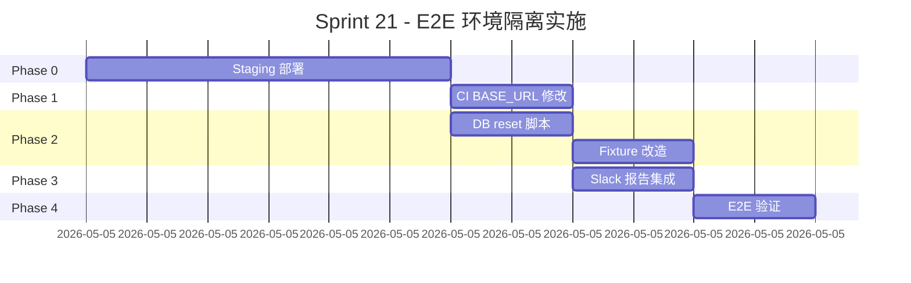

# VibeX Sprint 21 实施计划 — E2E 测试环境隔离

**项目**: vibex-proposals-20260501-sprint21
**版本**: 1.0
**日期**: 2026-05-02
**架构师**: ARCHITECT
**功能**: P005-R E2E 测试环境隔离

---

## 1. 里程碑与时间线

| 阶段 | 内容 | 预估工时 | 依赖 |
|------|------|---------|------|
| Phase 0 | Infrastructure: 部署 staging 环境 | 3h | DevOps |
| Phase 1 | CI 配置: 改 BASE_URL + 移除生产 fallback | 1h | Phase 0 |
| Phase 2 | DB 隔离: reset 脚本 + fixture 改造 | 2h | Phase 0 |
| Phase 3 | 报告: Slack 摘要 + artifact 配置 | 1h | Phase 1 |
| Phase 4 | 验证: Canvas + Workbench E2E 在 staging 通过 | 1h | Phase 1+2+3 |
| **Total** | | **8h** | |

---

## 2. 详细实施步骤

### Phase 0: Staging 环境部署（DevOps 负责）

#### Step 0.1: Staging 域名配置
```
- 在 Cloudflare 添加 DNS 记录
  staging.vibex.top -> staging server IP (或 Cloudflare Tunnel)
- 验证: curl -I https://staging.vibex.top/health
  预期: HTTP 200
```

#### Step 0.2: Staging 应用部署
```
- 复用现有部署 pipeline，复制 prod config
- 环境变量:
  NODE_ENV=staging
  DATABASE_URL=<staging-d1>
  NEXT_PUBLIC_BASE_URL=https://staging.vibex.top
  NEXT_PUBLIC_API_URL=https://staging.vibex.top/api
- 部署验证: https://staging.vibex.top/api/health 返回 {"status":"ok"}
```

#### Step 0.3: Staging DB 初始化
```
- 复制生产 schema 到 staging D1
- 验证: drizzle studio 可以连接 staging DB
- 记录: STAGING_DATABASE_URL (Cloudflare D1 binding)
```

#### Step 0.4: Staging GitHub Actions Variable
```
- 在仓库 Settings > Variables 中添加:
  BASE_URL = https://staging.vibex.top
- 验证: GitHub Actions workflow 中可读取 ${{ vars.BASE_URL }}
```

**出口标准**: `curl https://staging.vibex.top/api/health` 返回 200，GitHub vars 已设置。

---

### Phase 1: CI 配置变更（Dev 负责）

#### Step 1.1: 修改 test.yml BASE_URL
```yaml
# .github/workflows/test.yml, e2e job
env:
  CI: true
  BASE_URL: ${{ vars.BASE_URL }}  # 移除 || 'https://vibex.top' fallback
```

#### Step 1.2: 验证 BASE_URL 不含 vibex.top
```bash
# 在 CI job 中添加 inspection step
- name: Verify BASE_URL
  run: |
    echo "BASE_URL=$BASE_URL"
    if echo "$BASE_URL" | grep -q "vibex.top"; then
      echo "ERROR: BASE_URL contains vibex.top!"
      exit 1
    fi
    echo "BASE_URL is safe: $BASE_URL"
```

#### Step 1.3: 测试 staging health check
```yaml
# 在 e2e job 开始前加
- name: Check staging health
  run: |
    for i in 1 2 3; do
      STATUS=$(curl -s -o /dev/null -w "%{http_code}" $BASE_URL/api/health)
      if [ "$STATUS" = "200" ]; then
        echo "Staging is healthy"
        exit 0
      fi
      echo "Retry $i/3: staging returned $STATUS"
      sleep 10
    done
    echo "Staging is not accessible"
    exit 1
```

---

### Phase 2: DB 隔离机制（Dev 负责）

#### Step 2.1: 创建 db reset 脚本
```typescript
// scripts/e2e-db-reset.ts
import { drizzle } from 'drizzle-orm/d1';
import { eq, like } from 'drizzle-orm';
import * as schema from '../drizzle/schema';

interface ResetOptions {
  dryRun?: boolean;
  olderThanHours?: number;
}

async function resetStagingDB(options: ResetOptions = {}) {
  const db = drizzle(STAGING_DATABASE, { schema });
  const { dryRun = false, olderThanHours = 24 } = options;

  const cutoff = new Date(Date.now() - olderThanHours * 3600 * 1000).toISOString();

  // 删除测试标记的数据
  const testConditions = [
    // 规则1: 带 E2E_ 前缀的数据（测试创建的 fixtures）
    // 规则2: 超过 24 小时的测试数据
  ];

  for (const table of ['cards', 'sessions', 'artifacts']) {
    if (dryRun) {
      const count = await db.select().from(schema[table])
        .where(like(schema[table].name, 'E2E_%')).count();
      console.log(`[dry-run] Would delete ${count} rows from ${table}`);
    } else {
      // 删除逻辑
      console.log(`Reset ${table} completed`);
    }
  }

  // VACUUM 回收空间
  await db.run(sql`VACUUM`);
  console.log('DB reset complete');
}
```

#### Step 2.2: 添加 package.json script
```json
{
  "scripts": {
    "e2e:db:reset": "tsx scripts/e2e-db-reset.ts",
    "e2e:db:reset:dry": "tsx scripts/e2e-db-reset.ts --dry-run"
  }
}
```

#### Step 2.3: 修改 playwright.setup.ts
```typescript
// tests/e2e/playwright.setup.ts
import { test as setup } from '@playwright/test';
import { execSync } from 'child_process';

setup('reset staging DB before all tests', async () => {
  if (process.env.CI && process.env.BASE_URL?.includes('staging')) {
    console.log('Resetting staging DB...');
    execSync('pnpm run e2e:db:reset', { stdio: 'inherit' });
  }
});
```

#### Step 2.4: 改造现有 fixture（可选，快速路径）
```
不改动现有 fixture，改用 reset script 统一清理。
如果 reset 后仍有 flaky，说明 fixture 之间有状态泄漏，需要逐个修复。
```

---

### Phase 3: 报告与 Slack 集成（Dev 负责）

#### Step 3.1: E2E 摘要脚本
```typescript
// scripts/e2e-summary-to-slack.ts
interface E2ESummary {
  run_id: string;
  passed: number;
  failed: number;
  skipped: number;
  flaky: string[];
  duration_ms: number;
}

function formatSlackMessage(summary: E2ESummary): string {
  const emoji = summary.failed > 0 ? ':x:' : ':white_check_mark:';
  return `*E2E Test Summary*
${emoji} Passed: ${summary.passed} | Failed: ${summary.failed} | Skipped: ${summary.skipped}
:warning: Flaky: ${summary.flaky.join(', ') || 'none'}
:clock1: Duration: ${(summary.duration_ms / 1000).toFixed(1)}s
:link: <${summary.artifacts_url}|View HTML Report>`;
}
```

#### Step 3.2: 在 test.yml 中添加 webhook 步骤
```yaml
# 在 upload-artifact 后添加
- name: Post E2E summary to Slack
  if: always()
  env:
    SLACK_WEBHOOK_URL: ${{ secrets.SLACK_WEBHOOK_URL }}
  run: |
    pnpm run e2e:summary:slack
```

---

### Phase 4: 端到端验证

#### Step 4.1: 运行 Canvas E2E on staging
```bash
BASE_URL=https://staging.vibex.top pnpm exec playwright test \
  --config=tests/e2e/playwright.ci.config.ts \
  --project=canvas-e2e
```
**预期**: 所有 spec 通过（无生产数据干扰）

#### Step 4.2: 运行 Workbench E2E on staging
```bash
BASE_URL=https://staging.vibex.top pnpm exec playwright test \
  --config=tests/e2e/playwright.ci.config.ts \
  tests/e2e/workbench.spec.ts
```
**预期**: 关键路径通过

#### Step 4.3: CI 连续运行 3 次
```bash
# 触发 3 次 PR push 或手动 re-run
# 验证: 3 次全部 green，无 flaky 失败
```

#### Step 4.4: 验证报告可下载
```
GitHub Actions > Artifacts > playwright-report > 下载 > 验证 HTML 可打开
```

---

## 3. 回滚计划

| 场景 | 触发条件 | 回滚动作 |
|------|---------|---------|
| staging 部署失败 | DNS / health check 失败 | 保持当前 CI 配置（使用生产），直到 staging 修复 |
| staging 持续 flaky | 3 次 CI run 有 2 次因 staging 问题失败 | 通知 coord，暂停 E2E gate 1 天 |
| reset 脚本破坏数据 | staging DB 数据丢失 | D1 有 point-in-time restore，从备份恢复 |

**回滚 CLI**:
```bash
# 紧急回滚: 改回生产 BASE_URL
# 注意: 这是危险操作，需要 PM + DevOps 双签
gh variable set BASE_URL --body "https://vibex.top"
```

---

## 4. 测试用例清单

| ID | 用例 | 验证方式 | 负责人 |
|----|------|---------|--------|
| TC-1 | staging health endpoint 可访问 | `curl -s https://staging.vibex.top/api/health` | DevOps |
| TC-2 | CI job 中 BASE_URL 不含 vibex.top | workflow log inspection | Dev |
| TC-3 | 每个 E2E spec 使用后 staging DB 有残留但可接受 | DB query after spec | Dev |
| TC-4 | Canvas 关键路径 E2E 在 staging 通过 | Playwright test run | Tester |
| TC-5 | Workbench 关键路径 E2E 在 staging 通过 | Playwright test run | Tester |
| TC-6 | 报告 HTML 在 CI artifact 中 | artifact download | Tester |
| TC-7 | 连续 3 次 CI E2E 无 flaky failure | CI history | DevOps |

---

## 5. 依赖关系图

