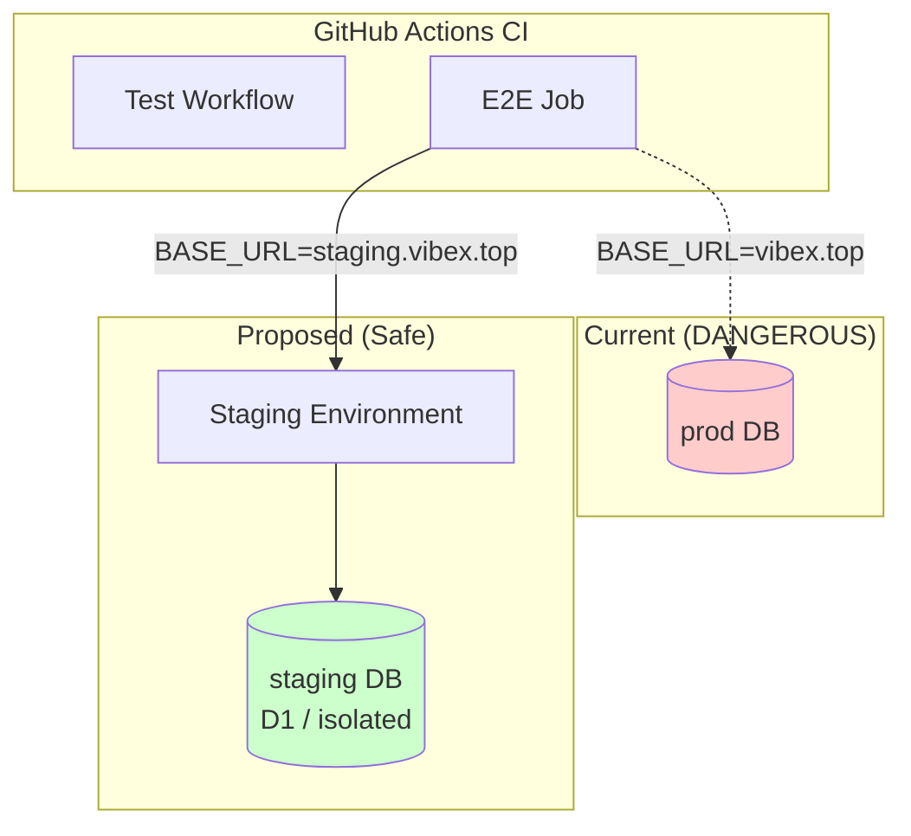
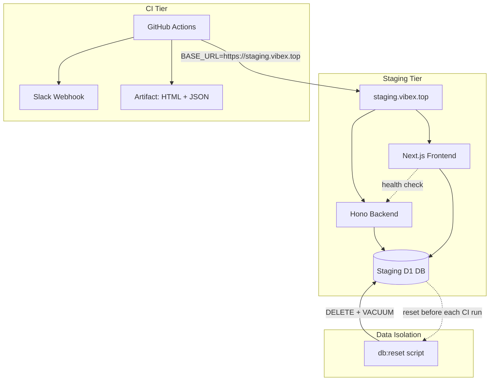
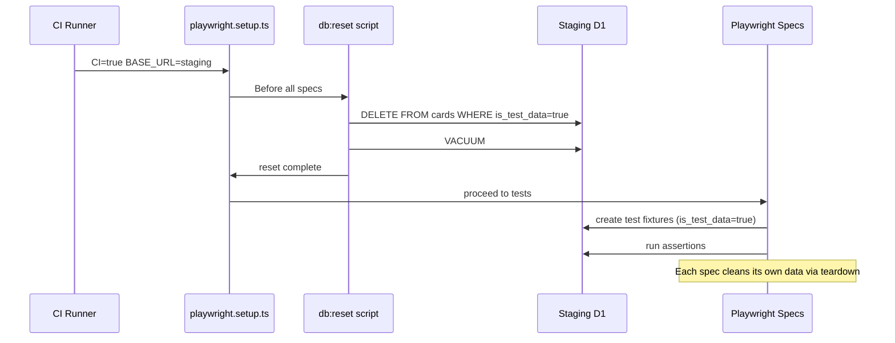
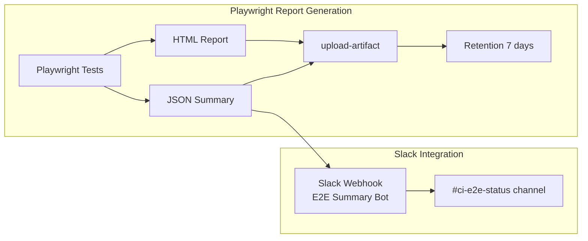

# VibeX Sprint 21 架构设计

**项目**: vibex-proposals-20260501-sprint21
**版本**: 1.0
**日期**: 2026-05-02
**架构师**: ARCHITECT
**功能**: P005-R E2E 测试环境隔离

---

## 执行决策

- **决策**: 已采纳
- **执行项目**: vibex-proposals-20260501-sprint21
- **执行日期**: 2026-05-02（arch 阶段完成）
- **总工时估算**: 7-9h（staging 部署 3h + CI 配置 2h + fixture 改造 2h + 验证 1h）

---

## 1. 问题分析

### 当前危险状态

```
.github/workflows/test.yml (line 192)
  BASE_URL: ${{ vars.BASE_URL || 'https://vibex.top' }}
```

**风险链条**:
1. CI E2E 写数据 → 写入 `vibex.top` 生产数据库 → 污染真实用户数据
2. 并发 PR 的 E2E 共享同一生产 DB → 竞态条件 → flaky 测试
3. `vibex.top` 不可用 → CI 全部失败 → 阻断所有 PR 合入
4. 无法在测试中重置用户状态 → 测试间相互污染

### 真实影响范围

- 当前仓库所有 PR 合入质量门禁
- `tests/e2e/` 下所有 Playwright spec
- `vibex-fronted/e2e/` 下 Canvas spec
- 约 20+ E2E 测试用例

---

## 2. 技术栈

| 技术 | 版本 | 选择理由 |
|-----|------|---------|
| Staging Subdomain | `staging.vibex.top` | 与生产同域同栈，真实端到端覆盖 |
| Cloudflare Tunnel / 独立部署 | 现有 infra | staging 入口，可通过 VPN 或 auth 保护 |
| D1 Database | 现有 | 已有 D1，staging 共享 schema，可独立清理 |
| Playwright | 现有 | 已有 `playwright.ci.config.ts`，复用配置 |
| SQLite VACUUM + FIXED | 现有 | fixture reset 方案，不改变现有 schema |
| GitHub Actions | 现有 | CI runtime 不变，只改 BASE_URL |
| Slack Webhook | 现有 | 复用现有 slack skill 通知能力 |

---

## 3. 架构图

### 3.1 系统总览



### 3.2 Staging 部署架构



### 3.3 Fixture Reset 数据流



### 3.4 CI Artifact 报告流程



---

## 4. 接口定义

### 4.1 环境变量接口

| 变量名 | 来源 | 用途 | 示例值 |
|--------|------|------|--------|
| `BASE_URL` | CI job env | E2E 测试目标 | `https://staging.vibex.top` |
| `STAGING_API_URL` | CI job env | Backend API 端点 | `https://api.staging.vibex.top` |
| `CI_STAGING_RESET` | CI job env | 是否在运行前 reset DB | `true` |

### 4.2 Playwright 配置接口

```typescript
// tests/e2e/playwright.ci.config.ts (现有文件，需新增)
interface StagingConfig {
  baseURL: string;                    // from process.env.BASE_URL
  retries: 3;                         // E4 Flaky governance
  workers: 1;                         // 单 worker，避免竞态
  reporter: [
    ['list'],
    ['html', { outputFolder: 'playwright-report' }],
    ['blob'],                          // for @playwright/test/reporter
  ];
  use: {
    baseURL: string;
    // 现有字段...
  };
}
```

### 4.3 DB Reset API（内部脚本）

```typescript
// scripts/e2e-db-reset.ts
interface ResetOptions {
  targetDB: 'staging' | 'local';
  markAsTestData?: boolean;  // 标记测试数据，selective delete
  vacuum?: boolean;           // 回收空间
}

// 调用: pnpm run e2e:db:reset --target=staging
```

### 4.4 Slack 报告摘要格式

```typescript
// scripts/e2e-summary-to-slack.ts
interface E2EReportSummary {
  run_id: string;
  total_tests: number;
  passed: number;
  failed: number;
  skipped: number;
  flaky: string[];       // 测试名称列表
  duration_ms: number;
  artifacts_url: string; // GitHub Actions artifact URL
}

// POST 到 Slack webhook
// 格式: 卡片消息，含 emoji 状态 + 摘要数字
```

---

## 5. 数据模型

### 5.1 测试数据隔离策略

**方案**: 软标记 + selective delete，不改变现有 schema。

```sql
-- 新增字段（可选，或通过 is_ prefixed 约定识别）
-- 实际实现：在 fixture creation 时带标记字段

-- 测试数据约定：
-- 1. 所有测试 fixture 创建时标记 timestamp + random suffix
-- 2. reset 脚本按时间戳删除过旧数据
-- 3. 或 reset 脚本按 fixture 标记字段删除

-- 示例: cards 表的测试数据
INSERT INTO cards (id, name, user_id, created_at)
VALUES (
  'test-card-' || :random_suffix,
  'E2E Test Card',
  'test-user-id',
  datetime('now')
);
-- reset 时: DELETE FROM cards WHERE name LIKE 'E2E Test Card%'
```

### 5.2 现有相关 Schema

```
cards
  id: text (PK)
  name: text
  user_id: text
  created_at: text
  updated_at: text

sessions
  id: text (PK)
  agent_id: text
  user_id: text
  created_at: text
```

---

## 6. 关键设计决策

### 决策 1: staging URL 是 subdomain 还是独立路径？

**选择**: `staging.vibex.top`（subdomain）

| 方案 | 优点 | 缺点 |
|------|------|------|
| `staging.vibex.top` | 同域同 cookie，同 API 接口，无需改动代码 | 需 DNS 配置 |
| `vibex.top/staging` | 无需 DNS | cookie 隔离复杂，URL 不一致 |

**代价**: 需 Cloudflare/域名配置一条 A/CNAME 记录。

### 决策 2: DB 隔离用独立 schema 还是 selective delete？

**选择**: selective delete（不改变 schema）

| 方案 | 优点 | 缺点 |
|------|------|------|
| 独立 D1 schema | 完全隔离，最安全 | D1 schema 管理成本高 |
| selective delete | 不改 schema，迁移简单 | reset 不干净（残留关系数据） |

**Trade-off**: 选 selective delete 是因为 P0 目标是"不污染生产"，staging DB 自己的残留数据不影响 CI 质量门禁的正确性。只要测试间不互相影响，staging 自己脏不是 blocker。

### 决策 3: BASE_URL 回退值是什么？

**当前**: `${{ vars.BASE_URL || 'https://vibex.top' }}` ❌

**改为**: `${{ vars.BASE_URL }}` 并强制要求 vars.BASE_URL 已设置，无回退值。

如果 staging 不可用，CI job 应该 fail-fast，不 fallback 到生产。

---

## 7. 性能影响评估

### 7.1 部署性能

| 操作 | 预估影响 | 说明 |
|------|---------|------|
| Staging 持续部署 | 现有 infra 成本 + 1x | 同等资源配置 |
| DB reset 脚本 | < 5s/次 | staging 数据量小，DELETE + VACUUM 快 |
| E2E 执行时间 | 无变化 | 测试逻辑不变，只改 BASE_URL |
| CI artifact 上传 | +5-15s | HTML 报告约 2-5MB |

### 7.2 风险

| 风险 | 影响 | 缓解 |
|------|------|------|
| staging 服务不稳定 | CI false positive | staging health check + retry |
| staging DB 持续增长 | reset 变慢 | 定期 vacuum + 容量监控 |
| staging 和 prod API 行为不一致 | 测试覆盖失效 | 每次 prod 发布同步到 staging |

---

## 8. 验收标准映射

| AC ID | 验收标准 | 验证方式 | 架构对应 |
|-------|---------|---------|---------|
| AC-1.1 | BASE_URL 不含 vibex.top | CI env inspection | `.github/workflows/test.yml` BASE_URL 变量 |
| AC-1.2 | staging 可访问 | HTTP health check | staging.vibex.top DNS + health endpoint |
| AC-1.3 | 数据隔离机制存在 | integration test | `e2e-db-reset.ts` 脚本 |
| AC-2.1 | CI E2E 成功率 >= 95% | CI history analysis | GitHub Actions history |
| AC-2.2 | 每个 spec 独立 fixture | code review | `playwright.setup.ts` |
| AC-2.3 | flaky 重试 <= 2 次 | CI config review | `playwright.ci.config.ts` retries: 3 |
| AC-3.1 | E2E 报告在 artifact | CI artifact inspection | `upload-artifact` step |
| AC-3.2 | Slack 查询 E2E 摘要 | integration test | `e2e-summary-to-slack.ts` |
| AC-4.1 | Canvas E2E 在 staging 通过 | e2e test run | `e2e/canvas.spec.ts` |
| AC-4.2 | Workbench E2E 通过 | e2e test run | `tests/e2e/workbench.spec.ts` |

---

## 9. 文件变更清单

| 文件 | 操作 | 说明 |
|------|------|------|
| `.github/workflows/test.yml` | 修改 | BASE_URL 改为 staging，移除生产 fallback |
| `tests/e2e/playwright.config.ts` | 不变 | 已支持 `process.env.BASE_URL` |
| `tests/e2e/playwright.ci.config.ts` | 不变 | 同上 |
| `scripts/e2e-db-reset.ts` | 新增 | DB reset 脚本 |
| `scripts/e2e-summary-to-slack.ts` | 新增 | Slack 报告摘要脚本 |
| `tests/e2e/playwright.setup.ts` | 修改 | 添加 fixture reset hook |
| `package.json` | 修改 | 添加 `e2e:db:reset` script |
| `.env.staging.example` | 新增 | staging 环境变量模板 |

---

## 执行决策

- **决策**: 已采纳
- **执行项目**: vibex-proposals-20260501-sprint21
- **执行日期**: 2026-05-02
- **阻塞项**: P003（Workbench 发版确认）等待 coord