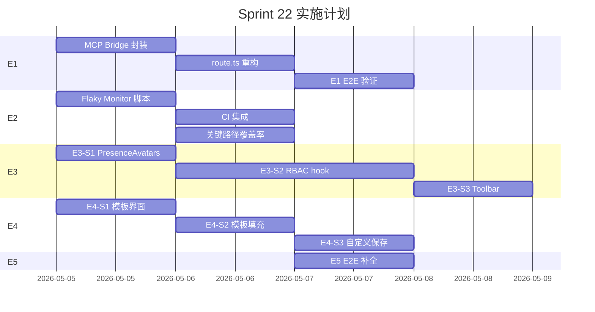

# VibeX Sprint 22 实施计划 — 5 Epic 并行实施

**项目**: vibex-proposals-20260502-sprint22
**版本**: 1.0
**日期**: 2026-05-02
**架构师**: ARCHITECT

---

## 1. 里程碑与时间线

| Epic | Stories | 工时 | 阶段顺序 |
|------|---------|------|---------|
| E1: Design Review MCP | E1-S1, E1-S2 | 3-5h | 并行 Sprint 22 全程 |
| E2: E2E 稳定性监控 | E2-S1, E2-S2 | 4h | Phase 2（依赖 S21 staging）|
| E3: Teams 协作 UI | E3-S1→S2→S3 | 9-12h | E3-S1 优先（低风险）|
| E4: 需求模板库 | E4-S1→S2→S3 | 5-7h | E4-S1 优先 |
| E5: Agent E2E | E5-S1→S2→S3 | 3h | 并行 Sprint 22 后期 |
| **Total** | **13 stories** | **24-31h** | |

**建议分期**:
- Sprint 22 阶段一（2 周）: E1 + E3-S1 + E4-S1 + E5（基础功能）
- Sprint 23 续做: E3-S2/S3 + E4-S2/S3 + E2（完整功能）

---

## 2. E1: Design Review MCP 真实调用

### 步骤 1.1: MCP Bridge 封装

```
文件: vibex-fronted/src/lib/mcp-bridge.ts (新增)

实现:
- spawn MCP server 子进程 (stdio mode)
- 封装 JSON-RPC tools/call 调用
- 处理超时（5s）+ 错误 + 进程退出

验证:
- pnpm exec ts-node --esm scripts/test-mcp-bridge.ts
- 预期: 返回 DesignReviewReport
```

### 步骤 1.2: 重构 route.ts

```
文件: vibex-fronted/src/app/api/mcp/review_design/route.ts

改动:
- 移除内联 checkDesignCompliance / checkA11yCompliance / analyzeComponentReuse
- 替换为 mcpBridge.callTool('review_design', request)

Graceful degradation:
- MCP 不可用 → catch → 调用内联静态分析（降级）
- 标记 mcp.called = false
- 返回结果中含 fallback: 'static-analysis'
```

### 步骤 1.3: E1-S2 E2E 验证

```
文件: tests/e2e/design-review-mcp.spec.ts (新增)

测试用例:
1. POST /api/mcp/review_design → 200 + mcp.called == true
2. MCP server down → 降级返回 200 + mcp.called == false
```

---

## 3. E2: E2E 稳定性监控

### 步骤 2.1: Flaky Monitor 脚本

```
文件: scripts/e2e-flaky-monitor.ts (新增)

输入: playwright-report/results.json
输出:
  - 控制台: 当前 run 的 flaky rate
  - Slack (连续 3 次失败): 告警消息

计算逻辑:
  flakyRate = stats.flaky / stats.total
  recentRuns.push(stats.failed > 0 ? 0 : 1)
  if (recentRuns.length > 5) recentRuns.shift()
  if (recentRuns.filter(r => r === 0).length >= 3) sendSlackAlert()
```

### 步骤 2.2: CI 集成

```
文件: .github/workflows/test.yml (e2e job, 末尾添加)

- name: Check E2E flaky rate
  if: always()
  run: pnpm run e2e:flaky:monitor
  env:
    SLACK_WEBHOOK_URL: ${{ secrets.SLACK_WEBHOOK_URL }}

package.json 添加:
  "e2e:flaky:monitor": "tsx scripts/e2e-flaky-monitor.ts"
```

### 步骤 2.3: 关键路径覆盖率提升

```
新增: tests/e2e/critical-path/canvas-crud.spec.ts

覆盖:
- Canvas 创建卡片
- Canvas 编辑卡片
- Canvas 删除卡片
- API 调用（chapter save/load）

运行覆盖率:
  pnpm exec playwright show-report --config=playwright.ci.config.ts
  # 或使用 playwright-coverage 插件
```

---

## 4. E3: Teams 协作 UI

### 步骤 3.1: E3-S1 PresenceAvatars 团队标识

```
文件: vibex-fronted/src/components/canvas/Presence/PresenceAvatars.tsx

改动:
1. props 新增 showTeamBadge, teamMemberIds
2. 从 API 获取: GET /v1/teams/:teamId/members → memberIds[]
3. CSS:
   - 团队成员: 绿色边框 (border: 2px solid #10b981)
   - 访客: 灰色边框 (border: 1px solid #d1d5db)

集成点:
  DDSCanvasPage.tsx:
    <PresenceAvatars
      canvasId={projectId}
      showTeamBadge={true}
      teamMemberIds={teamMembers.map(m => m.userId)}
    />
```

### 步骤 3.2: E3-S2 RBAC 按钮控制

```
文件: vibex-fronted/src/hooks/useCanvasRBAC.ts (新增)

interface RBACResult {
  canDelete: boolean;  // owner only
  canShare: boolean;   // owner + member
  canEdit: boolean;    // owner + member
  canView: boolean;    // all
  loading: boolean;
}

逻辑:
1. 获取当前用户 role: authStore.userRole
2. 获取项目 teamId: projectStore.project?.teamId
3. 调用: GET /v1/teams/:teamId/members
4. 检查: userId in members → role → permissions
5. 缓存: 同一 projectId 5 分钟内不重复请求

文件: vibex-fronted/src/components/dds/toolbar/DDSToolbar.tsx

改动:
- import { useCanvasRBAC } from '@/hooks/useCanvasRBAC'
- 按钮 disabled 逻辑:
  deleteBtn.disabled = !rbac.canDelete
  deleteBtn.title = rbac.canDelete ? '' : '需要 Owner 权限'
```

### 步骤 3.3: E3-S3 Toolbar 成员列表

```
文件: vibex-fronted/src/components/dds/toolbar/DDSToolbar.tsx

新增:
- 团队成员头像堆叠组件（复用 PresenceAvatars 逻辑）
- 在线成员排前，离线成员排后
- 显示: 最多 5 个 + overflow 数字

data-testid: team-member-stack
```

---

## 5. E4: 需求模板库

### 步骤 4.1: E4-S1 模板选择界面

```
文件: public/data/industry-templates.json (新增)

模板内容:
1. SaaS 产品设计
   - requirement: "## 用户\n- 角色：管理员/用户\n- 核心需求：...\n## 场景\n...\n## 目标\n..."
2. 移动端 App
3. 电商平台
4. 空白 (blank)

文件: vibex-fronted/src/components/dashboard/NewProjectModal.tsx

改动:
- 添加 TemplateSelectStep (modal step)
- data-testid="template-select-modal"
- data-testid="template-option" (×4)
- 步骤: 选择模板 → 填写项目名 → 确认创建
```

### 步骤 4.2: E4-S2 模板自动填充

```
文件: vibex-fronted/src/hooks/useTemplates.ts (新增)

函数:
  useTemplates(): { templates, customTemplates, selectTemplate, saveAsTemplate }

文件: vibex-fronted/src/components/chapters/ChapterPanel.tsx

改动:
- onTemplateSelect(templateId): 自动填充 requirement 内容
- 填充内容包含结构化字段: 用户/场景/目标/约束

data-testid="requirement-chapter"
```

### 步骤 4.3: E4-S3 自定义模板保存

```
文件: vibex-fronted/src/hooks/useTemplates.ts

localStorage key: 'vibex:customTemplates'

操作:
  saveAsTemplate(name: string, chapters: Record<string, string>)
  → localStorage.setItem('vibex:customTemplates', JSON.stringify([...existing, newTemplate]))

data-testid="save-as-template-btn"
```

### E4 完成状态

| Unit | 状态 | 验证 |
|------|------|------|
| E4-S1 模板选择界面 | :white_check_mark: 已完成 | NewProjectModal.tsx + industry-templates.json |
| E4-S2 模板自动填充 | :white_check_mark: 已完成 | ChapterPanel.tsx + useTemplates.ts |
| E4-S3 自定义模板保存 | :white_check_mark: 已完成 | saveAsTemplate + save-as-template-btn |

---

## 6. E5: Agent E2E 路径补全

### 步骤 5.1: E5-S1 Agent 超时降级

```
文件: tests/e2e/agent-timeout.spec.ts (新增)

测试步骤:
1. 使用 mock server 使 /api/agent/sessions 返回 503
2. 触发新 agent 会话
3. 验证: [data-testid="agent-error-message"] 可见
4. 验证: 错误消息匹配 /暂不可用|超时/i
```

### 步骤 5.2: E5-S2 会话列表 UI

```
文件: tests/e2e/agent-sessions.spec.ts (新增)

测试步骤:
1. 创建 2 个 agent 会话
2. 验证: [data-testid="agent-session-item"] 数量 = 2
3. 验证: 会话名称/时间戳正确显示
```

### 步骤 5.3: E5-S3 会话删除

```
文件: tests/e2e/agent-sessions.spec.ts (新增)

测试步骤:
1. 创建 1 个 agent 会话
2. 点击删除按钮
3. 等待 DELETE /api/agent/sessions/:id 响应
4. 验证: session item 数量 -1
```

---

## 7. 回滚计划

| Epic | 风险 | 回滚动作 |
|------|------|---------|
| E1 | MCP server 不稳定 | 降级到内联静态分析（已在代码中实现）|
| E2 | Flaky monitor false alert | 注释 CI step，flaky rate 监控下线 |
| E3 | RBAC hook 破坏现有功能 | 禁用 `useCanvasRBAC`，按钮恢复默认状态 |
| E4 | 模板加载失败 | 回退到无模板的空白创建流程 |
| E5 | E2E 破坏 CI stability | 禁用新 E2E spec，单独运行验证 |

---

## 8. 依赖关系图



---

## 9. 测试用例清单

| ID | Epic | 用例 | 验证方式 | 负责人 |
|----|------|------|---------|--------|
| TC-E1-1 | E1 | MCP bridge 调用成功 | unit test | Dev |
| TC-E1-2 | E1 | MCP 不可用降级 | manual + unit | Dev |
| TC-E1-3 | E1 | E2E 覆盖 MCP 路径 | e2e run | Tester |
| TC-E2-1 | E2 | flaky rate 计算正确 | CI log inspection | DevOps |
| TC-E2-2 | E2 | Slack 告警触发 | CI + manual | DevOps |
| TC-E2-3 | E2 | 覆盖率 >= 80% | coverage report | Tester |
| TC-E3-1 | E3 | 团队/访客边框区分 | visual test | Tester |
| TC-E3-2 | E3 | 权限按钮 disable | e2e test | Tester |
| TC-E3-3 | E3 | 403 响应拦截 | e2e test | Tester |
| TC-E4-1 | E4 | 模板 modal 显示 4 选项 | e2e test | Tester |
| TC-E4-2 | E4 | requirement 自动填充 | e2e test | Tester |
| TC-E4-3 | E4 | 自定义模板保存到 ls | e2e test | Tester |
| TC-E5-1 | E5 | 超时错误消息可见 | e2e test | Tester |
| TC-E5-2 | E5 | 多会话列表 UI | e2e test | Tester |
| TC-E5-3 | E5 | 会话删除成功 | e2e test | Tester |