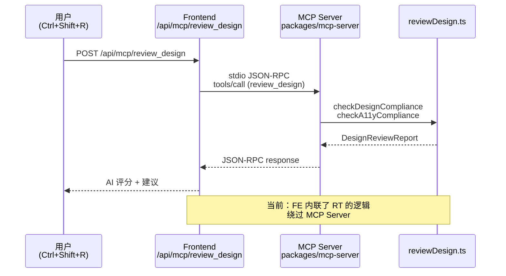
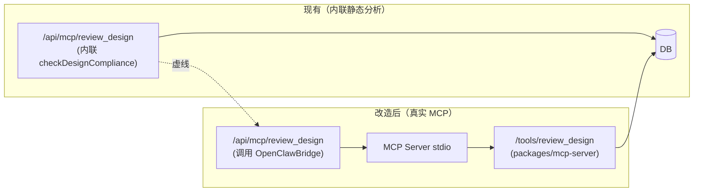
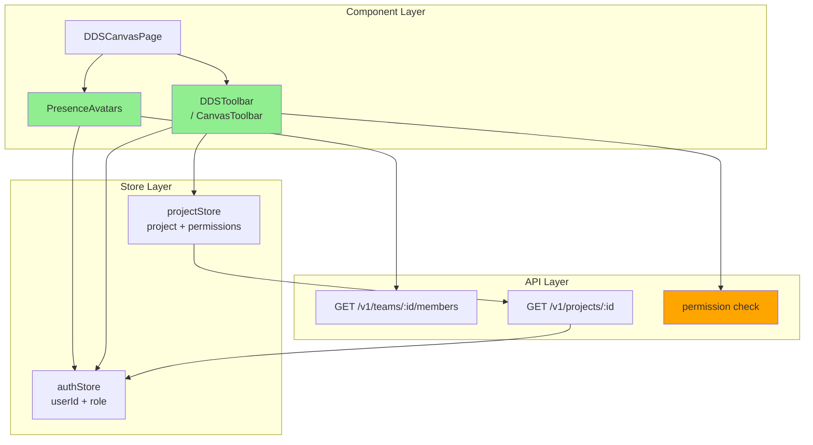

# VibeX Sprint 22 架构设计

**项目**: vibex-proposals-20260502-sprint22
**版本**: 1.0
**日期**: 2026-05-02
**架构师**: ARCHITECT
**功能**: E1 Design Review 真实 MCP + E2 E2E 稳定性 + E3 Teams 协作 UI + E4 模板库 + E5 Agent E2E

---

## 执行决策

- **决策**: 已采纳
- **执行项目**: vibex-proposals-20260502-sprint22
- **执行日期**: 2026-05-02（arch 阶段完成）
- **总工时估算**: 26-33h（5 Epic x 故事数分解）
- **E3 风险**: E3-S2 跨 store 权限同步复杂，建议优先 E3-S1

---

## 1. 技术栈

| 技术 | 版本 | 选择理由 |
|-----|------|---------|
| Next.js 15 App Router | 现有 | `/api/mcp/review_design` 路由宿主 |
| MCP Server (packages/mcp-server) | 现有 | S20 已接入，提供 `/tools/review_design` |
| OpenClaw sessions_spawn | 现有 | Agent 真实接入（S20） |
| Hono | 现有 | Backend 路由框架 |
| D1 / SQLite | 现有 | 数据存储 |
| Playwright | 现有 | E2E + CI gate |
| localStorage | 现有 | 模板存储（E4-S3） |
| Firebase Realtime DB | 现有 | PresenceAvatars 在线状态（S14） |

---

## 2. 架构图

### 2.1 系统总览（5 Epic）

```mermaid
graph TB
    subgraph "Frontend (Next.js 15)"
        DRP[DesignReviewPanel<br/>E1]
        TMPL[NewProjectModal<br/>E4]
        TEAM_UI[DDSToolbar<br/>DDSCanvasPage<br/>E3]
        AGENT_UI[AgentSessions UI<br/>E5]
    end

    subgraph "API Layer"
        DR[/api/mcp/review_design]
        TEAM[/v1/teams/*]
        AGENT[/api/agent/*]
    end

    subgraph "MCP Server"
        MCPS[MCP Server stdio]
        RPT[reviewDesign.ts]
        RPT --> MCPS
    end

    subgraph "Backend (Hono)"
        TEAM_SVC[TeamService]
        AGENT_SVC[AgentService]
    end

    subgraph "Data Layer"
        DB[(D1/SQLite)]
        FB[(Firebase<br/>Presence)]
        LS[(localStorage<br/>Templates)]
    end

    DRP --> DR
    DR --> MCPS
    DR -.->|graceful fallback| DRP
    TMPL -.->|save/load| LS
    TEAM_UI --> TEAM
    TEAM --> TEAM_SVC
    TEAM_SVC --> DB
    TEAM_UI --> FB
    AGENT_UI --> AGENT
    AGENT --> AGENT_SVC
    AGENT_SVC --> DB
```

### 2.2 E1: Design Review MCP 真实调用链路

**现状问题**: `/api/mcp/review_design` 使用内联静态分析，非真实 MCP 调用。



**改造方案**: 重构 `route.ts`，通过 OpenClawBridge 调用真实 MCP。



### 2.3 E3: Teams 协作 UI 分层架构



### 2.4 E4: 模板库数据流

```mermaid
graph LR
    subgraph "NewProjectModal"
        NPT[Template Selector]
        NPB[Confirm Button]
    end

    subgraph "Templates"
        TM[industry_templates.json]
        CM[custom_templates<br/>(localStorage)]
    end

    subgraph "ChapterPanel"
        CP[Requirement Chapter<br/>Auto-filled content]
    end

    NPT -->|select| TM
    NPT -->|select user-defined| CM
    NPB -->|fill| CP
    NPT -->|save new| CM

    style TM fill:#B8D4FF
    style CM fill:#FFE4B5
```

---

## 3. 接口定义

### 3.1 E1: Design Review 接口

```typescript
// POST /api/mcp/review_design
// 改造前：内联静态分析
// 改造后：通过 OpenClawBridge 调用 MCP server

interface ReviewDesignRequest {
  canvasId: string;
  nodes?: Array<Record<string, unknown>>;
  checkCompliance?: boolean;
  checkA11y?: boolean;
  checkReuse?: boolean;
}

interface ReviewDesignResponse {
  canvasId: string;
  reviewedAt: string;
  summary: {
    compliance: 'pass' | 'warn' | 'fail';
    a11y: 'pass' | 'warn' | 'fail';
    reuseCandidates: number;
    totalNodes: number;
  };
  designCompliance?: ComplianceResult;
  a11y?: A11yResult;
  reuse?: ReuseResult;
  // 新增：MCP 调用元数据
  mcp?: {
    called: boolean;
    tool?: string;
    error?: string;
  };
}

// MCP Bridge 接口 (via stdio JSON-RPC)
interface MCPToolCall {
  jsonrpc: '2.0';
  id: number;
  method: 'tools/call';
  params: {
    name: 'review_design';
    arguments: ReviewDesignRequest;
  };
}

// Graceful degradation: MCP 不可用时返回降级结果
interface FallbackResponse extends ReviewDesignResponse {
  mcp: { called: false; error: string; fallback: 'static-analysis' };
  summary: { compliance: 'pass'; a11y: 'pass'; reuseCandidates: 0; totalNodes: 0 };
  designCompliance: ComplianceResult;
  a11y: A11yResult;
  reuse: ReuseResult;
}
```

### 3.2 E3: Teams 协作 UI 接口

```typescript
// PresenceAvatars 扩展
interface PresenceAvatarProps {
  canvasId: string;
  maxDisplay?: number;
  showTeamBadge?: boolean;  // 新增：显示团队成员徽章
  teamMemberIds?: string[];  // 新增：团队成员 ID 列表
}

interface TeamMemberBadge {
  userId: string;
  role: 'owner' | 'member' | 'viewer';
  status: 'online' | 'offline';
}

// DDSToolbar RBAC 按钮控制
interface CanvasRBACButton {
  testId: string;
  action: 'delete' | 'share' | 'edit' | 'export';
  requiredRole: 'owner' | 'member' | 'viewer';
  disabledTooltip: string;
}

// GET /v1/teams/:teamId/members
interface TeamMembersResponse {
  members: Array<{
    userId: string;
    name: string;
    role: 'owner' | 'member';
    joinedAt: string;
  }>;
}

// 页面权限检查 Hook
// useCanvasRBAC(projectId: string): { canDelete, canShare, canEdit, loading }
```

### 3.3 E4: 模板库接口

```typescript
// industry_templates.json
interface IndustryTemplate {
  id: string;
  name: string;           // "SaaS 产品设计"
  description: string;
  chapters: {
    requirement: string;  // 预填充的 requirement 内容
    architecture: string;  // 空或引导性内容
    [key: string]: string;
  };
}

// localStorage key: 'vibex:customTemplates'
interface CustomTemplate {
  id: string;
  name: string;
  createdAt: string;
  chapters: Record<string, string>;
  source: 'user' | 'ai';
}

// API: 无后端存储，纯前端 localStorage
// templates.list(): IndustryTemplate[]
// templates.listCustom(): CustomTemplate[]
// templates.saveCustom(template: Omit<CustomTemplate, 'id' | 'createdAt'>): CustomTemplate
```

### 3.4 E2: E2E 稳定性监控接口

```typescript
// CI job 新增 step: e2e-flaky-monitor
interface FlakyMonitorConfig {
  ciReportPath: string;        // playwright-report/results.json
  alertThresholdRate: number;  // 0.05 (5%)
  consecutiveAlerts: number;   // 3 (连续 3 次失败触发 Slack)
  slackWebhookUrl: string;
}

interface E2EReport {
  stats: {
    total: number;
    passed: number;
    failed: number;
    skipped: number;
    flaky: number;  // Playwright 自动标记
    duration: number;
  };
  retries: number;
}

// e2e-flaky-monitor.ts 输出
interface FlakyAlert {
  flakyRate: number;
  isAboveThreshold: boolean;
  alertSent: boolean;
  details: {
    flakyTests: string[];
    recentRuns: number[];  // 最近 5 次 run 的结果 (1=pass, 0=fail)
  };
}
```

### 3.5 E5: Agent E2E 接口

```typescript
// Agent API 端点（已有，补充 E2E 覆盖）
// GET  /api/agent/sessions
// POST /api/agent/sessions
// DELETE /api/agent/sessions/:id

// 新增 E2E 测试覆盖：
// 1. Agent 超时降级 (backend unavailable)
// 2. 多会话列表 UI
// 3. 会话删除

interface AgentSession {
  id: string;
  name: string;
  createdAt: string;
  status: 'active' | 'completed' | 'failed';
  messageCount: number;
}
```

---

## 4. 数据模型

### 4.1 新增字段

```sql
-- 无需修改现有 schema
-- E3 依赖 Teams 和 Projects 已有字段
-- E4 使用 localStorage，无 DB 变更
-- E5 Agent sessions 已有 schema
```

### 4.2 现有相关 Schema

```typescript
// teams/members 关系
// projects + team_access (E3-S2 RBAC 权限检查)

// 关键: projectStore 需要暴露 permissions 字段
interface Project {
  id: string;
  name: string;
  ownerId: string;
  teamId?: string;        // 关联的 team（可选）
  permissions?: {
    canDelete: boolean;
    canShare: boolean;
    canEdit: boolean;
  };
}
```

---

## 5. 关键设计决策

### 决策 1: MCP Bridge 用 stdio 还是 HTTP?

**选择**: stdio（通过 `openclaw sessions_spawn` 或子进程）

| 方案 | 优点 | 缺点 |
|------|------|------|
| stdio (JSON-RPC) | S20 已验证，最直接 | 需要管理进程生命周期 |
| HTTP (localhost) | 简单，debug 方便 | 需要额外端口管理 |

**Trade-off**: S20 的 OpenClawBridge 使用 stdio 模式，复用已有模式更安全。stdio 需要处理进程启动/错误/超时，但 MCP server 已作为独立 package 存在。

### 决策 2: E3-S2 权限检查放前端还是后端?

**选择**: 前后端双重检查

| 位置 | 前端 | 后端 |
|------|------|------|
| 目的 | UX：立即 disable 按钮 | 安全：API 拦截越权 |
| 实现 | `useCanvasRBAC` hook | `/v1/projects/:id` 返回 permissions |

**Trade-off**: 前端 disable 按钮提升 UX（用户不会点击后看到 403），后端拦截是安全底线。两者都要。

### 决策 3: E4 模板存储用 localStorage 还是 DB?

**选择**: localStorage（阶段一）

| 方案 | 优点 | 缺点 |
|------|------|------|
| localStorage | 无后端变更，快速上线 | 不跨设备同步 |
| DB (D1) | 持久化，跨设备 | 增加后端工作量 |

**Trade-off**: E4-S3 是"用户可选保存"，不是核心功能。localStorage 可快速验证产品方向，后续需要跨设备时再迁 DB。

### 决策 4: E3 优先级——E3-S1 vs E3-S2 哪个先？

**选择**: E3-S1 优先（PresenceAvatars 改动小，风险低）

**理由**: E3-S2 需要跨 store 权限同步（authStore + projectStore），影响现有组件行为。E3-S1 只改 PresenceAvatars CSS，风险可控。

---

## 6. 性能影响评估

### 6.1 E1: MCP 调用延迟

| 指标 | 当前（内联） | 改造后（stdio MCP） | 影响 |
|------|------------|------------------|------|
| P50 延迟 | < 50ms | 50-200ms | 略有增加（stdio 进程开销）|
| P99 延迟 | < 100ms | 200-500ms | MCP 工具链复杂度影响 |
| 降级 | 无 | "Design Review 暂不可用" | 改善用户体验 |

### 6.2 E3: Teams UI 渲染

| 指标 | 影响 | 说明 |
|------|------|------|
| PresenceAvatars 渲染 | 无变化 | CSS class 切换，无重渲染 |
| Toolbar RBAC 检查 | +1 API call | 可缓存，impact 极小 |

### 6.3 E4: 模板加载

| 指标 | 影响 | 说明 |
|------|------|------|
| 首屏加载 | +5KB (模板 JSON) | lazy load，不影响首屏 |
| localStorage 读写 | < 10ms | 纯前端，极快 |

### 6.4 E5: Agent E2E

| 指标 | 影响 | 说明 |
|------|------|------|
| CI 执行时间 | +3-5 分钟 | 3 个新 E2E spec，约 30-40 个用例 |

---

## 7. 验收标准映射

| Story | 验收标准 | 验证方式 | 架构对应 |
|-------|---------|---------|---------|
| E1-S1 | AI 评分存在 + 降级提示 | unit test + manual | `/api/mcp/review_design` 改造 |
| E1-S2 | toolsCalled 含 review_design | e2e test | CI E2E job |
| E2-S1 | flakyRate < 5% + Slack 告警 | CI monitoring | `e2e-flaky-monitor.ts` |
| E2-S2 | 关键路径覆盖率 >= 80% | coverage report | `tests/e2e/critical-path/` |
| E3-S1 | team/guest 边框区分 | visual test | PresenceAvatars CSS |
| E3-S2 | 按钮 disable + 403 response | e2e test | `useCanvasRBAC` hook |
| E3-S3 | member count 匹配 | unit test | DDSToolbar |
| E4-S1 | modal visible + 4 options | e2e test | NewProjectModal |
| E4-S2 | requirement 含结构化字段 | e2e test | ChapterPanel |
| E4-S3 | localStorage 包含模板 | e2e test | ChapterPanel |
| E5-S1 | error message 可见 | e2e test | AgentSessions UI |
| E5-S2 | session count = 2 | e2e test | AgentSessions UI |
| E5-S3 | session count - 1 | e2e test | AgentSessions UI |

---

## 8. 文件变更清单

### E1: Design Review MCP（2 文件）

| 文件 | 操作 | 说明 |
|------|------|------|
| `vibex-fronted/src/app/api/mcp/review_design/route.ts` | 重构 | 通过 MCP bridge 调用真实 tool |
| `tests/e2e/design-review-mcp.spec.ts` | 新增 | E1-S2 E2E 验证 |

### E2: E2E 稳定性监控（2 文件）

| 文件 | 操作 | 说明 |
|------|------|------|
| `scripts/e2e-flaky-monitor.ts` | 新增 | flaky rate 计算 + Slack 告警 |
| `.github/workflows/test.yml` | 修改 | e2e job 中调用 flaky monitor |

### E3: Teams 协作 UI（4 文件）

| 文件 | 操作 | 说明 |
|------|------|------|
| `vibex-fronted/src/components/canvas/Presence/PresenceAvatars.tsx` | 修改 | 添加 team badge |
| `vibex-fronted/src/components/dds/toolbar/DDSToolbar.tsx` | 修改 | 添加 team member stack |
| `vibex-fronted/src/hooks/useCanvasRBAC.ts` | 新增 | 权限检查 hook |
| `tests/e2e/teams-canvas-rbac.spec.ts` | 新增 | E3 E2E 测试 |

### E4: 模板库（5 文件）

| 文件 | 操作 | 说明 |
|------|------|------|
| `public/data/industry-templates.json` | 新增 | 3 个行业模板 |
| `vibex-fronted/src/components/dashboard/NewProjectModal.tsx` | 修改 | 添加模板选择 |
| `vibex-fronted/src/hooks/useTemplates.ts` | 新增 | 模板管理 hook |
| `tests/e2e/template-library.spec.ts` | 新增 | E4 E2E 测试 |

### E5: Agent E2E（2 文件）

| 文件 | 操作 | 说明 |
|------|------|------|
| `tests/e2e/agent-timeout.spec.ts` | 新增 | E5-S1 |
| `tests/e2e/agent-sessions.spec.ts` | 新增 | E5-S2 + E5-S3 |

---

## 执行决策

- **决策**: 已采纳
- **执行项目**: vibex-proposals-20260502-sprint22
- **执行日期**: 2026-05-02