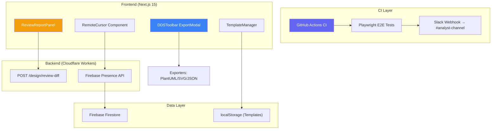
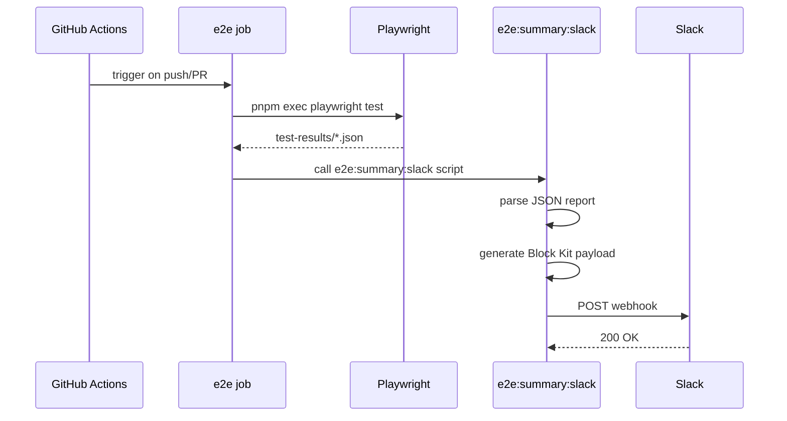
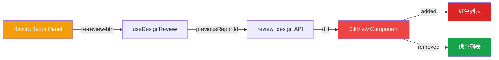
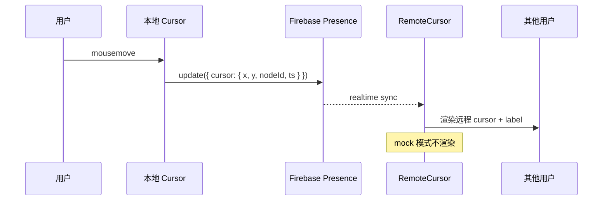
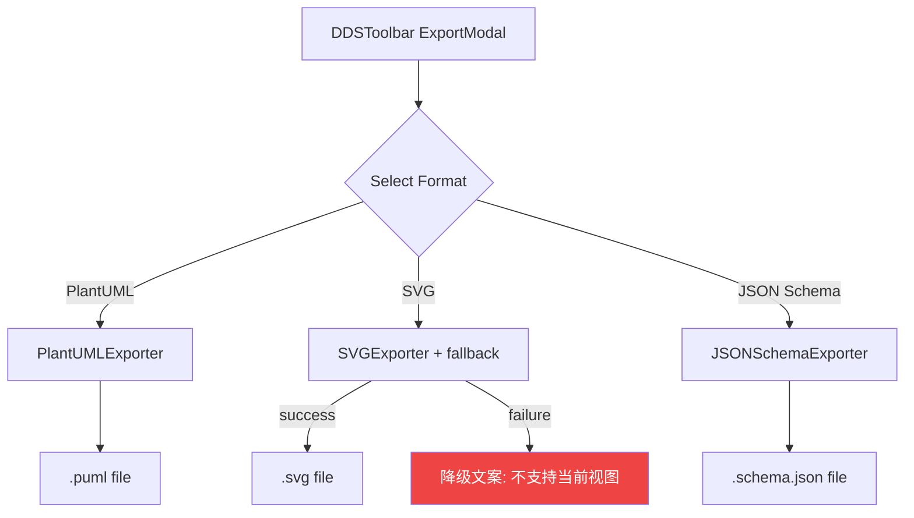

# VibeX Sprint 23 架构设计

**项目**: vibex-proposals-sprint23
**架构师**: Architect Agent
**日期**: 2026-05-03
<!-- /autoplan restore point: /root/.gstack/projects/MMXC-vibex/main-autoplan-restore-20260503-034209.md -->
<!-- /autoplan: RUNNING — initiated 2026-05-03T03:42:00Z -->

---

## 1. 执行决策

- **决策**: 待评审
- **执行项目**: 无
- **执行日期**: 待定

---

## 2. 技术栈

| Epic | 技术选型 | 版本 | 选择理由 |
|------|---------|------|---------|
| E1 Slack 报告 | @slack/web-api / Incoming Webhook | 最新 | CI 环境轻量集成，无需 SDK |
| E2 Design Review diff | React diff 算法 + CSS Modules | 现有 | 复用现有 ReviewReportPanel，轻量化 |
| E3 Firebase Cursor | firebase + Custom Hook | 现有 firebase v10 | 复用 presence.ts 基础设施 |
| E4 导出格式 | PlantUML.js + 原生 SVG Serializer | 稳定版 | 无需额外依赖，Node/Browser 兼容 |
| E5 模板版本 | localStorage + JSON | 现有 | 避免后端依赖，Phase 1 本地优先 |

---

## 3. 架构图

### 3.1 Sprint 23 整体架构



### 3.2 E1: E2E CI → Slack 报告链路



### 3.3 E2: Design Review 重评 + Diff 视图



### 3.4 E3: Firebase Cursor Sync



### 3.5 E4: 导出格式扩展



### 3.6 E5: 模板版本历史

```mermaid
graph LR
    A[TemplateManager] --> B[localStorage]
    B -->|snapshots| C[History Panel (≤10)]
    A -->|export| D[JSON file download]
    A -->|import| E[File input → JSON parse]
    
    style B fill:#8b5cf6,color:#fff
    style C fill:#a78bfa,color:#fff
```

---

## 4. 数据模型

### 4.1 Firebase Cursor Presence

```typescript
interface CursorPresence {
  cursor: {
    x: number;
    y: number;
    nodeId: string | null;
    timestamp: number;
  };
  user: {
    id: string;
    name: string;
    avatar?: string;
  };
}

// Throttle: 100ms debounce write
// Mock 模式: RemoteCursor 不渲染
```

### 4.2 Template Version Snapshot

```typescript
interface TemplateSnapshot {
  id: string;
  version: number;
  createdAt: number;
  data: TemplateData;
  label?: string; // 可选用户标注
}

interface TemplateStore {
  snapshots: TemplateSnapshot[]; // 最多 10 个
  current: TemplateData;
}

// Key: `template:${templateId}:history`
```

### 4.3 Review Diff Model

```typescript
interface ReviewDiffResult {
  reportId: string;
  previousReportId: string;
  diff: {
    added: ReviewItem[];
    removed: ReviewItem[];
    unchanged: ReviewItem[];
  };
  summary: {
    totalAdded: number;
    totalRemoved: number;
    scoreDelta: number; // 新评分 - 旧评分
  };
}
```

---

## 5. API 定义

### 5.1 Slack 报告脚本 (E1)

```typescript
// scripts/e2e-summary-slack.ts (CI 执行)
interface E2EReportPayload {
  passed: number;
  failed: number;
  skipped: number;
  duration: number; // ms
  artifacts: string; // 报告链接
  runUrl: string;
  timestamp: string;
}

// 输出: Slack Block Kit message
// POST $SLACK_WEBHOOK_URL
```

### 5.2 Design Review Diff API (E2)

```yaml
/design/review-diff:
  post:
    tags: [Design]
    summary: 对比两次 Design Review 报告，返回 diff
    requestBody:
      required: true
      content:
        application/json:
          schema:
            type: object
            required: [canvasId, previousReportId]
            properties:
              canvasId:
                type: string
                description: Canvas ID
              previousReportId:
                type: string
                description: 上一次评审报告 ID
    responses:
      '200':
        description: Diff 结果
        content:
          application/json:
            schema:
              $ref: '#/components/schemas/ReviewDiffResult'
```

### 5.3 Template API (E5)

```yaml
# 无需新增后端 API
# Phase 1 使用 localStorage + JSON export/import
# Phase 2 (Sprint 24+) 新增后端存储 + 分享 link
```

---

## 6. 接口契约

### 6.1 RemoteCursor 组件

```typescript
// src/components/presence/RemoteCursor.tsx
interface RemoteCursorProps {
  userId: string;
  userName: string;
  position: { x: number; y: number };
  nodeId?: string | null;
  isMockMode?: boolean; // Firebase mock 时不渲染
}

// 使用场景: Canvas 画布内渲染其他用户 cursor icon + username label
// Throttle: 100ms mouse move events → Firebase write
```

### 6.2 DDSToolbar ExportModal 扩展

```typescript
// src/components/dds/DDSToolbar.tsx
type ExportFormat = 'png' | 'svg' | 'plantuml' | 'schema';

// export 触发下载，无后端依赖
// SVG fallback: try-catch，失败显示降级文案
```

### 6.3 TemplateManager 导出/导入

```typescript
// src/hooks/useTemplateManager.ts
interface TemplateManagerAPI {
  exportTemplate(templateId: string): void; // download JSON
  importTemplate(file: File): Promise<TemplateData>;
  getHistory(templateId: string): TemplateSnapshot[];
  createSnapshot(templateId: string, label?: string): void;
}

// localStorage key: `template:${id}:history`
// max 10 snapshots，超出时删除最旧
```

---

## 7. 性能影响评估

| Epic | 性能影响 | 缓解措施 |
|------|---------|---------|
| E1 Slack 报告 | CI 延迟 +3~5s（解析 JSON + Webhook 调用） | 异步执行，不阻塞 CI exit code |
| E2 diff 视图 | 客户端 diff 计算 < 50ms（数据量小） | 前端计算，无后端负载 |
| E3 Firebase cursor | 每用户 100ms throttle，降低写入频率 | mock 模式关闭渲染，减少 DOM 操作 |
| E4 导出 | PlantUML/SVG 导出 < 200ms（同步） | SVG 降级文案异步显示 |
| E5 模板历史 | localStorage 读取 < 10ms | 限制 10 个 snapshot，避免存储膨胀 |

**总体评估**: Sprint 23 新增功能对性能影响极小，均为客户端计算或轻量 Webhook 调用。

---

## 8. 兼容性设计

### 8.1 现有架构兼容

- **E1**: 仅修改 CI workflow，不触碰前端代码
- **E2**: ReviewReportPanel 扩展，props 兼容
- **E3**: Firebase presence 字段扩展，向后兼容
- **E4**: DDSToolbar ExportModal 扩展选项，不改现有格式
- **E5**: localStorage 隔离存储，不影响现有数据

### 8.2 Firebase Mock 模式

```typescript
// firebaseMock.ts 已实现
// mock 模式下 RemoteCursor 组件不渲染
// 通过 isMockMode prop 控制
```

### 8.3 不引入新依赖

| Epic | 依赖 | 说明 |
|------|------|------|
| E1 | @slack/webhook 或 fetch | Node 内置无需安装 |
| E2 | react-diff 库 | 使用原生算法或轻量库 |
| E3 | firebase | 已有 |
| E4 | @plantuml/encoder 或手写 | 已有 或 内联实现 |
| E5 | 无 | localStorage 原生 |

---

## 9. 测试策略

### 9.1 测试框架

| 层级 | 框架 | 覆盖率目标 |
|------|------|-----------|
| 单元测试 | Jest | > 80% |
| 组件测试 | React Testing Library | > 80% |
| E2E 测试 | Playwright | 覆盖全部 5 Epic |

### 9.2 核心测试用例

```typescript
// E1: Slack 报告
describe('E2E Slack Reporter', () => {
  it('should parse Playwright JSON and generate Block Kit', () => {
    // 读取 test-results/*.json
    // 生成 pass/fail 摘要 + 失败用例列表
  });
  it('should POST to Slack webhook with correct payload', () => {
    // mock fetch
    // 验证 payload 格式
  });
});

// E2: Design Review diff
describe('ReviewReportPanel', () => {
  it('should show re-review-btn', () => {
    expect(screen.getByTestId('re-review-btn')).toBeVisible();
  });
  it('should render diff with red/green items', () => {
    expect(screen.getByTestId('diff-item-added')).toHaveClass(/text-red/);
    expect(screen.getByTestId('diff-item-removed')).toHaveClass(/text-green/);
  });
});

// E3: RemoteCursor
describe('RemoteCursor', () => {
  it('should render cursor icon + username', () => {
    expect(RemoteCursor).toBeInTheDocument();
    expect(screen.getByText(/username/)).toBeInTheDocument();
  });
  it('should not render in mock mode', () => {
    render(<RemoteCursor isMockMode={true} />);
    expect(screen.queryByTestId('remote-cursor')).not.toBeInTheDocument();
  });
});

// E4: Export formats
describe('DDSToolbar Export', () => {
  it('should export .puml file', () => {
    userEvent.click(screen.getByTestId('plantuml-option'));
    expect(downloadedFile.name).toMatch(/\.puml$/);
  });
  it('should show fallback message on SVG failure', () => {
    // mock SVG failure
    expect(screen.getByText(/当前视图不支持/)).toBeVisible();
  });
});

// E5: Template version history
describe('TemplateManager', () => {
  it('should export JSON file', () => {
    expect(screen.getByTestId('template-export-btn')).toBeVisible();
  });
  it('should limit history to 10 snapshots', () => {
    expect(screen.getAllByTestId('history-item').length).toBeLessThanOrEqual(10);
  });
});
```

---

## 10. 风险评估

| 风险 | 可能性 | 影响 | 缓解措施 |
|------|-------|------|---------|
| Slack Webhook 超时 | 低 | 中 | CI 超时 30s，显式错误消息 |
| Firebase cursor 写入风暴 | 低 | 中 | 100ms throttle 已定义 |
| SVG 导出失败率高 | 中 | 中 | 降级文案兜底，用户体验降级非崩溃 |
| 模板历史 localStorage 满 | 低 | 低 | 限制 10 snapshot + 清理旧数据 |
| PlantUML 语法错误 | 低 | 中 | StarUML 验证测试覆盖 |

---

## 11. 检查清单

- [ ] E1: CI workflow 修改 + Slack 报告脚本
- [ ] E2: ReviewReportPanel 重评按钮 + diff 视图
- [ ] E3: Firebase cursor 字段 + RemoteCursor 组件
- [ ] E4: PlantUML/SVG/JSON Schema exporter
- [ ] E5: 模板导入/导出 + 版本历史
- [ ] 全量 `pnpm run build` → 0 errors
- [ ] Playwright E2E 覆盖全部 5 Epic

---

*文档版本: 1.0*
*创建时间: 2026-05-03*
*作者: Architect Agent*