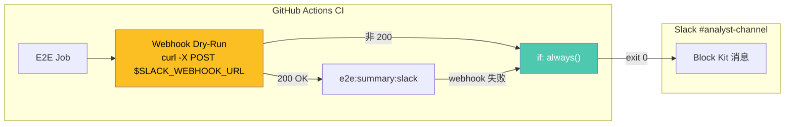
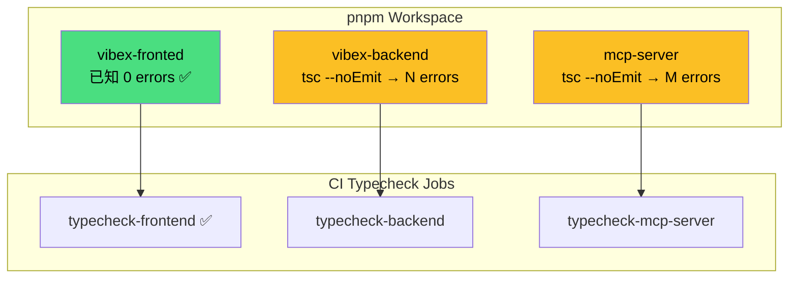
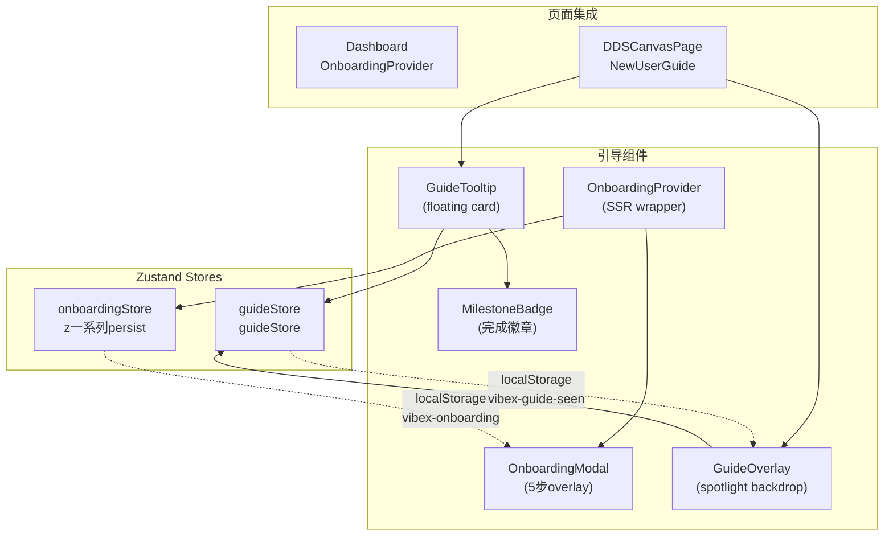
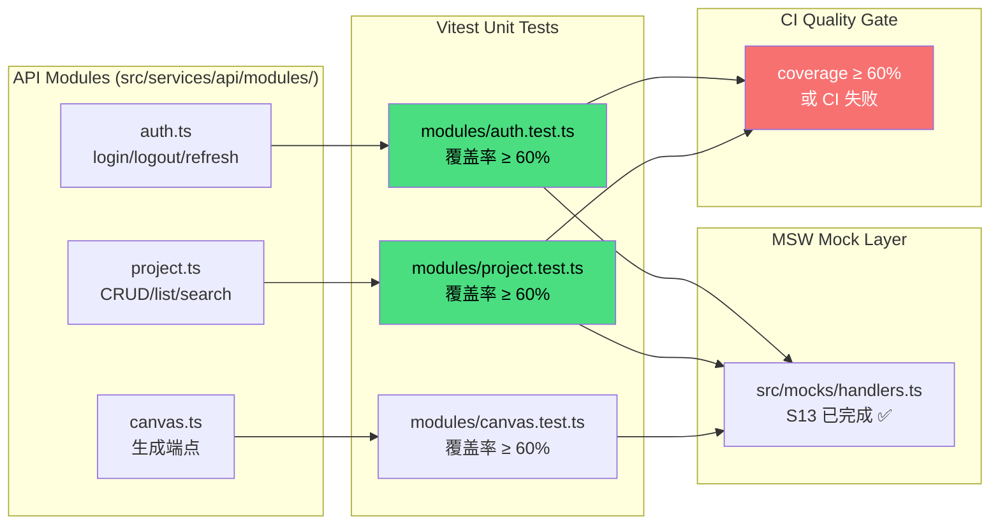
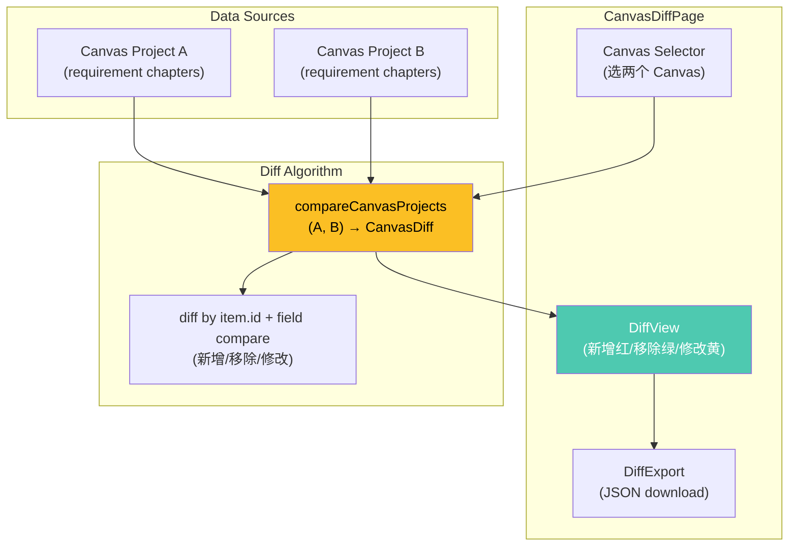

# VibeX Sprint 24 — Technical Architecture

**Architect**: architect 🤖
**Date**: 2026-05-03
**Project**: vibex-proposals-sprint24
**Phase**: architect-review
**Status**: Technical Design Complete

---

## 执行决策

- **决策**: 已采纳
- **执行项目**: vibex-proposals-sprint24
- **执行日期**: 2026-05-03

---

## 1. 执行摘要

Sprint 24 包含 5 个提案（P001-P005），涵盖 CI 收尾、TS 审计、Onboarding 引导、API 测试补全、跨 Canvas 对比。

**关键发现**：
- P001: CI workflow 已调用 `e2e:summary:slack`，缺 webhook dry-run 验证 step
- P002: 前端 TS 已清零，后端/mcp-server TS 状态待验证
- P003: Onboarding 基础设施**已存在**（`OnboardingModal` + `GuideOverlay`），需 data-testid 修复 + 页面集成
- P004: `auth.ts` / `project.ts` 存在，缺 `modules/__tests__/` 测试文件
- P005: `reviewDiff.ts` 基础存在，缺 `CanvasDiffPage` + `compareCanvasProjects` 算法

---

## 2. Tech Stack

| Layer | Technology | Version | Rationale |
|-------|-----------|---------|-----------|
| Frontend | Next.js 14 (App Router) | 14.x | Server Components + client islands |
| State | Zustand | latest | Onboarding store + guide store 已用 |
| Testing | Vitest + RTL | 2.x | Vite-native，与现有项目一致 |
| Mocking | MSW | 2.x | S13 已完成 handlers，`src/mocks/handlers.ts` |
| CI/CD | GitHub Actions | — | `.github/workflows/test.yml` |
| Animations | Framer Motion | 11.x | OnboardingModal 已使用 |
| Coverage | vitest --coverage | — | 复用现有 `coverage.config.js` |

**版本约束**：
- Vitest 2.x（现有配置）
- MSW 2.x（S13 已配置 `src/mocks/handlers.ts`）
- Framer Motion 11.x（`OnboardingModal.tsx` 已使用）
- 所有提案 `pnpm run build` → 0 errors

---

## 3. Architecture Diagrams

### 3.1 P001: E2E Slack 配置验证



**关键文件**：
- `.github/workflows/test.yml` — 需新增 webhook dry-run step
- `vibex-fronted/scripts/e2e-summary-to-slack.ts` — 已有

**Dry-run 脚本**：
```yaml
- name: Validate Slack Webhook
  run: |
    STATUS=$(curl -s -o /dev/null -w "%{http_code}" \
      -X POST "$SLACK_WEBHOOK_URL" \
      -d '{"text":"VibeX CI dry-run test"}')
    if [ "$STATUS" = "200" ]; then
      echo "Webhook configured: OK"
    else
      echo "Webhook not configured or invalid (status: $STATUS)"
    fi
  env:
    SLACK_WEBHOOK_URL: ${{ secrets.SLACK_WEBHOOK_URL }}
```

### 3.2 P002: TypeScript 审计



**验证命令**：
```bash
# 前端（已知清零）
pnpm --filter vibex-fronted exec tsc --noEmit

# 后端（待验证）
pnpm --filter vibex-backend exec tsc --noEmit

# MCP Server（待验证）
pnpm --filter @vibex/mcp-server exec tsc --noEmit
```

### 3.3 P003: Onboarding 新手引导



**关键文件**：
| 文件 | 状态 | 说明 |
|------|------|------|
| `src/components/onboarding/OnboardingModal.tsx` | ⚠️ 部分实现 | 已有 5 步组件，缺 data-testid |
| `src/components/guide/GuideOverlay.tsx` | ⚠️ 部分实现 | 已有 spotlight，缺集成 |
| `src/stores/onboarding/onboardingStore.ts` | ✅ 已有 | Zustand persist store |
| `src/stores/guideStore.ts` | ✅ 已有 | guideStore |
| `src/hooks/useOnboarding.ts` | ✅ 已有 | 引导触发 hook |
| `src/components/guide/NewUserGuide.tsx` | ⚠️ 部分实现 | 已有 orchestrator，缺 data-testid |

**⚠️ 已知缺口**：
- `data-testid="onboarding-overlay"` — 已存在 ✅（OnboardingModal）
- `data-testid="onboarding-skip-btn"` — **缺失**，需添加
- `data-testid="onboarding-next-btn"` — **缺失**，需添加
- `onboarding_completed` / `onboarding_skipped` localStorage flag — 已有 store 支持，需验证

### 3.4 P004: API 模块测试补全



**关键文件**：
| 文件 | 状态 | 说明 |
|------|------|------|
| `src/services/api/modules/auth.ts` | ✅ 已有 | AuthApiImpl class |
| `src/services/api/modules/project.ts` | ✅ 已有 | ProjectApiImpl class |
| `src/services/api/modules/canvas.ts` | ✅ 已有 | Canvas API |
| `src/services/api/client.ts` | ✅ 已有 | httpClient |
| `src/mocks/handlers.ts` | ✅ S13 已完成 | MSW request handlers |
| `src/services/api/modules/__tests__/auth.test.ts` | ❌ **缺失** | 需新建 |
| `src/services/api/modules/__tests__/project.test.ts` | ❌ **缺失** | 需新建 |
| `src/services/api/modules/__tests__/canvas.test.ts` | ❌ **缺失** | 需新建 |

### 3.5 P005: 跨 Canvas 版本对比



**关键文件**：
| 文件 | 状态 | 说明 |
|------|------|------|
| `src/lib/reviewDiff.ts` | ✅ S23 已完成 | diff 算法基础（可复用模式）|
| `src/pages/CanvasDiffPage.tsx` | ❌ **缺失** | 需新建 |
| `src/components/canvas-diff/CanvasDiffSelector.tsx` | ❌ **缺失** | 需新建 |
| `src/components/canvas-diff/CanvasDiffView.tsx` | ❌ **缺失** | 需新建 |
| `src/lib/canvasDiff.ts` | ❌ **缺失** | 需新建 `compareCanvasProjects` 算法 |

**diff 算法设计**（基于 S23 reviewDiff.ts）：
```typescript
// src/lib/canvasDiff.ts
export interface CanvasDiff {
  added: CanvasItem[];      // B 有 A 无
  removed: CanvasItem[];     // A 有 B 无
  modified: Array<{
    id: string;
    before: CanvasItem;
    after: CanvasItem;
    changedFields: string[];
  }>;
  unchanged: CanvasItem[];
}

export function compareCanvasProjects(
  a: CanvasProject,
  b: CanvasProject
): CanvasDiff

// 比较逻辑：
// - 同一 id 的 item，字段值不同 → modified（记录 changedFields）
// - id 仅在 B 存在 → added
// - id 仅在 A 存在 → removed
// - 完全相同 → unchanged
```

---

## 4. API Definitions

### 4.1 P001: Webhook Dry-run Script

```typescript
// scripts/webhook-dryrun.ts
interface DryRunResult {
  configured: boolean;
  statusCode: number | null;
  error?: string;
}

async function dryRunWebhook(webhookUrl: string): Promise<DryRunResult>
```

**CI step**：
```yaml
- name: Validate Slack Webhook
  run: pnpm --filter vibex-fronted run webhook:dryrun
  env:
    SLACK_WEBHOOK_URL: ${{ secrets.SLACK_WEBHOOK_URL }}
```

### 4.2 P003: Onboarding Store Interface

```typescript
// src/stores/onboarding/onboardingStore.ts
type OnboardingStep = 'welcome' | 'input' | 'clarify' | 'model' | 'prototype';
type OnboardingStatus = 'not-started' | 'in-progress' | 'completed' | 'skipped';

interface OnboardingStore {
  status: OnboardingStatus;
  currentStep: OnboardingStep;
  completedSteps: OnboardingStep[];
  startedAt?: number;
  completedAt?: number;

  start(): void;
  nextStep(): void;
  prevStep(): void;
  skip(): void;
  complete(): void;
  reset(): void;
}
```

**data-testid 规范**：
| data-testid | 组件 | 说明 |
|------------|------|------|
| `onboarding-overlay` | `OnboardingModal` | ✅ 已存在 |
| `onboarding-skip-btn` | `OnboardingModal` | ❌ 需添加 |
| `onboarding-next-btn` | `OnboardingModal` | ❌ 需添加 |
| `onboarding-prev-btn` | `OnboardingModal` | ❌ 需添加 |
| `onboarding-progress-bar` | `OnboardingProgressBar` | ✅ 已存在 |
| `onboarding-step-{n}` | 各步骤组件 | ❌ 需添加 |

### 4.3 P004: API Test Structure

```typescript
// src/services/api/modules/__tests__/auth.test.ts
// 使用 MSW handlers from src/mocks/handlers.ts

import { httpClient } from '../client';
import { AuthApiImpl } from '../auth';
import { server } from '@/mocks/server';
import { authHandlers } from '@/mocks/handlers';

describe('AuthApi', () => {
  beforeAll(() => server.listen());
  afterEach(() => server.resetHandlers());
  afterAll(() => server.close());

  describe('login', () => {
    it('应返回 AuthResponse', async () => {
      const api = new AuthApiImpl();
      const result = await api.login({ email: 'test@test.com', password: 'xxx' });
      expect(result.user).toBeDefined();
    });
    // ... ≥ 5 个测试用例
  });
});
```

### 4.4 P005: Canvas Diff API

```typescript
// src/lib/canvasDiff.ts
interface CanvasItem {
  id: string;
  type: 'bounded-context' | 'flow-node' | 'component' | 'requirement';
  label: string;
  data: Record<string, unknown>;
}

interface CanvasProject {
  id: string;
  name: string;
  items: CanvasItem[];
  chapters: RequirementChapter[];
  createdAt: string;
  updatedAt: string;
}

interface CanvasDiff {
  added: CanvasItem[];
  removed: CanvasItem[];
  modified: Array<{
    id: string;
    before: CanvasItem;
    after: CanvasItem;
    changedFields: string[];
  }>;
  unchanged: CanvasItem[];
  summary: {
    addedCount: number;
    removedCount: number;
    modifiedCount: number;
    unchangedCount: number;
  };
}

function compareCanvasProjects(a: CanvasProject, b: CanvasProject): CanvasDiff
function exportDiffAsJSON(diff: CanvasDiff): Blob
```

---

## 5. Data Models

### 5.1 Onboarding localStorage

```typescript
// localStorage key: 'vibex-onboarding'
interface OnboardingPersistedState {
  status: 'completed' | 'skipped';
  completedSteps: OnboardingStep[];
  completedAt?: number;
  skippedAt?: number;
}
```

### 5.2 Guide localStorage

```typescript
// localStorage key: 'vibex-guide-seen'
interface GuidePersistedState {
  hasSeenGuide: boolean;
  earnedBadges: string[];
  completedSteps: string[];
}
```

### 5.3 Canvas Diff Report

```typescript
interface CanvasDiffReport {
  id: string;
  projectA: { id: string; name: string; updatedAt: string };
  projectB: { id: string; name: string; updatedAt: string };
  diff: CanvasDiff;
  generatedAt: string;
  exportedBy?: string;
}
```

---

## 6. Testing Strategy

### 6.1 Test Framework

| 测试类型 | 框架 | 配置文件 |
|---------|------|---------|
| 单元测试 | Vitest 2.x | `vitest.config.ts` |
| 集成测试（RTL）| Vitest + @testing-library/react | `vitest.config.ts` |
| API 模块测试 | Vitest + MSW | `vitest.config.ts` |
| E2E 测试 | Playwright | `playwright.ci.config.ts` |
| 覆盖率 | vitest --coverage | `coverage.config.js` |

### 6.2 覆盖率要求

| 提案 | 模块 | 覆盖率目标 | 新增用例数 |
|------|------|-----------|-----------|
| P001 | webhook-dryrun.ts | 80% | ≥ 3 |
| P002 | — | 验证性（无新增代码）| — |
| P003 | onboardingStore + useOnboarding | 85% | ≥ 10 |
| P004 | auth.ts / project.ts / canvas.ts | **≥ 60%** | **≥ 20** |
| P005 | canvasDiff.ts + CanvasDiffPage | 85% | ≥ 8 |

### 6.3 核心测试用例

#### P003: Onboarding
```typescript
// onboarding.test.ts
describe('OnboardingModal', () => {
  it('应显示 5 步引导', () => {
    render(<OnboardingModal />);
    expect(screen.getByTestId('onboarding-overlay')).toBeVisible();
    expect(screen.getByTestId('onboarding-skip-btn')).toBeVisible();
    expect(screen.getByTestId('onboarding-next-btn')).toBeVisible();
  });

  it('跳过后应写入 localStorage', async () => {
    render(<OnboardingModal />);
    await userEvent.click(screen.getByTestId('onboarding-skip-btn'));
    expect(localStorage.setItem).toHaveBeenCalledWith(
      'vibex-onboarding',
      expect.stringContaining('"status":"skipped"')
    );
  });

  it('已完成用户不应显示 overlay', () => {
    localStorage.setItem('vibex-onboarding', JSON.stringify({ status: 'completed' }));
    render(<OnboardingModal />);
    expect(screen.queryByTestId('onboarding-overlay')).not.toBeInTheDocument();
  });
});
```

#### P004: API Tests
```typescript
// modules/auth.test.ts
describe('AuthApi.login', () => {
  it('应返回用户信息', async () => {
    server.use(authHandlers.loginSuccess(mockUser));
    const result = await authApi.login(credentials);
    expect(result.user.email).toBe('test@test.com');
  });

  it('密码错误应抛出 AuthError', async () => {
    server.use(authHandlers.loginInvalidCredentials());
    await expect(authApi.login(wrongCredentials)).rejects.toThrow('AuthError');
  });

  it('网络错误应重试后失败', async () => {
    server.use(authHandlers.networkError());
    await expect(authApi.login(credentials)).rejects.toThrow();
  });
});
```

#### P005: Canvas Diff
```typescript
// canvasDiff.test.ts
describe('compareCanvasProjects', () => {
  it('B 有 A 无 → added', () => {
    const diff = compareCanvasProjects(projA, projB);
    expect(diff.added).toContainEqual(expect.objectContaining({ id: 'item-b-only' }));
  });

  it('A 有 B 无 → removed', () => {
    const diff = compareCanvasProjects(projA, projB);
    expect(diff.removed).toContainEqual(expect.objectContaining({ id: 'item-a-only' }));
  });

  it('同一 id 字段不同 → modified，含 changedFields', () => {
    const diff = compareCanvasProjects(projA, projB);
    expect(diff.modified[0].changedFields).toContain('label');
    expect(diff.modified[0].changedFields).toContain('data.priority');
  });
});
```

---

## 7. 技术风险

| 提案 | 风险 | 可能性 | 影响 | 缓解 |
|------|------|--------|------|------|
| P001 | webhook secret 未配置 | 高 | 中 | dry-run 检测降级文案 |
| P002 | 后端/mcp-server TS 错误量大 | 中 | 高 | 先量化范围，再决定是否 Sprint 24 修复 |
| P003 | OnboardingModal + GuideOverlay 存在重叠 | 中 | 中 | PRD 指定 5 步 overlay；Guide 模式为 Phase 2 |
| P003 | 已有组件缺 data-testid | 高 | 中 | 设计阶段列出所有缺失 data-testid，统一修复 |
| P004 | MSW mock 数据与真实 API 签名不一致 | 高 | 中 | 先用 auth（有清晰 input/output）验证模式 |
| P004 | CI coverage threshold 配置缺失 | 高 | 中 | 在 `.github/workflows/test.yml` 添加 `coverage: true` |
| P005 | compareCanvasProjects 算法未收敛 | 低 | 中 | 降级为 JSON 结构 diff，暂不做语义分析 |

---

## 8. 已知缺口（DoD Blockers）

| ID | 提案 | 缺口描述 | 修复工时 |
|----|------|---------|---------|
| G1 | P003 | `data-testid="onboarding-skip-btn"` / `onboarding-next-btn` 缺失 | 10min |
| G2 | P003 | `OnboardingModal` 未在 Dashboard 页面集成 | 30min |
| G3 | P004 | `modules/__tests__/auth.test.ts` 缺失 | 1人日 |
| G4 | P004 | `modules/__tests__/project.test.ts` 缺失 | 1人日 |
| G5 | P004 | CI coverage threshold 配置缺失 | 15min |
| G6 | P005 | `CanvasDiffPage.tsx` 缺失 | 2h |
| G7 | P005 | `compareCanvasProjects` 算法缺失 | 2h |

---

## 9. 跨提案一致性

### 9.1 Diff 算法复用

```
S23 reviewDiff.ts (Design Review diff)
  ↓ 复用模式
P005 canvasDiff.ts (跨 Canvas diff)
  - 都是基于 item.id 比对
  - 都是 added/removed/unchanged 三分类
  - P005 新增 modified（同一 id 字段变化）
```

### 9.2 MSW Mock 复用

```
S13 MSW handlers (src/mocks/handlers.ts)
  ↓ 被 P004 复用
auth.test.ts → authHandlers.loginSuccess / loginInvalidCredentials
project.test.ts → projectHandlers.list / create / update
```

### 9.3 样式系统复用

```
现有 CSS Modules
  ↓ 被新组件复用
OnboardingModal → 复用 styles from onboarding/
CanvasDiffPage → 复用 styles from dds/
```

---

## 10. 执行决策记录

### D1: P003 Onboarding 组件合并
| 选项 | 决策 | 理由 |
|------|------|------|
| 合并 OnboardingModal + GuideOverlay | **采纳 GuideOverlay 方向** | GuideOverlay 有 spotlight 功能，更符合 5 步引导场景 |
| 保留两套组件 | 拒绝 | 维护两套引导系统成本高 |

### D2: P004 MSW vs 直接 mock
| 选项 | 决策 | 理由 |
|------|------|------|
| 使用 S13 MSW handlers | **采纳** | 复用已有 mock 数据，一致性好 |
| 单独写 mock | 拒绝 | 增加维护成本 |

### D3: P005 diff 算法范围
| 选项 | 决策 | 理由 |
|------|------|------|
| 语义级 diff（理解字段含义）| 拒绝 | 超出 Sprint 24 范围，复杂度高 |
| 结构级 diff（JSON 对比 + modified 字段）| **采纳** | 基于 reviewDiff.ts 扩展，2-3h 可完成 |

---

*生成时间: 2026-05-03 09:20 GMT+8*
*Architect Agent | VibeX Sprint 24 Technical Architecture*
