# VibeX Sprint 25 — Architecture

**Agent**: Architect
**日期**: 2026-05-04
**项目**: vibex-proposals-sprint25
**版本**: v1.0

---

## 执行决策

- **决策**: 待评审
- **执行项目**: vibex-proposals-sprint25
- **执行日期**: 待定

---

## 1. Tech Stack

| 层级 | 技术 | 版本 | 状态 | 说明 |
|------|------|------|------|------|
| **前端框架** | Next.js | 15.x | ✅ 现有 | App Router，`/canvas-diff` 新路由 |
| **状态管理** | Zustand | ^5.x | ✅ 现有 | `onboardingStore` 扩展 |
| **样式** | Tailwind CSS | 现有 | ✅ 现有 | 新 UI 组件 |
| **测试** | Vitest | ^2.x | ✅ 现有 | 单元测试扩展 |
| **测试** | Playwright | ^1.58 | ✅ 现有 | E2E + data-testid 覆盖 |
| **HTTP Client** | Fetch API | 内置 | ✅ 现有 | Canvas 分享 API |
| **缓存** | LRU Map | 现有 | ✅ 现有 | `useCanvasRBAC` 5min TTL |

**无新增依赖**。所有提案复用现有技术栈。

---

## 2. Architecture Diagram

### 2.1 系统整体架构

```mermaid
graph TB
    subgraph "Client (Next.js Frontend)"
        Dashboard["Dashboard\n/page.tsx"]
        OnboardingModal["OnboardingModal.tsx\n(Step 1-5)"]
        CanvasDiffPage["/canvas-diff\n(NEW)"]
        NewProjectModal["NewProjectModal.tsx"]
        ChapterPanel["ChapterPanel.tsx"]
        DDSToolbar["DDSToolbar.tsx"]
    end

    subgraph "Stores (Zustand)"
        onboardingStore["onboardingStore.ts"]
        canvasStore["canvasStore"]
        projectTemplateStore["projectTemplateStore.ts"]
    end

    subgraph "Hooks"
        useProjectSearch["useProjectSearch.ts\n(NEW, refactor)"]
        useCanvasRBAC["useCanvasRBAC.ts\n(existing)"]
        useTemplates["useTemplates.ts\n(existing)"]
    end

    subgraph "Lib / Utils"
        reviewDiff["reviewDiff.ts\n(extend for cross-canvas)"]
        useProjectMutations["useProjectMutations.ts"]
    end

    subgraph "API Layer"
        TeamsAPI["Teams API\n/v1/teams/*"]
        ProjectAPI["Project API\n/v1/projects/*"]
        CanvasShareAPI["/canvas-share\n(NEW endpoint)"]
        RBACAPI["RBAC API\n/v1/projects/:id/permissions"]
    end

    subgraph "Backend (Node.js)"
        TeamsRoutes["teams/\nindex.ts|members.ts|permissions.ts|id.ts"]
    end

    subgraph "Data"
        ProjectDB["projects table"]
        TeamDB["teams table"]
        TeamMembers["team_members table"]
        CanvasTeamMap["canvas_team_mapping\n(NEW)"]
    end

    %% P001: Onboarding + Template
    OnboardingModal --> onboardingStore
    onboardingStore -->|"scenario from Step 2"| NewProjectModal
    NewProjectModal -->|"template selected"| ChapterPanel
    ChapterPanel -->|"auto-fill requirements"| canvasStore
    useTemplates -->|"template data"| NewProjectModal

    %% P002: Cross-Canvas Diff
    CanvasDiffPage --> reviewDiff
    reviewDiff --> ProjectAPI
    CanvasDiffPage -->|"canvas A/B select"| ProjectAPI

    %% P004: Dashboard Search
    Dashboard --> useProjectSearch
    useProjectSearch --> ProjectAPI
    Dashboard -->|"searchQuery/sortBy"| useProjectSearch

    %% P005: Teams × Canvas
    DDSToolbar --> useCanvasRBAC
    useCanvasRBAC --> RBACAPI
    DDSToolbar -->|"share-to-team"| CanvasShareAPI
    CanvasShareAPI --> TeamsAPI
    CanvasShareAPI --> CanvasTeamMap
    Dashboard -->|"team badge"| CanvasTeamMap
```



### 2.2 P005 数据模型关键决策：Canvas ↔ Team 多对多关系

**Architect 决策：采用多对多关系（一个 Canvas 可属于多个 Team）**

理由：
- 企业场景中，同一 Canvas 设计可能需要跨多个团队共享（如设计组 + 开发组 + 产品组）
- Sprint 13-14 Teams API 已支持多对多成员关系，模式一致
- 实现成本可控：通过 `canvas_team_mapping` 中间表管理

**替代方案否决**：
- 一对一（Canvas 只能属于一个 Team）：限制过严，企业场景不适用
- 多对一（Team 可有多个 Canvas，但 Canvas 只能有一个 Team）：语义与多对多相同，但"属于"语义更模糊

### 2.3 P003 验证策略

```mermaid
flowchart LR
    A[CHANGELOG.md\nS23/S24 条目] --> B{S24 coord 通过?}
    B -->|Yes| C[验证实际执行状态]
    C --> C1[Slack 历史: E2E 报告存在?]
    C --> C2["tsc --noEmit: 0 errors?"]
    C --> C3[auth.test.ts ≥ 20 cases?"]
    C1 --> D[满足 → 更新 CHANGELOG]
    C1 --> E[不满足 → 补开发]
    C2 --> E
    C3 --> E
    B -->|No| F[由 coord 确认]
```

---

## 3. API Definitions

### 3.1 新增 API

#### POST /canvas-share — Canvas 分享给 Team

**Request**:
```typescript
interface CanvasShareRequest {
  canvasId: string;   // Canvas 项目 ID
  teamId: string;     // 目标 Team ID
  role: 'viewer' | 'editor';  // 分享权限级别
}
```

**Response** (200):
```typescript
interface CanvasShareResponse {
  canvasId: string;
  teamId: string;
  role: string;
  sharedAt: string;   // ISO 8601
}
```

**Errors**:
- 401: Unauthorized
- 403: 发起分享者无 Canvas owner/admin 权限
- 404: Canvas 或 Team 不存在
- 409: Canvas 已分享给该 Team

**Backend 实现**: 新建 `vibex-backend/src/routes/v1/canvas-share.ts`，写入 `canvas_team_mapping` 表。

#### GET /canvas-share/teams?canvasId={id} — 查询 Canvas 已分享的 Teams

**Response** (200):
```typescript
interface CanvasShareListResponse {
  shares: Array<{
    teamId: string;
    teamName: string;
    role: string;
    sharedAt: string;
  }>;
}
```

### 3.2 扩展现有 API

#### P004: Dashboard 项目过滤（客户端扩展）

无需新增 API。`useProjects` hook 已支持 `filters` 参数，扩展 filter 类型：

```typescript
interface ProjectFilters {
  status?: 'active' | 'deleted';
  search?: string;
  createdBy?: 'me' | 'all';          // NEW
  dateRange?: 'all' | '7d' | '30d'; // NEW
}
```

#### P002: 跨 Canvas Diff

复用现有 `projectApi.getProject(id)` 获取两个 Canvas 的完整 JSON，无新增 API。

### 3.3 现有 API 依赖确认

| API | 所在位置 | P001 | P002 | P004 | P005 |
|-----|---------|------|------|------|------|
| GET /v1/projects | useProjects.ts | — | — | ✅ | ✅ |
| GET /v1/projects/:id | useProject.ts | — | ✅ | — | — |
| GET /v1/teams | teams/index.ts | — | — | — | ✅ |
| GET /v1/teams/:id/members | teams/members.ts | — | — | — | ✅ |
| GET /v1/projects/:id/permissions | useCanvasRBAC.ts | — | — | — | ✅ |
| POST /canvas-share | **NEW** | — | — | — | ✅ |

---

## 4. Data Model

### 4.1 新增表：`canvas_team_mapping`

```sql
CREATE TABLE canvas_team_mapping (
  id          TEXT PRIMARY KEY,
  canvas_id   TEXT NOT NULL REFERENCES projects(id),
  team_id     TEXT NOT NULL REFERENCES teams(id),
  role        TEXT NOT NULL CHECK (role IN ('viewer', 'editor')),
  shared_by   TEXT NOT NULL REFERENCES users(id),
  shared_at   DATETIME DEFAULT CURRENT_TIMESTAMP,
  UNIQUE(canvas_id, team_id)  -- 同一 Canvas 不能重复分享给同一 Team
);
```

### 4.2 扩展现有表

**projects 表**（无需改动）：
- Canvas 项目本身无 schema 变化
- 分享状态通过 `canvas_team_mapping` 间接关联

**teams 表**（无需改动）：
- 现有结构支持，Sprint 13-14 已完成

### 4.3 实体关系

```mermaid
erDiagram
    User ||--o{ Project : "creates"
    User ||--o{ Team : "creates/joins"
    User {
      string id PK
      string name
      string email
    }

    Project ||--o{ canvas_team_mapping : "shared_to"
    Team ||--o{ canvas_team_mapping : "receives"
    Project {
      string id PK
      string name
      string owner_id FK
      datetime created_at
      datetime updated_at
    }

    Team {
      string id PK
      string name
      string owner_id FK
    }

    canvas_team_mapping {
      string id PK
      string canvas_id FK
      string team_id FK
      string role
      string shared_by FK
      datetime shared_at
    }

    Team ||--o{ team_members : "has"
    team_members {
      string team_id FK
      string user_id FK
      string role  -- owner/admin/member
      PRIMARY KEY (team_id, user_id)
    }
```

**P005 权限绑定逻辑**：

```typescript
// useCanvasRBAC.ts 扩展 — Canvas × Team 权限
function resolveCanvasPermission(
  userId: string,
  canvasId: string,
  teamRole?: 'owner' | 'admin' | 'member'  // 来自 team_members 表
): RBACResult {
  if (!teamRole) {
    // 无 Team 关联，降级为项目 owner 检查
    return { canEdit: isProjectOwner(userId, canvasId) };
  }

  switch (teamRole) {
    case 'owner':  return { canEdit: true, canDelete: true, canShare: true };
    case 'admin': return { canEdit: true, canDelete: false, canShare: true };
    case 'member': return { canEdit: false, canDelete: false, canShare: false };
  }
}
```

**RBAC 优先级**：Project Owner > Team Owner > Team Admin > Team Member > Viewer

---

## 5. Testing Strategy

### 5.1 测试框架

| 层级 | 框架 | 覆盖率目标 | 说明 |
|------|------|-----------|------|
| 单元测试 | Vitest | 核心逻辑 > 80% | useProjectSearch / reviewDiff 扩展 |
| 组件测试 | Vitest + Testing Library | UI 逻辑覆盖 | OnboardingModal / CanvasDiffPage |
| API 测试 | Vitest | auth/project 各 ≥ 20 cases | S25-S3.3 补全目标 |
| E2E 测试 | Playwright | 所有 data-testid 覆盖 | 新增页面 + 新增按钮 |

### 5.2 核心测试用例

#### P001: Onboarding + Template

```typescript
// onboarding-template.integration.test.tsx
describe('Onboarding + Template Bundle', () => {
  it('S1.1: Step 5 显示模板推荐卡片', () => {
    render(<OnboardingModal />);
    // 模拟走到 Step 5
    for (let i = 0; i < 4; i++) {
      fireEvent.click(screen.getByTestId('onboarding-next-btn'));
    }
    expect(screen.getByTestId('onboarding-step-5')).toBeVisible();
    expect(screen.getAllByTestId('onboarding-template-card')).toHaveLength(4);
  });

  it('S1.3: Step 2 选"新功能开发"，Step 5 推荐含 feature 标签模板', () => {
    // Step 2 选择
    fireEvent.click(screen.getByTestId('onboarding-step-2-option-new-feature'));
    // 前进到 Step 5
    for (let i = 0; i < 3; i++) {
      fireEvent.click(screen.getByTestId('onboarding-next-btn'));
    }
    const cards = screen.getAllByTestId('onboarding-template-card');
    cards.forEach(card => {
      expect(card).toHaveAttribute('data-tags', /feature/);
    });
  });

  it('S1.2: 选择模板后 requirement chapter 自动填充', async () => {
    fireEvent.click(screen.getAllByTestId('onboarding-template-card')[0]);
    await waitFor(() => {
      expect(canvasStore.getState().requirements.length).toBeGreaterThan(0);
    });
  });
});
```

#### P002: Cross-Canvas Diff

```typescript
// canvasDiff.integration.test.ts
describe('Cross-Canvas Diff', () => {
  it('S2.3: compareCanvasProjects 返回 added/removed/changed', () => {
    const result = compareCanvasProjects('canvas-A', 'canvas-B');
    expect(result).toHaveProperty('added');
    expect(result).toHaveProperty('removed');
    expect(result).toHaveProperty('changed');
    expect(Array.isArray(result.added)).toBe(true);
  });

  it('S2.4: diff 视图三色展示', () => {
    render(<CanvasDiffPage />);
    expect(screen.getByTestId('diff-item-added')).toHaveClass(/text-red/);
    expect(screen.getByTestId('diff-item-removed')).toHaveClass(/text-green/);
    expect(screen.getByTestId('diff-item-changed')).toHaveClass(/text-yellow/);
  });

  it('S2.4: JSON 导出触发下载', async () => {
    const { downloadBlob } = useBlobDownload();
    fireEvent.click(screen.getByTestId('diff-export-btn'));
    expect(downloadBlob).toHaveBeenCalledWith(
      expect.objectContaining({ type: 'application/json' }),
      expect.stringMatching(/diff-report-.+\.json/)
    );
  });
});
```

#### P004: Dashboard Search

```typescript
// useProjectSearch.test.ts
describe('useProjectSearch', () => {
  it('S4.1: 搜索防抖 300ms', async () => {
    const { result } = renderHook(() => useProjectSearch(projects));
    act(() => result.current.setSearch('PRD'));
    expect(result.current.searching).toBe(false);
    await act(async () => {
      await new Promise(r => setTimeout(r, 350));
    });
    expect(result.current.searching).toBe(true);
  });

  it('S4.3: 过滤"最近7天"只返回7天内更新的项目', () => {
    const { result } = renderHook(() => useProjectSearch(projects));
    act(() => result.current.setFilter('7d'));
    const sevenDaysAgo = Date.now() - 7 * 24 * 60 * 60 * 1000;
    result.current.filtered.forEach(p => {
      expect(new Date(p.updatedAt).getTime()).toBeGreaterThan(sevenDaysAgo);
    });
  });

  it('S4.4: 排序名称 A-Z', () => {
    const { result } = renderHook(() => useProjectSearch(projects));
    act(() => result.current.setSort('name-asc'));
    const names = result.current.filtered.map(p => p.name);
    expect(names).toEqual([...names].sort());
  });
});
```

#### P005: Teams × Canvas

```typescript
// canvasShare.api.test.ts
describe('Canvas Share API', () => {
  it('S5.1: 分享 Canvas 给 Team 返回 200', async () => {
    const res = await api.post('/canvas-share', {
      canvasId: 'canvas-1',
      teamId: 'team-1',
      role: 'editor',
    });
    expect(res.status).toBe(200);
    expect(res.data.canvasId).toBe('canvas-1');
    expect(res.data.teamId).toBe('team-1');
  });

  it('S5.1: 非 owner 分享返回 403', async () => {
    // 模拟 member 角色调用
    const res = await api.post('/canvas-share', {
      canvasId: 'canvas-1',
      teamId: 'team-1',
    });
    expect(res.status).toBe(403);
  });

  it('S5.3: Team member 角色无编辑权限', () => {
    const rbac = resolveCanvasPermission('user-1', 'canvas-1', 'member');
    expect(rbac.canEdit).toBe(false);
    expect(rbac.canDelete).toBe(false);
    expect(rbac.canShare).toBe(false);
  });
});
```

### 5.3 E2E 覆盖率要求

| 页面 | 关键 data-testid | E2E 覆盖 |
|------|-----------------|----------|
| OnboardingModal | onboarding-overlay / onboarding-skip-btn / onboarding-template-card | ✅ Playwright |
| /canvas-diff | canvas-diff-page / canvas-a-selector / canvas-b-selector / diff-view / diff-export-btn | ✅ Playwright |
| Dashboard | project-search-input / project-filter-btn / project-sort-select / team-project-badge | ✅ Playwright |
| DDSToolbar | share-to-team-btn / team-share-modal | ✅ Playwright |
| Teams page | team-canvas-list / team-project-item | ✅ Playwright |

### 5.4 覆盖率门槛

- **Vitest 单元测试**: 核心逻辑文件（reviewDiff 扩展、useProjectSearch、resolveCanvasPermission）> 80%
- **API 测试**: auth.test.ts ≥ 20 cases，project.test.ts ≥ 20 cases（S25-S3.3 目标）
- **E2E**: 所有 `data-testid` 元素可定位，覆盖正向路径 + 主要错误路径
- **TS**: `pnpm run build` → 0 errors（全 Sprint 强制）

---

## 6. 关键设计决策摘要

| 决策 | 选项 A（采纳） | 选项 B（否决） | 理由 |
|------|---------------|--------------|------|
| Canvas ↔ Team 关系 | 多对多 | 一对一 / 多对一 | 企业跨团队协作需求；Sprint 13-14 模式一致 |
| P004 实现方式 | 客户端 hook | 服务端搜索 | Dashboard 已内置 searchQuery，复用成本低 |
| P002 diff 算法 | JSON 结构 diff | 语义 diff | S23 E2 已确认降级策略；语义 diff 工时超限 |
| P003 验证顺序 | CHANGELOG + Slack 倒推 | 直接补开发 | 避免重复劳动，先确认实际执行状态 |
| P001 模板 auto-fill | 追加到现有 chapter | 替换现有内容 | 保护用户已有输入，不覆盖 |

---

*Architect Agent | VibeX Sprint 25 | 2026-05-04*
