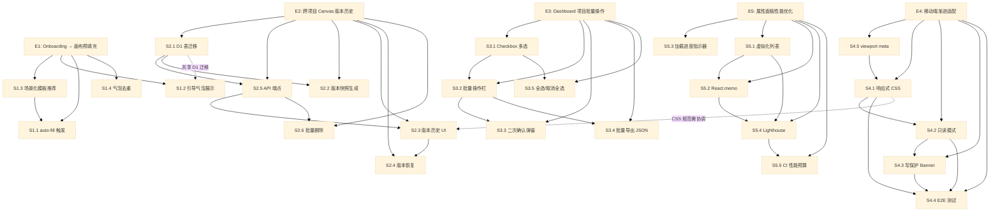

# VibeX Sprint 26 — Implementation Plan

> **总工期估算: 24h**（E1: 3h + E2: 7h + E3: 3.5h + E4: 5h + E5: 5.5h）
> **Sprint 周期: 2 周**（Week 1: Day 1–5 / Week 2: Day 6–10）

---

## 1. Unit Index — Epic & Story 清单

### E1: Onboarding → 画布预填充（3h）

| Story | 描述 | 工时 | 状态 | 依赖 |
|---|---|---|---|---|
| S1.1 | Onboarding Step 5 跳转画布前触发模板 auto-fill | 1h | [ ] | S1.3（模板数据需先就绪） |
| S1.2 | 画布页面首次加载展示引导气泡 | 0.5h | [ ] | 无 |
| S1.3 | 场景化模板推荐（基于 Onboarding Step 2 选择） | 1h | [ ] | 无 |
| S1.4 | 引导气泡消失后不再重复出现 | 0.5h | [ ] | S1.2 |

### E2: 跨项目 Canvas 版本历史（7h）

| Story | 描述 | 工时 | 状态 | 依赖 |
|---|---|---|---|---|
| S2.1 | D1 数据库 project_versions 表迁移 | 1h | [ ] | 无 |
| S2.2 | Canvas 保存时自动生成版本快照（最多 50 个） | 2h | [ ] | S2.1 |
| S2.5 | 版本历史 API 端点 | 0.5h | [ ] | S2.1 |
| S2.3 | 版本历史面板 UI（时间线 + 快照预览） | 2h | [ ] | S2.5 |
| S2.4 | 版本恢复功能（含二次确认） | 1h | [ ] | S2.3 |
| S2.6 | 批量删除版本历史（清理） | 0.5h | [ ] | S2.5 |

### E3: Dashboard 项目批量操作（3.5h）

| Story | 描述 | 工时 | 状态 | 依赖 |
|---|---|---|---|---|
| S3.1 | Dashboard 项目卡片增加 checkbox 多选 | 1h | [ ] | 无 |
| S3.2 | 底部批量操作栏（归档/删除/导出） | 1h | [ ] | S3.1 |
| S3.5 | 全选/取消全选快捷操作 | 0.5h | [ ] | S3.1 |
| S3.3 | 批量删除二次确认弹窗 | 0.5h | [ ] | S3.2 |
| S3.4 | 批量导出 JSON（含所有选中项目元数据） | 0.5h | [ ] | S3.2 |

### E4: 移动端渐进适配（5h）

| Story | 描述 | 工时 | 状态 | 依赖 |
|---|---|---|---|---|
| S4.5 | viewport meta 标签优化 | 0.5h | ✅ | 无 |
| S4.1 | 响应式 CSS 断点（<768px / 768-1024px） | 2h | ✅ | S4.5 |
| S4.2 | Canvas 移动端只读模式 | 1h | ✅ | S4.1 |
| S4.3 | 移动端写保护提示 banner | 0.5h | ✅ | S4.2 |
| S4.4 | 移动端 E2E 测试覆盖 | 1h | [ ] | S4.1, S4.2, S4.3 |

### E5: 大型项目属性面板性能优化（5.5h）

| Story | 描述 | 工时 | 状态 | 依赖 |
|---|---|---|---|---|
| S5.3 | 大型项目（>200 nodes）加载进度指示器 | 0.5h | [ ] | 无 |
| S5.1 | 属性面板引入虚拟化列表 | 2h | [ ] | 无 |
| S5.2 | 属性面板组件 React.memo + useMemo 优化 | 1h | [ ] | S5.1 |
| S5.4 | Lighthouse 性能指标验证 | 1h | [ ] | S5.1, S5.2 |
| S5.5 | 性能预算 CI 集成 | 1h | [ ] | S5.4 |

---

## 2. Sprint 规划

### Week 1 — Day 1–5（12h）

| Day | 并行 Track A（前端） | 并行 Track B（后端/数据） | 并行 Track C（基础设施） |
|---|---|---|---|
| **Day 1** | [ ] **S1.3** 场景化模板推荐（1h） | [ ] **S2.1** D1 数据库 project_versions 表迁移（1h） | [ ] **S4.5** viewport meta 标签优化（0.5h） |
| | [ ] **S1.2** 画布页面首次加载展示引导气泡（0.5h） | | |
| **Day 2** | [ ] **S1.1** Onboarding Step 5 跳转触发模板 auto-fill（1h） | [ ] **S2.5** 版本历史 API 端点（0.5h） | |
| | [ ] **S1.4** 引导气泡消失后不再重复出现（0.5h） | | |
| **Day 3** | [ ] **S3.1** Dashboard 项目卡片 checkbox 多选（1h） | [ ] **S2.2** Canvas 保存时自动生成版本快照（2h） | |
| **Day 4** | [ ] **S3.2** 底部批量操作栏（1h） | [ ] **S2.3** 版本历史面板 UI（2h） | |
| | [ ] **S3.5** 全选/取消全选（0.5h） | | |
| **Day 5** | [ ] **S3.3** 批量删除二次确认弹窗（0.5h） | | |
| | [ ] **S3.4** 批量导出 JSON（0.5h） | | |

**Week 1 里程碑** 🔵：
- [ ] E1 完成（Onboarding → 画布预填充）
- [ ] E2 数据库迁移 + API 就绪
- [ ] E3 完成（Dashboard 批量操作）

---

### Week 2 — Day 6–10（12h）

| Day | 并行 Track A（移动端） | 并行 Track B（性能优化） |
|---|---|---|
| **Day 6** | [ ] **S4.1** 响应式 CSS 断点（2h） | [ ] **S5.1** 属性面板虚拟化列表（2h） |
| **Day 7** | [ ] **S4.2** Canvas 移动端只读模式（1h） | [ ] **S5.2** React.memo + useMemo 优化（1h） |
| | [ ] **S4.3** 移动端写保护 banner（0.5h） | |
| **Day 8** | | [ ] **S5.3** 大型项目加载进度指示器（0.5h） |
| | | [ ] **S5.4** Lighthouse 性能指标验证（1h） |
| **Day 9** | [ ] **S4.4** 移动端 E2E 测试覆盖（1h） | [ ] **S5.5** 性能预算 CI 集成（1h） |
| **Day 10** | 🔵 **E4 完成** 移动端适配上线 | 🔵 **E5 完成** 性能优化上线 |

**Week 2 里程碑** 🔴：
- [ ] E4 完成（移动端渐进适配）
- [ ] E5 完成（属性面板性能优化）

---

## 3. 并行策略

```
可完全并行:
  - E1 / E3 / E4-基础(S4.5) — 独立模块，无共享代码
  - E5 各 Story（S5.1 除外）— 性能优化可独立验证

半并行（共享 UI 层，需协调）:
  - S2.3（版本历史面板 UI）与 S4.1（移动端断点）可能冲突 → 需统一 CSS 规范

必须串行:
  S2.1 → S2.2 → S2.3 → S2.4   (E2 版本历史链)
  S1.3 → S1.1                  (模板就绪后才能 auto-fill)
  S3.1 → S3.2 → S3.3/S3.4      (先多选，再批量操作)
  S4.5 → S4.1 → S4.2 → S4.3 → S4.4  (移动端适配链)
  S5.1 → S5.2 → S5.4 → S5.5    (性能优化链)
```

---

## 4. 依赖关系图



---

## 5. 风险点

| # | 风险 | 影响 | 概率 | 缓解措施 |
|---|---|---|---|---|
| R1 | D1 迁移涉及生产数据，S2.1 可能阻塞后续 | 高 | 中 | **Day 1 优先执行 S2.1**，迁移脚本需评审 + 灰度 |
| R2 | 移动端 Canvas 只读模式与编辑模式状态切换复杂 | 中 | 高 | S4.2 预留 0.5h buffer；只读模式用 CSS + 路由守卫而非条件渲染 |
| R3 | 虚拟化列表（S5.1）破坏现有滚动行为 | 高 | 中 | 引入 `react-window`，隔离分支 PR，专项 QA |
| R4 | S4.4 E2E 测试在 CI 模拟器不稳定 | 中 | 中 | 使用 Playwright 真机云（如 BrowserStack）或 skip on CI + 本地验证 |
| R5 | Sprint 跨 Holiday（如五一）可能导致 Day 1–3 人员不齐 | 中 | 中 | E2.1/2.5 后端任务前置，E1/E3 前端可独立推进 |

---

## 6. 总结

| Epic | 工时 | Week | 关键里程碑 |
|---|---|---|---|
| **E1** Onboarding → 画布预填充 | 3h | Week 1 | Day 2 完成 |
| **E2** 跨项目 Canvas 版本历史 | 7h | Week 1–2 | Day 8 完成（S2.3） |
| **E3** Dashboard 项目批量操作 | 3.5h | Week 1 | Day 5 完成 |
| **E4** 移动端渐进适配 | 5h | Week 2 | Day 10 完成 |
| **E5** 属性面板性能优化 | 5.5h | Week 2 | Day 10 完成 |

> **实际可用产能**：假设 2 人 Sprint，10 天 × 6h = **60h 产能**，总需求 24h，在险范围内可从容完成，并预留 4h buffer 用于 Code Review + Bug Fix。