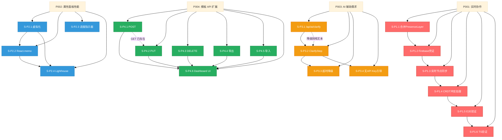

# VibeX Sprint 27 — 实施计划

**Agent**: architect
**日期**: 2026-05-07
**项目**: vibex-proposals-sprint27

---

## 1. 概述

**总工期**: 15-17h（2人 Sprint 60h，可行）
**Sprint 周期**: 2 周（Week 1: Day 1-5 / Week 2: Day 6-10）

### 推荐执行顺序

1. **P002** → 属性面板性能（低风险，独立，无依赖）
2. **P004** → 模板 API 扩展（低风险，独立，CRUD 已有 GET 基础）
3. **P003** → AI 辅助需求（依赖 LLM API 配置，Coord 介入）
4. **P001** → 实时协作（复杂度最高，依赖 Firebase 配置 + worktree 合并）

---

## 2. Epic & Story 清单

### P002: 属性面板性能优化（3h）

| Story | 描述 | 工时 | 依赖 |
|--------|------|------|------|
| S-P2.1 | 引入 react-window FixedSizeList，属性列表虚拟化 | 1.5h | 无 |
| S-P2.2 | 所有属性组件添加 React.memo + useMemo | 0.5h | 无 |
| S-P2.3 | 大型项目（>200 nodes）加载进度指示器 | 0.5h | 无 |
| S-P2.4 | Lighthouse Performance 验证 ≥ 85 | 0.5h | S-P2.1, S-P2.2 |

### P004: 模板 API 扩展（3h）

| Story | 描述 | 工时 | 依赖 |
|--------|------|------|------|
| S-P4.1 | POST /api/v1/templates 创建模板 | 0.5h | 无 |
| S-P4.2 | PUT /api/v1/templates/:id 更新模板 | 0.5h | 无 |
| S-P4.3 | DELETE /api/v1/templates/:id 删除模板 | 0.5h | 无 |
| S-P4.4 | GET /api/v1/templates/:id/export JSON 导出 | 0.5h | 无 |
| S-P4.5 | POST /api/v1/templates/import JSON 导入 | 0.5h | 无 |
| S-P4.6 | /dashboard/templates 页面 UI | 0.5h | S-P4.1 |

### P003: AI 辅助需求解析（3h）

| Story | 描述 | 工时 | 依赖 |
|--------|------|------|------|
| S-P3.1 | POST /api/ai/clarify endpoint（含降级逻辑） | 1h | 无 |
| S-P3.2 | ClarifyStep 集成 AI 解析，显示结构化预览 | 1h | S-P3.1 |
| S-P3.3 | 超时 30s 降级为纯文本，不阻断 Onboarding | 0.5h | S-P3.2 |
| S-P3.4 | 无 API Key 时显示引导提示 | 0.5h | S-P3.1 |

### P001: 实时协作（6-8h）

| Story | 描述 | 工时 | 依赖 |
|--------|------|------|------|
| S-P1.1 | 合并 PresenceLayer 从 ts-fix-worktree 到 main | 1h | Firebase 凭证 |
| S-P1.2 | 配置 .env.staging Firebase 凭证 | 0.5h | Coord + DevOps |
| S-P1.3 | 实现实时节点同步（Firebase onValue 监听） | 2h | S-P1.1 |
| S-P1.4 | 冲突处理：Yjs CRDT 或 last-write-wins | 2h | S-P1.3 |
| S-P1.5 | E2E presence-mvp.spec.ts staging 验证 | 1h | S-P1.1, S-P1.2 |
| S-P1.6 | TS 编译 0 errors 验证 | 0.5h | 全上 |

---

## 3. Sprint 规划

### Week 1 — Day 1-5

| Day | Track A（前端） | Track B（后端/其他） |
|-----|----------------|---------------------|
| **Day 1** | [ ] S-P2.1 属性面板虚拟化（1.5h） | [ ] S-P4.1 POST /templates（0.5h） |
| | | [ ] S-P4.2 PUT /templates/:id（0.5h） |
| **Day 2** | [ ] S-P2.2 React.memo + useMemo（0.5h） | [ ] S-P4.3 DELETE /templates（0.5h） |
| | | [ ] S-P4.4 模板导出（0.5h） |
| **Day 3** | [ ] S-P2.3 加载进度指示器（0.5h） | [ ] S-P4.5 模板导入（0.5h） |
| | | [ ] S-P3.1 /api/ai/clarify（1h） |
| **Day 4** | [ ] S-P4.6 /dashboard/templates UI（0.5h） | [ ] S-P3.2 ClarifyStep AI 集成（1h） |
| **Day 5** | [ ] S-P2.4 Lighthouse 验证（0.5h） | [ ] S-P3.3 超时降级（0.5h） |
| | | [ ] S-P3.4 无 API Key 引导（0.5h） |

**Week 1 里程碑** 🔵：
- P002 完成（属性面板性能）
- P004 完成（模板 API CRUD + Dashboard）
- P003 完成（AI 解析 + 降级）

---

### Week 2 — Day 6-10

| Day | Track A | Track B |
|-----|---------|---------|
| **Day 6** | [ ] S-P1.1 合并 PresenceLayer（1h） | [ ] S-P1.2 Firebase 凭证配置（0.5h） |
| **Day 7** | [ ] S-P1.3 实时节点同步（2h） | |
| **Day 8** | [ ] S-P1.4 冲突处理 CRDT（2h） | |
| **Day 9** | [ ] S-P1.5 E2E staging 验证（1h） | [ ] Buffer / 收尾 |
| **Day 10** | [ ] S-P1.6 TS 编译验证（0.5h） | 🔵 **P001 完成** |

**Week 2 里程碑** 🔴：
- P001 完成（实时协作）
- Sprint 27 完成

---

## 4. 并行策略

```
完全并行:
  P002 / P004 — 独立模块，无共享代码
  P003 / P004 — 独立 API，独立页面

必须串行:
  S-P1.1 → S-P1.3 → S-P1.4 → S-P1.5  (P001 协作链)
  S-P3.1 → S-P3.2 → S-P3.3            (P003 AI 链)
  S-P4.1 → S-P4.6                     (P004 CRUD → UI)
```

### 团队分工

- **Developer A**: P002（P1.1-P1.3）+ P003
- **Developer B**: P004 + P001 基础设施

---

## 5. 依赖关系图



---

## 6. 风险缓解

| ID | 功能 | 风险 | 缓解 |
|----|------|------|------|
| R1 | P001 | Firebase 凭证申请需 Coord + DevOps | **Day 1 前完成配置**，否则 P001 降级为离线模式 |
| R2 | P001 | worktree 合并可能冲突 | 尽早合并，隔离分支 PR |
| R3 | P001 | 无 CRDT 可能覆盖 | 采用 Yjs 或 last-write-wins，Day 8 前验证 |
| R4 | P003 | LLM 成本不可预测 | 设置 usage limit，降级到规则引擎 |
| R5 | P002 | react-window 破坏滚动状态 | 隔离分支 PR，专项 QA |
| R6 | P003 | 用户输入质量差导致 AI 失败 | UI 引导 + 降级到手动输入 |
| R7 | P004 | 模板 JSON schema 变化 | 版本化 schema + 校验 |

---

## 7. DoD 验收清单

### P002 完成标准
- [ ] react-window FixedSizeList 引入，DOM 节点 ≤ 25
- [ ] 属性面板渲染 < 200ms（300 节点项目）
- [ ] 加载进度指示器 > 200 nodes 时可见
- [ ] Lighthouse Performance ≥ 85
- [ ] TS 编译 0 errors

### P004 完成标准
- [ ] GET /api/v1/templates → 200，数组 ≥ 3
- [ ] POST /api/v1/templates → 201，创建后能 GET
- [ ] PUT /api/v1/templates/:id → 200，字段更新生效
- [ ] DELETE /api/v1/templates/:id → 200，再次 GET → 404
- [ ] 模板导出 JSON 下载可用
- [ ] 模板导入 JSON 解析正确
- [ ] /dashboard/templates 页面可访问

### P003 完成标准
- [ ] /api/ai/clarify 返回结构化 JSON（role/goal/constraints）
- [ ] ClarifyStep 显示 AI 解析预览，可编辑确认
- [ ] 超时 30s 降级为纯文本，不阻断 Onboarding
- [ ] 无 API Key 显示引导提示
- [ ] TS 编译 0 errors

### P001 完成标准
- [ ] PresenceLayer 合并到 main，Code Review 通过
- [ ] .env.staging 配置 Firebase 凭证，RTDB 可写入
- [ ] 实时节点同步实现（多人同时编辑无覆盖）
- [ ] usePresence() TS 编译 0 errors
- [ ] presence-mvp.spec.ts staging 全部通过

---

## 8. 交付物清单

| 交付物 | 路径 | 负责人 |
|--------|------|--------|
| PRD 文档 | docs/vibex-proposals-sprint27/prd.md | PM |
| 分析报告 | docs/vibex-proposals-sprint27/analysis.md | Analyst |
| 架构设计 | docs/vibex-proposals-sprint27/architecture.md | Architect |
| 实施计划 | docs/vibex-proposals-sprint27/IMPLEMENTATION_PLAN.md | Architect |
| 开发约束 | docs/vibex-proposals-sprint27/AGENTS.md | Architect |