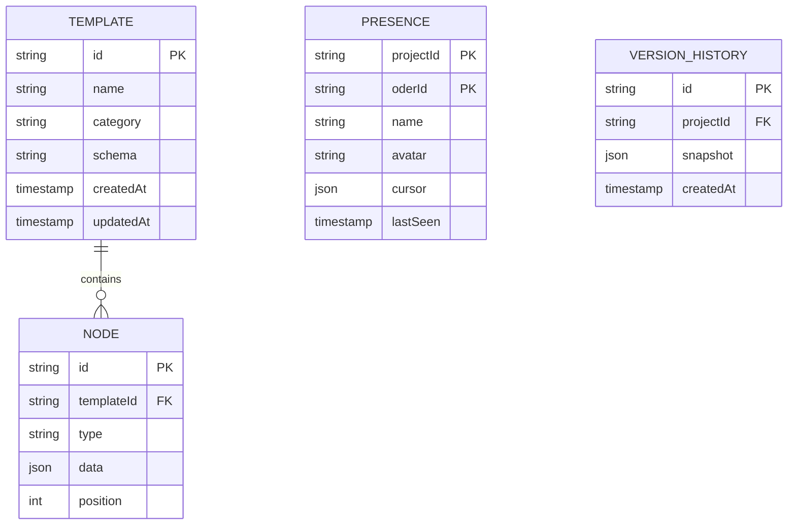

# VibeX Sprint 27 — 架构设计

**Agent**: architect
**日期**: 2026-05-07
**项目**: vibex-proposals-sprint27
**工作目录**: /root/.openclaw/vibex

---

## 1. 技术栈

| 层级 | 技术选型 | 版本 | 理由 |
|------|---------|------|------|
| 前端框架 | Next.js + React | 14.x | 现有架构，App Router |
| 状态管理 | Zustand | 5.x | Canvas 状态管理已用 |
| 后端 | Node.js + Express | 20.x | 现有 backend |
| 实时通信 | Firebase RTDB | 现有 | P001 已部分实现 |
| LLM | OpenAI GPT-4o-mini | API | P003 AI 解析 |
| 虚拟化 | react-window | 1.8.x | P002 属性面板 |
| 协作同步 | Yjs | 13.x | P001 CRDT 冲突处理（备选 last-write-wins） |
| 样式 | Tailwind CSS | 3.x | 现有 |

### Tech Stack 选择理由

- **Firebase RTDB**：P001 基础设施已接入 ts-fix-worktree，零额外成本
- **OpenAI GPT-4o-mini**：成本最低的语义理解方案，P003 降级到规则引擎
- **react-window**：业界成熟方案，DOM 节点 200→20，性能提升显著
- **Yjs CRDT**：协作编辑冲突处理行业标准，Firebase 生态支持好

---

## 2. 系统架构图

```mermaid
%%{init: {'theme': 'base', 'themeVariables': { 'fontSize': '12px'}}}%%
graph TB
    subgraph Client["前端 (Next.js App Router)"]
        subgraph Canvas["/canvas/[projectId]"]
            PC[PropertyPanel<br/>属性面板<br/>⚡P002]
            PL[PresenceLayer<br/>用户头像层<br/>🔴P001]
            CL[CursorLayer<br/>光标跟随<br/>🔴P001]
        end

        subgraph Onboarding["/onboarding/"]
            CS[ClarifyStep<br/>AI 需求解析<br/>🟡P003]
            AIP[AIParsePreview<br/>结构化预览]
            PR[PreviewStep<br/>模板过滤]
        end

        subgraph Dashboard["/dashboard/templates"]
            TL[TemplateList<br/>模板列表]
            TF[TemplateForm<br/>新建/编辑]
        end

        subgraph Hooks["关键 Hooks"]
            UP[usePresence<br/>🔴P001]
            UT[useTemplates<br/>已存在·P003依赖]
            UM[useMemoOptimization<br/>⚡P002]
        end
    end

    subgraph Backend["后端 (Node.js + Express)"]
        APIv1[/api/v1/templates<br/>⚡P004]
        AIA[/api/ai/clarify<br/>🟡P003]
        VH[version-history API<br/>已有·Sprint26]
        RBAC[RBAC Middleware<br/>已有·Sprint25]
    end

    subgraph External["外部服务"]
        FB[Firebase RTDB<br/>🔴P001]
        OAI[OpenAI API<br/>🟡P003]
        YJS[Yjs CRDT Server<br/>🔴P001 备选]
    end

    subgraph Storage["存储层"]
        DB[(SQLite<br/>project_versions<br/>已有)]
        FS[(文件系统<br/>模板 JSON<br/>⚡P004)]
        RDC[(Redis<br/>Session Cache<br/>已有)]
    end

    %% P001 Real-time Collab
    PL --> UP
    UP --> FB
    PC -->|useEffect| FB
    UP -->|last-write-wins| PC
    FB -.->|降级 mock| PL

    %% P002 Performance
    PC --> UM
    UM -->|react-window| PC

    %% P003 AI Assisted
    CS --> AIA
    AIA --> OAI
    CS --> AIP
    AIP --> PR
    PR -->|useTemplates| UT
    UT --> APIv1

    %% P004 Template CRUD
    TL --> APIv1
    TF --> APIv1
    APIv1 --> FS
    APIv1 -->|P004| DB

    %% Shared
    APIv1 --> RBAC
    AIA --> RBAC

    classDef red fill:#ff6b6b,stroke:#c0392b,color:white
    classDef yellow fill:#f39c12,stroke:#e67e22,color:white
    classDef blue fill:#3498db,stroke:#2980b9,color:white
    classDef green fill:#27ae60,stroke:#1e8449,color:white

    class PC,UM blue
    class PL,UP,CL red
    class CS,AIP,PR,AIA yellow
    class TL,TF,APIv1 green
```

---

## 3. API 定义

### P001: Real-time Collaboration

#### `usePresence(projectId: string)`

```typescript
// Hook 返回类型
interface PresenceState {
  users: PresenceUser[];
  isConnected: boolean;
  isFallback: boolean; // Firebase 未配置时为 true
  error: string | null;
}

interface PresenceUser {
  id: string;
  name: string;
  avatar: string;
  cursor: { x: number; y: number } | null;
  lastSeen: number;
}

// 用法
const { users, isConnected, isFallback } = usePresence(projectId);
```

#### Firebase RTDB 路径

```
/presence/{projectId}/{userId} → {
  name: string,
  avatar: string,
  cursor: { x: number, y: number } | null,
  lastSeen: timestamp
}
```

#### 节点同步路径（P001 新增）

```
/canvas/{projectId}/nodes/{nodeId} → NodeData
/events/{projectId}/{nodeId} → { op: 'update', userId, timestamp, data }
```

### P002: 属性面板性能优化

#### `PropertyPanel` Props

```typescript
interface PropertyPanelProps {
  projectId: string;
  nodeId?: string;
  loading?: boolean; // 加载状态 >200 nodes 时为 true
}
```

#### `PropertyList` 虚拟化接口

```typescript
// 使用 react-window FixedSizeList
interface PropertyListProps {
  items: PropertyItem[];
  height: number; // 固定高度，容器决定
  itemHeight: number; // 每行高度，默认 36px
  overscanCount?: number; // 渲染区域外缓冲行数，默认 3
}

// PropertyItem 结构
interface PropertyItem {
  id: string;
  label: string;
  value: string | number | boolean;
  type: 'string' | 'number' | 'boolean' | 'select';
}
```

### P003: AI-Assisted Requirements

#### `POST /api/ai/clarify`

**Request:**
```json
{
  "text": "我想做一个登录功能，包括用户名密码和验证码"
}
```

**Response (200):**
```json
{
  "success": true,
  "data": {
    "role": "终端用户 / 系统管理员",
    "goal": "通过用户名+密码+验证码完成身份认证",
    "constraints": ["安全性：密码需加密存储", "可用性：验证码有效期", "兼容性：支持记住登录状态"]
  },
  "fallback": false
}
```

**Response (降级):**
```json
{
  "success": true,
  "data": {
    "text": "我想做一个登录功能，包括用户名密码和验证码"
  },
  "fallback": true,
  "reason": "LLM_TIMEOUT | LLM_ERROR | NO_API_KEY"
}
```

#### `ClarifyStep` 组件接口

```typescript
interface ClarifyStepProps {
  onParsed: (result: ParseResult) => void;
  onFallback: (originalText: string) => void;
  timeout?: number; // 默认 30000ms
}

interface ParseResult {
  role: string;
  goal: string;
  constraints: string[];
}
```

### P004: Template API 扩展

#### `GET /api/v1/templates`

**Response (200):**
```json
{
  "templates": [
    { "id": "1", "name": "登录系统模板", "category": "auth", "createdAt": "..." },
    { "id": "2", "name": "数据看板模板", "category": "dashboard", "createdAt": "..." },
    { "id": "3", "name": "电商后台模板", "category": "ecommerce", "createdAt": "..." }
  ]
}
```

#### `POST /api/v1/templates`

**Request:**
```json
{
  "name": "我的自定义模板",
  "category": "custom",
  "nodes": [{ "id": "node1", "type": "canvas", "data": {} }],
  "schema": "1.0"
}
```

**Response (201):**
```json
{
  "id": "generated-uuid",
  "name": "我的自定义模板",
  "category": "custom",
  "createdAt": "2026-05-07T00:00:00Z"
}
```

#### `PUT /api/v1/templates/:id`

**Request:**
```json
{
  "name": "更新后的模板名",
  "category": "custom"
}
```

**Response (200):** 更新后的模板对象

#### `DELETE /api/v1/templates/:id`

**Response (200):**
```json
{ "success": true, "deletedId": "template-id" }
```

#### `GET /api/v1/templates/:id/export`

**Response (200):** 文件下载 `Content-Disposition: attachment; filename="{name}.json"`

#### `POST /api/v1/templates/import`

**Request:** `multipart/form-data`
- `file`: JSON 模板文件
- `name`: 模板名称（可选，从 JSON 读取）

**Response (201):** 创建后的模板对象

---

## 4. 数据模型



---

## 5. 测试策略

### 测试框架
- **Unit**: Jest（现有）
- **E2E**: Playwright（现有 `presence-mvp.spec.ts`）
- **性能**: Lighthouse CI（新增）

### 覆盖率目标
- **核心业务逻辑（API routes）**: ≥ 80%
- **React 组件**: ≥ 60%（重点：PropertyPanel、ClarifyStep、TemplateList）
- **Hooks**: ≥ 80%（新增 usePresence、useTemplates）

### P001 测试用例

```typescript
// presence.spec.ts
describe('usePresence', () => {
  it('降级 mock 时不抛异常', async () => {
    process.env.FIREBASE_DATABASE_URL = '';
    const { result } = renderHook(() => usePresence('test-project'));
    await waitFor(() => {
      expect(result.current.isFallback).toBe(true);
    });
  });

  it('多人 presence 时各用户头像可见', async () => {
    const { getByTestId } = render(<PresenceLayer projectId="test" />);
    // Mock 2 个用户
    await simulateUserMove('user-a', { x: 100, y: 200 });
    await waitFor(() => {
      expect(getByTestId('avatar-user-a')).toBeVisible();
    });
  });

  it('节流 100ms 内不重复发送', async () => {
    const sendSpy = jest.spyOn(FirebaseClient, 'sendPresence');
    fireEvent.mouseMove(canvas, { clientX: 10, clientY: 20 });
    fireEvent.mouseMove(canvas, { clientX: 11, clientY: 21 });
    await waitForTimeout(150);
    expect(sendSpy).toHaveBeenCalledTimes(1);
  });
});
```

### P002 测试用例

```typescript
// property-panel.spec.ts
describe('PropertyPanel Performance', () => {
  it('300 节点渲染 < 200ms', async () => {
    const start = performance.now();
    render(<PropertyPanel projectId="large-project" />);
    await waitForIdle();
    expect(performance.now() - start).toBeLessThan(200);
  });

  it('虚拟化列表 DOM 节点数 ≤ 25', async () => {
    render(<PropertyList items={generateItems(300)} height={400} itemHeight={36} />);
    const domNodes = document.querySelectorAll('[data-testid="property-row"]');
    expect(domNodes.length).toBeLessThanOrEqual(25);
  });

  it('加载进度指示器在 >200 nodes 时可见', async () => {
    render(<PropertyPanel projectId="large-project" loading={true} />);
    expect(screen.getByTestId('loading-spinner')).toBeVisible();
  });
});
```

### P003 测试用例

```typescript
// ai-clarify.spec.ts
describe('ClarifyStep AI', () => {
  it('调用 /api/ai/clarify 返回结构化结果', async () => {
    const res = await request(app)
      .post('/api/ai/clarify')
      .send({ text: '我想做一个登录功能，包括用户名密码和验证码' });
    expect(res.status).toBe(200);
    expect(res.body.data).toHaveProperty('role');
    expect(res.body.data).toHaveProperty('goal');
    expect(res.body.data).toHaveProperty('constraints');
  });

  it('超时 30s 后降级为纯文本', async () => {
    jest.useFakeTimers();
    const res = await request(app)
      .post('/api/ai/clarify')
      .send({ text: '登录功能' });
    await waitForTimeout(31000);
    jest.runAllTimers();
    expect(res.body.fallback).toBe(true);
    expect(res.body.data).toHaveProperty('text');
  });
});
```

### P004 测试用例

```typescript
// template-api.spec.ts
describe('Template CRUD', () => {
  it('POST /api/v1/templates → 201 + 可 GET', async () => {
    const create = await request(app).post('/api/v1/templates').send({
      name: 'Test Template',
      nodes: [],
      schema: '1.0'
    });
    expect(create.status).toBe(201);
    const get = await request(app).get(`/api/v1/templates/${create.body.id}`);
    expect(get.status).toBe(200);
  });

  it('DELETE /api/v1/templates/:id → 200 + 再次 GET → 404', async () => {
    const created = await request(app).post('/api/v1/templates').send({ name: 'ToDelete' });
    await request(app).delete(`/api/v1/templates/${created.body.id}`);
    const res = await request(app).get(`/api/v1/templates/${created.body.id}`);
    expect(res.status).toBe(404);
  });

  it('导出 JSON 文件下载', async () => {
    const res = await request(app).get('/api/v1/templates/t1/export');
    expect(res.headers['content-disposition']).toContain('attachment');
    expect(JSON.parse(res.text)).toHaveProperty('name');
  });

  it('导入无效 JSON → 400', async () => {
    const res = await request(app)
      .post('/api/v1/templates/import')
      .attach('file', Buffer.from('not valid json'), 'bad.json');
    expect(res.status).toBe(400);
  });
});
```

---

## 6. 性能影响评估

| 功能 | 影响维度 | 评估 | 缓解措施 |
|------|---------|------|---------|
| P001 Presence | Firebase RTDB 写入频率 | 中 — 节流 100ms，频率可控 | 降级 mock 无网络请求 |
| P001 节点同步 | Firebase 带宽 + 冲突处理 | 高 — 多用户同时编辑 | Yjs CRDT 按需同步，懒加载 |
| P002 react-window | JS bundle 增加 | 低 — ~3KB gzip | Code split，按需加载 |
| P002 渲染 | 首次渲染时间 | 显著降低 — DOM 200→20 | 配合 Suspense 边界 |
| P003 AI 调用 | OpenAI API 延迟 + 成本 | 中 — 单次请求 < 30s | 超时降级，本地缓存 |
| P004 模板 CRUD | 文件系统 I/O | 低 — JSON 小文件 | 批量操作优化 |

### Lighthouse Performance 目标

- **P002 优化后**: Performance Score ≥ 85（大型项目场景）
- **其他功能**: 保持 ≥ 90

---

## 7. 部署与配置

### 环境变量

```env
# P001 Firebase (coord 配置)
FIREBASE_DATABASE_URL=https://vibex-xxx-default-rtdb.firebaseio.com
FIREBASE_API_KEY=...
FIREBASE_AUTH_DOMAIN=...

# P003 OpenAI
OPENAI_API_KEY=sk-...
LLM_TIMEOUT_MS=30000

# P004 Template Storage
TEMPLATE_STORAGE_PATH=./data/templates
```

---

## 执行决策

- **决策**: 已采纳
- **执行项目**: vibex-proposals-sprint27
- **执行日期**: 2026-05-07