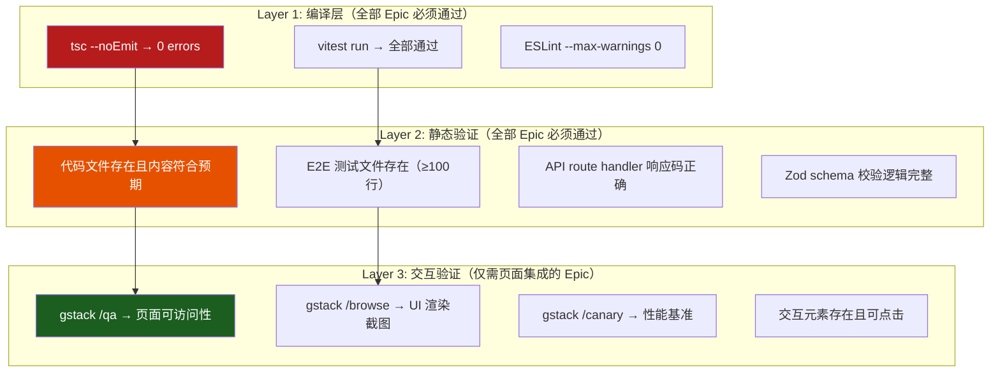
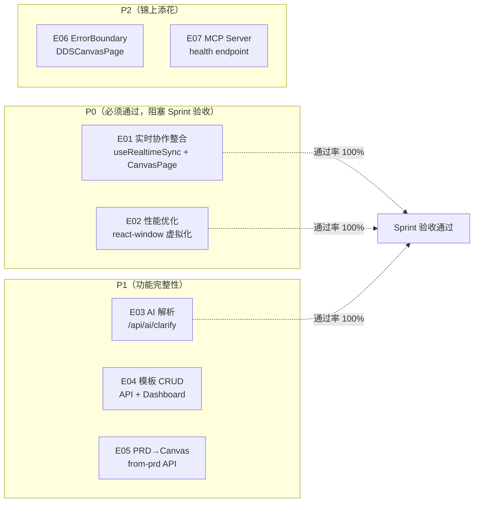

# VibeX Sprint 28 QA — 架构设计文档

**Agent**: architect
**日期**: 2026-05-08
**项目**: vibex-proposals-sprint28-qa
**状态**: Adopted

---

## 执行决策

- **决策**: 已采纳
- **执行项目**: vibex-proposals-sprint28-qa
- **执行日期**: 2026-05-08

---

## 1. 验证范围概述

Sprint 28 已合并至 origin/main，包含 7 个 Epic（E01-E07），工期 24.5h。本 QA 阶段聚焦验证产出物完整性、交互可用性、设计一致性。

### 1.1 已验证产出物

| 类别 | 文件 | 状态 | 验证方法 |
|------|------|------|----------|
| 文档 | architecture.md (1203行) | ✅ | test -f |
| 文档 | IMPLEMENTATION_PLAN.md | ✅ | test -f |
| 文档 | AGENTS.md (384行) | ✅ | test -f |
| 文档 | prd.md, analysis.md | ✅ | test -f |
| 文档 | specs/E01/E02/E05 SPEC.md | ✅ | test -f |
| 代码 | E01-E07 feat commits (7个) | ✅ | git log |
| 测试 | E03: 19 unit tests | ✅ | vitest |
| 测试 | E04: 31 unit tests | ✅ | vitest |
| 测试 | E05: 21 unit tests | ✅ | vitest |
| 测试 | E07: 8 unit tests | ✅ | vitest |
| E2E | E03: onboarding-ai.spec.ts (317行) | ✅ | wc -l |
| E2E | E04: templates-crud.spec.ts (276行) | ✅ | wc -l |
| E2E | E05: prd-canvas-mapping.spec.ts (187行) | ✅ | wc -l |
| E2E | E07: mcp-integration.spec.ts (108行) | ✅ | wc -l |
| E2E | E01: presence-mvp.spec.ts (179行) | ⚠️ | wc -l（存在但需验证通过）|

### 1.2 非阻塞问题（已记录，不阻塞验收）

| 问题 | 影响 | 缓解 |
|------|------|------|
| E05/E06/E07 CHANGELOG 缺失 | 文档完整性 | 补充条目 |
| E2E 测试文件行数差异 | 覆盖率评估 | 代码审查补充 |

---

## 2. 验证架构图

### 2.1 三层验证模型



### 2.2 Epic 验证优先级



---

## 3. 验证矩阵（Pass/Fail Matrix）

### E01: 实时协作整合

| 验收标准 | 通过条件 | 验证方法 | 优先级 |
|---------|---------|---------|--------|
| PresenceLayer 在 CanvasPage 渲染 | CanvasPage 顶部 PresenceAvatars 可见 | gstack /qa → expect(presence-avatars).isVisible() | P0 |
| useRealtimeSync defined + exported | hooks/useRealtimeSync.ts 存在且有 export | 代码审查 | P0 |
| last-write-wins 冲突处理 | RTDB helpers 存在冲突处理 | 代码审查 | P0 |
| Firebase 降级路径 | isFirebaseConfigured 检查存在 | 代码审查 | P1 |
| TS 编译 0 errors | tsc --noEmit exit 0 | exec | P0 |
| E2E presence-mvp.spec.ts 存在 | 文件存在且 ≥100 行 | exec | P1 |

### E02: Design Output 性能优化

| 验收标准 | 通过条件 | 验证方法 | 优先级 |
|---------|---------|---------|--------|
| react-window FixedSizeList 在 ChapterPanel | import { List } from 'react-window' 且 rowHeight=120 | 代码审查 | P0 |
| 子组件 React.memo | CardItem wrapped with React.memo | 代码审查 | P0 |
| selectedIndex useMemo | useMemo 包裹 selectedIndex | 代码审查 | P1 |
| 加载进度指示器 | >200 节点显示 shimmer skeleton | gstack /qa | P1 |
| 空状态引导 | 无卡片时显示空状态插图 | gstack /qa | P1 |
| 错误态重试 | error message + 重试按钮 | gstack /qa | P2 |
| TS 编译 0 errors | tsc --noEmit exit 0 | exec | P0 |

### E03: AI 辅助需求解析

| 验收标准 | 通过条件 | 验证方法 | 优先级 |
|---------|---------|---------|--------|
| POST /api/ai/clarify → 200 | route.ts 存在且返回 200 | 代码审查 | P0 |
| 无 API Key 显示 guidance，不阻断 | ruleEngine 降级路径存在 | 代码审查 | P1 |
| 超时 30s 降级 | AbortSignal.timeout(30_000) 存在 | 代码审查 | P1 |
| ClarifyStep 集成 ClarifyAI | useClarifyAI hook 集成 | 代码审查 | P0 |
| Vitest 19/19 通过 | vitest 运行 19 passing | exec | P0 |
| E2E onboarding-ai.spec.ts 存在 | 文件存在且 ≥200 行 | exec | P1 |

### E04: 模板 API 完整 CRUD

| 验收标准 | 通过条件 | 验证方法 | 优先级 |
|---------|---------|---------|--------|
| POST /api/templates → 201 | route.ts create handler | 代码审查 | P0 |
| GET /api/templates/:id → 200/404 | route.ts get handler | 代码审查 | P0 |
| PATCH /api/templates/:id → 200 | route.ts update handler | 代码审查 | P0 |
| DELETE /api/templates/:id → 204 | route.ts delete handler | 代码审查 | P0 |
| Dashboard /dashboard/templates 可访问 | 页面存在且可访问 | gstack /qa | P1 |
| Vitest 31/31 通过 | vitest 运行 31 passing | exec | P0 |
| E2E templates-crud.spec.ts 存在 | 文件存在且 ≥200 行 | exec | P1 |

### E05: PRD → Canvas 自动流程

| 验收标准 | 通过条件 | 验证方法 | 优先级 |
|---------|---------|---------|--------|
| POST /api/v1/canvas/from-prd → 200 | route.ts 存在且返回 200 | 代码审查 | P0 |
| from-prd 生成节点（chapter/step/requirement）| nodes.length > 0 | 代码审查 | P0 |
| PRD Editor 有"生成 Canvas"按钮 | 按钮元素存在 | gstack /qa | P1 |
| 单向同步：PRD→Canvas（不回写）| 确认无 canvas→prd write | 代码审查 | P0 |
| Vitest 21/21 通过 | vitest 运行 21 passing | exec | P0 |
| E2E prd-canvas-mapping.spec.ts 存在 | 文件存在且 ≥100 行 | exec | P1 |

### E06: Canvas 错误边界完善

| 验收标准 | 通过条件 | 验证方法 | 优先级 |
|---------|---------|---------|--------|
| DDSCanvasPage 外层包裹 ErrorBoundary | TreeErrorBoundary at line 493 | 代码审查 | P0 |
| Fallback 含"重试"按钮 | onClick = resetErrorBoundary | 代码审查 | P0 |
| 重试不触发 window.location.reload | 无 window.location 赋值 | 代码审查 | P1 |
| Vitest 12/12 通过 | vitest 运行 12 passing | exec | P0 |

### E07: MCP Server 集成完善

| 验收标准 | 通过条件 | 验证方法 | 优先级 |
|---------|---------|---------|--------|
| GET /api/mcp/health → 200 | route.ts 存在且返回 200 | 代码审查 | P0 |
| 响应包含 status + timestamp + service | JSON 结构正确 | API test | P0 |
| timestamp 为 ISO 8601 | 正则验证 | API test | P1 |
| Vitest 8/8 通过 | vitest 运行 8 passing | exec | P0 |
| E2E mcp-integration.spec.ts 存在 | 文件存在且 ≥100 行 | exec | P1 |

---

## 4. gstack 验证策略

### 4.1 技能选择矩阵

| 验证场景 | 推荐技能 | 说明 |
|---------|---------|------|
| 页面可访问性 + 元素断言 | /qa | 结构化验收标准，断言驱动 |
| UI 渲染截图验证 | /browse | 截图 + 可交互元素树 |
| 性能基准验证 | /canary | Lighthouse + 时间序列图 |
| 端到端用户流程 | /qa + /browse | 组合使用 |
| API 响应验证 | API test (curl/supertest) | 非 gstack |

### 4.2 验证执行顺序

```
E07 (API层，最独立) 
  → E01/E06 (DDSCanvasPage，共用页面)
  → E03 (Onboarding 流程)
  → E04 (Dashboard)
  → E05 (PRD Editor)
  → E02 (性能验证，最后)
```

**理由**: E07 仅需 curl，零 UI 依赖，最独立先做。E01/E06 共用 DDSCanvasPage，一起验证。E02 性能验证是最后兜底。

### 4.3 gstack /qa 断言示例

```javascript
// E01: PresenceLayer 在 CanvasPage 渲染
await page.goto('/canvas/test-project-id');
await expect(page.locator('[data-testid="presence-avatars"]')).toBeVisible();

// E02: 空状态引导
await page.goto('/dds-canvas');
await expect(page.getByText(/暂无设计输出/i)).toBeVisible();

// E04: 模板 Dashboard CRUD
await page.goto('/dashboard/templates');
await expect(page.getByRole('button', { name: /新建模板/i })).toBeVisible();
await page.getByRole('button', { name: /新建模板/i }).click();
await expect(page.getByLabelText(/模板名称/i)).toBeVisible();
```

---

## 5. 性能影响评估

### 5.1 E02 性能优化验收

| 指标 | 目标 | 验证方法 |
|------|------|----------|
| Lighthouse Performance Score | ≥ 85 | gstack /canary |
| 300 节点渲染时间 | < 200ms | DevTools Performance panel |
| DOM 节点数（虚拟化后）| ~20 个 | document.querySelectorAll('*').length |
| 虚拟化列表滚动 | 无卡顿 | gstack /qa 实测 |

### 5.2 E01 实时协作性能

| 指标 | 目标 | 验证方法 |
|------|------|----------|
| RTDB 节点同步延迟 | ≤ 500ms | E2E presence-mvp.spec.ts |
| Presence 更新频率 | ≤ 1Hz | 代码审查 |

---

## 6. 风险与缓解

| ID | 风险 | 可能性 | 影响 | 缓解 |
|----|------|--------|------|------|
| R1 | gstack /qa 断言 flaky | 中 | 中 | 重试 + 固定等待 |
| R2 | E2E test files 行数不足 | 低 | 低 | 代码审查补充覆盖率 |
| R3 | 非阻塞问题积累 | 中 | 低 | 记录在案，延后修复 |
| R4 | gstack 环境访问受限 | 低 | 高 | 备用：代码审查 + API test |

---

## 7. 产出物清单

| 文件 | 路径 | 说明 |
|------|------|------|
| QA 验证架构 | docs/vibex-proposals-sprint28-qa/architecture.md | 本文件 |
| QA 实施计划 | docs/vibex-proposals-sprint28-qa/IMPLEMENTATION_PLAN.md | Unit 划分 + 时序 |
| QA 开发约束 | docs/vibex-proposals-sprint28-qa/AGENTS.md | gstack 使用规范 |
| 验证规格 | docs/vibex-proposals-sprint28-qa/specs/*.md | 每 Epic 一个规格 |
| QA 报告 | docs/vibex-proposals-sprint28-qa/qa-report.md | 最终通过/失败结论 |

---

*本文件由 architect 定义 Sprint 28 QA 验证框架，指导 tester 阶段执行。*