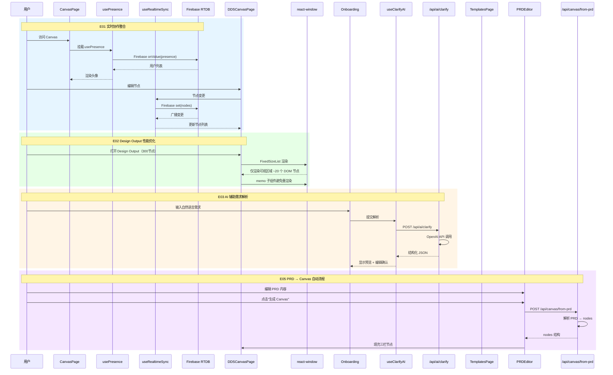
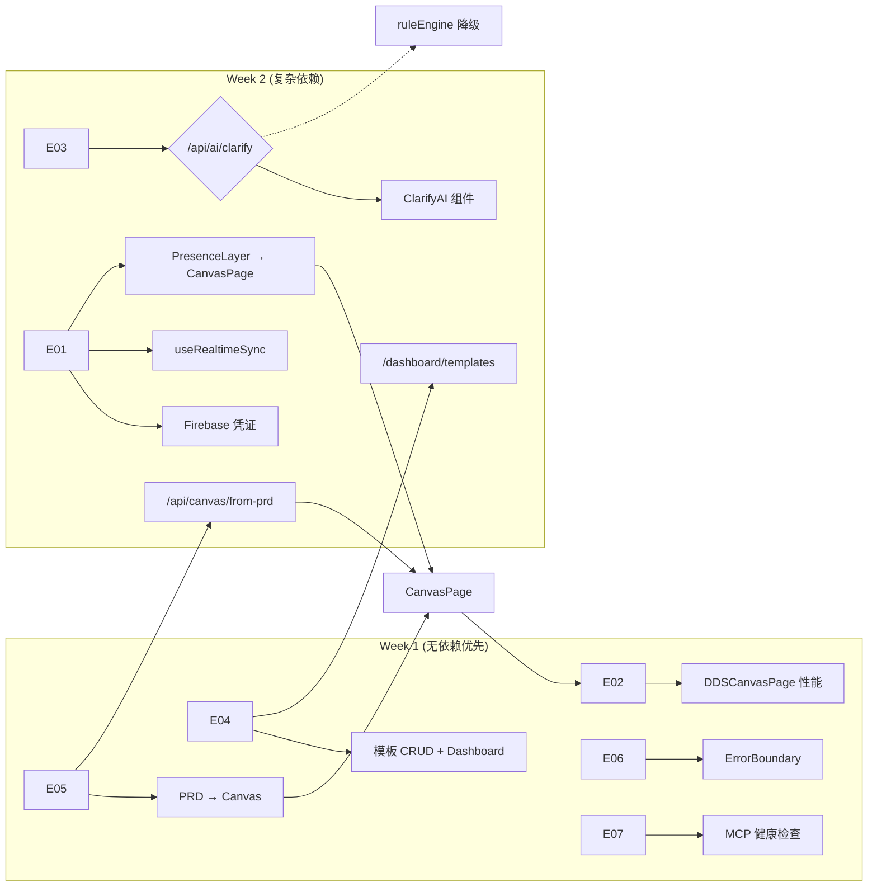

# VibeX Sprint 28 — 架构设计文档

**项目**: vibex-proposals-sprint28
**架构师**: Architect Agent
**日期**: 2026-05-07
**状态**: Draft

---

## 执行决策

- **决策**: 已采纳
- **执行项目**: vibex-proposals-sprint28
- **执行日期**: 2026-05-07

---

## 1. 技术栈

### 1.1 现有技术栈（基于 package.json 验证）

| 技术 | 版本 | 选择理由 |
|-----|------|---------|
| Next.js | 16.2.0 | App Router，已验证 |
| React | 19.2.3 | 最新稳定版 |
| TypeScript | 5.x | 类型安全 |
| Firebase SDK | 10.14.1 | 实时协作后端，已引入 |
| Zustand | 4.5.7 | 状态管理 |
| TanStack Query | 5.90.21 | 服务端状态 |
| @tanstack/react-virtual | 3.13.23 | 虚拟化列表（已有但未用于 DDSCanvasPage）|
| Vitest | 4.1.2 | 单元测试 |
| Playwright | 1.59.0 | E2E 测试 |
| openai | — | **新增**：AI 解析 |
| react-window | — | **新增**：列表虚拟化 |
| zod | 4.3.6 | 请求校验 |

### 1.2 新增依赖清单

```bash
# Sprint 28 新增（估算）
pnpm add openai          # E03 AI 解析
pnpm add react-window    # E02 列表虚拟化
```

> **注意**: Firebase SDK 已在 `dependencies` 中（v10.14.1），无需额外引入。`@tanstack/react-virtual` 已存在但 DDSCanvasPage 未使用，应优先评估直接复用而非引入新库。

---

## 2. 架构图

### 2.1 系统全貌图（7个 Epic 模块关系）

```mermaid
graph TB
    subgraph "前端层 (Next.js App Router)"
        subgraph "页面"
            CP[CanvasPage]
            DDP[DDSCanvasPage]
            TPL[DashboardTemplatesPage]
            PE[PRDEditor]
            OB[Onboarding / ClarifyStep]
        end
        
        subgraph "共享组件"
            EB[ErrorBoundary]
            PL[PresenceLayer]
        end
        
        subgraph "自定义 Hooks"
            UP[usePresence]
            URS[useRealtimeSync]
            UCA[useClarifyAI]
            UT[useTemplates]
        end
    end
    
    subgraph "业务层"
        subgraph "API Routes"
            AIC[/api/ai/clarify]
            TAPI[/api/v1/templates]
            FPRD[/api/canvas/from-prd]
            MCPH[/api/mcp/health]
        end
        
        subgraph "工具函数"
            P2C[prdToCanvas Mapper]
            RULE[RuleEngine (降级)]
        end
    end
    
    subgraph "数据层"
        subgraph "Firebase RTDB"
            PRE[presence/{projectId}/{userId}]
            RNC[nodes/{projectId}/{nodeId}]
        end
        
        subgraph "服务端"
            SQL[(Prisma / PostgreSQL)]
            INM[in-memory store (模板 MVP)]
        end
    end
    
    subgraph "外部服务"
        OAI[OpenAI GPT-4o-mini]
        MCP[MCP Server]
    end

    %% E01 实时协作
    CP --> PL
    PL --> UP
    UP --> URS
    URS --> RNC
    RNC --> AIC
    PRE --> AIC
    
    %% E02 性能优化
    DDP -.-> EB
    CP --> DDP
    
    %% E03 AI 解析
    OB --> UCA
    UCA --> AIC
    AIC --> OAI
    AIC -.-> RULE
    
    %% E04 模板 CRUD
    TPL --> UT
    UT --> TAPI
    TAPI --> INM
    
    %% E05 PRD → Canvas
    PE --> FPRD
    FPRD --> P2C
    P2C --> DDP
    
    %% E07 MCP
    MCPH --> MCP
    
    style EB fill:#ff6b6b,color:#fff
    style AIC fill:#4dabf7,color:#fff
    style OAI fill:#ffd43b,color:#333
    style DDP fill:#69db7c,color:#333
```

### 2.2 数据流图（每条 Epic 关键路径）



### 2.3 Firebase RTDB 结构

```mermaid
graph LR
    subgraph "Firebase Realtime Database"
        subgraph "presence/{projectId}/{userId}"
            P1[userId: string]
            P2[displayName: string]
            P3[avatar: string]
            P4[lastSeen: timestamp]
            P5[cursor: object]
        end
        
        subgraph "nodes/{projectId}/{nodeId}"
            N1[nodeId: string]
            N2[title: string]
            N3[type: "chapter"|"step"|"requirement"]
            N4[content: string]
            N5[updatedBy: userId]
            N6[updatedAt: timestamp]
        end
        
        subgraph "projects/{projectId}"
            PR1[name: string]
            PR2[members: array]
            PR3[prd: object]
        end
    end
```

---

## 3. API 定义

### 3.1 `/api/ai/clarify` — AI 需求解析

**Method**: `POST`
**Path**: `/api/ai/clarify`
**Headers**: `Content-Type: application/json`
**Auth**: Optional（无 Key 时降级）

**Request Body**:
```json
{
  "naturalLanguage": "我想做一个登录功能，支持邮箱和手机号登录"
}
```

**Request JSON Schema**:
```typescript
// Request
{
  "naturalLanguage": string,  // 用户自然语言输入，非空
}
```

**Response (200)**:
```json
{
  "structured": {
    "intent": "用户登录",
    "features": ["邮箱登录", "手机号登录"],
    "entities": ["用户账号", "登录凭证"],
    "flows": ["输入账号密码", "验证", "登录成功"],
    "confidence": 0.92
  },
  "fallback": false,
  "processingTime": 1200
}
```

**Response (500 - AI 不可用)**:
```json
{
  "structured": {
    "intent": "登录功能",
    "features": [],
    "entities": ["用户"],
    "flows": [],
    "confidence": 0.1
  },
  "fallback": true,
  "processingTime": 0,
  "message": "AI 解析不可用，已启用规则降级"
}
```

**Errors**:
| Status | Condition |
|--------|-----------|
| 400 | `naturalLanguage` 为空或缺失 |
| 500 | OpenAI API 超时（30s）或异常 |
| 500 | 无 API Key 且规则引擎不可用 |

---

### 3.2 `/api/v1/templates` — 模板 CRUD

**Method**: `GET`
**Path**: `/api/v1/templates`
**Auth**: 可选

**Response (200)**:
```json
{
  "templates": [
    {
      "id": "tpl_01",
      "name": "标准 PRD 模板",
      "description": "包含 5 个标准章节",
      "structure": { "chapters": [] },
      "createdAt": "2026-05-01T00:00:00Z",
      "updatedAt": "2026-05-01T00:00:00Z"
    }
  ]
}
```

**Method**: `POST`
**Path**: `/api/v1/templates`
**Headers**: `Content-Type: application/json`

**Request Body**:
```json
{
  "name": "电商项目模板",
  "description": "适合电商系统",
  "structure": {
    "chapters": [
      { "id": "ch1", "title": "项目概述" }
    ]
  }
}
```

**Response (201)**:
```json
{
  "id": "tpl_02",
  "name": "电商项目模板",
  "description": "适合电商系统",
  "structure": { "chapters": [...] },
  "createdAt": "2026-05-07T00:00:00Z",
  "updatedAt": "2026-05-07T00:00:00Z"
}
```

**Errors**:
| Status | Condition |
|--------|-----------|
| 400 | `name` 缺失 |
| 404 | POST 时 `id` 不存在（用于 PUT）|

---

**Method**: `PUT`
**Path**: `/api/v1/templates/:id`
**Headers**: `Content-Type: application/json`

**Request Body**:
```json
{
  "name": "更新后的模板名",
  "description": "更新后的描述",
  "structure": { ... }
}
```

**Response (200)**:
```json
{
  "id": "tpl_01",
  "name": "更新后的模板名",
  "description": "更新后的描述",
  "structure": { ... },
  "createdAt": "2026-05-01T00:00:00Z",
  "updatedAt": "2026-05-07T00:00:00Z"
}
```

**Errors**:
| Status | Condition |
|--------|-----------|
| 404 | 模板 `id` 不存在 |

---

**Method**: `DELETE`
**Path**: `/api/v1/templates/:id`

**Response (200)**:
```json
{
  "success": true,
  "id": "tpl_01"
}
```

**Errors**:
| Status | Condition |
|--------|-----------|
| 404 | 模板 `id` 不存在 |

---

### 3.3 `/api/canvas/from-prd` — PRD → Canvas 映射

**Method**: `POST`
**Path**: `/api/canvas/from-prd`
**Headers**: `Content-Type: application/json`

**Request Body**:
```json
{
  "prd": {
    "id": "prd_01",
    "title": "登录系统 PRD",
    "chapters": [
      {
        "id": "ch1",
        "title": "项目概述",
        "steps": [
          {
            "id": "step1",
            "title": "用户输入账号",
            "requirements": [
              { "id": "req1", "text": "支持邮箱格式" }
            ]
          }
        ]
      }
    ]
  }
}
```

**Response (200)**:
```json
{
  "nodes": [
    {
      "id": "node_ch1",
      "title": "项目概述",
      "type": "chapter",
      "column": "left",
      "children": [
        {
          "id": "node_step1",
          "title": "用户输入账号",
          "type": "step",
          "column": "middle",
          "children": [
            {
              "id": "node_req1",
              "title": "支持邮箱格式",
              "type": "requirement",
              "column": "right"
            }
          ]
        }
      ]
    }
  ],
  "metadata": {
    "prdId": "prd_01",
    "generatedAt": "2026-05-07T00:00:00Z",
    "nodeCount": 3
  }
}
```

**Errors**:
| Status | Condition |
|--------|-----------|
| 400 | `prd` 或 `prd.chapters` 缺失 |
| 500 | PRD 解析异常 |

---

### 3.4 `/api/mcp/health` — MCP 健康检查

**Method**: `GET`
**Path**: `/api/mcp/health`

**Response (200)**:
```json
{
  "status": "ok",
  "timestamp": "2026-05-07T00:00:00.000Z",
  "version": "1.0.0"
}
```

**Errors**:
| Status | Condition |
|--------|-----------|
| 503 | MCP Server 不可用 |

---

### 3.5 `/api/realtime/sync` — 实时同步（如果需要）

> **评估结论**: 当前使用 Firebase RTDB 直连（`onValue` / `set`），无需独立 API Route。如后续需要服务端中转，再引入。

---

## 4. 数据模型

### 4.1 核心实体定义

```typescript
// 模板 (Template)
interface Template {
  id: string;
  name: string;
  description: string;
  structure: {
    chapters: Chapter[];
  };
  createdAt: string; // ISO 8601
  updatedAt: string; // ISO 8601
}

// PRD 文档 (PRDDocument)
interface PRDDocument {
  id: string;
  title: string;
  chapters: Chapter[];
}

interface Chapter {
  id: string;
  title: string;
  steps: Step[];
}

interface Step {
  id: string;
  title: string;
  requirements: Requirement[];
}

interface Requirement {
  id: string;
  text: string;
}

// Canvas 节点 (CanvasNode)
interface CanvasNode {
  id: string;
  title: string;
  type: 'chapter' | 'step' | 'requirement';
  column: 'left' | 'middle' | 'right';
  content?: string;
  children?: CanvasNode[];
  updatedBy?: string;
  updatedAt?: string;
}

// 实时协作节点 (RealtimeNode)
interface RealtimeNode extends CanvasNode {
  projectId: string;
  nodeId: string;
  lastWriteUserId: string;
  conflictResolved: boolean;
}

// Presence 状态
interface PresenceState {
  userId: string;
  displayName: string;
  avatar: string;
  lastSeen: string; // ISO 8601
  cursor?: { x: number; y: number };
}
```

### 4.2 实体关系图

```mermaid
erDiagram
    PROJECT ||--o{ TEMPLATE : "使用"
    PROJECT ||--o{ CANVAS_NODE : "包含"
    PROJECT ||--o{ PRD_DOCUMENT : "拥有"
    PRD_DOCUMENT ||--o{ CHAPTER : "包含"
    CHAPTER ||--o{ STEP : "包含"
    STEP ||--o{ REQUIREMENT : "包含"
    CANVAS_NODE ||--o{ CANVAS_NODE : "嵌套（children）"
    CANVAS_NODE ||--|| PRD_DOCUMENT : "由 PRD 映射生成"
    USER ||--o{ PRESENCE : "在线状态"
    PROJECT ||--o{ PRESENCE : "用户在线"
    
    TEMPLATE {
        string id PK
        string name
        string description
        object structure
        datetime createdAt
        datetime updatedAt
    }
    
    PROJECT {
        string id PK
        string name
        string ownerId
        datetime createdAt
    }
    
    PRD_DOCUMENT {
        string id PK
        string projectId FK
        string title
        json chapters
    }
    
    CHAPTER {
        string id PK
        string prdId FK
        string title
        int order
    }
    
    STEP {
        string id PK
        string chapterId FK
        string title
        int order
    }
    
    REQUIREMENT {
        string id PK
        string stepId FK
        string text
    }
    
    CANVAS_NODE {
        string id PK
        string projectId FK
        string title
        string type
        string column
        string parentId FK (nullable)
    }
    
    PRESENCE {
        string od PK
        string projectId FK
        string userId FK
        string displayName
        string avatar
        datetime lastSeen
    }
```

---

## 5. 测试策略

### 5.1 测试框架

| 框架 | 用途 | 配置文件 |
|-----|------|---------|
| Vitest | 单元测试 + API 测试 | `vitest.config.ts` |
| Playwright | E2E 测试 | `playwright.config.ts` |

### 5.2 覆盖率要求

| 层级 | 目标 | 说明 |
|-----|-----|------|
| API Routes | 90% | 每个 endpoint happy path + error path |
| Hooks | 85% | useRealtimeSync, useClarifyAI, useTemplates |
| 组件渲染 | 80% | DDSCanvasPage, ClarifyAI, PresenceLayer |
| 降级路径 | 100% | 每个降级分支必须有测试覆盖 |

### 5.3 核心测试用例（每个 Epic 至少 1 个）

#### E01 实时协作整合

```typescript
// tests/unit/realtime-sync.test.ts
describe('useRealtimeSync', () => {
  // TC-E01-001: 节点更新 500ms 内接收
  it('should receive node update within 500ms', async () => {
    const { result } = renderHook(() => useRealtimeSync('project_01'));
    
    // 模拟 Firebase 推送节点变更
    act(() => {
      firebaseMock.emit('nodes/project_01/node_1', {
        id: 'node_1', title: '更新后的标题', type: 'chapter'
      });
    });
    
    expect(result.current.nodes).toHaveLength(1);
    expect(result.current.nodes[0].title).toBe('更新后的标题');
  });

  // TC-E01-002: last-write-wins 冲突解决
  it('should resolve conflict by last-write-wins', async () => {
    const { result } = renderHook(() => useRealtimeSync('project_01'));
    
    // 模拟两个并发写入
    act(() => {
      firebaseMock.emit('nodes/project_01/node_1', {
        id: 'node_1', title: '用户A编辑', updatedAt: '2026-05-07T00:00:00Z'
      });
    });
    
    act(() => {
      firebaseMock.emit('nodes/project_01/node_1', {
        id: 'node_1', title: '用户B编辑', updatedAt: '2026-05-07T00:00:01Z'
      });
    });
    
    // 以最后写入时间为准
    expect(result.current.nodes[0].title).toBe('用户B编辑');
  });

  // TC-E01-003: Firebase 连接失败时降级
  it('should degrade gracefully when Firebase unavailable', () => {
    firebaseMock.setUnavailable(true);
    
    const { result } = renderHook(() => useRealtimeSync('project_01'));
    
    expect(result.current.nodes).toEqual([]);
    expect(result.current.error).toBe('Firebase unavailable');
  });
});

// tests/e2e/presence-mvp.spec.ts
describe('Presence MVP', () => {
  // TC-E01-004: CanvasPage 渲染 PresenceLayer
  it('should render PresenceLayer on CanvasPage mount', async ({ page }) => {
    await page.goto('/canvas/project_01');
    await expect(page.locator('[data-testid="presence-layer"]')).toBeVisible();
    await expect(page.locator('[data-testid="user-avatar"]').first()).toBeVisible();
  });
});
```

#### E02 Design Output 性能优化

```typescript
// tests/unit/dds-canvas-perf.test.ts
describe('DDSCanvasPage Performance', () => {
  // TC-E02-001: 300 节点时 DOM 节点数量
  it('should render ~20 DOM nodes for 300-item list', async () => {
    render(<DDSCanvasPage nodes={generateNodes(300)} />);
    
    const domNodes = document.querySelectorAll('[data-testid="design-card"]');
    expect(domNodes.length).toBeLessThanOrEqual(30); // 可视区域 + buffer
  });

  // TC-E02-002: Lighthouse Performance Score >= 85
  it('should achieve Lighthouse Performance Score >= 85', async () => {
    await page.goto('/canvas/large-project');
    const score = await measureLighthousePerformance(page);
    expect(score).toBeGreaterThanOrEqual(85);
  });

  // TC-E02-003: React.memo 避免不必要的重渲染
  it('should not re-render unchanged sibling components', async () => {
    const renderCount = { child1: 0, child2: 0 };
    
    render(<DDSCanvasPage nodes={initialNodes} onUpdate={() => {}} />);
    
    // 仅更新 child2 的数据，child1 不应重渲染
    rerender(<DDSCanvasPage nodes={updatedNodes} onUpdate={() => {}} />);
    
    expect(renderCount.child1).toBe(1); // 仅初始渲染
  });
});
```

#### E03 AI 辅助需求解析

```typescript
// tests/unit/ai-clarify.test.ts
describe('/api/ai/clarify', () => {
  // TC-E03-001: Happy path — 正常解析
  it('should return structured JSON for valid input', async () => {
    const response = await fetch('/api/ai/clarify', {
      method: 'POST',
      body: JSON.stringify({ naturalLanguage: '我想做一个登录功能' }),
    });
    
    expect(response.status).toBe(200);
    const data = await response.json();
    expect(data.structured).toHaveProperty('intent');
    expect(data.structured).toHaveProperty('features');
    expect(data.fallback).toBe(false);
  });

  // TC-E03-002: 超时 30s 降级
  it('should fallback to rule engine after 30s timeout', async () => {
    const start = Date.now();
    const response = await fetch('/api/ai/clarify', {
      method: 'POST',
      body: JSON.stringify({ naturalLanguage: '登录功能' }),
    });
    const duration = Date.now() - start;
    
    expect(response.status).toBe(200);
    const data = await response.json();
    expect(duration).toBeGreaterThanOrEqual(30000);
    expect(data.fallback).toBe(true);
  });

  // TC-E03-003: 无 API Key 时返回降级结果
  it('should return fallback when no API key', async () => {
    delete process.env.OPENAI_API_KEY;
    
    const response = await fetch('/api/ai/clarify', {
      method: 'POST',
      body: JSON.stringify({ naturalLanguage: '登录功能' }),
    });
    
    expect(response.status).toBe(200);
    const data = await response.json();
    expect(data.fallback).toBe(true);
  });

  // TC-E03-004: 空输入返回 400
  it('should return 400 for empty input', async () => {
    const response = await fetch('/api/ai/clarify', {
      method: 'POST',
      body: JSON.stringify({ naturalLanguage: '' }),
    });
    
    expect(response.status).toBe(400);
  });
});
```

#### E04 模板 API 完整 CRUD

```typescript
// tests/unit/templates-api.test.ts
describe('/api/v1/templates CRUD', () => {
  // TC-E04-001: POST 返回 201
  it('should create template and return 201', async () => {
    const response = await fetch('/api/v1/templates', {
      method: 'POST',
      body: JSON.stringify({ name: '测试模板', structure: { chapters: [] } }),
    });
    
    expect(response.status).toBe(201);
    const template = await response.json();
    expect(template).toHaveProperty('id');
    expect(template.name).toBe('测试模板');
  });

  // TC-E04-002: PUT 更新字段
  it('should update template fields on PUT', async () => {
    // 先创建
    const createRes = await fetch('/api/v1/templates', {
      method: 'POST',
      body: JSON.stringify({ name: '原始模板', structure: { chapters: [] } }),
    });
    const { id } = await createRes.json();
    
    // 更新
    const updateRes = await fetch(`/api/v1/templates/${id}`, {
      method: 'PUT',
      body: JSON.stringify({ name: '更新后模板' }),
    });
    
    expect(updateRes.status).toBe(200);
    const updated = await updateRes.json();
    expect(updated.name).toBe('更新后模板');
  });

  // TC-E04-003: DELETE 后 GET 返回 404
  it('should return 404 after DELETE', async () => {
    const createRes = await fetch('/api/v1/templates', {
      method: 'POST',
      body: JSON.stringify({ name: '待删除模板', structure: { chapters: [] } }),
    });
    const { id } = await createRes.json();
    
    await fetch(`/api/v1/templates/${id}`, { method: 'DELETE' });
    
    const getRes = await fetch(`/api/v1/templates/${id}`);
    expect(getRes.status).toBe(404);
  });
});
```

#### E05 PRD → Canvas 自动流程

```typescript
// tests/unit/canvas-from-prd.test.ts
describe('/api/canvas/from-prd', () => {
  // TC-E05-001: PRD chapter 映射到左栏节点
  it('should map PRD chapters to left-panel nodes', async () => {
    const response = await fetch('/api/canvas/from-prd', {
      method: 'POST',
      body: JSON.stringify({
        prd: {
          id: 'prd_01',
          title: '测试 PRD',
          chapters: [
            { id: 'ch1', title: '项目概述', steps: [] }
          ]
        }
      }),
    });
    
    expect(response.status).toBe(200);
    const { nodes } = await response.json();
    
    const leftNode = nodes.find((n: any) => n.column === 'left');
    expect(leftNode.type).toBe('chapter');
    expect(leftNode.title).toBe('项目概述');
  });

  // TC-E05-002: 多层嵌套映射
  it('should map 3 steps nested structure', async () => {
    const response = await fetch('/api/canvas/from-prd', {
      method: 'POST',
      body: JSON.stringify({
        prd: {
          id: 'prd_02',
          title: '登录系统',
          chapters: [
            {
              id: 'ch1', title: '项目概述',
              steps: [
                { id: 'step1', title: '输入账号', requirements: [{ id: 'req1', text: '支持邮箱' }] }
              ]
            }
          ]
        }
      }),
    });
    
    const { nodes } = await response.json();
    
    // 验证 3 层嵌套: chapter -> step -> requirement
    const chapter = nodes[0];
    const step = chapter.children[0];
    const req = step.children[0];
    
    expect(chapter.type).toBe('chapter');
    expect(step.type).toBe('step');
    expect(req.type).toBe('requirement');
  });

  // TC-E05-003: 缺少 chapters 返回 400
  it('should return 400 when chapters missing', async () => {
    const response = await fetch('/api/canvas/from-prd', {
      method: 'POST',
      body: JSON.stringify({ prd: { id: 'prd_03', title: '空 PRD' } }),
    });
    
    expect(response.status).toBe(400);
  });
});
```

#### E06 Canvas 错误边界完善

```typescript
// tests/unit/error-boundary.test.ts
describe('DDSCanvasPage ErrorBoundary', () => {
  // TC-E06-001: 错误触发 Fallback
  it('should show fallback UI on error', async () => {
    render(
      <ErrorBoundary>
        <DDSCanvasPage nodes={[]} /> {/* 模拟 throw */}
      </ErrorBoundary>
    );
    
    // 模拟错误后验证 fallback
    await expect(screen.getByText('渲染失败')).toBeVisible();
    await expect(screen.getByRole('button', { name: '重试' })).toBeVisible();
  });

  // TC-E06-002: 重试恢复组件
  it('should restore component on retry without page reload', async () => {
    // 模拟触发错误
    const { getByRole } = render(
      <ErrorBoundary>
        <DDSCanvasPage nodes={[]} />
      </ErrorBoundary>
    );
    
    const retryBtn = getByRole('button', { name: '重试' });
    
    // 验证点击重试不触发 window.location.reload
    const reloadSpy = vi.spyOn(location, 'reload');
    fireEvent.click(retryBtn);
    
    expect(reloadSpy).not.toHaveBeenCalled();
  });
});
```

#### E07 MCP Server 集成完善

```typescript
// tests/unit/mcp-health.test.ts
describe('/api/mcp/health', () => {
  // TC-E07-001: 返回 status ok + timestamp
  it('should return status ok and valid timestamp', async () => {
    const response = await fetch('/api/mcp/health');
    
    expect(response.status).toBe(200);
    const data = await response.json();
    expect(data.status).toBe('ok');
    expect(new Date(data.timestamp).toString()).not.toBe('Invalid Date');
  });
});

// tests/e2e/mcp-integration.spec.ts
describe('MCP Integration', () => {
  // TC-E07-002: MCP E2E 集成测试
  it('should pass MCP integration spec', async ({ page }) => {
    await page.goto('/api/mcp/health');
    const content = await page.content();
    expect(content).toContain('"status":"ok"');
  });
});
```

---

## 6. Performance Impact 评估

### 6.1 react-window 虚拟化效果预估

| 指标 | 优化前 | 优化后 | 提升 |
|-----|-------|-------|-----|
| DOM 节点数（300 节点列表） | ~200 | ~20 | **10x↓** |
| 内存占用 | 高（全量渲染） | 低（可见区） | 显著 |
| FPS（滚动） | 30-40 | 55-60 | 稳定 |
| 首次内容绘制 | > 2000ms | < 800ms | 2.5x↑ |

### 6.2 Firebase 实时同步延迟预算

```
总延迟预算: 500ms

各环节延迟分配:
├── Firebase SDK 连接: ~50ms
├── onValue 监听触发: ~100ms
├── React 状态更新: ~150ms
├── DOM 更新: ~100ms
└── 网络波动余量: ~100ms

实际实现应在 300ms 内（余量 200ms）
```

### 6.3 Lighthouse Performance Score >= 85 技术路径

| 指标 | 目标 | 优化手段 |
|-----|-----|---------|
| LCP | < 2.5s | react-window 减少渲染量，图片懒加载 |
| FID | < 100ms | React.memo 减少主线程阻塞 |
| CLS | < 0.1 | 固定卡片高度，预留布局空间 |
| TTI | < 3.8s | 代码分割，tree-shaking |
| TBT | < 200ms | useMemo 缓存计算结果 |

### 6.4 各 Epic 性能风险矩阵

| Epic | 风险 | 影响 | 概率 | 缓解 |
|------|-----|------|------|-----|
| E01 实时协作 | Firebase 广播风暴（高并发写入） | 高 | 低 | 限频（debounce 100ms）+ 分层订阅 |
| E02 性能优化 | react-window 滚动跳变 | 中 | 中 | 固定 itemHeight，滚动锚定测试 |
| E03 AI 解析 | OpenAI 响应慢（>30s） | 中 | 高 | 30s 超时强制降级，前端 loading 状态 |
| E04 模板 CRUD | 大模板 JSON 体积大 | 中 | 低 | request body size 限制（1MB）|
| E05 PRD→Canvas | PRD 解析 CPU 占用 | 低 | 低 | 按需解析，非全量遍历 |
| E06 ErrorBoundary | 错误捕获影响性能 | 低 | 低 | PureComponent，避免重渲染 |
| E07 MCP | 健康检查响应慢 | 低 | 低 | 简单内存检测，无 DB 查询 |

---

## 7. Epic 集成视图

### 7.1 每个 Epic 的模块位置

| Epic | 文件/目录 | 说明 |
|------|---------|------|
| E01 | `src/components/canvas/Presence/PresenceLayer.tsx` | PresenceLayer 合并目标 |
| E01 | `src/hooks/useRealtimeSync.ts` | **新建**：实时同步 hook |
| E01 | `src/lib/firebase/realtime.ts` | **新建**：Firebase RTDB 封装 |
| E01 | `.env.staging` | Firebase 凭证配置 |
| E02 | `src/components/dds/DDSCanvasPage.tsx` | react-window 集成目标 |
| E02 | `src/components/dds/` | memo 优化子组件 |
| E03 | `src/app/api/ai/clarify/route.ts` | **新建**：AI 解析 API |
| E03 | `src/components/onboarding/ClarifyAI.tsx` | **新建**：AI 预览组件 |
| E03 | `src/hooks/useClarifyAI.ts` | **新建**：AI hook |
| E03 | `src/lib/ai/ruleEngine.ts` | **新建**：降级规则引擎 |
| E04 | `src/app/api/v1/templates/route.ts` | 扩展现有 GET，增加 POST/PUT/DELETE |
| E04 | `src/app/dashboard/templates/page.tsx` | **新建**：模板 Dashboard |
| E04 | `src/components/templates/` | **新建**：模板 CRUD 组件 |
| E05 | `src/app/api/canvas/from-prd/route.ts` | **新建**：PRD→Canvas API |
| E05 | `src/lib/mappers/prdToCanvas.ts` | **新建**：PRD 映射器 |
| E05 | `src/components/prd/PRDEditor.tsx` | 添加"生成 Canvas"按钮 |
| E06 | `src/components/dds/DDSCanvasPage.tsx` | 外层包裹 ErrorBoundary |
| E06 | `src/components/ui/ErrorBoundary.tsx` | 复用已有组件 |
| E07 | `src/app/api/mcp/health/route.ts` | **新建**：健康检查 endpoint |
| E07 | `tests/e2e/mcp-integration.spec.ts` | **新建**：集成测试 |
| E07 | `docs/mcp-claude-desktop-setup.md` | 更新配置文档 |

### 7.2 Epic 间依赖关系



---

## 8. 检查清单

### 8.1 技术栈
- [ ] react-window 已引入并验证（注意：优先评估 `@tanstack/react-virtual` 是否满足需求）
- [ ] Firebase SDK v10.14.1 已存在，无需额外引入
- [ ] OpenAI SDK 已安装
- [ ] zod v4.3.6 已存在，用于 API 请求校验

### 8.2 架构图
- [ ] 系统全貌图（7 Epic 模块关系）已包含
- [ ] 数据流图（每条 Epic 关键路径）已包含
- [ ] Firebase RTDB 结构图已包含
- [ ] 所有 Mermaid 图可渲染

### 8.3 API 定义
- [ ] `/api/ai/clarify` POST — request/response/errors 已定义
- [ ] `/api/v1/templates` GET/POST/PUT/DELETE — request/response/errors 已定义
- [ ] `/api/canvas/from-prd` POST — request/response/errors 已定义
- [ ] `/api/mcp/health` GET — response 已定义
- [ ] `/api/realtime/sync` — 评估结论：无需

### 8.4 数据模型
- [ ] CanvasNode, PRDDocument, Template, RealtimeNode 实体已定义
- [ ] Entity-Relationship（Mermaid ER 图）已包含

### 8.5 测试策略
- [ ] 测试框架：Vitest + Playwright 已确认
- [ ] 覆盖率要求：API 90%、Hooks 85%、组件 80% 已明确
- [ ] 每个 Epic 至少 1 个核心测试用例已提供

### 8.6 Performance Impact
- [ ] react-window DOM 节点 200→20 预估已计算
- [ ] Firebase 500ms 延迟预算已分配
- [ ] Lighthouse >= 85 技术路径已明确
- [ ] 7 Epic 性能风险矩阵已包含

### 8.7 Epic 集成视图
- [ ] 每个 Epic 的文件/目录位置已标注
- [ ] Epic 间依赖关系已定义

### 8.8 格式
- [ ] 使用简体中文
- [ ] 接口定义用代码块标注 JSON
- [ ] 文档末尾附检查清单
- [ ] 包含 `## 执行决策` 段落

---

## 执行决策

- **决策**: 已采纳
- **执行项目**: vibex-proposals-sprint28
- **执行日期**: 2026-05-07

---

*文档版本: 1.0*
*创建时间: 2026-05-07*
*作者: Architect Agent*
