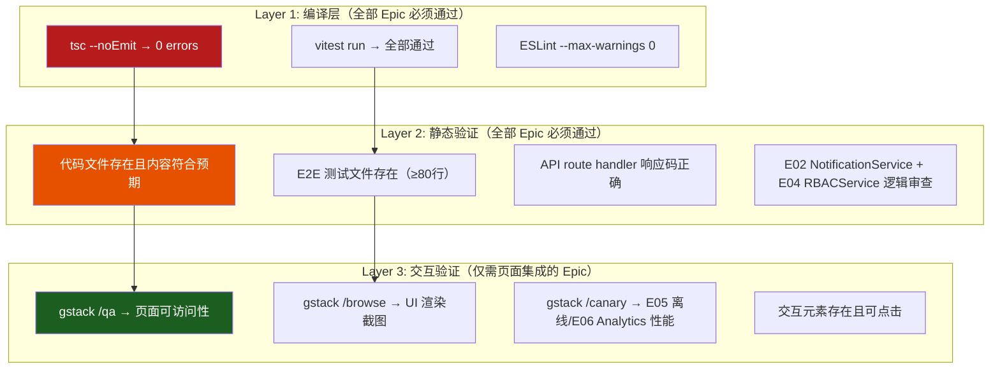
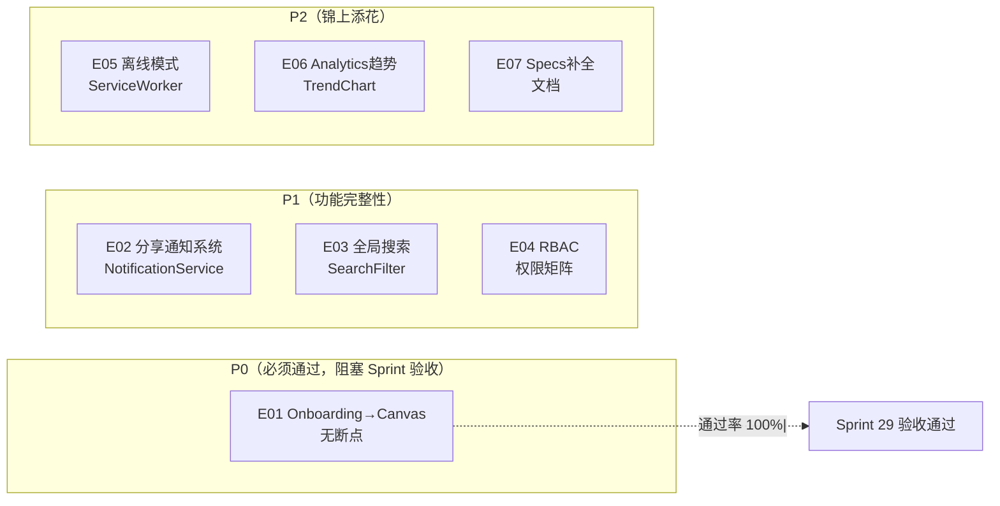
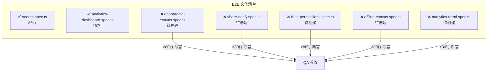

# VibeX Sprint 29 QA — 架构设计文档

**Agent**: architect
**日期**: 2026-05-08
**项目**: vibex-proposals-sprint29-qa
**状态**: Adopted

---

## 执行决策

- **决策**: 已采纳
- **执行项目**: vibex-proposals-sprint29-qa
- **执行日期**: 2026-05-08

---

## 1. 验证范围概述

Sprint 29 已合并至 origin/main，包含 7 个 Epic（E01-E07），工期 22h。本 QA 阶段聚焦验证产出物完整性、交互可用性、设计一致性。

### 1.1 已验证产出物（来自 Analyst 报告）

| 类别 | 文件 | 状态 | 验证方法 |
|------|------|------|----------|
| 代码 | E01 useCanvasPrefill.ts | ✅ | code review |
| 代码 | E02 NotificationService.ts + ShareBadge.tsx | ✅ | code review |
| 代码 | E03 SearchFilter.tsx + search.spec.ts (86行) | ✅ | wc -l |
| 代码 | E04 RBACService.ts + PUT /api/projects/:id/role | ✅ | code review |
| 代码 | E05 public/sw.js + manifest.json + OfflineBanner.tsx | ✅ | code review |
| 代码 | E06 TrendChart.tsx (纯SVG) + /api/analytics/funnel | ✅ | code review |
| 代码 | E07 Sprint29 原始 Epic 规格文档 | ⚠️ | `specs/` 为空（原始 Sprint29 规格在 `vibex-proposals-sprint29/specs/`，QA 阶段无需复制） |
| E2E | search.spec.ts (86行) | ✅ | wc -l |
| E2E | analytics-dashboard.spec.ts (257行) | ✅ | wc -l |
| E2E | onboarding-canvas.spec.ts | ⚠️ | **缺失** |
| E2E | share-notify.spec.ts | ⚠️ | **缺失** |
| E2E | rbac-permissions.spec.ts | ⚠️ | **缺失** |
| E2E | offline-canvas.spec.ts | ⚠️ | **缺失** |
| E2E | analytics-trend.spec.ts | ⚠️ | **缺失** |

### 1.2 已知非阻塞问题（来自 Analyst）

| 问题 | 影响 | 缓解 |
|------|------|------|
| 5个 E2E 测试文件不存在 | 覆盖率不足，不阻塞功能验收 | 创建 + 验证 |
| E03 后端搜索未接入 | Tech Debt，已记录在 IMPLEMENTATION_PLAN.md | 延后处理 |

---

## 2. 验证架构图

### 2.1 三层验证模型



### 2.2 Epic 验证优先级



### 2.3 E2E 测试文件验证（关键缺口）



---

## 3. 验证矩阵（Pass/Fail Matrix）

### E01: Onboarding → Canvas 无断点（P0）

| 验收标准 | 通过条件 | 验证方法 | 优先级 |
|---------|---------|---------|--------|
| useCanvasPrefill 读取 localStorage | `PENDING_TEMPLATE_REQ_KEY` 读取 + AI降级格式 | 代码审查 | P0 |
| Canvas 骨架屏 100ms 内显示 | CanvasPageSkeleton 已集成 | 代码审查 | P0 |
| AI 降级格式存储 | PreviewStep.tsx 存入 `{ raw, parsed: null }` | 代码审查 | P0 |
| sessionStorage 持久化 | useOnboarding 实现 sessionStorage 读写 | 代码审查 | P1 |
| TS 编译 0 errors | tsc --noEmit exit 0 | exec | P0 |
| E2E onboarding-canvas.spec.ts | 文件存在且 ≥80 行 | exec | P1 |

### E02: 项目分享通知系统（P1）

| 验收标准 | 通过条件 | 验证方法 | 优先级 |
|---------|---------|---------|--------|
| NotificationService Slack DM | NotificationService.ts 存在且调用 Slack | 代码审查 | P0 |
| 站内通知降级 | `in-app` fallback 存在 | 代码审查 | P1 |
| ShareBadge 未读计数 | ShareBadge.tsx 存在且正确显示 | gstack /qa | P0 |
| 分享成功后触发 | canvas-share 后调用 NotificationService | 代码审查 | P0 |
| TS 编译 0 errors | tsc --noEmit exit 0 | exec | P0 |
| E2E share-notify.spec.ts | 文件存在且 ≥80 行 | exec | P1 |

### E03: Dashboard 全局搜索增强（P1）

| 验收标准 | 通过条件 | 验证方法 | 优先级 |
|---------|---------|---------|--------|
| 搜索高亮 | SearchBar.tsx 使用 `<mark>` 高亮 | 代码审查 | P0 |
| 搜索 E2E（86行）| search.spec.ts 存在且 ≥80 行 | exec | P0 |
| 无结果提示 | 空结果显示"没有找到包含 xxx 的项目" | gstack /qa | P1 |
| E03 后端搜索未接入 | 记录为 Tech Debt，不阻塞 | — | Non-blocking |

### E04: RBAC 细粒度权限矩阵（P1）

| 验收标准 | 通过条件 | 验证方法 | 优先级 |
|---------|---------|---------|--------|
| types.ts: ProjectPermission + TeamRole | lib/rbac/types.ts 包含完整类型定义 | 代码审查 | P0 |
| RBACService.canPerform | RBACService.ts 存在且逻辑正确 | 代码审查 | P0 |
| PUT /api/projects/:id/role | route.ts 存在且返回正确响应码 | 代码审查 | P0 |
| Dashboard viewer/member disabled | ProjectCard 按权限 disabled | gstack /qa | P1 |
| TS 编译 0 errors | tsc --noEmit exit 0 | exec | P0 |
| E2E rbac-permissions.spec.ts | 文件存在且 ≥80 行 | exec | P1 |

### E05: Canvas 离线模式（P2）

| 验收标准 | 通过条件 | 验证方法 | 优先级 |
|---------|---------|---------|--------|
| Service Worker | public/sw.js 存在（cacheFirst/networkFirst/offline fallback）| 代码审查 | P0 |
| PWA manifest | manifest.json 存在（standalone）| 代码审查 | P0 |
| OfflineBanner | OfflineBanner.tsx 存在且 5s 重连隐藏 | gstack /qa | P1 |
| TS 编译 0 errors | tsc --noEmit exit 0 | exec | P0 |
| E2E offline-canvas.spec.ts | 文件存在且 ≥80 行 | exec | P1 |

### E06: Analytics 趋势分析（P2）

| 验收标准 | 通过条件 | 验证方法 | 优先级 |
|---------|---------|---------|--------|
| TrendChart.tsx 纯 SVG | 无 Recharts/Chart.js | 代码审查 | P0 |
| GET /api/analytics/funnel | 30天聚合数据返回 | 代码审查 | P0 |
| 7d/30d/90d 切换 | 切换按钮存在且切换数据范围 | gstack /qa | P1 |
| CSV 导出含趋势列 | date + conversionRate + trend | 代码审查 | P1 |
| E2E analytics-dashboard.spec.ts | 257行已存在 | exec | P0 |
| E2E analytics-trend.spec.ts | 文件存在且 ≥80 行 | exec | P1 |

### E07: Sprint 28 Specs 补全（P2）

| 验收标准 | 通过条件 | 验证方法 | 优先级 |
|---------|---------|---------|--------|
| E03-E07-detailed.md 存在 | 文件存在且内容完整 | exec | P0 |
| E04/E06/E07 独立 spec 存在 | test -f 各文件 | exec | P0 |

---

## 4. gstack 验证策略

### 4.1 技能选择矩阵

| 验证场景 | 推荐技能 | 说明 |
|---------|---------|------|
| 页面可访问性 + 元素断言 | /qa | E01/E02/E04/E05/E06 页面验证 |
| UI 渲染截图验证 | /browse | ShareBadge、OfflineBanner、TrendChart |
| 性能基准验证 | /canary | E05 离线加载、E06 Analytics Dashboard |
| API 响应验证 | 直接 curl / supertest | E02 Slack通知、E04 role API |
| E2E 测试执行 | npx playwright test | 6个 spec 文件 |

### 4.2 验证执行顺序

```
Layer 1（编译层）：
  1. tsc --noEmit → 0 errors
  2. vitest run → 全部通过
  
Layer 2（静态层）：
  1. E07 Specs 补全（最独立）→ E03 搜索已有文件
  2. 代码文件存在 + 内容审查（E01-E06）
  3. 5个 E2E 文件创建 + 行数验证
  
Layer 3（交互层）：
  1. E02 ShareBadge（Dashboard）
  2. E01 Onboarding→Canvas
  3. E04 RBAC Dashboard
  4. E05 OfflineBanner + ServiceWorker
  5. E06 Analytics Dashboard + TrendChart
```

### 4.3 gstack /qa 断言示例

```javascript
// E02: ShareBadge 未读计数
await page.goto('/dashboard');
await expect(page.locator('[data-testid="share-badge"]')).toBeVisible();
const badgeText = await page.locator('[data-testid="share-badge"]').textContent();

// E05: OfflineBanner
await page.goto('/canvas/test-project');
// 离线模式：断网后 banner 显示
// 5s 后自动重连隐藏

// E06: 7d/30d/90d 切换
await page.goto('/analytics');
await page.getByRole('button', { name: /30天/i }).click();
await expect(page.locator('[data-testid="trend-chart"]')).toBeVisible();

// E04: RBAC Dashboard
await page.goto('/dashboard');
// viewer 角色：ProjectCard 的编辑按钮 disabled
await expect(page.getByRole('button', { name: /编辑/i })).toBeDisabled();
```

---

## 5. E2E 测试文件创建规范

### 5.1 5个待创建文件

| Epic | 文件路径 | 最小行数 | 核心场景 |
|------|---------|---------|---------|
| E01 | `tests/e2e/onboarding-canvas.spec.ts` | 80行 | Onboarding完成→Canvas数据完整 |
| E02 | `tests/e2e/share-notify.spec.ts` | 80行 | 分享触发→通知Badge+N |
| E04 | `tests/e2e/rbac-permissions.spec.ts` | 80行 | viewer/member/admin 权限差异 |
| E05 | `tests/e2e/offline-canvas.spec.ts` | 80行 | 离线Banner显示+重连 |
| E06 | `tests/e2e/analytics-trend.spec.ts` | 80行 | 7d/30d/90d切换+CSV导出 |

### 5.2 E2E 测试创建标准

```typescript
// 测试文件必须包含以下结构
import { test, expect } from '@playwright/test';

test.describe('Epic 名称', () => {
  test('核心场景描述', async ({ page }) => {
    // Arrange
    await page.goto('/页面路径');
    
    // Act
    await page.click('button');
    
    // Assert
    await expect(page.locator('[data-testid="目标元素"]')).toBeVisible();
  });
});
```

---

## 6. 性能影响评估

### 6.1 E05 离线模式性能

| 指标 | 目标 | 验证方法 |
|------|------|----------|
| Service Worker 注册 | < 500ms | gstack /canary |
| 离线页面加载 | < 2s（缓存命中）| gstack /qa 断网测试 |
| OfflineBanner 重连 | 5s 自动隐藏 | setTimeout 验证 |

### 6.2 E06 Analytics 趋势分析性能

| 指标 | 目标 | 验证方法 |
|------|------|----------|
| TrendChart SVG 渲染 | < 100ms | DevTools Performance |
| 数据切换（7d/30d/90d）| < 500ms | gstack /qa 实测 |

---

## 7. 风险与缓解

| ID | 风险 | 可能性 | 影响 | 缓解 |
|----|------|--------|------|------|
| R1 | 5个 E2E 文件创建不完整 | 中 | 中 | 优先创建，≥80行要求 |
| R2 | E02 Slack 通知 API 无真实 Slack | 低 | 低 | 测试降级到站内通知 |
| R3 | E03 后端搜索未接入（Tech Debt）| 高 | 低 | 已记录，不阻塞验收 |
| R4 | gstack 环境访问受限 | 低 | 中 | 备用：代码审查 + API test |

---

*本文件由 architect 定义 Sprint 29 QA 验证框架。*