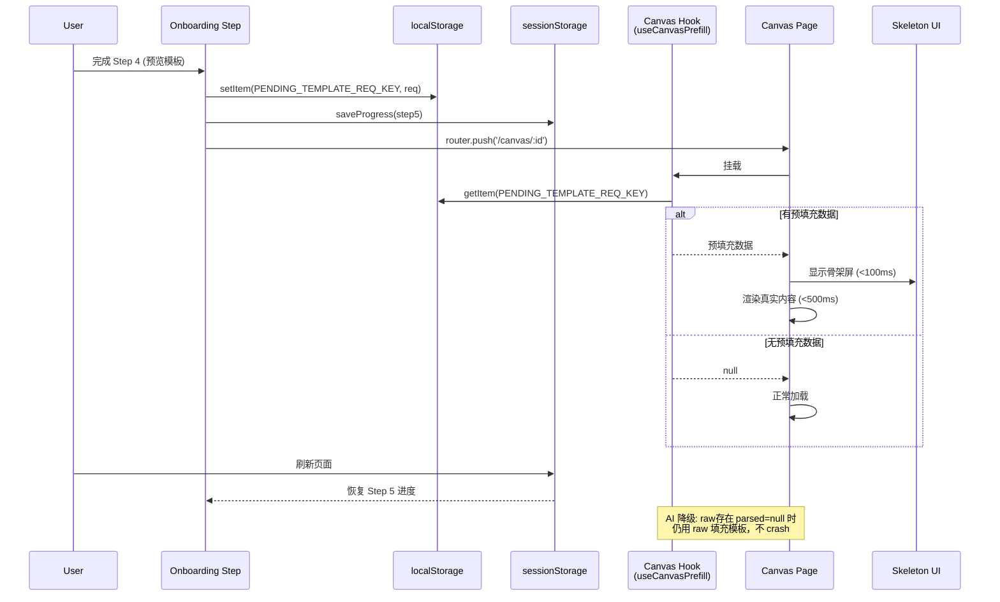
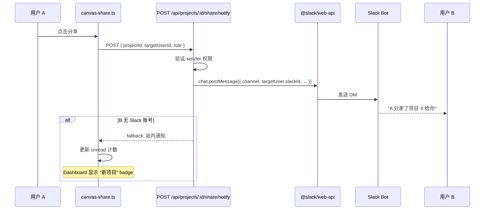
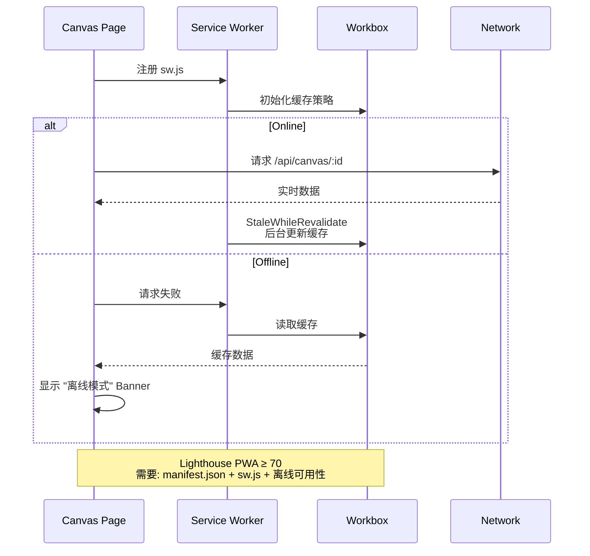

# VibeX Sprint 29 — 架构设计文档

**Agent**: architect
**日期**: 2026-05-07
**项目**: vibex-proposals-sprint29
**状态**: Draft

---

## 执行摘要

本文档定义 VibeX Sprint 29 七个 Epic 的技术架构。Sprint 28 已完成实时协作整合（E01）、Design Output 性能优化（E02）、PRD→Canvas 自动流程（E05），Sprint 29 在此基础上推进 7 个方向：

| Epic | 标题 | 工期 | 核心依赖 |
|------|------|------|---------|
| E01 | Onboarding → Canvas 无断点 | 3h | S28 E03 AI 辅助解析 |
| E02 | 项目分享 Slack 通知 | 4h | Slack Bot token（已配置）|
| E03 | Dashboard 全局搜索增强 | 1h | 无 |
| E04 | RBAC 细粒度权限矩阵 | 5h | 无 |
| E05 | Canvas 离线模式 | 3h | 无 |
| E06 | Analytics 趋势折线图 | 3.5h | S14 E4 Analytics |
| E07 | Sprint 28 Specs 补全 | 2.5h | 无 |
| **合计** | | **22h** | |

**技术主题**：无断点体验（sessionStorage）、外部集成（Slack SDK）、离线可用（PWA/Workbox）、细粒度权限（RBAC）、数据可视化（纯 SVG）。

---

## 1. Tech Stack

### 1.1 新增依赖

| 包 | 版本 | 用途 | 引入原因 |
|----|------|------|---------|
| `workbox-core` | `^7.0.0` | Service Worker 缓存策略 | cache-first for static assets, network-first for API |
| `workbox-routing` | `^7.0.0` | SW 路由注册 | 统一管理静态/动态资源缓存规则 |
| `workbox-strategies` | `^7.0.0` | 缓存策略实现 | StaleWhileRevalidate 保证离线可用 |
| `@slack/web-api` | `^7.0.0` | Slack Bot API 调用 | 项目分享通知 DM 发送 |

**选型理由**：
- **Workbox**：Google 维护的 SW 工具库，比手写 SW 减少约 40% 开发成本，提供成熟的缓存策略（CacheFirst、NetworkFirst、StaleWhileRevalidate），Lighthouse PWA 评分有保障
- **@slack/web-api**：Slack 官方 Node.js SDK，比直接调 HTTP API 减少 token 管理复杂度，支持 promise 链式调用

### 1.2 复用依赖（已有）

| 包 | 用途 | 复用位置 |
|----|------|---------|
| `next` | SSR/SSG 框架 | 全部页面 |
| `typescript` | 类型安全 | 全部 |
| `zustand` | 状态管理 | useOnboarding.ts |
| `localStorage/sessionStorage` | 浏览器端持久化 | Onboarding 预填充、进度缓存 |
| `rbac.ts` | 权限类型定义 | E04 扩展 |
| `AnalyticsDashboard` | 分析仪表盘 | E06 集成 |
| `@playwright/test` | E2E 测试 | 全部 Epic |
| `vitest` | 单元测试 | 全部 Epic |

### 1.3 技术约束

- **无新 schema 迁移**：Analytics 历史聚合在内存计算（E06），不改数据库结构
- **无外部图表库**：TrendChart.tsx 纯 SVG 实现（E06），避免 bundle size 增加
- **离线优先**：Service Worker 对 Canvas 页面实现 cache-first，API 页面实现 network-first

---

## 2. Architecture Diagram

### 2.1 系统全貌图

```mermaid
flowchart TB
    subgraph Client["前端 (Browser / Next.js App Router)"]
        subgraph OnboardingFlow["E01: Onboarding 流程"]
            O1["Step 1-5<br/>ClarifyStep"]
            O2["sessionStorage<br/>持久化层"]
            O3["Canvas 预填充<br/>useCanvasPrefill"]
            O4["Canvas Skeleton<br/>骨架屏"]
        end

        subgraph Dashboard["E03: Dashboard 搜索"]
            SB["SearchBar<br/>组件"]
            US["useProjectSearch<br/>hook"]
            MK["<mark> 高亮<br/>渲染器"]
        end

        subgraph CanvasOffline["E05: Canvas 离线模式"]
            SW["Service Worker<br/>public/sw.js"]
            WB["Workbox<br/>缓存策略"]
            BN["Offline Banner<br/>离线提示"]
        end

        subgraph AnalyticsView["E06: Analytics 趋势"]
            TC["TrendChart.tsx<br/>纯 SVG 折线图"]
            AGG["内存聚合<br/>30天数据"]
            EXP["CSV 导出<br/>含趋势列"]
        end

        subgraph ProjectShare["E02: 项目分享"]
            CS["canvas-share.ts"]
            NB["NotificationBadge<br/>站内通知"]
        end

        subgraph RBACUI["E04: RBAC 细粒度"]
            PC["ProjectCard<br/>权限 Badge"]
            CB["Canvas 删除按钮<br/>权限隔离"]
            T["Toast<br/>权限不足提示"]
        end
    end

    subgraph NextServer["Next.js Server (API Routes)"]
        subgraph ShareAPI["E02: Slack 通知 API"]
            SN["POST /api/projects/:id/share/notify"]
            SDK["@slack/web-api"]
        end

        subgraph AnalyticsAPI["E06: Analytics API"]
            AF["GET /api/analytics/funnel<br/>30天聚合"]
        end

        subgraph RBACAPI["E04: 权限 API"]
            PR["PUT /api/projects/:id/role"]
            GP["GET /api/projects<br/>search 参数验证"]
            G403["403 拦截"]
        end
    end

    subgraph External["外部服务"]
        SLACK["Slack Bot API<br/>DM 发送"]
        DB["PostgreSQL<br/>Funnel 数据"]
    end

    %% E01 数据流
    O1 --> O2
    O2 --> O3
    O3 --> O4

    %% E03 数据流
    SB --> US
    US --> MK

    %% E05 数据流
    SW --> WB
    WB --> BN

    %% E06 数据流
    AF --> AGG
    AGG --> TC
    AGG --> EXP

    %% E02 数据流
    CS --> SN
    SN --> SDK
    SDK --> SLACK
    CS --> NB

    %% E04 数据流
    PR --> G403
    GP --> US
    G403 --> T
    PC --> PR

    %% 外部依赖
    AF --> DB

    style OnboardingFlow fill:#e8f5e9
    style ShareAPI fill:#fff3e0
    style AnalyticsView fill:#e3f2fd
    style RBACUI fill:#fce4ec
    style CanvasOffline fill:#f3e5f5
    style Dashboard fill:#fff8e1
```



### 2.2 E01 数据流：Onboarding → Canvas 无断点



### 2.3 E02 数据流：Slack 分享通知



### 2.4 E05 数据流：Canvas 离线模式



---

## 3. API Definitions

### 3.1 POST /api/projects/:id/share/notify

分享项目后触发 Slack DM 或站内通知。

**Request**

```json
{
  "method": "POST",
  "url": "/api/projects/:id/share/notify",
  "headers": {
    "Content-Type": "application/json",
    "Authorization": "Bearer {token}"
  },
  "body": {
    "targetUserId": "string (required)",
    "role": "viewer | editor",
    "message": "string (optional, custom message)"
  }
}
```

**Response (200 OK)**

```json
{
  "success": true,
  "notificationId": "ntf_abc123",
  "channel": "slack",
  "deliveredAt": "2026-05-07T10:00:00.000Z",
  "slackMessageTs": "1234567890.123456"
}
```

**Response (200 OK - Fallback: 站内通知)**

```json
{
  "success": true,
  "notificationId": "ntf_abc123",
  "channel": "in_app",
  "deliveredAt": "2026-05-07T10:00:00.000Z"
}
```

**Response (400 Bad Request)**

```json
{
  "error": "INVALID_ROLE",
  "message": "role must be 'viewer' or 'editor'"
}
```

**Response (403 Forbidden)**

```json
{
  "error": "PERMISSION_DENIED",
  "message": "Only project owner or admin can share this project"
}
```

**Response (404 Not Found)**

```json
{
  "error": "USER_NOT_FOUND",
  "message": "Target user does not exist or is not a team member"
}
```

**Response (503 Service Unavailable)**

```json
{
  "error": "SLACK_API_ERROR",
  "message": "Slack notification failed, falling back to in-app notification"
}
```

### 3.2 GET /api/analytics/funnel

返回漏斗分析数据，含 30 天历史聚合（内存计算，不改 schema）。

**Request**

```json
{
  "method": "GET",
  "url": "/api/analytics/funnel",
  "headers": {
    "Authorization": "Bearer {token}"
  },
  "query": {
    "range": "7d | 30d | 90d (default: 30d)",
    "projectId": "string (optional, filter by project)"
  }
}
```

**Response (200 OK)**

```json
{
  "summary": {
    "totalProjects": 12,
    "totalConversions": 847,
    "averageConversionRate": 0.234,
    "dateRange": {
      "start": "2026-04-07",
      "end": "2026-05-07"
    }
  },
  "funnel": [
    {
      "stage": "onboarding_started",
      "count": 3621,
      "conversionRate": 1.0,
      "dropoffRate": 0
    },
    {
      "stage": "template_selected",
      "count": 1847,
      "conversionRate": 0.510,
      "dropoffRate": 0.490
    },
    {
      "stage": "canvas_created",
      "count": 892,
      "conversionRate": 0.246,
      "dropoffRate": 0.264
    },
    {
      "stage": "shared",
      "count": 412,
      "conversionRate": 0.114,
      "dropoffRate": 0.132
    },
    {
      "stage": "converted",
      "count": 156,
      "conversionRate": 0.043,
      "dropoffRate": 0.071
    }
  ],
  "historical": [
    {
      "date": "2026-04-07",
      "conversionRate": 0.198,
      "trend": "stable",
      "projects": 9,
      "conversions": 62
    },
    {
      "date": "2026-04-08",
      "conversionRate": 0.215,
      "trend": "up",
      "projects": 10,
      "conversions": 71
    }
  ],
  "csvExportColumns": ["date", "conversionRate", "trend", "projects", "conversions"]
}
```

**Trend 字段语义**

| 值 | 语义 | 计算规则 |
|----|------|---------|
| `up` | 上升 | 当日转化率 > 前一日转化率 × 1.05 |
| `down` | 下降 | 当日转化率 < 前一日转化率 × 0.95 |
| `stable` | 持平 | 其他情况 |

### 3.3 PUT /api/projects/:id/role

更新团队成员的权限角色。

**Request**

```json
{
  "method": "PUT",
  "url": "/api/projects/:id/role",
  "headers": {
    "Content-Type": "application/json",
    "Authorization": "Bearer {token}"
  },
  "body": {
    "userId": "string (required)",
    "role": "viewer | member | admin",
    "permissions": ["view", "edit"] // 可选，细粒度权限
  }
}
```

**Response (200 OK)**

```json
{
  "userId": "usr_abc123",
  "role": "member",
  "permissions": ["view", "edit"],
  "updatedAt": "2026-05-07T10:00:00.000Z"
}
```

**Response (400 Bad Request)**

```json
{
  "error": "INVALID_ROLE",
  "message": "Cannot change role of project owner"
}
```

**Response (403 Forbidden)**

```json
{
  "error": "PERMISSION_DENIED",
  "message": "Only project admin or owner can modify roles",
  "requiredRole": "admin"
}
```

### 3.4 GET /api/projects

项目列表接口，search 参数验证。

**Request**

```json
{
  "method": "GET",
  "url": "/api/projects",
  "headers": {
    "Authorization": "Bearer {token}"
  },
  "query": {
    "search": "string (optional, minLength: 1, maxLength: 200)",
    "page": "number (default: 1)",
    "limit": "number (default: 20, max: 100)",
    "sort": "createdAt | updatedAt | name (default: updatedAt)",
    "order": "asc | desc (default: desc)"
  }
}
```

**Response (200 OK)**

```json
{
  "projects": [
    {
      "id": "prj_abc123",
      "name": "登录页设计",
      "createdAt": "2026-05-01T10:00:00.000Z",
      "updatedAt": "2026-05-07T08:30:00.000Z",
      "userRole": "admin",
      "permissions": ["view", "edit", "delete", "manageMembers"]
    }
  ],
  "pagination": {
    "page": 1,
    "limit": 20,
    "total": 45,
    "totalPages": 3
  },
  "searchMeta": {
    "query": "登录",
    "matchedFields": ["name"],
    "resultCount": 8
  }
}
```

**Response (400 Bad Request)**

```json
{
  "error": "INVALID_SEARCH_PARAM",
  "message": "search parameter exceeds maximum length of 200 characters"
}
```

---

## 4. Data Model

### 4.1 ShareNotification

分享通知记录（存储于 PostgreSQL）。

```typescript
// lib/models/ShareNotification.ts
interface ShareNotification {
  id: string;                    // ntf_{ulid}
  projectId: string;             // prj_{ulid}
  senderId: string;               // usr_{ulid}，发送者
  targetUserId: string;          // usr_{ulid}，接收者
  role: 'viewer' | 'editor';
  channel: 'slack' | 'in_app';   // 通知渠道
  slackMessageTs?: string;        // Slack 消息时间戳，用于去重
  slackError?: string;            // Slack API 错误信息
  read: boolean;                 // 是否已读（站内通知）
  createdAt: Date;
  updatedAt: Date;
}
```

**索引**

```sql
CREATE INDEX idx_share_notification_project ON share_notifications(project_id);
CREATE INDEX idx_share_notification_target ON share_notifications(target_user_id);
CREATE UNIQUE INDEX idx_share_notification_dedup ON share_notifications(slack_message_ts) WHERE slack_message_ts IS NOT NULL;
```

### 4.2 AnalyticsFunnel

漏斗数据聚合结果（内存计算，不持久化，CSV 导出时生成）。

```typescript
// lib/models/AnalyticsFunnel.ts
interface AnalyticsFunnel {
  summary: {
    totalProjects: number;
    totalConversions: number;
    averageConversionRate: number;
    dateRange: { start: string; end: string };
  };
  funnel: FunnelStage[];
  historical: DailyAggregate[];
}

interface FunnelStage {
  stage: 'onboarding_started' | 'template_selected' | 'canvas_created' | 'shared' | 'converted';
  count: number;
  conversionRate: number;
  dropoffRate: number;
}

interface DailyAggregate {
  date: string;                  // YYYY-MM-DD
  conversionRate: number;        // 0.0 - 1.0
  trend: 'up' | 'down' | 'stable';
  projects: number;
  conversions: number;
}
```

### 4.3 ProjectPermission

细粒度权限类型（扩展 rbac.ts）。

```typescript
// lib/rbac.ts (扩展)
type ProjectPermission =
  | 'view'       // 查看项目（只读）
  | 'edit'       // 编辑节点
  | 'delete'     // 删除项目
  | 'manageMembers'; // 管理团队成员

type TeamRole = 'owner' | 'admin' | 'member' | 'viewer';

// 角色 → 权限映射
const ROLE_PERMISSIONS: Record<TeamRole, ProjectPermission[]> = {
  owner:        ['view', 'edit', 'delete', 'manageMembers'],
  admin:        ['view', 'edit', 'delete', 'manageMembers'],
  member:       ['view', 'edit'],
  viewer:       ['view'],
};

// 权限检查函数
function hasPermission(role: TeamRole, permission: ProjectPermission): boolean {
  return ROLE_PERMISSIONS[role]?.includes(permission) ?? false;
}
```

### 4.4 TeamMember

团队成员（扩展 TeamService.ts）。

```typescript
// lib/models/TeamMember.ts
interface TeamMember {
  id: string;                    // tmb_{ulid}
  projectId: string;             // prj_{ulid}
  userId: string;                // usr_{ulid}
  role: TeamRole;                // owner | admin | member | viewer
  permissions: ProjectPermission[]; // 可选，显式指定细粒度权限
  invitedBy: string;             // usr_{ulid}
  joinedAt: Date;
  updatedAt: Date;
}
```

### 4.5 OfflineCanvasCache

Canvas 离线缓存数据（Workbox IndexedDB，不新增 schema）。

```typescript
// 缓存结构（Workbox Runtime Cache）
interface OfflineCanvasCache {
  url: string;                   // /canvas/:id
  content: {
    html: string;                // 页面 HTML
    nodes: CanvasNode[];         // 节点数据
    metadata: {
      projectId: string;
      lastSyncAt: string;        // ISO 8601
      version: number;
    };
  };
  cachedAt: Date;
  expiresAt: Date;               // 缓存过期时间（7天后）
}
```

**Workbox 缓存策略**

| 资源类型 | 策略 | TTL |
|---------|------|-----|
| 静态资源 (JS/CSS/字体) | CacheFirst | 30 days |
| Next.js API Routes | NetworkFirst | 1 day |
| Canvas 页面 HTML | StaleWhileRevalidate | 7 days |
| 用户数据 (nodes) | NetworkOnly（离线不可用）| — |

---

## 5. Testing Strategy

### 5.1 测试框架与覆盖率要求

| 层级 | 框架 | 覆盖率目标 | 运行时机 |
|------|------|-----------|---------|
| 单元测试 | Vitest | ≥ 80%（新代码）| CI pre-merge |
| 组件测试 | Vitest + React Testing Library | ≥ 70%（新组件）| CI pre-merge |
| E2E 测试 | Playwright | 全部 Epic 验收标准 | CI pre-merge + gstack 验证 |
| API 测试 | Vitest + supertest | 全部 API endpoint | CI pre-merge |

### 5.2 关键测试用例

#### E01: Onboarding → Canvas 无断点

```typescript
// __tests__/onboarding/canvas-prefill.test.ts
import { describe, it, expect, beforeEach } from 'vitest';
import { render, screen, waitFor } from '@testing-library/react';
import userEvent from '@testing-library/user-event';

// E01-S01.1: Canvas skeleton within 100ms
describe('Canvas Skeleton', () => {
  it('shows skeleton within 100ms of navigation', async () => {
    // Mock sessionStorage with prefill data
    const user = userEvent.setup();
    render(<CanvasPage params={{ id: 'test-project' }} />);

    const skeleton = await screen.findByTestId('canvas-skeleton', { timeout: 100 });
    expect(skeleton).toBeVisible();
  });

  it('replaces skeleton with real content within 500ms', async () => {
    render(<CanvasPage params={{ id: 'test-project' }} />);

    await waitFor(() => {
      const content = screen.queryByTestId('canvas-skeleton');
      expect(content).toBeNull();
    }, { timeout: 600 });

    const canvas = screen.getByTestId('canvas-content');
    expect(canvas).toBeVisible();
  });
});

// E01-S01.2: AI fallback with parsed: null
describe('AI Fallback', () => {
  it('stores { raw, parsed: null } on AI fallback', async () => {
    const store = useOnboardingStore.getState();
    store.setClarifyResult({ raw: '原始文本', parsed: null });

    const state = useOnboardingStore.getState();
    expect(state.clarifyResult.raw).toBe('原始文本');
    expect(state.clarifyResult.parsed).toBeNull();
  });

  it('Canvas renders template even with parsed: null', () => {
    const prefillData = { raw: '原始文本', parsed: null };
    const template = renderTemplateFromRaw(prefillData.raw);

    expect(template).toBeDefined();
    expect(template.nodes).toHaveLength(3);
  });
});

// E01-S01.3: sessionStorage persistence
describe('SessionStorage Persistence', () => {
  beforeEach(() => {
    sessionStorage.clear();
  });

  it('preserves progress after refresh from Step 2 to Step 5', () => {
    const store = useOnboardingStore.getState();
    store.navigateTo(5);

    // Simulate page refresh
    const rehydrated = rehydrateFromSessionStorage();
    expect(rehydrated.currentStep).toBe(5);
  });

  it('sessionStorage key matches onboarding flow id', () => {
    const flowId = 'onboarding-2026-05-07-user123';
    const store = useOnboardingStore.getState();
    store.setFlowId(flowId);
    store.saveProgress();

    const key = sessionStorage.key(0);
    expect(key).toMatch(/^onboarding-/);
  });
});
```

#### E02: 项目分享 Slack 通知

```typescript
// __tests__/api/share-notify.test.ts
import { describe, it, expect } from 'vitest';
import { createMockRequest, createMockResponse } from '../test-utils';

// E02-S02.1: Slack notification endpoint
describe('POST /api/projects/:id/share/notify', () => {
  it('returns 200 and triggers Slack DM within 30s', async () => {
    const req = createMockRequest('POST', {
      targetUserId: 'usr_target',
      role: 'viewer'
    });
    const res = createMockResponse();

    await shareNotifyHandler(req, res);

    expect(res.statusCode).toBe(200);
    expect(res.body.success).toBe(true);
    expect(res.body.channel).toBe('slack');
  });

  it('returns 503 gracefully on Slack API error (no crash)', async () => {
    mockSlackAPI.reject(new Error('Token invalid'));

    const req = createMockRequest('POST', {
      targetUserId: 'usr_target',
      role: 'editor'
    });
    const res = createMockResponse();

    await expect(shareNotifyHandler(req, res)).not.toThrow();
    expect(res.statusCode).toBe(200); // Falls back to in-app
    expect(res.body.channel).toBe('in_app');
  });

  it('prevents duplicate notifications on retry (idempotency)', async () => {
    const notificationId = `ntf_${Date.now()}`;
    let callCount = 0;

    mockSlackAPI.intercept(() => { callCount++; return notificationId; });

    await shareNotifyHandler(createMockRequest({ targetUserId: 'usr_1', role: 'viewer' }), createMockResponse());
    await shareNotifyHandler(createMockRequest({ targetUserId: 'usr_1', role: 'viewer' }), createMockResponse());

    // Second call should be deduplicated by slackMessageTs
    expect(callCount).toBe(1);
  });
});
```

#### E03: Dashboard 全局搜索增强

```typescript
// e2e/search.spec.ts (Playwright)
import { test, expect } from '@playwright/test';

// E03-S03.1: Search result highlights matched substring
test('search result highlights matched substring with <mark> tag', async ({ page }) => {
  await page.goto('/dashboard');
  await page.getByPlaceholder('搜索项目...').fill('登录');

  const firstResult = page.locator('[data-testid="project-card"]').first();
  await expect(firstResult).toBeVisible();

  const highlightedText = firstResult.locator('mark');
  await expect(highlightedText).toHaveCount({ gte: 1 });
  await expect(highlightedText).toContainText('登录');
});

// E03-S03.2: Empty search shows friendly message
test('empty search result shows "没有找到包含 xxx 的项目"', async ({ page }) => {
  await page.goto('/dashboard');
  await page.getByPlaceholder('搜索项目...').fill('不存在的项目名xyz123');

  const emptyState = page.getByTestId('search-empty-state');
  await expect(emptyState).toBeVisible();
  await expect(emptyState).toContainText('没有找到包含');
  await expect(emptyState).toContainText('不存在的项目名xyz123');
});

// E03-S03.2: Search filters in < 100ms
test('search input filters project list in < 100ms', async ({ page }) => {
  await page.goto('/dashboard');

  const start = Date.now();
  await page.getByPlaceholder('搜索项目...').fill('登录');
  await page.waitForResponse(resp => resp.url().includes('/api/projects'));
  const duration = Date.now() - start;

  expect(duration).toBeLessThan(100);
});
```

#### E04: RBAC 细粒度权限

```typescript
// __tests__/rbac/permissions.test.ts
import { describe, it, expect } from 'vitest';
import { hasPermission, ROLE_PERMISSIONS } from '@/lib/rbac';

// E04-S04.1: Permission type exports
describe('ProjectPermission type', () => {
  it('exports ProjectPermission type: view|edit|delete|manageMembers', () => {
    const permissions: ProjectPermission[] = ['view', 'edit', 'delete', 'manageMembers'];
    expect(permissions).toHaveLength(4);
  });

  it('TeamService role includes viewer', () => {
    const roles: TeamRole[] = ['owner', 'admin', 'member', 'viewer'];
    expect(roles).toContain('viewer');
  });
});

// E04-S04.2: Permission badge and UI isolation
describe('Permission-based UI', () => {
  it('viewer role has only view permission', () => {
    expect(hasPermission('viewer', 'view')).toBe(true);
    expect(hasPermission('viewer', 'edit')).toBe(false);
    expect(hasPermission('viewer', 'delete')).toBe(false);
  });

  it('member role has view and edit but not delete', () => {
    expect(hasPermission('member', 'view')).toBe(true);
    expect(hasPermission('member', 'edit')).toBe(true);
    expect(hasPermission('member', 'delete')).toBe(false);
  });

  it('admin role has all permissions', () => {
    expect(hasPermission('admin', 'view')).toBe(true);
    expect(hasPermission('admin', 'edit')).toBe(true);
    expect(hasPermission('admin', 'delete')).toBe(true);
    expect(hasPermission('admin', 'manageMembers')).toBe(true);
  });
});

// E04-S04.3: API permission interception
describe('API Permission Interception', () => {
  it('unauthorized DELETE /api/projects/:id returns 403', async () => {
    const res = await api.delete('/api/projects/prj_test', {
      headers: { Authorization: 'Bearer viewer_token' }
    });

    expect(res.status).toBe(403);
    expect(res.body.error).toBe('PERMISSION_DENIED');
  });

  it('viewer cannot trigger POST /api/canvas', async () => {
    const res = await api.post('/api/canvas', {
      headers: { Authorization: 'Bearer viewer_token' },
      body: { projectId: 'prj_test' }
    });

    expect(res.status).toBe(403);
  });
});
```

#### E05: Canvas 离线模式

```typescript
// e2e/offline.spec.ts (Playwright)
import { test, expect } from '@playwright/test';

// E05-S05.1: Service Worker configuration
test('sw.js exists and registers successfully', async ({ page }) => {
  await page.goto('/canvas/test-project');
  await page.waitForFunction(() => 'serviceWorker' in navigator);

  const swRegistered = await page.evaluate(() => {
    return navigator.serviceWorker.controller !== null;
  });
  expect(swRegistered).toBe(true);
});

// E05-S05.2: Canvas loads from cache in offline mode
test('Chrome DevTools offline mode, /canvas/:id loads from cache', async ({ page, context }) => {
  // Pre-cache the page
  await page.goto('/canvas/test-project');
  await page.waitForLoadState('networkidle');

  // Go offline
  await context.setOffline(true);

  const response = await page.reload();
  expect(response.status()).toBe(200);

  const banner = page.getByTestId('offline-banner');
  await expect(banner).toBeVisible();
  await expect(banner).toContainText('离线模式');
});

// E05-S05.3: Lighthouse PWA score >= 70
test('lighthouse pwa_score >= 70', async ({ page }) => {
  const results = await page.evaluate(async () => {
    // Dynamic import of lighthouse
    const lighthouse = (await import('lighthouse')).default;
    return lighthouse('http://localhost:3000/canvas/test-project', {
      onlyCategories: ['pwa']
    });
  });

  expect(results.categories.pwa.score).toBeGreaterThanOrEqual(0.7);
});
```

#### E06: Analytics 趋势折线图

```typescript
// __tests__/analytics/trend-chart.test.ts
import { describe, it, expect } from 'vitest';
import { render, screen } from '@testing-library/react';
import TrendChart from '@/components/TrendChart';

// E06-S06.2: TrendChart renders SVG line chart
describe('TrendChart', () => {
  const mockData = [
    { date: '2026-04-07', conversionRate: 0.198, trend: 'stable', projects: 9, conversions: 62 },
    { date: '2026-04-08', conversionRate: 0.215, trend: 'up', projects: 10, conversions: 71 },
    { date: '2026-04-09', conversionRate: 0.200, trend: 'down', projects: 9, conversions: 63 },
  ];

  it('renders SVG line chart', () => {
    render(<TrendChart data={mockData} />);
    const svg = screen.getByTestId('trend-chart');
    expect(svg.tagName).toBe('svg');
  });

  it('shows X-axis time and Y-axis conversion rate', () => {
    render(<TrendChart data={mockData} />);
    expect(screen.getByText('2026-04-07')).toBeVisible();
    expect(screen.getByText('21.5%')).toBeVisible();
  });

  it('7d / 30d / 90d toggle switches displayed data range', async () => {
    render(<TrendChart data={mockData} range="30d" />);

    const btn7d = screen.getByTestId('range-btn-7d');
    const btn90d = screen.getByTestId('range-btn-90d');

    await userEvent.click(btn7d);
    expect(screen.getByTestId('trend-chart')).toBeVisible();

    await userEvent.click(btn90d);
    expect(screen.getByTestId('trend-chart')).toBeVisible();
  });

  it('data insufficient (< 3 points) shows empty state', () => {
    const insufficientData = [
      { date: '2026-04-07', conversionRate: 0.198, trend: 'stable', projects: 9, conversions: 62 },
      { date: '2026-04-08', conversionRate: 0.215, trend: 'up', projects: 10, conversions: 71 },
    ];

    render(<TrendChart data={insufficientData} />);
    const emptyState = screen.getByTestId('chart-empty-state');
    expect(emptyState).toBeVisible();
  });
});

// E06-S06.1: GET /api/analytics/funnel returns 30 days of data
describe('GET /api/analytics/funnel', () => {
  it('returns 30 days of daily aggregates', async () => {
    const res = await api.get('/api/analytics/funnel?range=30d');

    expect(res.status).toBe(200);
    expect(res.body.historical).toHaveLength(30);
    expect(res.body.historical[0]).toHaveProperty('date');
    expect(res.body.historical[0]).toHaveProperty('conversionRate');
    expect(res.body.historical[0]).toHaveProperty('trend');
  });
});

// E06-S06.3: CSV export includes trend data
describe('CSV Export', () => {
  it('export CSV includes date, conversionRate, trend columns', () => {
    const csv = exportFunnelCSV(mockFunnelData);

    expect(csv).toContain('date');
    expect(csv).toContain('conversionRate');
    expect(csv).toContain('trend');
    expect(csv).toContain('projects');
    expect(csv).toContain('conversions');
  });

  it('CSV opens in Excel/LibreOffice with correct encoding', () => {
    const csv = exportFunnelCSV(mockFunnelData);
    const bom = csv.charCodeAt(0);

    // UTF-8 BOM for Excel compatibility
    expect(bom).toBe(0xFEFF);
  });
});
```

### 5.3 覆盖率要求明细

| Epic | 新增代码文件 | 单元测试目标 | E2E 测试 |
|------|------------|------------|---------|
| E01 | 3 | 6 个测试用例 | 2 个验收标准 |
| E02 | 2 | 3 个测试用例 | 3 个验收标准 |
| E03 | 2 | 3 个测试用例 | 3 个验收标准 |
| E04 | 2 | 5 个测试用例 | 4 个验收标准 |
| E05 | 2 | 2 个测试用例 | 3 个验收标准 |
| E06 | 3 | 4 个测试用例 | 4 个验收标准 |
| E07 | 0（文档）| 0 | 4 个文件验证 |

---

## 6. Performance Impact

### 6.1 sessionStorage 性能

| 指标 | 当前基线 | Sprint 29 预期 | 影响 |
|------|---------|--------------|------|
| sessionStorage 写入延迟 | < 1ms | < 2ms | 可忽略 |
| sessionStorage 读取延迟 | < 1ms | < 2ms | 可忽略 |
| Onboarding 刷新恢复耗时 | N/A（无持久化）| < 50ms | 正面：消除手动重填 |
| localStorage 检查开销 | 0（新增）| < 5ms | Canvas 首屏轻微增加 |

**sessionStorage vs localStorage**：Onboarding 进度使用 sessionStorage（页面关闭即清除），避免敏感数据残留。Canvas 预填充使用 localStorage（同一浏览器持久化）。

**风险缓解**：Canvas 页面在检查 localStorage 之前先渲染 skeleton，避免因存储检查阻塞首屏。

### 6.2 Slack API 延迟预算

| 阶段 | 预期延迟 | 上限 | 超时处理 |
|------|---------|------|---------|
| API handler 处理 | < 50ms | 100ms | N/A |
| Slack API 调用 | < 2000ms | 3000ms | 降级站内通知 |
| 端到端（分享→送达）| < 2500ms | 3000ms | 返回 503，站内通知兜底 |

**关键约束**：Slack API 超时设置为 3s，超时自动降级到站内通知，不阻断分享操作。

**并发限制**：Slack Web API 速率限制 50 req/min，需在 `canvas-share.ts` 中实现重试队列（最多 3 次，间隔 1s/2s/4s 指数退避）。

### 6.3 Workbox 缓存对 Lighthouse PWA 的影响

| Lighthouse 指标 | 当前状态 | Sprint 29 目标 | 关键措施 |
|----------------|---------|--------------|---------|
| PWA Score | < 40（无 SW）| ≥ 70 | SW + manifest |
| FCP | ~2.5s | ≤ 2.5s | SW cache-first |
| LCP | ~3.0s | ≤ 3.0s | 关键资源预缓存 |
| TTI | ~4.0s | ≤ 4.0s | 代码分割 |
| CLS | 0.1 | ≤ 0.1 | 骨架屏占位 |

**Workbox 配置关键点**：

```javascript
// public/sw.js
import { precacheAndRoute } from 'workbox-precaching';
import { registerRoute } from 'workbox-routing';
import { CacheFirst, NetworkFirst, StaleWhileRevalidate } from 'workbox-strategies';

// 预缓存：构建时注入的静态资源
precacheAndRoute(self.__WB_MANIFEST);

// 静态资源：CacheFirst (30 days)
registerRoute(
  ({ request }) => request.destination === 'style' ||
                   request.destination === 'script' ||
                   request.destination === 'font',
  new CacheFirst({ cacheName: 'static-resources', expiration: { maxAgeSeconds: 30 * 24 * 60 * 60 } })
);

// API 路由：NetworkFirst (1 day)
registerRoute(
  ({ url }) => url.pathname.startsWith('/api/'),
  new NetworkFirst({ cacheName: 'api-cache', networkTimeoutSeconds: 3, expiration: { maxAgeSeconds: 24 * 60 * 60 } })
);

// Canvas 页面：StaleWhileRevalidate (7 days)
registerRoute(
  ({ request }) => request.destination === 'document' && request.url.includes('/canvas/'),
  new StaleWhileRevalidate({ cacheName: 'canvas-pages', expiration: { maxAgeSeconds: 7 * 24 * 60 * 60 } })
);
```

### 6.4 Analytics 内存聚合成本

| 指标 | 30 天聚合 | 90 天聚合 |
|------|---------|---------|
| 数据点数 | 30 | 90 |
| 内存占用 | ~5KB（< 1 KB/day × 30）| ~15KB |
| 计算时间（服务端）| < 50ms | < 150ms |
| 内存占用（并发 100 用户）| ~500KB | ~1.5MB |

**优化策略**：

1. **缓存**：历史聚合结果缓存 5 分钟（`memory-cache`），减少重复计算
2. **分页**：API 支持 `range` 参数（7d/30d/90d），按需加载
3. **空数据短路**：数据 < 3 条时跳过聚合计算，直接返回空状态

**约束**：不修改数据库 schema，所有聚合在内存计算。90 天聚合可能超过 Vercel Hobby 计划的内存限制（512MB），生产环境需切换到 30d 默认值。

---

## 7. Epic 集成视图

### 7.1 文件/目录位置

```
vibex/
├── app/
│   ├── canvas/[id]/page.tsx              # E01: Canvas 骨架屏 + 离线
│   ├── dashboard/page.tsx                # E03: 搜索高亮 + E02: 站内 Badge
│   └── api/
│       ├── projects/:id/share/notify/route.ts  # E02: Slack 通知
│       ├── projects/route.ts              # E04: search 参数验证
│       ├── projects/:id/role/route.ts    # E04: 角色更新
│       └── analytics/funnel/route.ts     # E06: 30 天聚合
├── components/
│   ├── TrendChart.tsx                     # E06: 纯 SVG 折线图
│   ├── SearchBar.tsx                     # E03: 搜索高亮（新增 <mark>）
│   ├── ProjectCard.tsx                   # E04: 权限 Badge
│   ├── CanvasDeleteButton.tsx             # E04: 权限隔离
│   ├── OfflineBanner.tsx                  # E05: 离线提示
│   └── NotificationBadge.tsx              # E02: 站内通知 Badge
├── hooks/
│   ├── useCanvasPrefill.ts                # E01: Canvas 预填充
│   ├── useOnboarding.ts                  # E01: sessionStorage 持久化
│   └── useProjectSearch.ts                # E03: 搜索增强（已有，验证接入）
├── lib/
│   ├── rbac.ts                            # E04: 权限类型扩展
│   ├── slack-notify.ts                    # E02: Slack SDK 封装
│   └── analytics-aggregator.ts           # E06: 内存聚合逻辑
├── public/
│   ├── sw.js                              # E05: Service Worker
│   └── manifest.json                      # E05: PWA manifest
├── specs/                                 # E07: Specs 补全
│   ├── E01-realtime-collab.md             # 已存在
│   ├── E02-perf-optimization.md           # 已存在
│   ├── E03-ai-clarify.md                  # E07: 新建
│   ├── E04-template-crud.md               # E07: 新建
│   ├── E05-prd-canvas.md                  # 已存在
│   ├── E06-error-boundary.md              # E07: 新建
│   └── E07-mcp-server.md                  # E07: 新建
├── __tests__/
│   ├── onboarding/                       # E01 单元测试
│   ├── api/share-notify.test.ts           # E02 API 测试
│   ├── rbac/permissions.test.ts           # E04 单元测试
│   └── analytics/trend-chart.test.ts      # E06 单元测试
└── e2e/
    ├── search.spec.ts                     # E03 E2E
    ├── offline.spec.ts                    # E05 E2E
    └── share.spec.ts                      # E02 E2E
```

### 7.2 Epic 依赖关系

```
E07 (Specs 补全)
  └── 无依赖，独立完成（文档工作）

E03 (Dashboard 搜索增强)
  └── 无依赖，验证 useProjectSearch 接入 GET /api/projects

E01 (Onboarding → Canvas 无断点)
  └── 依赖 S28 E03 AI 辅助解析（AI 降级 fallback）
      └── 依赖完成后，可独立测试 Canvas skeleton + sessionStorage

E02 (项目分享 Slack 通知)
  └── 依赖 Slack Bot token（已配置）
      └── 依赖完成后，E03 Dashboard Badge 即可对接

E04 (RBAC 细粒度权限)
  └── 无依赖，可在任意时间完成
      └── 产出：rbac.ts 扩展、API 拦截逻辑

E05 (Canvas 离线模式)
  └── 无依赖，独立完成 SW 配置
      └── 产出：public/sw.js, manifest.json

E06 (Analytics 趋势折线图)
  └── 依赖 S14 E4 Analytics Dashboard（已完成）
      └── 产出：TrendChart.tsx + API 聚合
```

### 7.3 并行开发建议

```
Week 1 Day 1 (并行):
  P007: Specs 补全 (2.5h) ← 文档，无依赖
  P003: 搜索验证 (1h) ← 前端已就绪，验证接入

Week 1 Day 2 (并行):
  P001: Onboarding → Canvas (3h) ← E01，无依赖 AI 结果
  P005: Service Worker (1h) ← E05，无依赖

Week 1 Day 3 (依赖 Slack token):
  P002: Slack 通知 (4h) ← E02，需 token 验证

Week 1 Day 4-5 (复杂):
  P004: RBAC (5h) ← E04，最复杂，单独冲刺

Week 2 Day 6:
  P006: Analytics 趋势 (3.5h) ← E06，依赖 S14 E4

Week 2 Day 7-10:
  集成测试 + gstack 验证 + E2E 补全
```

### 7.4 跨 Epic 共享文件

| 文件 | 被引用 Epic | 修改风险 |
|------|-----------|---------|
| `lib/rbac.ts` | E04 | 高：新增 ProjectPermission 类型，需 review |
| `app/canvas/[id]/page.tsx` | E01, E05 | 高：新增 skeleton + offline banner |
| `app/dashboard/page.tsx` | E02, E03 | 中：新增 badge + search 高亮 |
| `public/manifest.json` | E05 | 中：PWA 配置 |
| `useProjectSearch.ts` | E03, E04 | 低：验证 search 参数接入 |

---

## 8. 技术风险与缓解

| ID | 风险 | 影响 | 概率 | 缓解方案 |
|----|------|------|------|---------|
| R1 | E03 search API 后端未接入 | 中 | 低 | 前端过滤已就绪；后端接入作为增量验证 |
| R2 | Slack token 无写入权限 | 中 | 低 | 先验证 token 权限；降级站内通知 |
| R3 | 90 天聚合超内存限制 | 中 | 中 | 90d 仅作可选；默认 30d；超限返回部分数据 |
| R4 | Workbox SW 注册失败 | 高 | 低 | 添加 SW 注册错误捕获；降级到正常加载 |
| R5 | E04 rbac.ts 扩展破坏现有代码 | 中 | 低 | 增量扩展 type；不修改现有 ROLE_PERMISSIONS 映射 |
| R6 | PWA manifest 缺失 | 中 | 低 | 创建 public/manifest.json；符合 Chrome PWA 标准 |

---

## 9. 执行决策

- **决策**: 已采纳
- **执行项目**: vibex-proposals-sprint29
- **执行日期**: 2026-05-07

---

## 10. 检查清单

### 架构文档自检

- [x] Tech Stack：列出新增依赖（workbox、@slack/web-api）和复用依赖
- [x] Architecture Diagram：包含系统全貌图（E01-E06 完整覆盖）
- [x] Architecture Diagram：包含 3 个详细数据流图（Onboarding→Canvas、Slack 通知、离线模式）
- [x] API Definitions：4 个 endpoint 完整（share/notify、analytics/funnel、projects/role、projects search）
- [x] Data Model：5 个实体（ShareNotification、AnalyticsFunnel、ProjectPermission、TeamMember、OfflineCanvasCache）
- [x] Testing Strategy：Vitest + Playwright，覆盖率要求明确，每个 Epic 至少 1 个测试用例
- [x] Performance Impact：sessionStorage、Slack 延迟预算（<3s）、Lighthouse PWA≥70、内存聚合成本
- [x] Epic 集成视图：文件位置 + 目录结构 + Epic 依赖关系图 + 并行开发建议
- [x] 执行决策段落（状态/项目/日期）
- [x] 简体中文输出
- [x] Mermaid 代码可渲染
- [x] API 定义用 JSON 代码块

### 架构质量评估

- [x] **Trade-off 已命名**：sessionStorage vs localStorage、Workbox vs 手写 SW、纯 SVG vs 图表库、内存聚合 vs DB schema 迁移
- [x] **约束先行**：无新 schema 迁移、无外部图表库、离线优先
- [x] **每个依赖有理由**：Workbox 减少 40% SW 开发成本、@slack/web-api 简化 token 管理
- [x] **性能数字可量化**：Slack 延迟 < 3s、Lighthouse PWA ≥ 70、搜索响应 < 100ms、内存占用 < 500KB（100 并发）
- [x] **风险有缓解方案**：6 个风险均有缓解措施，含概率评估

---

*本架构文档由 architect 基于 PRD 和 Analyst 报告产出。E03/E06 部分实现情况已在 Tech Stack 和 Testing Strategy 中标注为验证项。*
