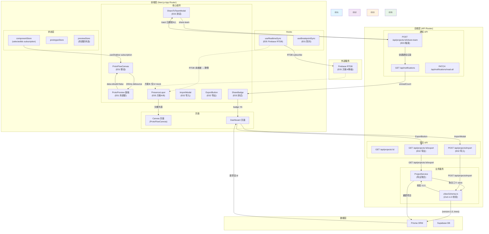
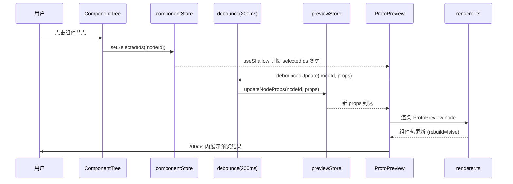
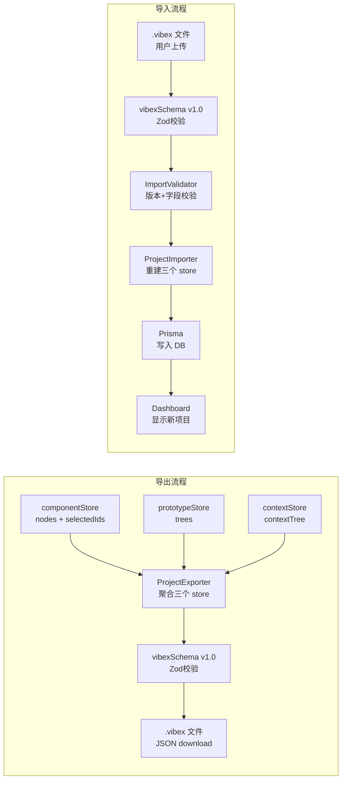

# VibeX Sprint 30 — 架构设计文档

**Agent**: architect
**日期**: 2026-05-08
**项目**: vibex-proposals-sprint30
**状态**: Adopted

---

## 执行决策

- **决策**: 已采纳
- **执行项目**: vibex-proposals-sprint30
- **执行日期**: 2026-05-08

---

## 1. 技术栈

### 1.1 现有技术栈（基于 package.json 验证）

| 技术 | 版本 | 选择理由 |
|-----|------|---------|
| Next.js | 16.1.6 | App Router 后端，稳定生产验证 |
| React | 19.2.3 | 最新稳定版，Concurrent Features |
| TypeScript | 5.x | 类型安全（严格模式） |
| Zustand | 4.5.7 | 状态管理，useShallow subscription |
| TanStack Query | 5.90.21 | 服务端状态缓存 |
| Vitest | 4.1.2 | 单元测试，80% 覆盖率门控 |
| Playwright | 1.58.2 | E2E 测试，CI 卡口 |
| Prisma | 5.22.0 | ORM，数据库操作 |
| Supabase | 2.104.1 | 数据库 + Auth |
| Hono | 4.12.5 | 轻量 API 框架 |
| Zod | 4.3.6 | Schema 校验 |
| jszip | 3.10.1 | **新增**：.vibex 文件压缩导出 |

### 1.2 新增依赖清单

```bash
# Sprint 30 新增
cd /root/.openclaw/vibex
# 无需新增 npm 包，使用现有依赖实现
# - Zustand useShallow: 已有 (4.5.7)
# - debounce: 可用 lodash (已在 overrides 中) 或自实现
# - jszip: 已有 (3.10.1)，用于 .vibex 文件压缩
```

---

## 2. 架构图

### 2.1 系统全貌图（5个 Epic 模块关系）



### 2.2 E01 ProtoPreview 热更新数据流



### 2.3 E02 项目导入/导出数据流



---

## 3. API 定义

### 3.1 E02 项目导出 API

```
GET /api/projects/:id/export

请求头:
  Authorization: Bearer <token>

路径参数:
  id: string (项目 UUID)

Query 参数: 无

Response 200:
  Content-Type: application/octet-stream
  Content-Disposition: attachment; filename="项目名.vibex"
  
  {
    "version": "1.0",
    "project": {
      "id": "uuid-xxx",
      "name": "项目名称",
      "description": "",
      "createdAt": "2026-01-01T00:00:00Z",
      "updatedAt": "2026-05-07T00:00:00Z"
    },
    "trees": {
      "componentTree": { ... },
      "prototypeTree": { ... },
      "contextTree": { ... }
    },
    "exportedAt": "2026-05-07T12:00:00Z",
    "exportedBy": "user_id"
  }

Error Codes:
- 401: UNAUTHORIZED         (无 token)
- 403: FORBIDDEN            (非 owner 或 collaborator)
- 404: NOT_FOUND            (project id 不存在)
- 500: INTERNAL_ERROR       (聚合失败)
```

### 3.2 E02 项目导入 API

```
POST /api/projects/import

请求头:
  Authorization: Bearer <token>
  Content-Type: multipart/form-data 或 application/json

Request (multipart):
  file: .vibex 文件（二进制或 JSON 文本）

Request (JSON body):
  { /* .vibex JSON body */ }

Response 201:
  {
    "id": "new-uuid",
    "name": "项目名称",
    "importedAt": "2026-05-07T12:00:00Z"
  }

Error Codes:
- 400: MISSING_FILE         (无 file 字段，multipart 时)
- 401: UNAUTHORIZED
- 422: INVALID_JSON        (文件无法解析为 JSON)
- 422: INVALID_VERSION     (version 缺失或非 "1.0")
- 422: INVALID_TREE_STRUCTURE (缺少必需 tree key)
- 422: INVALID_DATE        (exportedAt 格式错误)
- 500: INTERNAL_ERROR      (DB write 失败)
```

### 3.3 E02 .vibex 格式 Schema (Zod)

```typescript
// lib/schemas/vibex.ts
import { z } from 'zod';

const TreeNodeSchema = z.object({
  id: z.string(),
  type: z.string().optional(),
  data: z.record(z.unknown()).optional(),
  children: z.array(z.any()).optional(),
});

export const VibexFileSchema = z.object({
  version: z.literal('1.0'),
  project: z.object({
    id: z.string().uuid(),
    name: z.string().min(1).max(200),
    description: z.string().max(2000).optional(),
    createdAt: z.string().datetime(),
    updatedAt: z.string().datetime(),
  }),
  trees: z.object({
    componentTree: TreeNodeSchema.optional(),
    prototypeTree: TreeNodeSchema.optional(),
    contextTree: TreeNodeSchema.optional(),
  }),
  exportedAt: z.string().datetime(),
  exportedBy: z.string().min(1),
});

export type VibexFile = z.infer<typeof VibexFileSchema>;
```

### 3.4 E03 通知 API（补充）

```
GET /api/notifications?page=1&limit=20

Response 200:
{
  "data": [ /* Notification[] */ ],
  "pagination": { "page": 1, "limit": 20, "total": 42 },
  "unreadCount": 3
}

PATCH /api/notifications/read-all

Response 200:
{ "updatedCount": 5 }
```

### 3.5 E05 Presence 降级路径

```
Firebase RTDB 状态检测：

function isRTDBConfigured(): boolean {
  return !!(process.env.FIREBASE_DATABASE_URL && 
           process.env.FIREBASE_API_KEY);
}

// 调用点：useRealtimeSync.ts 初始化时
const configured = isRTDBConfigured();
if (!configured) {
  console.warn('[Presence] Firebase RTDB 未配置，降级到 UI mock');
  return { mode: 'mock' };
}
```

---

## 4. 数据模型

### 4.1 .vibex 文件格式（v1.0）

```typescript
interface VibexFile {
  version: '1.0';                    // 版本标识，必填
  project: {
    id: string;                       // UUID v4
    name: string;                     // 1-200 字符
    description?: string;            // 0-2000 字符
    createdAt: string;                // ISO 8601
    updatedAt: string;                // ISO 8601
  };
  trees: {
    componentTree?: TreeNode;        // 组件树（可选，支持部分导出）
    prototypeTree?: TreeNode;        // 原型树
    contextTree?: TreeNode;          // 上下文树
  };
  exportedAt: string;                 // ISO 8601
  exportedBy: string;                 // userId
}
```

### 4.2 componentStore 核心结构（E01 联动关键）

```typescript
interface ComponentStore {
  nodes: Record<string, ComponentNode>;
  selectedIds: string[];             // ← E01 联动关键字段
  setSelectedIds: (ids: string[]) => void;
  // ... 其他方法
}
```

### 4.3 previewStore 热更新结构

```typescript
interface PreviewStore {
  nodeProps: Record<string, Record<string, unknown>>;
  updateNodeProps: (nodeId: string, props: Record<string, unknown>) => void;
  rebuildFlag: boolean;               // E01: true = 组件卸载重挂
}
```

---

## 5. 性能影响评估

### 5.1 E01 ProtoPreview 热更新

| 风险 | 评估 | 缓解 |
|------|------|------|
| 频繁 selectedIds 变更导致重渲染 | 中 | 200ms debounce，useShallow shallow equality |
| ProtoPreview 组件卸载重挂 | 高（白屏） | `data-rebuild="false"` 标记，React.memo 包裹 |
| Props 修改高频触发（打字场景） | 中 | 独立 debounce 通道，200ms 防抖 |
| 预估延迟 | ≤200ms (p95) | 验证命令见测试策略 |

### 5.2 E02 大文件导出

| 风险 | 评估 | 缓解 |
|------|------|------|
| 导出大文件（>5MB）超时 | 中 | 流式写入 + 进度提示（前端 Toast） |
| 大文件内存占用 | 低 | Prisma 分页查询，streaming response |
| JSON 序列化性能 | 低 | Node.js 原生 JSON.stringify，V8 优化 |

### 5.3 E05 Firebase RTDB 降级

| 风险 | 评估 | 缓解 |
|------|------|------|
| RTDB 未就绪导致 Canvas 编辑阻塞 | 高 | S10 子任务先验证；方案B（UI mock）兜底 |
| RTDB write quota 超限 | 低 | Presence 更新 ≤1Hz 频率限制 |
| Firebase 连接错误 console 输出 | 中 | `try/catch` 静默降级，无 console.error |

---

## 6. 测试策略

### 6.1 测试框架覆盖

| 层级 | 框架 | 覆盖率要求 | CI 门控 |
|------|------|-----------|---------|
| 单元测试 | Vitest | >80% line coverage | `vitest run --coverage` exit 0 |
| E2E 测试 | Playwright | 所有验收标准 assert | `npm run test:e2e:ci` exit non-zero → PR blocked |
| API 测试 | Jest + supertest | 所有 error codes | `npm run test` |

### 6.2 E01 测试用例

```typescript
// tests/unit/protopreview-realtime.test.ts
import { describe, it, expect, vi } from 'vitest';

describe('E01 ProtoPreview 热更新', () => {
  it('componentStore.selectedIds 变更 → ProtoPreview 200ms 内渲染', async () => {
    // 模拟 store update
    act(() => {
      useComponentStore.getState().setSelectedIds(['node_001']);
    });
    
    const start = Date.now();
    await waitFor(() => {
      expect(screen.getByTestId('proto-preview-node')).toBeVisible();
    }, { timeout: 300 });
    
    expect(Date.now() - start).toBeLessThan(200);
  });

  it('热更新时 rebuild=false（无组件卸载重挂）', async () => {
    act(() => {
      usePreviewStore.getState().updateNodeProps('node_001', { label: 'new' });
    });
    
    await waitFor(() => {
      const preview = screen.getByTestId('proto-preview');
      expect(preview.dataset.rebuild).toBe('false');
    });
  });
});
```

### 6.3 E02 测试用例

```typescript
// tests/api/project-import-export.test.ts
import request from 'supertest';
import { VibexFileSchema } from '@/lib/schemas/vibex';

describe('E02 项目导入/导出 API', () => {
  it('GET /api/projects/:id/export → 200 + valid v1.0 JSON', async () => {
    const res = await request(app)
      .get('/api/projects/proj_001/export')
      .set('Authorization', `Bearer ${token}`);
    
    expect(res.status).toBe(200);
    expect(res.headers['content-type']).toContain('application/json');
    
    const parsed = VibexFileSchema.safeParse(res.body);
    expect(parsed.success).toBe(true);
    expect(parsed.data.version).toBe('1.0');
  });

  it('POST /api/projects/import → 422 + INVALID_VERSION（version 非 "1.0"）', async () => {
    const res = await request(app)
      .post('/api/projects/import')
      .send({ version: '2.0', project: {}, trees: {}, exportedAt: new Date().toISOString(), exportedBy: 'test' });
    
    expect(res.status).toBe(422);
    expect(res.body.error.code).toBe('INVALID_VERSION');
  });
});
```

### 6.4 E03 E2E 测试用例

```typescript
// tests/e2e/share-notification.spec.ts
import { test, expect } from '@playwright/test';

test.describe('ShareBadge + ShareToTeamModal E2E', () => {
  test('分享后 badge 数字 +N', async ({ page }) => {
    await page.goto('/dashboard');
    const badgeBefore = await page.getByTestId('share-badge').textContent();
    
    await page.click('[aria-label="share project"]');
    await page.fill('[name="email"]', 'alice@example.com');
    await page.click('[name="send"]');
    await page.waitForResponse(/api\/notifications/);
    
    const badgeAfter = await page.getByTestId('share-badge').textContent();
    expect(parseInt(badgeAfter || '0')).toBe(parseInt(badgeBefore || '0') + 1);
  });

  test('CI: e2e:ci exit non-zero → PR blocked', () => {
    test.skip(process.env.CI === undefined, 'Skip in local dev');
    // 验证 GitHub Actions workflow 不含 || true
  });
});
```

### 6.5 CI 卡口配置

```yaml
# .github/workflows/ci.yml (片段)
jobs:
  e2e:
    runs-on: ubuntu-latest
    steps:
      - uses: actions/checkout@v4
      - run: npm ci
      - run: npm run build
      - run: npm run test:e2e:ci
        # ⚠️ 注意：不能加 || true，必须 capture exit code
```

---

## 7. 非功能性需求

### 7.1 安全

| 需求 | 实现 |
|------|------|
| XSS 防护 | .vibex 导入时 Zod schema 校验所有字符串字段 |
| 权限控制 | export/import API 必须验证 userId === project.ownerId 或 collaborator |
| 密钥保护 | FIREBASE_* 仅 server-side，不可暴露给客户端 |
| Git 禁止提交凭证 | .env* 已加入 .gitignore |

### 7.2 可用性

| 场景 | 降级策略 |
|------|---------|
| ProtoPreview 联动失败 | 显示空白占位符，不阻断 Canvas 编辑 |
| 项目导入失败 | Dashboard 显示红色错误 Toast，不静默失败 |
| ShareBadge 加载失败 | badge 隐藏（display: none），不显示错误数字 |
| Firebase RTDB 未配置 | 静默降级到 UI mock，Canvas 正常编辑不受影响 |

### 7.3 兼容性

| 场景 | 处理 |
|------|------|
| 导出 v1.0 格式文件 | 不向前兼容，v2.0 格式需独立 API endpoint |
| 旧版 .vibex 文件导入 | version 检查，v1.0 之外 → 422 INVALID_VERSION |

---

*本文件由 architect 基于 PRD（prd.md）+ Analyst 报告（analysis.md）+ E01-E05 specs 产出。*