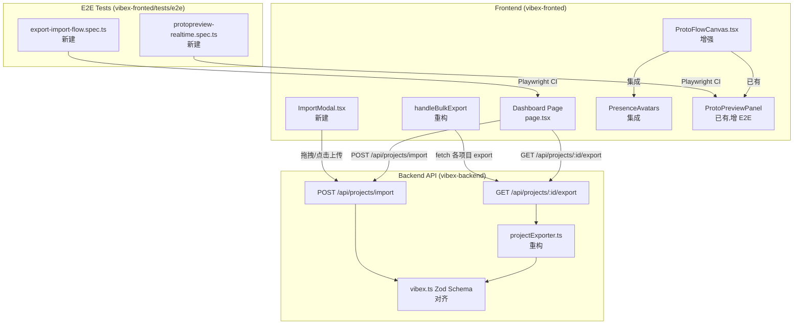

# VibeX Sprint 31 — Architecture Document

**Agent**: Architect
**日期**: 2026-05-08
**项目**: vibex-proposals-sprint31
**版本**: v1.0

---

## 1. 执行摘要

Sprint 31 修复 Sprint 30 遗留的 3 个 Epic 断裂点：
1. **E02 导入导出闭环** — schema 不一致导致 export/import 数据断裂
2. **E01 ProtoPreview E2E** — 缺少 CI 卡口保护
3. **E05 ProtoFlowCanvas Presence** — 头像组件缺失

**关键约束**: 不破坏现有 API，向后兼容，mock 优先降低 Firebase 依赖风险。

---

## 2. Tech Stack

| 层级 | 技术选型 | 理由 |
|------|----------|------|
| E2E 测试框架 | Playwright | 已有 `playwright-e2e-test.config.cjs`，可复用 |
| 文件上传 | 原生 `<input type="file">` + `FormData` | 轻量，无需引入 `react-dropzone` |
| Presence mock | 内存 Map + 定时轮询 | 避免 Firebase RTDB 配置门槛，300ms 轮询足够 |
| Schema 校验 | Zod（已有 `vibex.ts`） | 统一校验层，复用现有 schema |

**版本锁定**: Playwright `@playwright/test` 保持现有版本，不升级。

---

## 3. 架构图



---

## 4. API 定义

### 4.1 导出 API（已有，重构调用方）

```
GET /api/projects/:id/export
Authorization: Bearer <token>
Response 200:
  Content-Type: application/json
  Body: VibexExport JSON (见 vibex.ts)
Response 401: { error: "PERMISSION_DENIED", message: string }
Response 404: { error: "PROJECT_NOT_FOUND", message: string }
Response 500: { error: "EXPORT_FAILED", message: string }
```

### 4.2 导入 API（已有，校验 schema 对齐）

```
POST /api/projects/import
Authorization: Bearer <token>
Content-Type: application/json
Body: VibexExport JSON
Response 201: { success: true, projectId: string, projectName: string, importedAt: string }
Response 400: { error: "INVALID_JSON" | "INVALID_VERSION" | "INVALID_PROJECT_NAME", message: string }
Response 401: { error: "PERMISSION_DENIED", message: string }
Response 500: { error: "IMPORT_FAILED", message: string }
```

### 4.3 Frontend — 文件下载契约

```typescript
// Dashboard 单项目导出
async function handleSingleExport(projectId: string, projectName: string): Promise<void> {
  const response = await fetch(`/api/projects/${projectId}/export`);
  if (!response.ok) throw new Error('Export failed');
  const blob = await response.blob();
  const filename = `${projectName}-${new Date().toISOString().slice(0,10)}.vibex`;
  downloadBlob(blob, filename);
}

// Dashboard 批量导出
async function handleBulkExport(projectIds: string[]): Promise<void> {
  await Promise.all(
    projectIds.map(async (id) => {
      const project = projects.find(p => p.id === id);
      await handleSingleExport(id, project?.name ?? 'project');
    })
  );
}
```

### 4.4 Frontend — 文件导入契约

```typescript
// ImportModal 上传
async function handleFileUpload(file: File): Promise<{ projectId: string }> {
  const text = await file.text();
  const response = await fetch('/api/projects/import', {
    method: 'POST',
    headers: { 'Content-Type': 'application/json' },
    body: text,
  });
  if (!response.ok) {
    const error = await response.json();
    throw new Error(error.message ?? 'Import failed');
  }
  return response.json();
}
```

---

## 5. 数据模型

### 5.1 Export/Import Schema（vibex.ts 核心）

```typescript
// 导出格式（projectExporter.export 返回）
interface VibexExportData {
  version: '1.0';
  projectId: string;
  projectName: string;
  exportedAt: string;       // ISO datetime
  exportedBy?: string;
  pages?: UINode[];         // 字段名与 import 读取一致
  uiNodes?: UINode[];
  businessDomains?: BusinessDomain[];
  flowData?: FlowDataNode[];
  requirements?: Requirement[];
}

// 当前问题：export 返回 { pages, uiNodes, ... }
// 但 VibexExportSchema 要求 { project: { name, description }, ... }
// → 修复: export 统一输出 VibexExportSchema 格式
```

### 5.2 Schema 对齐决策

**问题**: `projectExporter.export()` 返回顶级字段（`projectId`, `projectName`），但 `VibexExportSchema` 要求 `{ project: { name, description } }` 嵌套格式。

**决策**: `export()` 调整为输出 `{ version, project: { name, description }, pages, uiNodes, ... }` 格式，与 `POST /api/projects/import` 读取格式完全一致。

---

## 6. 组件设计

### 6.1 ImportModal.tsx（新建）

```
路径: vibex-fronted/src/components/dashboard/ImportModal.tsx

状态:
  - isOpen: boolean
  - isLoading: boolean
  - errorMessage: string | null

Props:
  interface ImportModalProps {
    isOpen: boolean;
    onClose: () => void;
    onSuccess: (projectId: string, projectName: string) => void;
  }

实现要点:
  - 使用原生 <input type="file" accept=".vibex,.json"> + hidden ref trigger
  - 拖拽区域: onDragEnter/onDragOver/onDrop + CSS visual feedback
  - 文件大小限制: 10MB
  - 错误处理: 捕获 JSON parse 失败 + API 400 错误
  - Loading 状态: 不可重复提交，显示 spinner
  - 成功: 自动关闭 Modal，调用 onSuccess 刷新列表
```

### 6.2 ProtoFlowCanvas Presence 集成（最小改动）

```
路径: vibex-fronted/src/components/prototype/ProtoFlowCanvas.tsx

改动: 在 return JSX 的 canvasWrap div 内或 Controls 旁添加:
  <PresenceAvatarsContainer>
    <PresenceAvatars usePresence={usePresence} />
  </PresenceAvatarsContainer>

PresenceAvatars 使用:
  const presence = usePresence({ mockMode: true });

Mock 数据策略:
  - 内存 Map: Map<userId, { name, color, initials }>
  - 定时器模拟: 每 5s 随机更新在线状态
  - Firebase 未配置: try/catch 包裹，失败时静默使用 mock
```

---

## 7. 测试策略

### 7.1 测试框架

| 测试类型 | 框架 | 配置文件 |
|----------|------|----------|
| Unit | Jest + React Testing Library | 默认 |
| E2E | Playwright | `playwright-e2e-test.config.cjs` |
| CI E2E | Playwright | `playwright-e2e-test.config.cjs` + `npm run test:e2e:ci` |

### 7.2 核心测试用例

#### F1.1 — Schema 对齐（Backend Unit）
```typescript
describe('projectExporter.export()', () => {
  it('返回字段包含 pages, uiNodes, businessDomains, flowData, requirements, version', () => {
    const result = await exportProject('test-id');
    expect(Object.keys(result)).toEqual(
      expect.arrayContaining(['version', 'project', 'pages', 'uiNodes', 'businessDomains', 'flowData', 'requirements'])
    );
  });
  it('version 为 "1.0"', () => {
    const result = await exportProject('test-id');
    expect(result.version).toBe('1.0');
  });
  it('export 输出可直接作为 import 输入', () => {
    const exported = await exportProject('test-id');
    const validated = validateExportJson(exported);
    expect(validated.success).toBe(true);
  });
});
```

#### F1.2 — Dashboard 导出（E2E）
```typescript
// tests/e2e/export-import-flow.spec.ts
describe('Dashboard Export', () => {
  it('点击导出 → fetch GET /api/projects/:id/export', async ({ page }) => {
    await page.goto('/dashboard');
    await page.click('[data-testid="project-card-export-btn"]');
    await expect(page).toHaveResponse(/api\/projects\/.*\/export/);
  });
  it('导出文件为 .vibex 格式', async ({ page }) => {
    const [download] = await Promise.all([
      page.waitForEvent('download'),
      page.click('[data-testid="project-card-export-btn"]'),
    ]);
    expect(download.suggestedFilename()).toMatch(/\.vibex$/);
  });
  it('批量导出调用多次 API', async ({ page }) => {
    await page.click('[data-testid="select-all-projects"]');
    await page.click('[data-testid="bulk-export-btn"]');
    // 验证 n 次 fetch 调用
    const calls = page.request_mock?.calls ?? [];
    expect(calls.filter(c => c.url.includes('/export'))).toHaveLength(selectedCount);
  });
});
```

#### F1.3 — ImportModal（E2E + Unit）
```typescript
// tests/e2e/export-import-flow.spec.ts
describe('Dashboard Import', () => {
  it('存在「导入项目」按钮', async ({ page }) => {
    await page.goto('/dashboard');
    await expect(page.getByText('导入项目')).toBeVisible();
  });
  it('点击打开 Modal', async ({ page }) => {
    await page.getByText('导入项目').click();
    await expect(page.getByRole('dialog')).toBeVisible();
  });
  it('无效文件显示错误提示', async ({ page }) => {
    await page.getByText('导入项目').click();
    const input = page.locator('input[type="file"]');
    await input.setInputFiles(Buffer.from('invalid json'));
    await expect(page.getByText(/导入失败|无效|格式错误/i)).toBeVisible();
  });
  it('有效 .vibex 导入成功', async ({ page }) => {
    await page.getByText('导入项目').click();
    const input = page.locator('input[type="file"]');
    await input.setInputFiles('valid-project.vibex');
    await page.waitForResponse('POST /api/projects/import');
    await expect(page.getByRole('dialog')).not.toBeVisible();
  });
});
```

#### F2.1 — ProtoPreview E2E（新建 spec）
```typescript
// tests/e2e/protopreview-realtime.spec.ts
describe('ProtoPreview Realtime', () => {
  it('选中节点 → ProtoPreview 300ms 内显示', async ({ page }) => {
    await page.goto('/prototype');
    await page.click('[data-node-id="node-1"]');
    await expect(page.locator('[data-preview-panel]')).toBeVisible({ timeout: 300 });
  });
  it('无选中 → 显示 placeholder', async ({ page }) => {
    await page.goto('/prototype');
    await page.keyboard.press('Escape');
    await expect(page.locator('[data-preview-placeholder]')).toBeVisible();
  });
  it('npm run test:e2e:ci exit 0', async () => {
    const result = await exec('npm run test:e2e:ci');
    expect(result.exitCode).toBe(0);
  });
});
```

#### F2.2 — ProtoFlowCanvas Presence（Unit）
```typescript
describe('ProtoFlowCanvas Presence', () => {
  it('ProtoFlowCanvas 渲染 PresenceAvatars', () => {
    render(<ProtoFlowCanvas />);
    expect(screen.getByTestId('presence-avatars')).toBeInTheDocument();
  });
  it('Firebase 未配置 → 无 error 抛出', () => {
    const consoleError = jest.spyOn(console, 'error').mockImplementation(() => {});
    render(<ProtoFlowCanvas />);
    expect(consoleError).not.toHaveBeenCalled();
    consoleError.mockRestore();
  });
});
```

### 7.3 覆盖率要求

| 文件 | 覆盖率 |
|------|--------|
| `projectExporter.ts` | > 80% |
| `ImportModal.tsx` | > 70% |
| `vibex.ts` schema 校验 | > 80% |

---

## 8. 性能影响评估

| 变更点 | 性能影响 | 缓解措施 |
|--------|----------|----------|
| `handleBulkExport` 调用 n 次 fetch | 无显著影响，Promise.all 并行 | 限制最大批量 50 个 |
| ImportModal 文件读取 | 10MB 限制，大文件体验差 | 限制 10MB，超出提示 |
| PresenceAvatars 300ms 轮询 | 极低，内存 Map 查询 O(1) | mockMode 下无网络请求 |
| `exportProject` 并行 Prisma 查询 | 与现有相同 | 无变化 |

**结论**: 性能影响可忽略。

---

## 9. 风险与缓解

| 风险 | 概率 | 影响 | 缓解 |
|------|------|------|------|
| export/import schema 不对齐导致数据丢失 | 低 | 高 | F1.1 先完成，export→import roundtrip 测试必写 |
| ImportModal 影响 Dashboard 性能 | 低 | 低 | 文件大小 10MB 限制，streaming upload |
| Firebase RTDB 未配置破坏 Presence | 中 | 低 | mockMode 默认开启，try/catch 静默降级 |
| E2E 测试 flaky | 中 | 中 | 使用 `data-testid` 而非 CSS selector，`waitForResponse` 而非固定 sleep |

---

## 10. 依赖关系与执行顺序

```
F1.1 (3h) ──→ F1.2 (4h) ──→ F1.3 (6h)    Epic 1（串行）
F2.1 (5h) ────────────────────────────────── Epic 2a（并行）
F2.2 (3h) ────────────────────────────────── Epic 2b（并行）

关键路径: F1.1 → F1.2 → F1.3（21h）
```

**并行启动**: F1.1 与 F2.1、F2.2 可同时开始。
