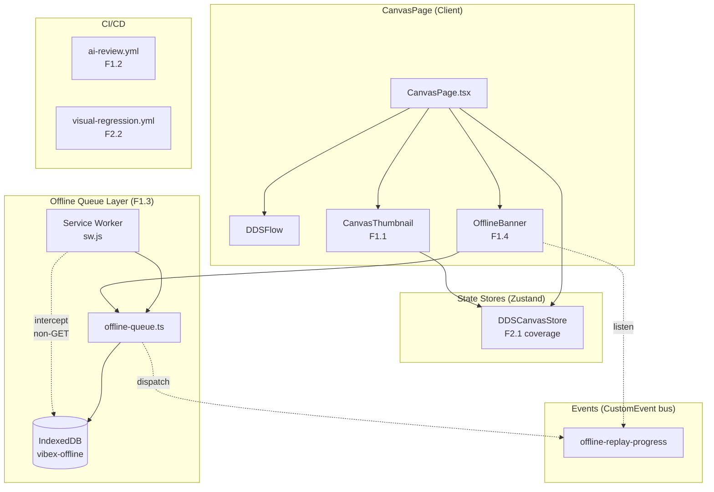
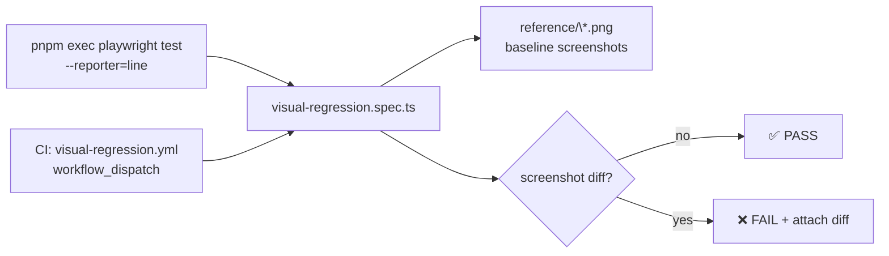

# VibeX Sprint 32 — System Architecture

**Project**: vibex-proposals-sprint32-qa
**Date**: 2026-05-09
**Status**: Technical Design — QA Verification Phase
**Author**: architect

---

## 1. Tech Stack

| Layer | Technology | Version | Rationale |
|-------|-----------|---------|-----------|
| Frontend framework | Next.js | 14.x | App Router, Server Components |
| UI components | React 18 | 18.x | Concurrent features |
| Canvas engine | `@xyflow/react` | ^12.x | ReactFlow for node-based canvas |
| Styling | CSS Modules | — | Scoped styles, no runtime overhead |
| State management | Zustand | ^5.x | Lightweight, `@xyflow/react` compatible |
| Offline storage | IndexedDB | Browser native | Durable queue persistence |
| Service Worker | Vanilla JS | — | Intercept requests without extra deps |
| Unit testing | Vitest | ^2.x | Vite-native, fast, Jest-compatible |
| E2E testing | Playwright | ^1.x | Cross-browser visual regression |
| CI/CD | GitHub Actions | — | `ai-review.yml`, `visual-regression.yml` |

**Key version notes**:
- `@xyflow/react` (ReactFlow v12) — used for `getNodesBounds`, `useReactFlow`, `Viewport`
- Vitest 2.x — snapshot support compatible with Jest/Jest-dom matchers
- `NEXT_PUBLIC_ENABLE_OFFLINE_QUEUE` feature flag gates F1.3 in production

---

## 2. Architecture Diagram



**Data flow for offline write → sync → banner**:
```
User action (offline)
  → Service Worker intercepts fetch (non-GET)
  → enqueueRequest() → IndexedDB vibex-offline/request-queue
  → getPendingCount() read by OfflineBanner → pendingCount state
  → network restored → replayQueue() fires
  → dispatches CustomEvent 'offline-replay-progress' {type, total, completed, failed, lastError}
  → OfflineBanner updates progress bar + error message
```

---

## 3. API Definitions

### 3.1 `offline-queue.ts` (F1.3 — `lib/offline-queue.ts`)

```typescript
// Core queue API
export async function enqueueRequest(
  req: Omit<QueuedRequest, 'id' | 'retryCount'>
): Promise<string>
  // Returns idempotency key (timestamp-method-url hash)
  // Persists to IndexedDB vibex-offline/request-queue

export async function dequeueRequest(id: string): Promise<void>

export async function getQueuedRequests(): Promise<QueuedRequest[]>
  // Returns all requests ordered by timestamp (FIFO)

export async function getPendingCount(): Promise<number>
  // Returns count of requests with retryCount < MAX_RETRIES (3)

export async function clearQueue(): Promise<void>

export async function replayQueue(): Promise<{ completed: number; failed: number }>
  // Replays all queued requests; dispatches 'offline-replay-progress' events
  // Increments retryCount on failure; max 3 retries per request

export function isReplayInProgress(): boolean
export function isOfflineQueueEnabled(): boolean
```

```typescript
interface QueuedRequest {
  id: string;          // idempotency key
  url: string;
  method: string;
  body: string | null;
  headers: Record<string, string>;
  timestamp: number;
  retryCount: number;  // 0–3; >3 = permanent failure
}

interface ReplayProgressEvent {
  type: 'progress' | 'complete' | 'error';
  total: number;
  completed: number;
  failed: number;
  lastError?: string;
}
```

### 3.2 `OfflineBanner.tsx` (F1.4 — `components/canvas/OfflineBanner.tsx`)

```typescript
// Component props: none (reads queue + navigator state internally)
export function OfflineBanner(): JSX.Element | null

// Key internal state
// isOffline: boolean       — navigator.onLine listener
// hidden: boolean         — set after success or user dismiss
// pendingCount: number    — from getPendingCount()
// totalCount: number      — from replay progress events
// isSyncing: boolean      — true during replayQueue()
// syncError: string | null — from lastError in replay event

// Critical data attributes (for E2E)
// data-testid="offline-banner"     — banner container
// data-sync-progress="true"        — progress bar element  ⚠️ Q2 MISSING
// data-sync-error={bool}           — error state flag

// Critical accessibility attributes
// role="alert"                    — live region
// aria-live="polite"              — non-intrusive announcements
// aria-valuenow / min / max        — progress bar

// Error message format: "第 {retryCount} 次失败，请检查网络"
// ⚠️ Q3: retryCount not currently embedded in error text
```

### 3.3 `CanvasThumbnail.tsx` (F1.1 — `components/dds/canvas/CanvasThumbnail.tsx`)

```typescript
interface CanvasThumbnailProps {
  threshold?: number;   // default 50 — min nodes before showing
  className?: string;
}

export function CanvasThumbnail(props): JSX.Element | null

// Critical data attributes (for E2E)
// ⚠️ Q1 MISSING: data-testid="canvas-thumbnail" on outer container
// role="img"          — SVG element
// aria-label="画布缩略图"    — container
// aria-label="点击跳转到对应区域" — SVG

// Viewport indicator: rect with className={styles.indicator}
// min size: 4×4px (prevents invisible indicator on small viewports)
```

---

## 4. Data Model

### 4.1 IndexedDB Schema

```
Database: vibex-offline (version 1)
└── ObjectStore: request-queue (keyPath: id)
    ├── id: string          PRIMARY KEY — idempotency key
    ├── url: string         INDEXED
    ├── method: string
    ├── body: string | null
    ├── headers: object     JSON-serializable
    ├── timestamp: number   INDEXED (for FIFO ordering)
    └── retryCount: number (0–3, max 3 retries)
```

**Idempotency key formula**: `${timestamp}-${method}-${url}`

### 4.2 Key Entity Relationships

```
QueuedRequest (IndexedDB)
  ├── id (PK) = makeIdempotencyKey(timestamp, url, method)
  ├── retryCount ≤ MAX_RETRIES (3)
  └── timestamp → used for FIFO ordering

CanvasThumbnail
  ├── reads: getNodes() from ReactFlow context
  └── derives: nodesRect (via getNodesBounds), indicatorRect (worldToThumbnail)

OfflineBanner
  ├── reads: pendingCount (from IndexedDB via getPendingCount)
  ├── subscribes: 'offline-replay-progress' CustomEvent
  └── derives: showSyncBanner = !hidden && (isOffline || pendingCount > 0 || isSyncing)
```

---

## 5. Testing Strategy

### 5.1 Test Framework: Vitest 2.x

| Epic | Test File | Lines | Status |
|------|-----------|-------|--------|
| F2.1 | `ChapterPanel.test.tsx` | 574 | ✅ 85 tests, snapshot matching |
| F2.1 | `DDSCanvasStore.test.ts` | 566 | ✅ snapshot matching |
| F1.3 | `offline-queue.test.ts` | (missing — to be added) | ⬜ pending |

### 5.2 Coverage Requirements

| Epic | Coverage Target | Key Paths |
|------|----------------|-----------|
| F1.3 `offline-queue.ts` | > 80% | enqueueRequest, dequeueRequest, getQueuedRequests, getPendingCount, replayQueue, clearQueue, MAX_RETRIES edge case |
| F1.4 `OfflineBanner.tsx` | > 70% | state transitions (OFFLINE → SYNCING → SUCCESS/ERROR), event handling |
| F1.1 `CanvasThumbnail.tsx` | > 70% | threshold gating, indicator update, click-to-navigate |

### 5.3 F1.3 Unit Test Examples

```typescript
// offline-queue.test.ts (to be created)

describe('offline-queue', () => {
  beforeEach(async () => { await clearQueue(); });

  it('enqueueRequest adds request to IndexedDB', async () => {
    const id = await enqueueRequest({ url: '/api/test', method: 'POST', body: '{}', headers: {}, timestamp: Date.now() });
    const requests = await getQueuedRequests();
    expect(requests).toHaveLength(1);
    expect(requests[0].id).toBe(id);
  });

  it('getQueuedRequests returns FIFO order by timestamp', async () => {
    await enqueueRequest({ url: '/a', method: 'POST', body: 'a', headers: {}, timestamp: 100 });
    await enqueueRequest({ url: '/b', method: 'POST', body: 'b', headers: {}, timestamp: 200 });
    const requests = await getQueuedRequests();
    expect(requests[0].url).toBe('/a');
    expect(requests[1].url).toBe('/b');
  });

  it('getPendingCount excludes requests exceeding MAX_RETRIES', async () => {
    // Manually insert a request with retryCount = 3
    await addRequestWithRetryCount(3);
    await addRequestWithRetryCount(2);
    expect(await getPendingCount()).toBe(1);
  });

  it('replayQueue dispatches progress events', async () => {
    const events: ReplayProgressEvent[] = [];
    window.addEventListener('offline-replay-progress', (e) => events.push(e.detail));
    await enqueueRequest({ url: '/api/test', method: 'POST', body: '{}', headers: {}, timestamp: Date.now() });
    await replayQueue();
    expect(events.length).toBeGreaterThanOrEqual(2); // initial + final
    expect(events[events.length - 1].type).toBe('complete');
  });
});
```

### 5.4 E2E / Visual Regression Strategy



**Playwright visual-regression.spec.ts** (already implemented, ~140 lines):
- Covers: CanvasPage with ≥50 nodes → CanvasThumbnail visible
- Covers: OfflineBanner states (OFFLINE, SYNCING, SUCCESS, ERROR)
- Baseline screenshots: `reference/canvas-thumbnail-[state].png`

### 5.5 Acceptance Criteria (Test Contract)

| Layer | Command | Pass Condition |
|-------|---------|----------------|
| L1: Type check | `cd vibex-fronted && pnpm run type-check` | exit 0, 0 errors |
| L1: Unit tests | `pnpm run test:unit` | exit 0, all tests pass |
| L1: F1.3 coverage | `pnpm run test:unit -- offline-queue --coverage` | coverage ≥ 80% |
| L1: Overall coverage | `pnpm run test:unit:coverage` | ≥ 60% |
| L2: Q1 grep | `grep 'data-testid="canvas-thumbnail"' CanvasThumbnail.tsx` | ≥ 1 match |
| L2: Q2 grep | `grep 'data-sync-progress' OfflineBanner.tsx` | ≥ 1 match |
| L2: Q3 grep | `grep '第.*次失败' OfflineBanner.tsx` | ≥ 1 match |
| L2: Snapshots | `git ls-files -- '**/__snapshots__/*.snap'` | ≥ 2 files |
| L2: CI workflows | `test -f .github/workflows/ai-review.yml && test -f .github/workflows/visual-regression.yml` | exit 0 |
| L3: E2E | gstack browse (F1.1 + F1.4 scenarios) | all assertions pass |

---

## 6. Q1/Q2/Q3 Fix Specification

### Q1: `data-testid="canvas-thumbnail"` in CanvasThumbnail.tsx

**File**: `vibex-fronted/src/components/dds/canvas/CanvasThumbnail.tsx`

**Fix**: Add `data-testid="canvas-thumbnail"` to the outer `<div>` container (line ~135).

```tsx
// BEFORE (line ~135):
<div className={`${styles.container} ${className ?? ''}`} aria-label="画布缩略图">

// AFTER:
<div
  className={`${styles.container} ${className ?? ''}`}
  aria-label="画布缩略图"
  role="img"
  data-testid="canvas-thumbnail"
>
```

### Q2: `data-sync-progress` in OfflineBanner.tsx progress bar

**File**: `vibex-fronted/src/components/canvas/OfflineBanner.tsx`

**Fix**: Add `data-sync-progress="true"` to the progress bar container div (inside `isSyncing` block).

```tsx
// BEFORE:
<div
  className={styles.progressBar}
  role="progressbar"
  aria-valuenow={totalCount - pendingCount}
  aria-valuemin={0}
  aria-valuemax={totalCount}
  aria-label={`同步进度：${totalCount - pendingCount}/${totalCount}`}
>

// AFTER:
<div
  className={styles.progressBar}
  role="progressbar"
  data-sync-progress="true"
  aria-valuenow={totalCount - pendingCount}
  aria-valuemin={0}
  aria-valuemax={totalCount}
  aria-label={`同步进度：${totalCount - pendingCount}/${totalCount}`}
>
```

### Q3: retryCount in error message of OfflineBanner.tsx

**File**: `vibex-fronted/src/components/canvas/OfflineBanner.tsx`

**Fix**: Extract retryCount from the error event or maintain it in state, and display it in the error message.

```tsx
// ISSUE: syncError is set as a flat string without retryCount
// Current: setSyncError(detail.lastError ?? '同步失败，请检查网络')

// REQUIRED: error message must contain "第 N 次失败"
// The ReplayProgressEvent lastError field should contain retryCount info,
// OR OfflineBanner needs to track retryCount separately.
// Since offline-queue.ts dispatches { lastError } but lastError is a string,
// we need to either:
// Option A: change lastError to include retryCount in the dispatching code
// Option B: track retryCount per-request in OfflineBanner state

// Simplest fix: change the error message construction in OfflineBanner
// to include a retryCount variable derived from the error detail.
```

**Fix**: Add `retryCount` state and display it in error message:

```tsx
// Add to state:
const [retryCount, setRetryCount] = useState(0);

// In error handler:
} else if (detail.type === 'error') {
  setRetryCount(detail.retryCount ?? 0);
  setSyncError(`同步失败（第 ${detail.retryCount ?? 0} 次），请检查网络`);
  setIsSyncing(false);
}
```

Note: `offline-queue.ts` `ReplayProgressEvent` type needs to add `retryCount?: number` field, and the replay loop should pass it.

---

## 7. Dependencies

```
CanvasThumbnail.tsx
  └── @xyflow/react (getNodesBounds, useReactFlow)
  └── CanvasThumbnail.module.css (CSS Modules)

OfflineBanner.tsx
  └── offline-queue.ts (getPendingCount)
  └── OfflineBanner.module.css (CSS Modules)
  └── CustomEvent: 'offline-replay-progress' (window event bus)

offline-queue.ts
  └── IndexedDB (browser native)
  └── Service Worker (sw.js — intercepts non-GET, returns 202 offline)

sw.js (public/)
  └── intercepts: non-GET fetches when offline
  └── calls: offline-queue.ts (via navigator.serviceWorker)
```

---

## 8. Security Considerations

| Concern | Mitigation |
|---------|-----------|
| API key in CI | `OPENCLAW_API_KEY` injected via GitHub secrets, never hardcoded |
| IndexedDB XSS | No user input stored; only structured queue entries |
| Service Worker intercept | Only intercepts same-origin requests; returns 202 (not cached) |
| Replay replay attack | Idempotency keys (timestamp-method-url) prevent duplicate sends |

---

## 执行决策

- **决策**: 已采纳（有条件）
- **执行项目**: vibex-proposals-sprint32-qa
- **执行日期**: 2026-05-09
