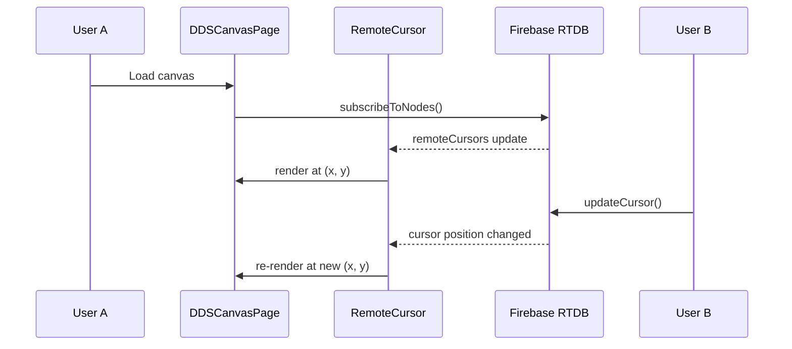

# VibeX Sprint 36 — Architecture Document

**Agent**: architect
**Date**: 2026-05-11
**Version**: v1.0
**Status**: ✅ Completed

---

## 执行摘要

Sprint 36 在两条主线上推进：
- **Epic E1-E4**：功能实现（多人协作 MVP、模板市场、MCP DoD CI、撤销重做 Toolbar）
- **Epic E5**：测试覆盖补全（Design Review E2E 降级路径）

所有 Epic 均为增量修改，不重构已稳定模块。技术决策以「最小变更 + 最大产出」为原则。

---

## 1. Tech Stack

| Epic | 技术选型 | 版本/库 | 选型理由 |
|------|---------|---------|----------|
| E1 | Firebase RTDB presence + RemoteCursor | firebase ^10.x | 基础设施已就绪，仅需挂载 RemoteCursor |
| E1 | Zustand store subscription | zustand ^4.x | 与现有 canvasHistoryStore 一致 |
| E2 | Next.js API Route (static JSON) | Next.js 14+ App Router | MVP 无数据库依赖，静态 JSON 满足需求 |
| E2 | React state + useSWR | swr ^2.x | 与现有 templateApi 一致 |
| E3 | GitHub Actions YAML | actions/checkout@v4 | CI 配置变更，无运行时影响 |
| E4 | React conditional rendering | — | 纯 UI 增量，不影响快捷键逻辑 |
| E5 | Playwright route mocking | @playwright/test ^1.40+ | 与现有 E2E 测试一致 |

---

## 2. Architecture Diagram

```mermaid
graph TB
    subgraph "Frontend (vibex-fronted)"
        subgraph "DDSCanvasPage"
            RemoteCursor["`<RemoteCursor />`"]
            useRealtimeSync["`useRealtimeSync`"]
            DDSToolbar["DDSToolbar\n(Undo/Redo buttons)"]
            ReviewReportPanel["ReviewReportPanel\n(Tabs)"]
        end
        subgraph "Dashboard Templates"
            TemplatesPage["/dashboard/templates\n(industry filter)"]
        end
        subgraph "Stores"
            canvasHistoryStore["canvasHistoryStore\n(canUndo/canRedo)"]
            presenceStore["usePresence\n(connectedUsers)"]
        end
    end

    subgraph "Backend (vibex-backend)"
        MarketplaceAPI["GET /api/templates/marketplace\n(static JSON)"]
        MCPEndpoint["POST /api/mcp/review_design"]
    end

    subgraph "External Services"
        FirebaseRTDB["Firebase RTDB\n(RemoteCursor sync)"]
        MCPServer["MCP Server\n(Design Review)"]
    end

    subgraph "CI/CD"
        TestYML[".github/workflows/test.yml\n(generate-tool-index job)"]
        INDEXMD["docs/mcp-tools/INDEX.md"]
        GenerateScript["scripts/generate-tool-index.ts"]
    end

    subgraph "E2E Tests"
        presenceMVP["presence-mvp.spec.ts"]
        templatesMarket["templates-market.spec.ts"]
        designReviewDeg["design-review-degradation.spec.ts"]
        designReviewTabs["design-review-tabs.spec.ts"]
    end

    %% E1: RemoteCursor + useRealtimeSync
    RemoteCursor -->|subscribe| FirebaseRTDB
    RemoteCursor -->|get remote cursors| presenceStore
    useRealtimeSync -->|subscribe nodes| FirebaseRTDB

    %% E2: Marketplace API
    MarketplaceAPI -.->|static JSON| TemplatesPage

    %% E4: Toolbar
    DDSToolbar -->|getState().undo/redo| canvasHistoryStore

    %% E3: CI Gate
    TestYML -->|run| GenerateScript
    GenerateScript -->|git diff| INDEXMD
```



---

## 3. API Definitions

### 3.1 GET /api/templates/marketplace

**File**: `vibex-backend/src/app/api/templates/marketplace/route.ts`

```typescript
// Request
GET /api/templates/marketplace

// Response 200
{
  "templates": Array<{
    id: string;          // e.g., "tpl_mkt_001"
    name: string;
    industry: "saas" | "mobile" | "ecommerce";
    description: string;
    tags: string[];
    icon: string;        // emoji, e.g., "📊"
    previewUrl: string;  // e.g., "/images/templates/saas-dashboard.png"
    usageCount: number;
    createdAt: string;   // ISO date
  }>;
  "meta": {
    "total": number;
    "lastUpdated": string; // ISO date
  }
}

// Response headers
Cache-Control: public, max-age=3600

// Error 401 (unauthorized)
{ "error": "Unauthorized" }
```

### 3.2 POST /api/mcp/review_design

**File**: `vibex-backend/src/app/api/ai/review_design/route.ts` (existing)

```typescript
// Request
POST /api/mcp/review_design
Content-Type: application/json
Authorization: Bearer <token>

{
  "canvasData": Record<string, unknown>;
  "chapterType": "requirement" | "context" | "flow" | "api" | "business-rules";
}

// Response 200
{
  "compliance": {
    "score": number;     // 0-100
    "issues": string[];
  };
  "accessibility": {
    "score": number;
    "issues": string[];
  };
  "reuse": {
    "score": number;
    "suggestions": string[];
  };
}

// Response 503 (MCP unavailable)
{ "error": "Service Unavailable" }

// Error 401
{ "error": "Unauthorized" }
```

---

## 4. Data Model

### 4.1 RemoteCursor Entity

**File**: `vibex-fronted/src/components/presence/RemoteCursor.tsx`

```typescript
interface RemoteCursor {
  userId: string;
  userName: string;
  position: { x: number; y: number };
  color?: string;
  intention?: IntentionType;  // E3-U1: current user intent
  nodeId?: string | null;     // element being hovered/selected
  isMockMode?: boolean;
}

type IntentionType = 'selecting' | 'dragging' | 'editing' | 'creating' | null;
```

### 4.2 Template Entity

**File**: `vibex-backend/public/data/marketplace-templates.json`

```typescript
interface MarketplaceTemplate {
  id: string;
  name: string;
  industry: 'saas' | 'mobile' | 'ecommerce';
  description: string;
  tags: string[];
  icon: string;         // emoji (NOT an image URL or component)
  previewUrl: string;   // static image path under /public
  usageCount: number;
  createdAt: string;    // ISO date
}
```

**数据约束**：
- `id` 格式: `tpl_mkt_{3-digit}`，全局唯一
- `industry` 枚举: `saas` | `mobile` | `ecommerce`，不得为空
- `icon` 字段: 必须是 emoji 字符，不允许空字符串
- `usageCount`: 非负整数

### 4.3 DesignReviewReport Entity

```typescript
interface DesignReviewReport {
  compliance: {
    score: number;     // 0-100
    issues: string[];
  };
  accessibility: {
    score: number;
    issues: string[];
  };
  reuse: {
    score: number;
    suggestions: string[];
  };
}
```

---

## 5. Testing Strategy

### 5.1 Test Framework

| 层级 | 框架 | 覆盖目标 |
|------|------|----------|
| Unit | Vitest | canvasHistoryStore, useRealtimeSync hooks |
| Component | React Testing Library | DDSToolbar buttons, RemoteCursor |
| E2E | Playwright | Full user flows, API contracts |

**覆盖率要求**：
- E1: RemoteCursor 渲染 + Firebase mock → presence-mvp.spec.ts (2 tests)
- E2: marketplace API response + industry filter → templates-market.spec.ts (2 tests)
- E3: CI git diff detection (manual verification via CI run)
- E4: Toolbar buttons → keyboard-shortcuts.spec.ts + undo-redo.spec.ts
- E5: Degradation path → design-review-degradation.spec.ts (2 tests) + design-review-tabs.spec.ts (4 tests)

### 5.2 E2E Test Cases

#### E1: Presence MVP (presence-mvp.spec.ts)

```typescript
import { test, expect } from '@playwright/test';

// TC1: Firebase mock 模式下 RemoteCursor 可见
test('multi-user sees remote cursor in Firebase mock mode', async ({ browser }) => {
  await firebaseMock.enableMock();

  // User 1 opens canvas
  const context1 = await browser.newContext();
  const page1 = await context1.newPage();
  await page1.goto('/canvas/test-canvas-001');

  // User 2 opens same canvas
  const context2 = await browser.newContext();
  const page2 = await context2.newPage();
  await page2.goto('/canvas/test-canvas-001');

  // User 2 moves cursor
  await page2.mouse.move(400, 300);
  await page2.waitForTimeout(500);

  // User 1 sees User 2's RemoteCursor
  await expect(page1.locator('[data-testid="remote-cursor"]').first())
    .toBeVisible({ timeout: 5000 });

  // User 1 sees User 2's name in PresenceAvatars
  await expect(page1.locator('[data-testid="presence-avatars"]'))
    .toContainText('User 2');

  await context1.close();
  await context2.close();
});
```

#### E2: Template Marketplace (templates-market.spec.ts)

```typescript
import { test, expect } from '@playwright/test';

// TC1: marketplace API 返回 200 和 ≥3 个模板
test('GET /api/templates/marketplace returns 200 with templates', async ({ request }) => {
  const response = await request.get('/api/templates/marketplace');
  expect(response.status()).toBe(200);
  const body = await response.json();
  expect(body.templates.length).toBeGreaterThanOrEqual(3);
  // Verify required fields
  for (const tpl of body.templates) {
    expect(tpl).toHaveProperty('id');
    expect(tpl).toHaveProperty('industry');
    expect(tpl).toHaveProperty('icon');
    expect(tpl.icon.length).toBeGreaterThan(0); // emoji, not empty
  }
});

// TC2: Dashboard 模板页 industry filter 可切换
test('industry filter tabs filter templates correctly', async ({ page }) => {
  await page.goto('/dashboard/templates');

  const saasTab = page.getByRole('tab', { name: /saas/i });
  await expect(saasTab).toBeInTheDocument();

  await saasTab.click();

  await expect(page.locator('[data-testid="template-card"]').first())
    .toBeVisible({ timeout: 3000 });

  // No "no templates found" error
  await expect(page.queryByText(/no templates found/i)).not.toBeInTheDocument();
});
```

#### E5: Design Review Degradation (design-review-degradation.spec.ts)

```typescript
import { test, expect } from '@playwright/test';

test.describe('Design Review degradation path', () => {
  test('shows degradation message when MCP server returns 503', async ({ page }) => {
    // Mock MCP server returning 503
    await page.route('**/api/mcp/review_design', async (route) => {
      await route.fulfill({
        status: 503,
        contentType: 'application/json',
        body: JSON.stringify({ error: 'Service Unavailable' }),
      });
    });

    await page.goto('/canvas/test-canvas-001');
    await page.keyboard.press('Control+Shift+R');

    // Degradation message visible
    await expect(page.getByText(/AI 评审暂时不可用/i))
      .toBeInTheDocument({ timeout: 5000 });

    // Canvas still functional
    await expect(page.locator('[data-testid="canvas-container"]'))
      .toBeInTheDocument();
  });
});
```

#### E5: Design Review Tabs (design-review-tabs.spec.ts)

```typescript
import { test, expect } from '@playwright/test';

test.describe('Design Review report tabs', () => {
  test.beforeEach(async ({ page }) => {
    // Mock successful response
    await page.route('**/api/mcp/review_design', async (route) => {
      await route.fulfill({
        status: 200,
        contentType: 'application/json',
        body: JSON.stringify({
          compliance: { score: 85, issues: ['Color contrast ratio 3.2:1'] },
          accessibility: { score: 78, issues: ['Missing alt text'] },
          reuse: { score: 62, suggestions: ['Button component can be extracted'] },
        }),
      });
    });
    await page.goto('/canvas/test-canvas-001');
  });

  test('compliance tab renders with score', async ({ page }) => {
    await page.keyboard.press('Control+Shift+R');
    await expect(page.getByRole('tab', { name: /compliance/i }))
      .toBeInTheDocument();
    await page.getByRole('tab', { name: /compliance/i }).click();
    await expect(page.getByTestId('compliance-score')).toBeInTheDocument();
  });

  test('reuse tab renders with reuse score', async ({ page }) => {
    await page.keyboard.press('Control+Shift+R');
    await page.getByRole('tab', { name: /reuse/i }).click();
    await expect(page.getByTestId('reuse-score')).toBeInTheDocument();
  });

  test('tab switching does not reload page', async ({ page }) => {
    await page.keyboard.press('Control+Shift+R');
    await page.waitForTimeout(500);
    let navCount = 0;
    page.on('navigation', () => navCount++);
    await page.getByRole('tab', { name: /accessibility/i }).click();
    await page.waitForTimeout(200);
    expect(navCount).toBe(0);
  });
});
```

---

## 6. Performance Impact Assessment

| Epic | 性能影响 | 量化估算 | 缓解措施 |
|------|----------|----------|----------|
| E1 RemoteCursor | 渲染增量：每个远程用户 +1 DOM 节点 | Canvas overlay 层，GPU 加速无主线程压力 | 条件守卫 `isFirebaseConfigured()`，Firebase 未配置时不渲染 |
| E1 useRealtimeSync | Store subscription + Firebase write debounce 500ms | 内存：每节点额外 store 引用；CPU：500ms debounce 防抖 | 已有实现，无变更 |
| E2 Marketplace API | 静态文件读取，无数据库查询 | 响应时间 < 50ms（缓存）；无并发数据库压力 | `Cache-Control: public, max-age=3600` |
| E3 CI Gate | GitHub Actions runner 额外 ~30s job | CI 总时长从 ~5min 增至 ~5.5min（+6%） | 仅在 tool 文件变更时触发（paths filter） |
| E4 Toolbar Undo/Redo | Zustand selector 订阅，DOM 渲染 2 按钮 | 可忽略 | 按钮 disabled 时不触发 re-render |
| E5 E2E Tests | Playwright 额外测试文件运行时间 | ~2-3min 额外 E2E（6 tests × ~30s） | 与现有 test suite 并行，无单独 gate |
| **整体** | 无生产代码性能下降 | — | E2 静态 JSON，E3 CI only，E5 测试文件 |

**Firebase RTDB 并发上限**（E1）：
- Firebase Spark 计划 20 并发连接上限
- 缓解：监控并发数，超限时 PresenceAvatars 显示「人数已达上限」提示

---

## 7. Key Architecture Decisions

### AD-1: RemoteCursor 条件渲染

**决策**：RemoteCursor 仅在 `isFirebaseConfigured() === true` 时渲染。

**理由**：避免 Firebase 未配置时产生空引用错误。用户无 Firebase 配置时，RemoteCursor 组件不挂载，PresenceAvatars 也相应隐藏（已有守卫）。

**回滚**：配置 `NEXT_PUBLIC_FIREBASE_*` 环境变量为空字符串，RemoteCursor 自动不渲染。

### AD-2: 模板市场静态 JSON（MVP）

**决策**：E2 MVP 使用静态 JSON，无数据库依赖。

**理由**：S35-P004 调研结论确认 MVP 只读市场安全风险可控。静态 JSON 满足「≥3 个模板」验收标准，无需额外的数据库基础设施。

**回滚**：前端降级为已有 `/v1/templates` CRUD 列表。

### AD-3: E2E 测试不影响生产代码

**决策**：E5 仅新增测试文件，不修改生产组件。

**理由**：E2E 测试通过 Playwright `page.route()` mock 响应，不需要修改 ReviewReportPanel 组件逻辑。

**回滚**：删除新增的 `.spec.ts` 文件即可。

### AD-4: CI job 仅在 tool 文件变更时触发

**决策**：`.github/workflows/test.yml` 的 `generate-tool-index` job 使用 `paths` filter。

**理由**：避免不必要的 CI 运行。`generate-tool-index.ts` 仅在 `packages/mcp-server/src/tools/**/*.ts` 或 `scripts/generate-tool-index.ts` 变更时触发。

**回滚**：从 workflow 中移除该 job。

---

## 8. File Changes Summary

| Epic | 文件操作 | 文件路径 |
|------|----------|----------|
| E1 | 修改 | `vibex-fronted/src/components/dds/DDSCanvasPage.tsx` — 添加 `<RemoteCursor />` JSX |
| E1 | 修改 | `vibex-fronted/src/components/dds/DDSCanvasPage.tsx` — 调用 `useRealtimeSync` |
| E1 | 新增 | `vibex-fronted/tests/e2e/presence-mvp.spec.ts` |
| E2 | 新增 | `vibex-backend/src/app/api/templates/marketplace/route.ts` |
| E2 | 新增 | `vibex-backend/public/data/marketplace-templates.json` |
| E2 | 修改 | `vibex-fronted/src/app/dashboard/templates/page.tsx` — industry filter tabs |
| E2 | 新增 | `vibex-fronted/tests/e2e/templates-market.spec.ts` |
| E3 | 修改 | `.github/workflows/test.yml` — 添加 `generate-tool-index` job |
| E4 | 修改 | `vibex-fronted/src/components/dds/toolbar/DDSToolbar.tsx` — undo/redo buttons |
| E5 | 新增 | `vibex-fronted/tests/e2e/design-review-degradation.spec.ts` |
| E5 | 新增 | `vibex-fronted/tests/e2e/design-review-tabs.spec.ts` |

---

## 9. DoD Checklist

### E1 多人协作 MVP
- [ ] DDSCanvasPage.tsx 中 `<RemoteCursor />` 存在于 render 输出
- [ ] RemoteCursor 有条件守卫 `isFirebaseConfigured()`
- [ ] useRealtimeSync 在 DDSCanvasPage 中被调用
- [ ] presence-mvp.spec.ts 在 Firebase mock 模式下 E2E 测试 100% 通过
- [ ] RemoteCursor position 更新延迟 < 3s

### E2 模板市场 MVP
- [ ] GET `/api/templates/marketplace` 返回 HTTP 200
- [ ] 返回 ≥3 个模板，每个含 industry/description/tags/icon 字段
- [ ] `/dashboard/templates` 页面存在 saas/mobile/ecommerce 三个 tab
- [ ] Tab 切换后模板列表正确过滤
- [ ] templates-market.spec.ts E2E 测试通过

### E3 MCP DoD CI Gate
- [ ] `.github/workflows/test.yml` 包含 `generate-tool-index` job
- [ ] job 在 tool 源文件变更时触发（paths 配置正确）
- [ ] `git diff --exit-code` 检测 INDEX.md 失步

### E4 撤销重做 Toolbar
- [ ] DDSToolbar.tsx 存在 `data-testid="undo-btn"` 的 button 元素
- [ ] DDSToolbar.tsx 存在 `data-testid="redo-btn"` 的 button 元素
- [ ] 按钮 disabled 状态与 canUndo/canRedo 一致
- [ ] Ctrl+Z / Ctrl+Shift+Z 快捷键在 Toolbar 上线后仍正常

### E5 Design Review E2E
- [ ] design-review-degradation.spec.ts 文件存在且 2 个测试通过
- [ ] design-review-tabs.spec.ts 文件存在且 4 个测试通过
- [ ] MCP 503 时页面显示「AI 评审暂时不可用」文案
- [ ] Tab 切换不触发页面刷新

---

## 10. Execution Decision

| Field | Value |
|-------|-------|
| **Decision** | Adopted |
| **Project ID** | vibex-proposals-sprint36 |
| **Execution Date** | 2026-05-11 |
| **Updated Items** | P004 工期修正（1-2 人天 → 0.5 人天），P003 DoD gaps 修正（已补全，仅需 CI gate）|

---

*本文档由 architect agent 基于 analyst 可行性分析报告编写。*
*生成时间: 2026-05-11 20:10 GMT+8*