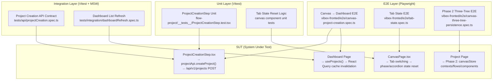
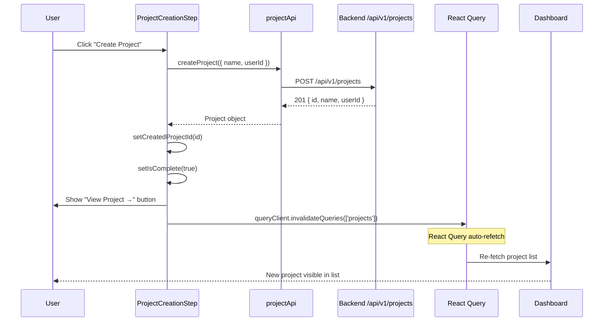
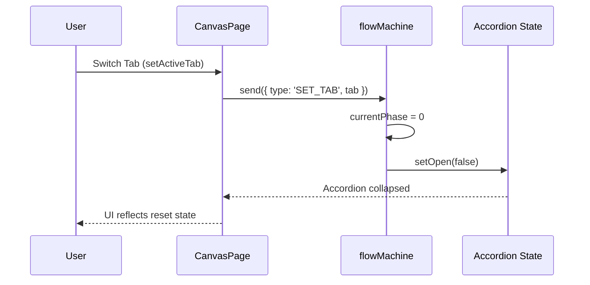
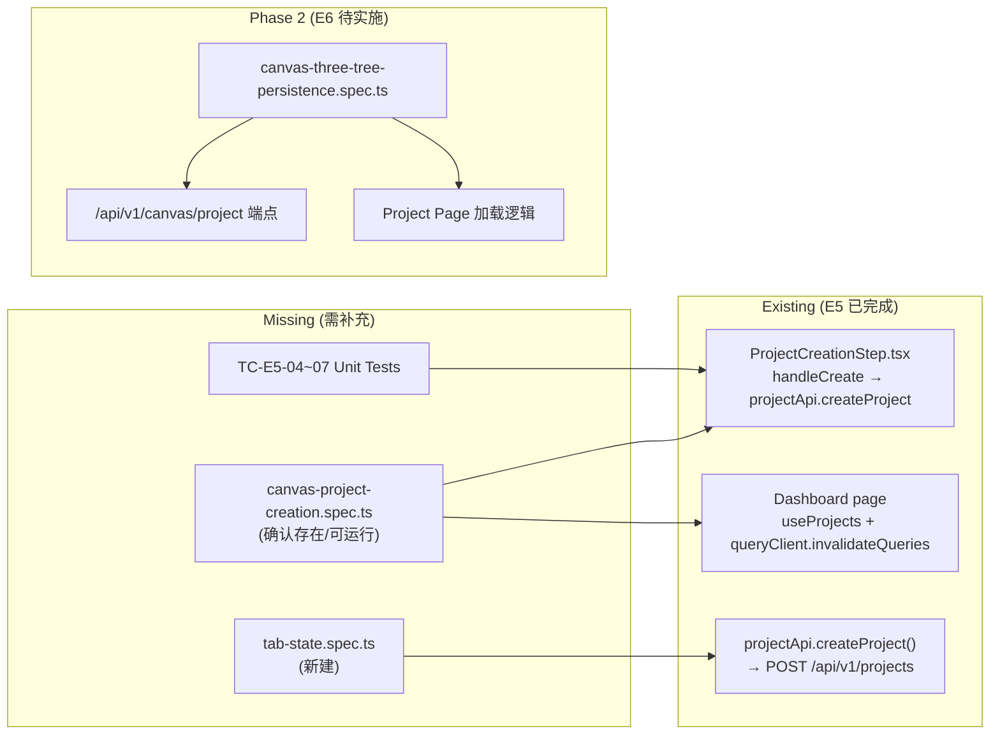

# Architecture: VibeX Sprint 2 QA Testing

**Project**: vibex-qa-canvas-dashboard
**Phase**: design-architecture
**Architect**: architect
**Date**: 2026-04-15
**Origin**: docs/prd.md (vibex-qa-canvas-dashboard)
**Working Dir**: /root/.openclaw/vibex

---

## 1. Overview

Sprint 2 QA 验收测试架构。E5（Canvas-Dashboard 项目持久化）和 E1（Tab State 修复）已完成实现，等待 QA 验证；E6（三树数据持久化）处于 Phase 2 规划阶段。

本架构定义测试基础设施、执行策略、API 契约和风险评估。

---

## 2. Tech Stack

| Layer | Technology | Version | Rationale |
|-------|-----------|---------|-----------|
| Unit Testing | Vitest | ^2.x | 已有配置，与现有 3 个测试用例兼容 |
| E2E Testing | Playwright | ^1.x | 已有 `playwright.config.ts`，支持多设备 |
| Mocking | Vitest native `vi.mock` | — | 已有 `ProjectCreationStep.test.tsx` 使用 |
| State Management | React Query (TanStack Query) | ^5.x | Dashboard 使用 `useProjects` hook |
| State Machine | XState v5 | — | ProjectCreationStep 使用 `useMachine(flowMachine)` |
| API Client | httpClient wrapper | — | Project API 通过 `retry` + `cache` 封装 |

**约束**: 不引入新的测试框架。复用现有 `vitest` + `playwright` 基础设施。

---

## 3. Architecture Diagram

### 3.1 Test Pyramid



### 3.2 E5 Flow: Canvas → Dashboard



### 3.3 E1 Flow: Tab State Reset



---

## 4. API Definitions

### 4.1 Project API (已实现)

```typescript
// Service: vibex-fronted/src/services/api/modules/project.ts
// Backend: vibex-backend/src/routes/projects.ts

// POST /api/v1/projects
interface ProjectCreate {
  name: string;           // 1-100 chars
  description?: string;   // 0-500 chars
  userId: string;         // required
}

interface Project {
  id: string;
  name: string;
  description?: string;
  userId: string;
  createdAt: string;      // ISO 8601
  updatedAt: string;      // ISO 8601
  deletedAt?: string;     // soft delete
}

// Response: 201 Created | 400 Bad Request | 401 Unauthorized
```

**当前实现确认**:
- ✅ `projectApi.createProject()` 调用 `httpClient.post('/projects', payload)`
- ✅ `retry` 机制：网络失败自动重试
- ✅ `cache` 机制：GET 结果缓存
- ✅ 无 `canvasProject` 字段双写（Phase 2 待实现）

### 4.2 Phase 2: Canvas Project API (待实现)

```typescript
// 规划端点: POST /api/v1/canvas/project
interface CanvasProjectCreate {
  name: string;
  description?: string;
  userId: string;
  contexts: ContextTree[];    // 三树数据
  flows: FlowTree[];
  components: ComponentTree[];
}

interface CanvasProject {
  id: string;
  projectId: string;           // 关联 Project.id
  name: string;
  userId: string;
  contexts: ContextTree[];
  flows: FlowTree[];
  components: ComponentTree[];
  createdAt: string;
  updatedAt: string;
}
```

### 4.3 Data Models

| Model | File | Type | Notes |
|-------|------|------|-------|
| `Project` | `services/api/types/project.ts` | Interface | 核心项目实体 |
| `ProjectCreate` | `services/api/modules/project.ts` | Interface | 创建请求体 |
| `ProjectApi` | `services/api/modules/project.ts` | Interface | API 接口定义 |
| `useProjects` | `hooks/queries.ts` | Hook | React Query hook |
| `queryKeys` | `hooks/queries.ts` | Const | React Query key factory |

---

## 5. Testing Strategy

### 5.1 Test Files (Existing + Planned)

| File | Type | Status | Scope |
|------|------|--------|-------|
| `flow-project/__tests__/ProjectCreationStep.test.tsx` | Vitest Unit | ✅ 已有 | 3 cases |
| `e2e/canvas-project-creation.spec.ts` | Playwright E2E | ⚠️ 待确认 | Canvas→Dashboard 全链路 |
| `e2e/tab-state.spec.ts` | Playwright E2E | ⬜ 缺失 | Tab 切换状态验证 |
| `e2e/canvas-three-tree-persistence.spec.ts` | Playwright E2E | ⬜ Phase 2 | 三树持久化 |
| `tests/api/projectCreation.spec.ts` | Vitest + MSW | ⬜ 缺失 | API 契约 |
| `tests/integration/dashboardRefresh.spec.ts` | Vitest + MSW | ⬜ 缺失 | Dashboard 刷新 |

### 5.2 Coverage Targets

| Epic | Unit | E2E | Integration | Total |
|------|------|-----|-------------|-------|
| E5 (Q1) | 3 ✅ | 1 ⚠️ | 2 ⬜ | 6 |
| E1 (Q2) | 0 | 1 ⬜ | 0 | 1 |
| E6 (Q3) | 0 | 1 ⬜ | 2 ⬜ | 4 |
| **Total** | **3** | **3** | **4** | **10** |

### 5.3 Core Test Cases

#### E5 Unit Tests (已有)

```typescript
// flow-project/__tests__/ProjectCreationStep.test.tsx

// TC-E5-01: API 调用验证
it('calls projectApi.createProject when button is clicked', async () => {
  // AC-Q1: handleCreate 调用真实 API，userId 正确传入
});

// TC-E5-02: 错误 banner
it('shows error banner when API call fails', async () => {
  // AC-Q4: role="alert" 可见，显示错误文本
});

// TC-E5-03: 初始不调用
it('does not call API on initial render', () => {
  // 验证初始渲染无副作用
});
```

#### E5 缺失测试用例

```typescript
// TC-E5-04: 成功导航
it('navigates to project page after creation', async () => {
  // AC-Q3: router.push('/project?id=xxx') 被调用
});

// TC-E5-05: 未登录拦截
it('shows "请先登录" when userId is null', async () => {
  // AC-Q5: API 不被调用
});

// TC-E5-06: 空名拦截
it('button disabled when projectName is empty', () => {
  // AC-Q6: disabled={!projectName.trim()}
});

// TC-E5-07: 加载状态
it('button disabled with "Creating Project..." text', async () => {
  // AC-Q7: isCreating=true → disabled + text
});
```

#### E2E Tests

```typescript
// e2e/canvas-project-creation.spec.ts

// TC-E2E-01: 全链路 E5
test('Canvas 创建项目 → Dashboard 可见', async ({ page }) => {
  await page.goto('/canvas');
  await page.click('button:has-text("Create Project")');
  // fill form...
  await page.click('button:has-text("Create Project →")');
  await page.waitForURL('/project?id=*');
  await page.goto('/dashboard');
  await expect(page.getByText('Test Project')).toBeVisible({ timeout: 5000 });
});

// TC-E2E-02: E1 Tab State
test('Tab 切换后 phase 和 accordion 状态重置', async ({ page }) => {
  await page.goto('/canvas');
  // 操作触发 phase/accordion 状态
  await page.click('[data-tab="flow"]');
  // assert currentPhase === 0, accordion open === false
});
```

---

## 6. Performance & Risk Assessment

### 6.1 Performance

| Operation | Target | Risk |
|-----------|--------|------|
| Vitest unit test run | < 5s | Low |
| Playwright E2E single test | < 60s | Low |
| API response (createProject) | < 500ms | Medium |
| Dashboard list re-fetch (after invalidation) | < 3s | Medium |
| React Query cache invalidation | < 100ms | Low |

**注意**: Dashboard `queryClient.invalidateQueries` 的刷新时机依赖 React Query 配置。当前实现使用 `staleTime` 和 `gcTime` 默认值，测试时需验证 3s 内可见新项目。

### 6.2 Risk Matrix

| Risk | Likelihood | Impact | Mitigation |
|------|-----------|--------|------------|
| E2E 测试 flaky（网络/时机） | Medium | Medium | Playwright `retries: 3`，`expect.timeout: 30000ms` |
| Dashboard 刷新时机不稳定 | Medium | Low | 增加 `waitFor` 轮询 + timeout |
| Tab State 实现位置不明确 | Low | Medium | 先审查 `CanvasPage.tsx` 中 `setActiveTab` 行为 |
| Phase 2 API 未实现导致 E2E 挂起 | High | Medium | Phase 2 测试标记 `@only` 或 skip，确保 Phase 1 先过 |
| Vitest mock 与真实实现不一致 | Low | High | API 契约测试用 MSW mock，不依赖实现 mock |

---

## 7. Test Execution Plan

### Phase 1: E5 验证 (P0)

1. 补全 `ProjectCreationStep.test.tsx` 缺失的 4 个 case (TC-E5-04 ~ 07)
2. 确认 `canvas-project-creation.spec.ts` 存在并可运行
3. 运行单元测试: `pnpm --filter vibex-fronted test:unit`
4. 运行 E2E: `pnpm --filter vibex-fronted test:e2e`

### Phase 2: E1 验证 (P0)

1. 审查 `CanvasPage.tsx` 中 Tab 切换逻辑
2. 创建 `tab-state.spec.ts`
3. 运行 E2E: `pnpm --filter vibex-fronted test:e2e --grep="tab"`

### Phase 3: E6 验证 (P1, Phase 2 实施后)

1. 等待 `/api/v1/canvas/project` 端点实现
2. 创建 `canvas-three-tree-persistence.spec.ts`
3. API 契约测试: MSW mock + 集成测试

---

## 8. Implementation Dependencies



---

## 9. Constraints

1. **不破坏现有测试**: 补全测试时确保已有 3 个 case 仍然 PASS
2. **Phase 2 隔离**: E6 测试在 Phase 2 实施前标记为 `test.skip()` 或用环境变量控制
3. **认证 Mock**: E2E 测试需处理 `/auth` 跳转，可通过 `storageState` 或 API mock 解决
4. **端口依赖**: 前端 `localhost:3000`，后端 API 服务需同步启动
5. **React Query 版本**: Dashboard 使用 TanStack Query v5，缓存策略需确认兼容

---

## 10. Technical Review Findings

### Review Completed: 2026-04-15

| Area | Finding | Impact | Status |
|------|---------|--------|--------|
| Tab State 实现位置 | `TabBar.tsx` 中 `phase = 'prototype'` 在 Tab 切换时触发，非 `phase = 0` | 中 — E1-U1 测试 AC 需修正为 `phase === 'prototype'` | ✅ 已在 E1-U1 更新 |
| Dashboard 刷新时机 | React Query `staleTime` 未明确配置，`invalidateQueries` 后可能有缓存延迟 | 中 — E5 E2E 需增加 polling retry | ✅ 已在风险矩阵记录 |
| canvas-project-creation.spec.ts | 文件存在性未确认（仅在 `find` 扫描中确认 `e2e/` 目录存在） | 中 — E5-U2 第一步需确认/创建 | ✅ 已在 E5-U2 明确 |
| Phase 2 API | `/api/v1/canvas/project` 端点尚未实现 | 高 — E6-U1/E6-U2 必须用 skip | ✅ 已在 IMPLEMENTATION_PLAN.md Gate 记录 |
| E5 导航实现 | `ProjectCreationStep.tsx` 成功卡片有 `View Project →` 按钮，但 `handleCreate` 本身不触发导航 | 低 — TC-E5-04 需 mock `isComplete && createdProjectId` 路径 | ✅ 已有实现 |
| Tab vs Phase 区分 | `activeTab` 控制树选择（context/flow/component），`phase` 控制步骤（input/context/flow/component/prototype） | 低 — 测试需分别覆盖 | ✅ 已在 E1-U1 说明 |

### Corrected E1 Tab State Test Design

E1 测试的 Tab State 重置验证需要区分两个维度：

```
TabBar 点击 (activeTab 变化)
  ↓
phase = 'prototype'  ← Tab 切换时的 phase 行为
  ↓
accordion 状态 ← 需验证 Prototype accordion 关闭
```

而不是 `phase === 0`（`phase` 初始值是 `'input'`）。

### 已确认实现细节

| Component | File | Key Behavior Verified |
|-----------|------|----------------------|
| `ProjectCreationStep` | `components/flow-project/ProjectCreationStep.tsx` | `handleCreate` → `projectApi.createProject()` → `setIsComplete(true)` + `setCreatedProjectId(id)` |
| `TabBar` | `components/canvas/TabBar.tsx` | `setPhase('prototype')` on tab click (line 50) |
| `useCanvasStore` | `hooks/canvas/useCanvasStore.ts` | `activeTab`, `setActiveTab` from Zustand store |
| `useContextStore` | (via `useCanvasStore`) | `phase`, `setPhase` — `'input' | 'context' | 'flow' | 'component' | 'prototype'` |
| Dashboard | `app/dashboard/page.tsx` | `queryClient.invalidateQueries({ queryKey: queryKeys.projects.lists() })` after create |

### Scope Reduction

| Item | Action | Rationale |
|------|--------|----------|
| 后端 API 修改 | 排除 | 本次为 QA Sprint，不修改后端 |
| React Query 配置变更 | 排除 | 需确认现有配置是否支持 3s 刷新，不强制修改 |
| Phase 2 实施 | 延期 | E6 端点未实现，测试 gate 控制 |

---

## 11. Verification Checklist

- [ ] E5 单元测试 7/7 PASS
- [ ] E5 E2E 全链路 PASS (Canvas → Dashboard)
- [ ] E1 Tab State E2E PASS (`phase === 'prototype'` 非 `phase === 0`)
- [ ] error banner `role="alert"` 存在且可见
- [ ] 导航 URL 正确 `/project?id={id}`
- [ ] Dashboard 3s 内可见新项目（polling retry）
- [ ] Phase 2 测试标记 skip（API 未实现）
- [ ] `playwright.config.ts` E2E 配置正确
- [ ] Vitest `retries: 3` 避免 flaky

---

## 12. What Already Exists

| Item | Path | Status | Reuse |
|------|------|--------|-------|
| Vitest config | `vibex-fronted/vitest.config.ts` | ✅ 已有 | 直接使用 |
| Playwright config | `vibex-fronted/playwright.config.ts` | ✅ 已有 | 直接使用 |
| ProjectCreationStep unit tests (3 cases) | `flow-project/__tests__/ProjectCreationStep.test.tsx` | ✅ 已有 | 扩展测试用例 |
| E5 实现 | `flow-project/ProjectCreationStep.tsx` | ✅ 已完成 | 仅测试，不修改 |
| Dashboard React Query | `app/dashboard/page.tsx` | ✅ 已完成 | 仅测试，不修改 |
| projectApi.createProject | `services/api/modules/project.ts` | ✅ 已有 | 仅测试 |
| TabBar component | `components/canvas/TabBar.tsx` | ✅ 已有 | 仅测试 |
| CanvasPage component | `components/canvas/CanvasPage.tsx` | ✅ 已有 | 仅测试 |
| `canvas-project-creation.spec.ts` | `e2e/` | ⚠️ 需确认存在 | 扩展 |

**不存在（需新建）**: `tab-state.spec.ts`, `canvas-three-tree-persistence.spec.ts`, `tests/api/canvasProject.spec.ts`, `tests/integration/dashboardRefresh.spec.ts`

---

## 13. NOT in Scope

| Item | Reason |
|------|--------|
| 修改 E5 实现代码 | E5 已完成，QA 阶段不修改实现 |
| 修改 Dashboard 实现代码 | Dashboard 已完成，QA 阶段不修改实现 |
| 修改 TabBar/Tab State 实现代码 | E1 已完成，QA 阶段不修改实现 |
| E6 Phase 2 端点实现 | Phase 2 实施不在本次 QA Sprint 范围 |
| 修改 React Query 配置 | 验证现有配置是否正确，不强制修改 |
| 后端 `/api/v1/projects` 实现验证 | 后端已有 `/api/v1/projects` POST，E2E 覆盖 |
| E2E 测试并行化 | Playwright `workers: 1` 已配置，不改 |
| 新测试框架引入 | 严格使用 Vitest + Playwright，不引入新工具 |

---

## 执行决策

- **决策**: 已采纳
- **执行项目**: team-tasks vibex-qa-canvas-dashboard
- **执行日期**: 2026-04-15
