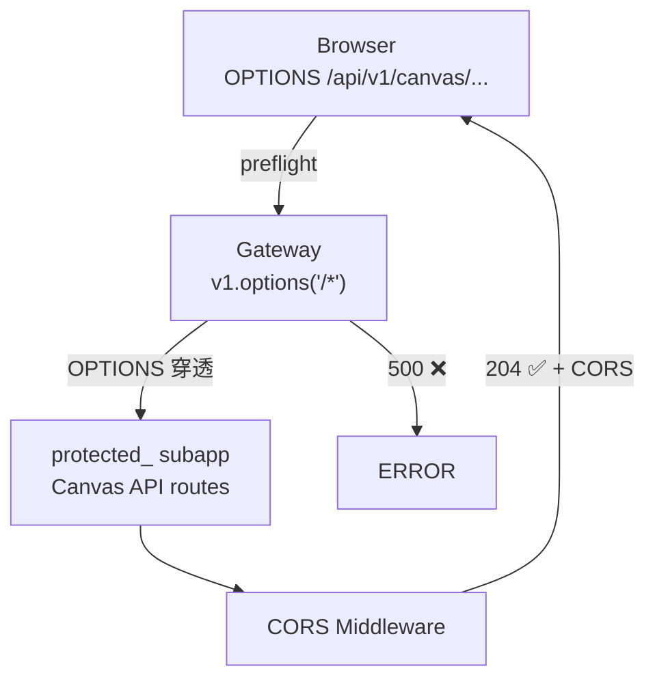

# Architecture: OPTIONS CORS 500 Fix

> **项目**: vibex-quickfix-20260405  
> **Architect**: Architect Agent  
> **日期**: 2026-04-07  
> **版本**: v1.0  
> **状态**: Proposed

---

## 1. 概述

### 1.1 问题陈述

Canvas API OPTIONS 预检请求返回 500，前端无法调用任何受保护的 Canvas API。根因：`v1.options('/*')` 只在顶层匹配，Canvas API 在 `protected_` 子 app 下。

### 1.2 技术目标

| 目标 | 描述 | 优先级 |
|------|------|--------|
| AC1 | OPTIONS 请求返回 204 | P0 |
| AC2 | CORS 头正确 | P0 |
| AC3 | 前端 Canvas API 可调用 | P0 |

---

## 2. 系统架构

### 2.1 请求流程



---

## 3. 详细设计

### 3.1 E1: OPTIONS 路由修复

```python
# app/api/v1/__init__.py 或 gateway.py

# 方案 A: 顶层 OPTIONS 处理
@v1.options('/*')
def handle_options(request):
    response = Response()
    response.status_code = 204
    response.headers['Access-Control-Allow-Origin'] = '*'
    response.headers['Access-Control-Allow-Methods'] = 'GET, POST, PUT, DELETE, OPTIONS'
    response.headers['Access-Control-Allow-Headers'] = 'Content-Type, Authorization'
    response.headers['Access-Control-Max-Age'] = '86400'
    return response

# 方案 B: 中间件自动处理（推荐）
# 在 protected_ subapp 中添加 CORS 中间件
```

### 3.2 E2: CORS 中间件配置

```python
# app/api/v1/protected_/canvas/__init__.py

from fastapi.middleware.cors import CORSMiddleware

protected_app.add_middleware(
    CORSMiddleware,
    allow_origins=["*"],
    allow_credentials=True,
    allow_methods=["GET", "POST", "PUT", "DELETE", "OPTIONS"],
    allow_headers=["*"],
)

# 确保 OPTIONS 请求直接返回 204，不触发路由匹配
@protected_app.options("/{full_path:path}")
async def options_catcher(full_path: str):
    return Response(status_code=204)
```

### 3.3 E3: 验证测试

```python
# tests/test_cors.py
import httpx

def test_options_returns_204():
    """OPTIONS should return 204 with CORS headers"""
    response = httpx.options(
        "http://localhost:8000/api/v1/canvas/generate-contexts",
        headers={"Origin": "http://localhost:3000"}
    )
    assert response.status_code == 204
    assert "access-control-allow-origin" in response.headers
    assert "access-control-allow-methods" in response.headers
    assert "POST" in response.headers["access-control-allow-methods"]
```

---

## 4. 接口定义

| 端点 | 方法 | 响应 | 说明 |
|------|------|------|------|
| `/api/v1/canvas/generate-contexts` | OPTIONS | 204 + CORS | Canvas 生成上下文 |
| `/api/v1/canvas/generate-components` | OPTIONS | 204 + CORS | Canvas 生成组件 |
| `/api/v1/projects` | OPTIONS | 204 + CORS | 项目 CRUD |

---

## 5. 性能影响评估

| 指标 | 影响 | 说明 |
|------|------|------|
| OPTIONS 请求 | < 10ms | 空响应 |
| CORS 中间件 | < 1ms | 极小 |
| **总计** | **< 10ms** | 无显著影响 |

---

## 6. 技术审查

### 6.1 PRD 验收标准覆盖

| PRD AC | 技术方案 | 缺口 |
|---------|---------|------|
| AC1: OPTIONS 204 | ✅ `options_catcher` 函数 | 无 |
| AC2: CORS 头正确 | ✅ CORSMiddleware | 无 |
| AC3: 前端可调用 | ✅ E2E 测试验证 | 无 |

### 6.2 风险点

| 风险 | 等级 | 缓解 |
|------|------|------|
| OPTIONS 被路由处理器拦截 | 🟡 中 | 中间件优先于路由 |
| 子 app 嵌套更深 | 🟢 低 | 递归添加 OPTIONS 处理 |

---

## 7. 实施计划

| Epic | 工时 | 交付物 |
|------|------|--------|
| E1: OPTIONS 路由修复 | 1h | options_catcher 函数 |
| E2: CORS 中间件 | 0.5h | CORSMiddleware 配置 |
| E3: 验证测试 | 0.5h | test_cors.py |
| **合计** | **2h** | |

*本文档由 Architect Agent 生成 | 2026-04-07*
