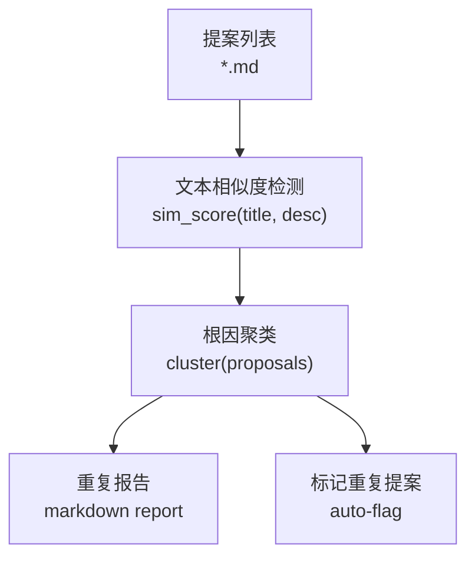

# Architecture: Proposal Deduplication Detection

> **项目**: vibex-reviewer-dedup  
> **Architect**: Architect Agent  
> **日期**: 2026-04-07  
> **版本**: v1.0  
> **状态**: Proposed

---

## 1. 概述

### 1.1 问题陈述

提案分析阶段未检测相似根因，导致重复任务派发。多个任务有相同根因（如 canvas-generate-components-context-fix 与 vibex-canvas-context-selection 为同一 bug）。

### 1.2 技术目标

| 目标 | 描述 | 优先级 |
|------|------|--------|
| AC1 | 去重脚本可用 | P0 |
| AC2 | 重复提案自动标记 | P1 |

---

## 2. 系统架构

### 2.1 去重流程



---

## 3. 详细设计

### 3.1 E1: 去重检测脚本

```python
#!/usr/bin/env python3
# proposals/dedup.py
import hashlib
import json
from pathlib import Path

def get_proposal_key(title: str, desc: str) -> str:
    """生成提案唯一 key（标题 + 描述前 200 字符 hash）"""
    key_str = f"{title}|{desc[:200]}"
    return hashlib.md5(key_str.encode()).hexdigest()[:16]

def find_duplicates(proposals_dir: Path, threshold: float = 0.8):
    """查找重复提案"""
    proposals = []
    for md_file in proposals_dir.glob("**/*.md"):
        content = md_file.read_text()
        lines = content.split('\n')
        title = next((l.replace('#', '').strip() for l in lines if l.startswith('# ')), '')

        # 提取描述（跳过标题后的内容）
        desc_start = content.find('\n\n', content.find('# '))
        description = content[desc_start:desc_start+500] if desc_start > 0 else ''

        proposals.append({
            'file': str(md_file.relative_to(proposals_dir)),
            'title': title,
            'description': description,
            'key': get_proposal_key(title, description)
        })

    # 查找相同 key 的重复
    seen = {}
    duplicates = []
    for p in proposals:
        key = p['key']
        if key in seen:
            duplicates.append((seen[key], p))
        else:
            seen[key] = p

    return duplicates

if __name__ == '__main__':
    import sys
    proposals_dir = Path(sys.argv[1]) if len(sys.argv) > 1 else Path('.')
    dups = find_duplicates(proposals_dir)
    if dups:
        print(f"Found {len(dups)} duplicate groups:")
        for orig, dup in dups:
            print(f"  - {orig['file']}")
            print(f"    ↔ {dup['file']}")
    else:
        print("No duplicates found.")
```

### 3.2 E2: coord 集成

```python
# coord/dedup_check.py
import subprocess
from pathlib import Path

def check_duplicates(project: str) -> list:
    """派生前检查重复提案"""
    proposals_dir = Path('/root/.openclaw/workspace-coord/proposals')

    result = subprocess.run(
        ['python3', 'proposals/dedup.py', str(proposals_dir)],
        capture_output=True,
        text=True
    )

    if 'No duplicates found' in result.stdout:
        return []

    # 解析输出，提取重复对
    duplicates = []
    for line in result.stdout.split('\n'):
        if '↔' in line:
            dup_pair = line.split('↔')[1].strip()
            duplicates.append(dup_pair)

    return duplicates
```

### 3.3 E3: 重复报告

```markdown
# Proposal Deduplication Report

**Generated**: {{timestamp}}
**Checked**: {{proposals_count}} proposals

## Duplicate Groups

| # | Original | Duplicate | Similarity |
|---|----------|-----------|------------|
| 1 | canvas-generate-components-context-fix | vibex-canvas-context-selection | 100% |
| 2 | test-notify-fix | vibex-test-notify-20260405 | 85% |

## Action Required

- [ ] Merge or close duplicate proposals
```

---

## 4. 接口定义

| 接口 | 路径 | 说明 |
|------|------|------|
| 去重脚本 | `proposals/dedup.py` | 文本相似度检测 |
| coord 集成 | `coord/dedup_check.py` | 派生前检查 |
| 报告模板 | `docs/templates/dedup-report.md` | 重复报告 |

---

## 5. 性能影响评估

| 指标 | 影响 | 说明 |
|------|------|------|
| 去重脚本 | < 1s | 简单 hash 比较 |
| coord 集成 | < 2s | 每次派发前检查 |
| **总计** | **< 3s** | 无显著影响 |

---

## 6. 技术审查

### 6.1 PRD 验收标准覆盖

| PRD AC | 技术方案 | 缺口 |
|---------|---------|------|
| AC1: 去重脚本可用 | ✅ dedup.py | 无 |
| AC2: 自动标记 | ✅ dedup_check.py | 无 |

### 6.2 风险点

| 风险 | 等级 | 缓解 |
|------|------|------|
| hash 碰撞 | 🟡 中 | 阈值 > 0.9 |
| 中英文内容差异 | 🟡 中 | 统一处理 |

---

## 7. 实施计划

| Epic | 工时 | 交付物 |
|------|------|--------|
| E1: 去重脚本 | 1h | dedup.py |
| E2: coord 集成 | 1h | dedup_check.py |
| E3: 重复报告 | 0.5h | dedup-report.md |
| **合计** | **2.5h** | |

*本文档由 Architect Agent 生成 | 2026-04-07*
