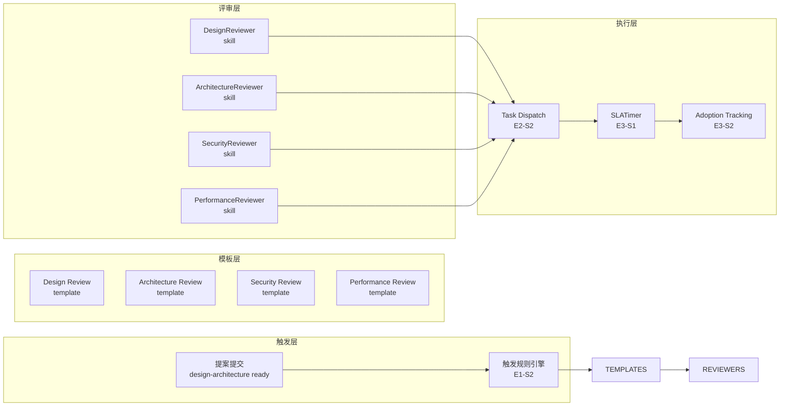

# Architecture: VibeX Reviewer 提案质量评审系统

> **类型**: Meta-tooling / Workflow Engine  
> **日期**: 2026-04-14  
> **依据**: prd.md (vibex-reviewer-proposals-20260414_143000)

---

## 1. Problem Frame

VibeX 提案评审依赖人工，缺乏标准流程、触发规则和 SLA 机制。Reviewer Agent 需要一套结构化评审系统：统一模板、skill-based 集成、4h SLA 和采纳率追踪。

---

## 2. System Architecture



---

## 3. Technical Decisions

### 3.1 Reviewer Skill 接口统一

**决策**: 所有 Reviewer Skill 实现统一接口 `ReviewerSkill`。

```typescript
// 统一 Skill 接口
interface ReviewerSkill {
  type: 'design' | 'architecture' | 'security' | 'performance';
  
  // 输入: 提案上下文
  review(input: ReviewInput): Promise<ReviewOutput>;
  
  // 评审输出: 结构化结论
  getTemplate(): ReviewTemplate;
}

// ReviewInput
interface ReviewInput {
  projectId: string;
  proposalPath: string;  // docs/<project>/ 下对应文档
  prdPath?: string;
  architecturePath?: string;
  context: Record<string, unknown>;  // 额外上下文
}

// ReviewOutput
interface ReviewOutput {
  verdict: 'pass' | 'fail' | 'conditional';
  findings: Finding[];
  blockers: Blocker[];
  suggestions: Suggestion[];
  confidence: number;  // 0-1
}

// Finding
interface Finding {
  section: string;
  severity: 'critical' | 'major' | 'minor';
  description: string;
  suggestion: string;
}
```

**trade-off**: 统一接口确保可插拔，但约束了各 skill 的表达能力。缓解：context 字段允许传递 skill-specific 数据。

### 3.2 触发规则引擎

**决策**: 规则优先模板匹配，非手动指定。

```typescript
// 规则匹配逻辑
const TRIGGER_RULES = [
  { path: '**/architecture.md', skills: ['architecture', 'design'] },
  { path: '**/prd.md', skills: ['design'] },
  { path: '**/security-*.md', skills: ['security'] },
  { path: '**/performance-*.md', skills: ['performance'] },
  { pattern: '**/api/**', skills: ['security', 'performance'] },
];

function matchSkills(docPath: string): SkillType[] {
  return TRIGGER_RULES
    .filter(r => minimatch(docPath, r.path))
    .flatMap(r => r.skills);
}
```

### 3.3 SLA Timer 设计

**决策**: 每条评审线独立计时，不共用全局 timer。

```typescript
// 每条评审线: design + architecture + security + performance 并行
interface TimerSession {
  id: string;
  proposalId: string;
  skillType: SkillType;
  startedAt: Date;
  deadline: Date;       // startedAt + 4h
  warningAt: Date;      // deadline - 0.5h (3.5h 时预警)
  autoProceed: boolean;
}
```

**4h SLA 行为**:
- 3.5h: 发送 Slack 预警到 #reviewer-channel
- 4h: 自动放行 (verdict = 'conditional', blockers = ['SLA timeout'])

### 3.4 任务分发 (Task Dispatch)

**决策**: 复用现有 `task_manager.py`，不新建调度器。

```bash
# 评审任务通过 team-tasks 管理
task_manager.py add <project> review-<type> --agent reviewer
task_manager.py update <project> review-<type> done
```

**Reviewer Agent 工作流**:
```
1. team-tasks ready → 领取 review 任务
2. 读取对应模板 (docs/templates/review-<type>.md)
3. 读取提案文档
4. 产出 review 输出到 docs/<project>/review-<type>.md
5. task update done
```

### 3.5 采纳追踪

**决策**: 追踪 Coord 决策与 Reviewer 结论的一致性。

```typescript
interface AdoptionRecord {
  projectId: string;
  reviewerConclusions: Record<SkillType, Verdict>;
  coordDecision: 'approved' | 'rejected' | 'conditional';
  coordReason?: string;
  timestamp: Date;
}

// 采纳率 = approved / total (不含 conditional)
```

---

## 4. Data Models

### 4.1 Review Record

```typescript
interface ReviewRecord {
  id: string;
  projectId: string;
  skillType: SkillType;
  verdict: Verdict;
  findings: Finding[];
  blockers: Blocker[];
  duration: number;      // 分钟
  autoProceeded: boolean;
  createdAt: Date;
}
```

### 4.2 Review Template Schema

```typescript
// 模板结构 (四类通用)
interface ReviewTemplate {
  type: SkillType;
  sections: TemplateSection[];
  redLines: RedLine[];
  scoringRubric: Record<string, number>;  // section → score
}

interface TemplateSection {
  id: string;
  name: string;
  checklist: ChecklistItem[];
  guidance: string;
}

interface RedLine {
  id: string;
  description: string;
  severity: 'critical';
  autoFail: boolean;
}
```

---

## 5. Integration Points

| 组件 | 技术 | 路径 |
|------|------|------|
| Trigger | team-tasks DAG | task_manager.py |
| Templates | Markdown 文件 | docs/templates/ |
| Skills | OpenClaw Skills | skills/reviewer-*/ |
| SLA Timer | 定时任务/心跳 | scripts/sla-timer.py |
| Adoption Tracking | Markdown 文件 | docs/reviews/INDEX.md |

---

## 6. Performance & Scale

| 维度 | 评估 |
|------|------|
| 并发评审 | 无限制 (独立 TimerSession) |
| 存储 | 每条 review ~5KB，Git 存储 |
| 延迟 | 评审完成即写文件，无额外处理 |

---

## 7. Security

- Review 输出仅 Reviewer + Coord 可写
- SLA timer 仅有写权限，无删除权限
- Adoption 记录不可修改（追加模式）

---

## 8. Open Questions

| 问题 | 状态 | 决定 |
|------|------|------|
| 评审 Skill 实际实现 | 已有 4 个 reviewer skills | 直接集成 |
| 4h SLA 是否太短 | 待验证 | 第一版先跑，收集数据再调整 |

---

## 9. Verification

- [ ] 4 个 review 模板存在于 docs/templates/
- [ ] Reviewer skill 接口统一，可互换
- [ ] SLA timer 在 3.5h 预警、4h 自动放行
- [ ] Adoption tracking 记录正确

---

*Architect Agent | 2026-04-14*
