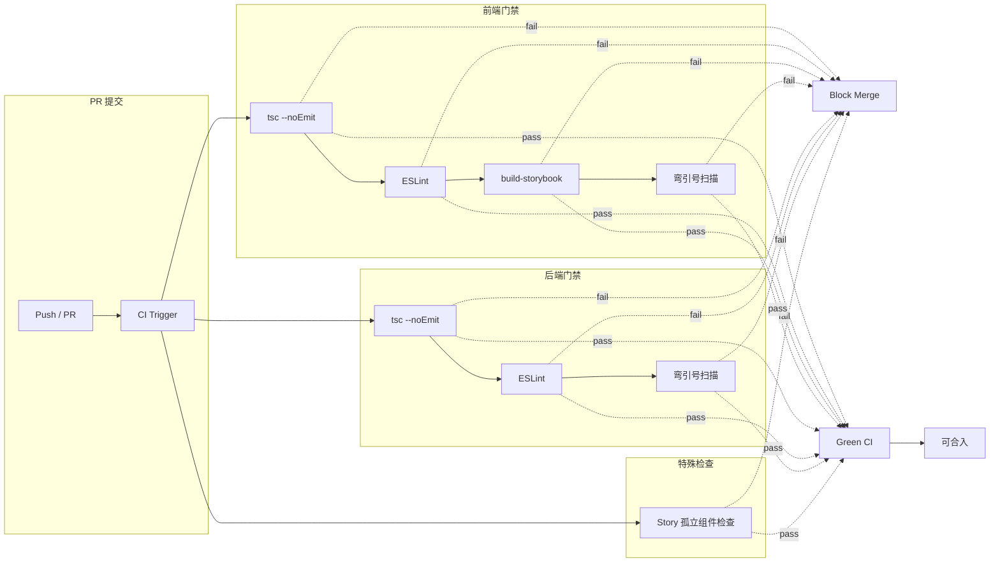
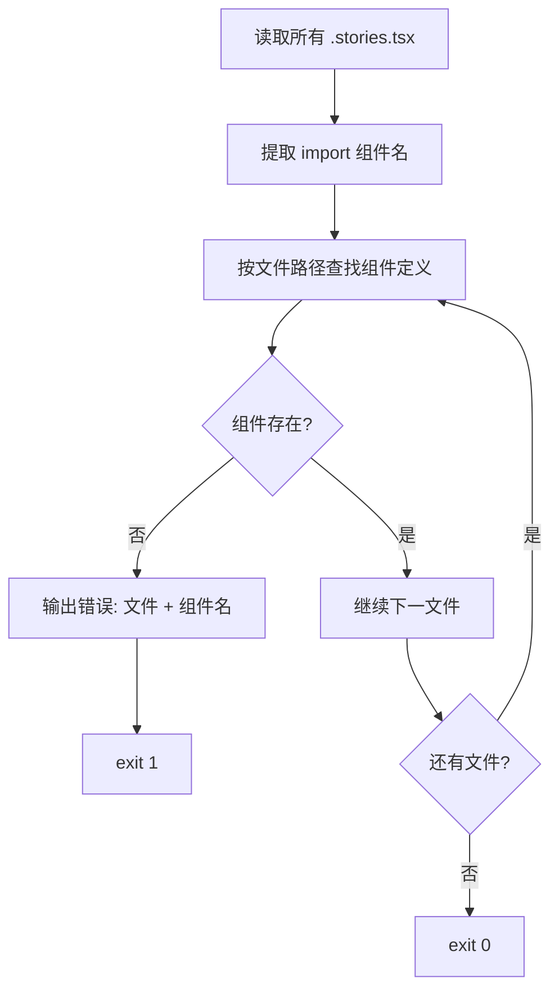

# VibeX 构建修复（Reviewer 视角）— 技术架构设计

**项目**: vibex-reviewer-proposals-vibex-build-fixes-20260411
**角色**: Architect
**日期**: 2026-04-11
**状态**: 设计完成

---

## 1. 技术栈

| 技术 | 选型 | 理由 |
|------|------|------|
| CI/CD | GitHub Actions | 现有 CI 系统 |
| Lint | ESLint + TypeScript | 现有代码检查 |
| 脚本语言 | TypeScript (ts-node) | 检查脚本类型安全 |
| 包管理 | pnpm | 现有 monorepo |

---

## 2. 架构图

### 2.1 CI 质量门禁架构



### 2.2 Story 孤立组件检查流程



---

## 3. 模块划分

| Epic | 模块 | 主要文件 | 工时 |
|------|------|----------|------|
| Epic 1 | 构建修复 | `CanvasHeader.stories.tsx`, `route.ts` | 15min |
| Epic 2 | PR 合入标准 | `docs/PR_MERGE_CRITERIA.md` | 1h |
| Epic 3 | Story 检查 | `.github/workflows/check-stories.ts` | 2h |
| Epic 3 | ESLint 规则 | `.eslintrc*` | 1h |
| Epic 3 | Storybook CI | `.github/workflows/ci.yml` | 1h |
| Epic 4 | CI 门禁 | `.github/workflows/` (前端+后端) | 2h |

---

## 4. 技术风险评估

### Epic 1 — 构建修复

| 风险 | 级别 | 缓解 |
|------|------|------|
| 其他文件含弯引号 | 低 | 扩大扫描范围验证 |
| Storybook 构建在 CI 中超时 | 中 | 单独 step，设置较长 timeout |

### Epic 3 — Story 孤立检查

| 风险 | 级别 | 缓解 |
|------|------|------|
| 路径解析误报 | 中 | 支持别名路径（@/），手动 Review 兜底 |
| 动态 import 无法检测 | 低 | 仅覆盖静态 import |

### Epic 4 — CI 门禁

| 风险 | 级别 | 缓解 |
|------|------|------|
| CI 构建时间过长 | 中 | 增量构建 + 缓存 |
| 误报阻断正常 PR | 中 | 先在 PR 中验证，再强制执行 |

---

## 5. 检查脚本设计

### 5.1 Story 孤立组件检查

```typescript
// .github/workflows/check-stories.ts
// 用法: npx ts-node .github/workflows/check-stories.ts
// 退出码: 0=通过, 1=有孤立引用
```

**检查逻辑**:
1. 遍历 `src/**/*.stories.tsx`
2. 提取 named import 的组件名（如 `import { CanvasHeader }`）
3. 相对于 story 文件路径，构建组件可能路径
4. 检查路径是否存在
5. 输出格式: `[ERROR] CanvasHeader.stories.tsx imports 'CanvasHeader' from '../CanvasHeader' but file not found`

### 5.2 弯引号检查

```bash
# 全库扫描 Unicode 弯引号
grep -rn $'\u2018\|\u2019\|\u201c\|\u201d' --include="*.ts" --include="*.tsx" --include="*.js" .
# 期望: 无输出
```

---

## 6. 测试策略

### 6.1 验收测试命令

```bash
# Epic 1: 构建验证
cd vibex-fronted && pnpm exec tsc --noEmit
cd vibex-backend && pnpm build

# Epic 3: Story 检查脚本
npx ts-node vibex-fronted/.github/workflows/check-stories.ts
# 期望: exit 0

# Epic 3: 弯引号扫描
grep -rn $'\u2018\|\u2019\|\u201c\|\u201d' vibex-backend/src/ vibex-fronted/src/
# 期望: 无输出
```

---

## 7. 执行决策

- **决策**: 已采纳
- **执行项目**: vibex-dev-proposals-vibex-build-fixes-20260411
- **执行日期**: 2026-04-11

---

## 8. 技术审查 (Self-Review)

| 检查项 | 结果 | 说明 |
|--------|------|------|
| 架构可行性 | ✅ 通过 | CI 门禁方案成熟，GitHub Actions 生态完善 |
| 功能点覆盖 | ✅ 通过 | 4 Epic 共 8 个 Story 均已设计 |
| 风险评估 | ✅ 通过 | 每个 Epic 均有风险点和缓解方案 |
| 测试策略 | ✅ 通过 | 每个 Story 有验收命令 |
| 实施计划 | ✅ 通过 | IMPLEMENTATION_PLAN.md 包含 Sprint 划分 |
| 开发约束 | ✅ 通过 | AGENTS.md 含 CI 门禁规范 |

**注意**: Epic 1（构建修复）与 vibex-analyst-proposals 重叠，构建修复已由 dev-build-commit 子代理完成（commit 378f8a56）。
