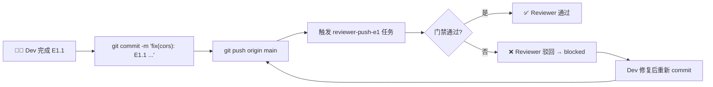
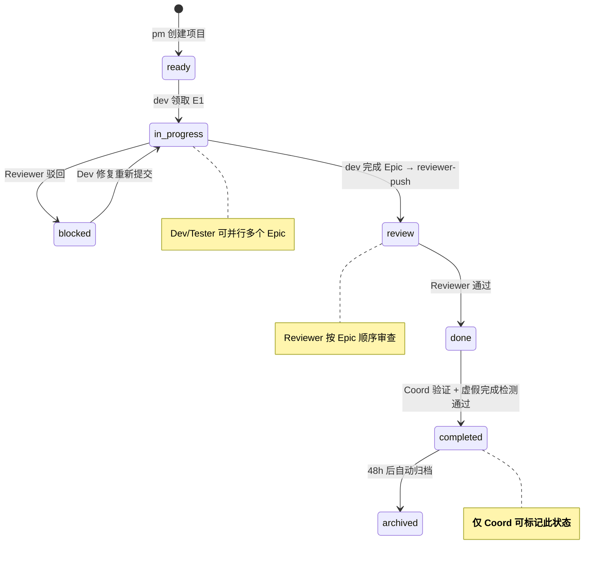
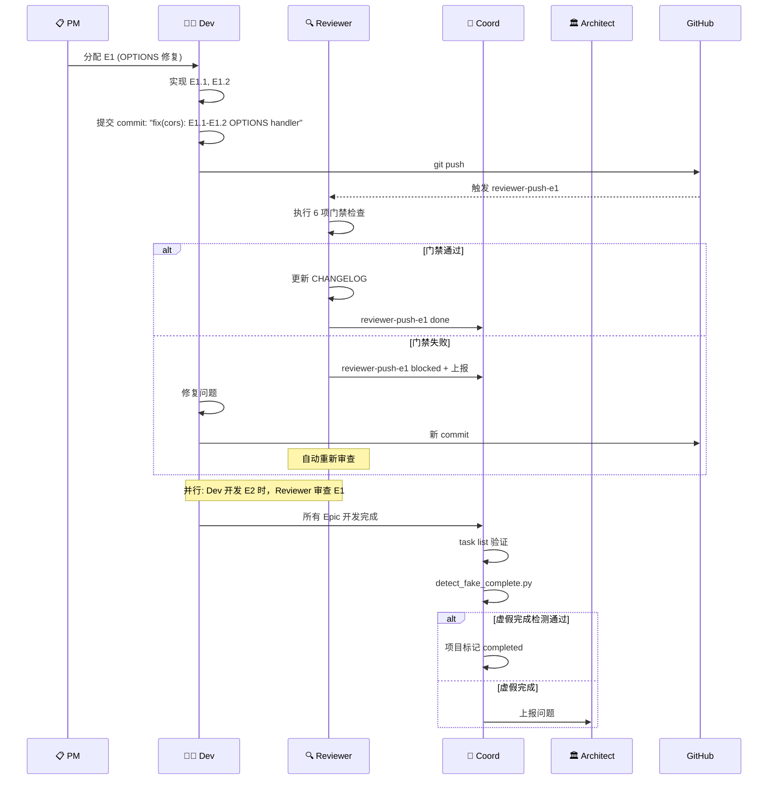

# AGENTS.md: VibeX Reviewer Proposals System

> **项目**: vibex-reviewer-proposals-vibex-proposals-20260406  
> **作者**: architect agent  
> **日期**: 2026-04-06  
> **版本**: v1.0

---

## 1. 角色定义

本项目涉及 4 个核心 Agent 角色，各角色职责明确，边界清晰。

| 角色 | 负责范围 | 关键约束 |
|------|----------|----------|
| **Dev** | 编码实现、测试编写 | 提交必须带 Epic 标识，通过所有门禁 |
| **Reviewer** | 代码审查、PR 质量门禁 | 驳回红线明确，状态回滚自动化 |
| **Coord** | 项目管理、状态终验 | completed 只能由 Coord 手动标记 |
| **Architect** | 架构设计、技术决策 | 不参与日常任务执行 |

---

## 2. Dev Agent 职责

### 2.1 提交规范

**强制规则**: 所有 commit message 必须包含 Epic 标识

```bash
# 格式: <type>(<scope>): E<EpicID>.<StoryID> <description>
# 示例:
git commit -m "fix(cors): E1.1 OPTIONS handler registration order"
git commit -m "feat(canvas): E2.1 checkbox onChange to onToggleSelect"
git commit -m "fix(schema): E3.1 add flowId to AI response schema"
```

**禁止**:
- ❌ `git commit -m "fix bug"` — 无 Epic 标识
- ❌ `git commit -m "E1.1 fix"` — 缺少类型前缀
- ❌ 多个 Epic 在同一 commit 中（除非明确标注）

### 2.2 测试要求

**强制规则**: 每个新增 API endpoint / 新增字段 / 新增组件必须有专项测试

```typescript
// ✅ 正确示例：同一 commit 包含功能和测试
// commit: "feat(health): E3.1 add /health endpoint with prismaHealth field"
describe('E3.1: Health endpoint', () => {
  it('returns { ok: true, prismaHealth: true }', async () => {
    const res = await fetch('/health');
    const body = await res.json();
    expect(body.ok).toBe(true);
    expect(body.prismaHealth).toBe(true); // 新增字段必须被测试
  });
});
```

```typescript
// ❌ 错误示例：功能提交和测试提交分离（除非拆解Epic）
// commit 1: "feat(health): E3.1 add /health endpoint" (无测试)
// commit 2: "test(health): E3.1 add tests" (应合并到同一 commit)
```

### 2.3 任务推送流程



---

## 3. Reviewer Agent 职责

### 3.1 审查红线（任一触发即驳回）

| 红线编号 | 触发条件 | 驳回理由模板 |
|----------|----------|--------------|
| **R-01** | OPTIONS 预检返回非 204 | `OPTIONS returned {status}, expected 204. CORS preflight blocked.` |
| **R-02** | CORS headers 缺失 | `Missing Access-Control-Allow-Origin header` |
| **R-03** | 新增功能无专项测试 | `E{ID}: New feature without dedicated test case. Add at least one targeted test.` |
| **R-04** | commit 无 Epic 标识 | `Commit message missing Epic ID. Format: type(scope): E{ID}.{SID} description` |
| **R-05** | 同一 Epic 跨多个未关联 commit | `Epic E{ID} split across unrelated commits. Merge or add cross-commit reference.` |
| **R-06** | 代码引入安全漏洞 | `Security: {vulnerability_type} detected at {location}` |

### 3.2 驳回后状态回滚（自动执行）

当 Reviewer 驳回代码时，**自动执行**以下操作，无需 Coord 介入：

```bash
# 自动执行（Reviewer CLI 内部）
python3 task_manager.py update <project> reviewer-push-e{ID} blocked \
  --blocked-reason "<R-XX>: <具体驳回理由>"

# 记录被驳回的 commit hash
echo "<commit_hash> rejected at $(date)" >> .reviewer-rejections.log
```

**Reviewer 的正确行为**:
- ✅ 驳回后立即 blocked reviewer-push-eN
- ✅ 记录驳回 commit hash
- ✅ 等待修复 commit 重新 push 后重新审查
- ❌ **禁止**在原 reviewer-push 已 done 的情况下跳过重新审查

### 3.3 CHANGELOG 维护职责

Reviewer 负责维护项目的 CHANGELOG，具体规则：

1. **审查通过后**，立即更新 CHANGELOG
2. **按 Epic 分组**记录所有 commit
3. **自动生成**：使用 `commit_epic_map.py` 脚本减少手动工作量

```bash
# Reviewer 在项目审查通过后执行
python3 ~/.openclaw/skills/reviewer/scripts/commit_epic_map.py \
  /root/.openclaw/vibex vibex-backend \
  /path/to/IMPLEMENTATION_PLAN.md >> CHANGELOG.md
```

### 3.4 PR 质量门禁检查清单

每个 reviewer-push 任务必须验证以下 6 项：

| # | 检查项 | 验证方法 | 通过标准 |
|---|--------|----------|----------|
| 1 | OPTIONS 返回 204 | `curl -X OPTIONS -I /v1/projects` | status = 204 |
| 2 | CORS headers 存在 | 检查 response headers | `Access-Control-Allow-Origin: *` |
| 3 | Epic commit 标识 | `git log --oneline` grep Epic ID | 所有 commit 含 Epic ID |
| 4 | 新功能专项测试 | 审查测试文件 | 每个新功能 ≥ 1 测试 |
| 5 | 回归测试通过 | `npm test` | 全部通过 |
| 6 | CHANGELOG 更新 | 审查 CHANGELOG.md | 包含本 Epic 所有 commit |

---

## 4. Coord Agent 职责

### 4.1 项目 Status 管理规则（核心）

> ⚠️ **强制规则**: 项目 `status=completed` 只能由 Coord 在 `coord-completed` 任务完成时手动标记。
> Dev / Reviewer / Tester 完成各自的 Epic 任务后，**不得自动变更项目 status**。

**Coord 的正确行为**:
- ✅ coord-completed 提交前，执行 `task list --project <name>` 确认所有 reviewer-push 全部 done
- ✅ 发现虚假 completed 时，立即上报 architect
- ❌ **禁止**在 `task list` 未全部 done 时标记 completed

### 4.2 coord-completed 验证流程

```bash
# Step 1: 列出项目所有任务
python3 task_manager.py list --project vibex-backend

# Step 2: 检查输出
# ✅ 所有 reviewer-push-eN 显示 done → 可标记 completed
# ❌ 任一 reviewer-push-eN 显示 blocked/in-progress → 阻塞

# Step 3: 执行虚假完成检测
python3 ~/.openclaw/skills/reviewer/scripts/detect_fake_complete.py vibex-backend
# 退出码 0 = 通过，退出码 1 = 检测到虚假 completed
```

### 4.3 项目状态机



---

## 5. Architect Agent 职责

### 5.1 架构提案规范

每个架构提案必须包含以下结构：

```markdown
## 执行决策
- **决策**: 已采纳 | 已拒绝 | 待评审
- **执行项目**: [team-tasks 项目 ID 或 "无"]
- **执行日期**: [YYYY-MM-DD 或 "待定"]
```

**提案必须包含**:
1. 执行决策段落（状态/项目/日期）
2. 问题背景（根因分析）
3. Tech Stack（含版本选择理由）
4. Mermaid 架构图
5. 实施计划（含 Sprint 拆分）

### 5.2 架构审查触发条件

以下情况必须发起 architect 讨论，不得在实现频道临时决策：

- 新增外部依赖（npm 包、API）
- 跨模块状态共享
- 数据库 schema 变更
- CI/CD 流程变更
- 引入新 Agent 角色或职责变更

---

## 6. 协作流程

### 6.1 端到端开发流程



### 6.2 异常处理流程

| 异常场景 | 处理者 | 处理方式 |
|----------|--------|----------|
| Reviewer 驳回代码 | Dev | 修复后重新 commit + push，Reviewer 自动重新审查 |
| coord-completed 虚假完成 | Coord | 立即 blocked，向 Architect 上报 |
| 测试覆盖率不足 | Reviewer | R-03 驳回，要求 Dev 补充测试 |
| CHANGELOG 遗漏 | Reviewer | 使用 commit_epic_map.py 自动补充 |
| 重复项目检测 | PM | 在 analyze-requirements 阶段检查现有项目 |

### 6.3 消息格式规范

**任务领取**:
```
📌 领取任务: <project>/<task>
👤 Agent: <角色>
⏰ 时间: <timestamp>
🎯 目标: <具体目标>
```

**进度更新**:
```
🔄 进度更新: <project>/<task>
📊 状态: <step> (x/y)
📝 说明: <detail>
```

**任务完成**:
```
✅ 任务完成: <project>/<task>
📦 产出物: <文件路径>
🔍 验证: <验证方法>
```

**任务阻塞**:
```
⚠️ 任务阻塞: <project>/<task>
🔒 原因: <reason>
📋 缺失项: <missing>
❓ 问题: <question>
```

---

## 7. 质量门禁自动化

### 7.1 CI 集成

在 GitHub Actions 中集成以下检查：

```yaml
# .github/workflows/reviewer-gate.yml
name: Reviewer Quality Gate

on:
  push:
    branches: [main, develop]
  pull_request:

jobs:
  reviewer-gate:
    runs-on: ubuntu-latest
    steps:
      - uses: actions/checkout@v4

      - name: Run unit tests
        run: npm test

      - name: OPTIONS preflight check
        run: |
          curl -s -o /dev/null -w "%{http_code}" \
            -X OPTIONS http://localhost:8787/api/v1/projects | \
            grep -q "204" || exit 1

      - name: CORS headers check
        run: |
          curl -s -I -X OPTIONS http://localhost:8787/api/v1/projects | \
            grep -qi "access-control-allow-origin" || exit 1

      - name: Commit message format check
        run: |
          git log --oneline -10 | grep -qv "E[0-9]" && \
          echo "ERROR: Commit without Epic ID" && exit 1

      - name: Fake complete detection
        run: |
          python3 scripts/detect_fake_complete.py ${{ github.event.repository.name }}
```

### 7.2 验收标准

| 指标 | 基线 | 目标 | 测量方法 |
|------|------|------|----------|
| Reviewer 无效阻塞处理时间 | 30min+/次 | 0min | 心跳报告统计 |
| 虚假 completed 项目数 | 2个/天 | 0个/天 | coord 日志 |
| CHANGELOG commit 遗漏率 | 1+/Epic | 0 | commit_epic_map.py 验证 |
| 测试盲区数量 | 2个已知 | 0个 | PR 审查记录 |
| 审查驳回后重新通过时间 | 手动 | < 5min | task_manager 日志 |

---

## 8. 文件清单

| 文件 | 路径 | 负责人 |
|------|------|--------|
| architecture.md | `docs/vibex-reviewer-proposals-.../architecture.md` | Architect |
| IMPLEMENTATION_PLAN.md | `docs/vibex-reviewer-proposals-.../IMPLEMENTATION_PLAN.md` | Architect |
| AGENTS.md | `docs/vibex-reviewer-proposals-.../AGENTS.md` | Architect |
| task_manager.py | `~/.openclaw/skills/team-tasks/scripts/task_manager.py` | Dev |
| commit_epic_map.py | `~/.openclaw/skills/reviewer/scripts/commit_epic_map.py` | Dev |
| detect_fake_complete.py | `~/.openclaw/skills/reviewer/scripts/detect_fake_complete.py` | Dev |
| gateway-cors.test.ts | `apps/api/src/__tests__/gateway-cors.test.ts` | Dev |
| cors.spec.ts | `apps/e2e/src/cors.spec.ts` | Dev |

---

## 9. 术语表

| 术语 | 定义 |
|------|------|
| **Epic** | 一个功能模块的完整实现，包含多个 Story |
| **Story** | Epic 内的子任务，对应一个 commit |
| **reviewer-push** | Reviewer 验证 dev commit 通过后执行的任务 |
| **coord-completed** | Coord 验证所有 Epic 完成后标记项目为完成的任务 |
| **虚假完成** | 项目 status=completed 但仍有 Epic 未完成的情况 |
| **门禁检查** | Reviewer 在 reviewer-push 中执行的 6 项标准化检查 |
| **CHANGELOG** | 项目变更记录，按 Epic 分组，由 Reviewer 维护 |

---

*文档版本: v1.0 | 最后更新: 2026-04-06*
