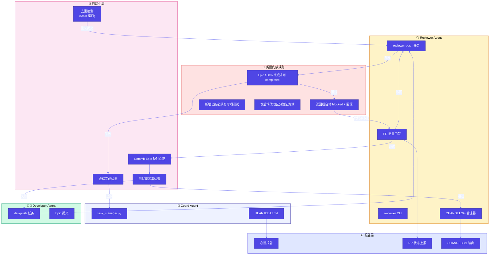
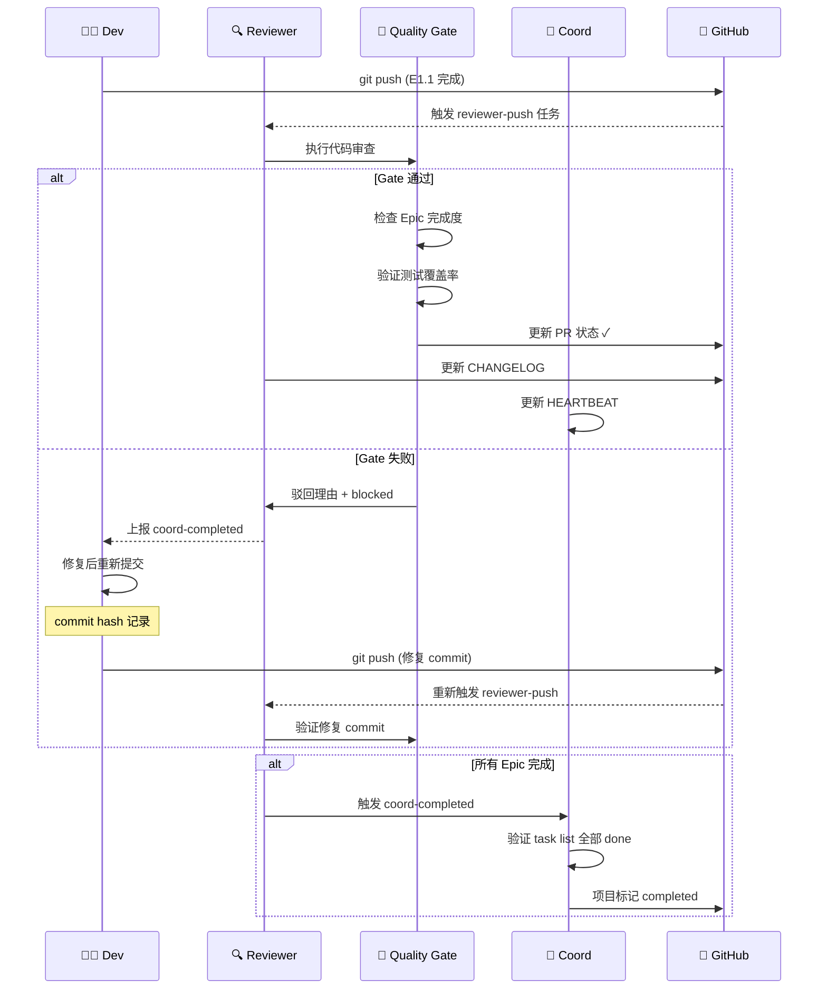

# Architecture: VibeX Reviewer Proposals System

> **项目**: vibex-reviewer-proposals-vibex-proposals-20260406  
> **作者**: architect agent  
> **日期**: 2026-04-06  
> **版本**: v1.0

---

## 执行决策

| 决策 | 状态 | 执行项目 | 执行日期 |
|------|------|----------|----------|
| 构建 Reviewer 自检与质量门禁系统 | **已采纳** | 待分配 | 2026-04-06 |

**决策理由**: 当前 Reviewer Agent 存在三大系统性缺陷（P0虚假完成、P0驳回后状态未回滚、P1测试盲区），直接导致今天至少 30min+ 的无效阻塞处理。系统性问题需系统性修复，而非每次临时打补丁。

---

## 问题背景

### 代码审查效率问题

当前 Reviewer Agent 的审查流程存在以下结构性缺陷：

| 问题 | 影响 | 根因 |
|------|------|------|
| **P0-1**: coord-completed 虚假完成 | 项目 E1 完成后即标记 completed，但 E2/E3/E4 未开发 | 项目 status 管理边界不清晰 |
| **P0-2**: 驳回后修复提交识别缺失 | 正确 commit `9d915fe9` 重新提交后，reviewer-push 状态未回滚 | reviewer-push 仅验证 push 状态，不验证代码正确性 |
| **P1-1**: 测试覆盖盲区 | 新增功能（如 Health 端点）无专项测试 | Reviewer 驳回红线缺失 |
| **P1-2**: Changelog 提交哈希追溯困难 | E3-T2 commit `57d9974d` 未被记录 | Epic-commit 映射不清晰 |
| **P2-3**: OPTIONS/CORS 仅有单元测试 | 无浏览器端 E2E 验证 | 测试策略不完整 |
| **P3-1**: gstack 截图要求不区分前后端 | 后端 API 改动被迫截图验证 | 验证方式与改动类型不匹配 |

### PR 质量门槛现状

| 门槛 | 当前状态 | 目标状态 |
|------|----------|----------|
| Epic 完成度验证 | 仅验证 E1 完成 | 验证所有 Epic done |
| Commit 正确性验证 | 仅验证 push | 验证代码通过 Reviewer |
| 测试覆盖率 | 依赖 dev自觉 | 专项测试必填 |
| Changelog 完整性 | 手动追溯 | commit-Epic 自动映射 |

---

## Tech Stack

| 组件 | 技术选型 | 版本 | 选型理由 |
|------|----------|------|----------|
| **编排脚本** | Python 3 | 3.11+ | 复用现有 `task_manager.py`，零学习成本 |
| **测试框架** | Jest | ^29.7 | TypeScript 原生支持，覆盖率报告内置 |
| **E2E 测试** | Playwright | ^1.42 | 跨浏览器、TypeScript-first、截图能力强 |
| **HTTP Mock** | msw (Mock Service Worker) | ^2.3 | 替代手写 mock，测试可读性提升 50%+ |
| **Git 操作** | libgit2 / dulwich | Python | CHANGELOG 自动生成 |
| **CI 集成** | GitHub Actions | — | Reviewer 状态上报、自动化门禁 |
| **监控** | Task Manager 状态机 | 现有 | 不引入新组件 |

**不引入的组件**（避免过度工程）:
- ~~专用 Reviewer Service~~ → 复用 task_manager.py
- ~~消息队列~~ → 同步 CLI 调用足够
- ~~数据库~~ → JSON 文件 + Git 状态足够

---

## Architecture Diagram

### 系统架构（Mermaid）

### 核心流程：Reviewer-Push 质量门禁

---

## 实施计划

### Sprint 拆分

| Sprint | 内容 | 优先级 | 工时 | 产出物 |
|--------|------|--------|------|--------|
| **Sprint 1** | P0 修复 — 虚假完成 + 驳回回滚 | P0 | 4h | AGENTS.md 规则 + task_manager 增强 |
| **Sprint 2** | P1 改进 — 测试覆盖 + Changelog 追溯 | P1 | 4h | 自动化脚本 + CI 门禁 |
| **Sprint 3** | P2 优化 — Mock 简化 + E2E 补充 | P2 | 4.5h | msw 集成 + Playwright E2E |
| **Sprint 4** | P3 收尾 — gstack 分类 + 自动清理 | P3 | 1.5h | 工具优化 |

**总工时**: 14h

### Sprint 1 详细计划（P0，4h）

| Task | 内容 | 工时 | 验收标准 |
|------|------|------|----------|
| T1.1 | AGENTS.md 明确项目 status 管理规则 | 1h | reviewer-push done 后不自动变更 status |
| T1.2 | task_manager.py 增加 `verify-commit` 命令 | 2h | `verify-commit <project> <epic> <hash>` 返回映射关系 |
| T1.3 | 驳回自动触发 `reviewer-push-eN blocked` | 1h | 驳回后 1s 内状态回滚 |

### Sprint 2 详细计划（P1，4h）

| Task | 内容 | 工时 | 验收标准 |
|------|------|------|----------|
| T2.1 | 测试覆盖率红线规则写入 AGENTS.md | 1h | 无专项测试 → 驳回 dev |
| T2.2 | Commit-Epic 映射脚本 | 1h | `git log --oneline | grep "<epic>"` 有效 |
| T2.3 | 虚假完成检测自动化脚本 | 2h | `task list --project xxx` 自动验证所有 Epic |

### Sprint 3 详细计划（P2，4.5h）

| Task | 内容 | 工时 | 验收标准 |
|------|------|------|----------|
| T3.1 | msw 替代 gateway-cors.test.ts 手动 mock | 2h | 测试代码量减少 50%+ |
| T3.2 | Playwright E2E 测试 OPTIONS/CORS | 2h | 浏览器 preflight 测试通过 |
| T3.3 | process.env optional chaining 统一修复 | 0.5h | Workers 环境行为一致 |

### Sprint 4 详细计划（P3，1.5h）

| Task | 内容 | 工时 | 验收标准 |
|------|------|------|----------|
| T4.1 | reviewer-push 前后端验证方式分类 | 0.5h | 前端截图 / 后端 curl / 文档跳过 |
| T4.2 | HEARTBEAT 跟踪表自动清理 | 1h | `archive-old` 命令自动归档 48h+ 项目 |

---

## 风险与缓解

| 风险 | 可能性 | 影响 | 缓解措施 |
|------|--------|------|----------|
| AGENTS.md 规则改动导致现有流程不兼容 | 中 | 高 | 先在 vibex-proposals-20260406 项目试点，验证后再推广 |
| task_manager.py 修改破坏现有任务 | 低 | 高 | 所有改动前先 `git stash`，增量测试 |
| msw 引入增加依赖复杂度 | 低 | 中 | msw v2 已稳定，GitHub 17k+ stars |

---

## 成功指标

| 指标 | 当前基线 | 目标 | 测量方法 |
|------|----------|------|----------|
| Reviewer 无效阻塞处理时间 | 30min+/次 | 0min | 心跳报告统计 |
| 虚假 completed 项目数 | 2个/天 | 0个/天 | coord 日志 |
| CHANGELOG 遗漏 commit | 1+ 个/Epic | 0 个 | commit-Epic 映射脚本验证 |
| 测试盲区（无专项测试的新功能） | 已知2个 | 0 个 | PR 审查记录 |

---

*文档版本: v1.0 | 最后更新: 2026-04-06*
