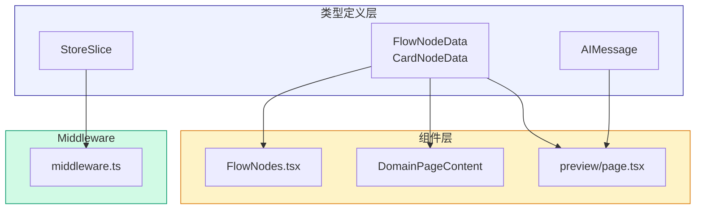

# Architecture: VibeX Reviewer Proposals — TypeScript Type Safety 2026-04-10

> **项目**: vibex-reviewer-proposals-vibex-proposals-20260410  
> **作者**: Architect  
> **日期**: 2026-04-10  
> **版本**: v1.0

---

## 执行决策

| 决策 | 状态 | 执行项目 | 执行日期 |
|------|------|----------|----------|
| 类型安全优先 | **已采纳** | vibex-reviewer-proposals-vibex-proposals-20260410 | 2026-04-10 |
| 泛型约束 | **已采纳** | vibex-reviewer-proposals-vibex-proposals-20260410 | 2026-04-10 |

---

## 1. Tech Stack

| 组件 | 技术选型 | 版本 | 说明 |
|------|----------|------|------|
| **类型** | TypeScript strict | ^5.5 | 严格模式 |
| **React Flow** | @xyflow/react | ^0.40 | 类型化节点 |
| **状态** | Zustand | ^4.5 | 带泛型的 Store |

---

## 2. 架构图

### 2.1 类型修复分层



---

## 3. 类型定义详细设计

### 3.1 React Flow 节点类型

```typescript
// types/flow.ts

// === 基类 ===
export interface BaseNodeData {
  id: string;
  label?: string;
  selected?: boolean;
}

export interface Position {
  x: number;
  y: number;
}

// === FlowNodeData ===
export interface FlowNodeData extends BaseNodeData {
  type: 'flow';
  flowType?: 'domain-event' | 'command' | 'query' | 'policy';
  boundedContext?: string;
  description?: string;
}

// === CardNodeData ===
export interface CardNodeData extends BaseNodeData {
  type: 'card';
  cardType?: 'entity' | 'value-object' | 'aggregate' | 'service';
  attributes?: Attribute[];
  methods?: string[];
}

export interface Attribute {
  name: string;
  type: string;
  visibility?: 'public' | 'private' | 'protected';
}

// === 节点 Props ===
export type FlowNodeProps = NodeProps<FlowNodeData>;
export type CardNodeProps = NodeProps<CardNodeData>;

// === Union ===
export type AnyNodeData = FlowNodeData | CardNodeData | BaseNodeData;
```

### 3.2 Zustand Middleware 类型

```typescript
// types/store.ts

// 修复前
export const createStoreSlice = <T extends Partial<StoreState>>(slice: StoreSlice<any>) => slice;
// 修复后
export type StoreSlice<T extends object, S extends object = {}> = (
  set: SetStateFunction<S>,
  get: GetStateFunction<S>,
  api: StoreApi<S>
) => T;

export interface StoreState {
  // 明确的状态接口
}

export interface StoreActions {
  // 明确的 action 接口
}

export type StoreSliceType = StoreSlice<StoreActions, StoreState>;

export const createStoreSlice = <A extends StoreActions>(slice: StoreSliceType) => slice;
```

### 3.3 API Schema 类型

```typescript
// types/api.ts

export interface AIMessage {
  id?: string;
  role: 'user' | 'assistant' | 'system' | 'tool';
  content: string;
  name?: string;
  toolCalls?: ToolCall[];
  toolCallId?: string;
  timestamp?: number;
}

export interface ToolCall {
  id: string;
  type: 'function';
  function: {
    name: string;
    arguments: string; // JSON string
  };
}

export interface UIBlock {
  id: string;
  type: 'text' | 'code' | 'mermaid' | 'component';
  content: string;
  metadata?: Record<string, unknown>;
}

export interface UIStreamEvent {
  type: 'block' | 'delta' | 'done' | 'error';
  data: UIBlock | string | null;
}
```

---

## 4. 修复方案

### 4.1 FlowNodes.tsx 修复

```typescript
// components/FlowNodes.tsx
// 修复前
const FlowNode: React.FC<NodeProps<any>> = ({ data }) => { ... }

// 修复后
import type { FlowNodeData } from '@/types/flow';

interface FlowNodeProps {
  data: FlowNodeData;
  selected?: boolean;
}

const FlowNode: React.FC<FlowNodeProps> = ({ data, selected }) => {
  const { label, flowType, boundedContext, description } = data;
  
  return (
    <div className={cn('flow-node', selected && 'selected')}>
      {label && <div className="node-label">{label}</div>}
      {flowType && <div className="node-type">{flowType}</div>}
      {boundedContext && <div className="node-context">{boundedContext}</div>}
    </div>
  );
};
```

### 4.2 DomainPageContent 修复

```typescript
// pages/domain/[id].tsx
// 修复前
const [nodes, setNodes, onNodesChange] = useNodesState<any>([]);

// 修复后
import type { FlowNodeData } from '@/types/flow';

const [nodes, setNodes, onNodesChange] = useNodesState<FlowNodeData>([]);
```

### 4.3 preview/page.tsx 修复

```typescript
// pages/preview/page.tsx
// 修复前
modelList.map((ctx: any) => <div key={ctx.id}>{ctx.name}</div>)

// 修复后
interface DomainContext {
  id: string;
  name: string;
  entities: string[];
}

modelList.map((ctx: DomainContext) => <div key={ctx.id}>{ctx.name}</div>)
```

### 4.4 双重断言消除

```typescript
// 修复前
<CardTreeRenderer
  {...(props as any)}
  onNodeClick={handleNodeClick}
/>

// 修复后
interface CardTreeRendererProps {
  nodes: CardNodeData[];
  onNodeClick?: (nodeId: string) => void;
  selectedIds?: Set<string>;
}

const CardTreeRenderer: React.FC<CardTreeRendererProps> = ({ 
  nodes, 
  onNodeClick,
  selectedIds 
}) => { ... };

// 调用处
<CardTreeRenderer
  nodes={props.nodes}
  onNodeClick={handleNodeClick}
/>
```

### 4.5 middleware.ts 修复

```typescript
// stores/middleware.ts
// 修复前
export const createSlice = <T>(slice: StoreSlice<any>) => slice;

// 修复后
import type { StoreState, StoreActions } from './types';

export type AppStoreSlice = StoreSlice<StoreActions, StoreState>;

export const createSlice = <A extends StoreActions>(slice: AppStoreSlice) => slice;
```

---

## 5. 验收标准

| 检查项 | 命令 | 目标 |
|--------|------|------|
| NodeProps<any> | `grep -rn "NodeProps<any>" --include="*.tsx"` | 0 结果 |
| StoreSlice<any> | `grep -rn "StoreSlice<any>" --include="*.ts"` | 0 结果 |
| as any as | `grep -rn "as any as" --include="*.tsx"` | 0 结果 |
| any[] | `grep -rn ": any\[\]" --include="*.ts"` | 0 结果 |
| tsc --noEmit | `pnpm exec tsc --noEmit` | 0 errors |

---

*文档版本: v1.0 | 最后更新: 2026-04-10*
