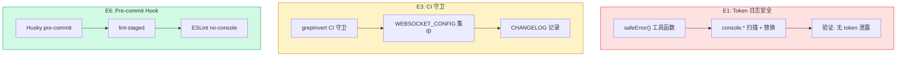

# Architecture: Reviewer Proposals — 2026-04-12 Sprint

**Project**: vibex-reviewer-proposals-vibex-proposals-20260412
**Stage**: architect-review
**Architect**: Architect
**Date**: 2026-04-07
**Version**: v1.0
**Status**: Proposed

---

## 执行决策

| 决策 | 状态 | 执行项目 | 执行日期 |
|------|------|----------|----------|
| E1: Token 日志 safeError 包装 | **待评审** | vibex-reviewer-proposals-vibex-proposals-20260412 | 待定 |
| E3: CI/CD 守卫增强 | **待评审** | vibex-reviewer-proposals-vibex-proposals-20260412 | 待定 |
| E6: 流程标准化 (console.* hook) | **待评审** | vibex-reviewer-proposals-vibex-proposals-20260412 | 待定 |

---

## 1. Tech Stack

| 组件 | 技术选型 | 说明 |
|------|----------|------|
| **ESLint** | @typescript-eslint | no-console 规则 |
| **Husky** | ^9.0 | pre-commit hook |
| **lint-staged** | ^15.0 | staged 文件 lint |
| **GitHub Actions** | YAML | CI 守卫 |
| **pino** | 结构化日志 | safeError 包装 |

---

## 2. Architecture Diagram



---

## 3. Module Design

### 3.1 E1: Token 日志 safeError 包装

#### 3.1.1 safeError 工具

```typescript
// vibex-backend/src/lib/logger/safeError.ts

type SensitiveKey =
  | 'token'
  | 'accessToken'
  | 'refreshToken'
  | 'secret'
  | 'apiKey'
  | 'password'
  | 'authorization';

const SENSITIVE_PATTERNS = [
  /^(token|accessToken|refreshToken|secret|apiKey|password|authorization)$/i,
  /^(bearer|auth).*/i,
  /.*_(token|key|secret|password)$/i,
];

function isSensitiveKey(key: string): boolean {
  return SENSITIVE_PATTERNS.some(p => p.test(key));
}

function hashToken(token: string): string {
  // 只保留前后各2个字符，中间用 *** 替代
  if (token.length <= 4) return '***';
  return `${token.slice(0, 2)}...${token.slice(-2)}`;
}

export function safeError(context: Record<string, unknown>): Record<string, unknown> {
  const result: Record<string, unknown> = {};
  
  for (const [key, value] of Object.entries(context)) {
    if (isSensitiveKey(key) && typeof value === 'string') {
      result[key] = hashToken(value);
    } else if (typeof value === 'object' && value !== null) {
      // 递归处理嵌套对象
      result[key] = safeError(value as Record<string, unknown>);
    } else {
      result[key] = value;
    }
  }
  
  return result;
}

export function safeLog(message: string, context?: Record<string, unknown>): void {
  const safe = context ? safeError(context) : {};
  console.log(message, safe);
}
```

#### 3.1.2 全局 console 拦截

```typescript
// vibex-backend/src/lib/logger/consoleInterceptor.ts

const originalConsole = { ...console };

function createSafeConsole() {
  const safe = (level: 'log' | 'warn' | 'error') =>
    (...args: unknown[]) => {
      const processed = args.map(arg => {
        if (typeof arg === 'object' && arg !== null) {
          try {
            return safeError(arg as Record<string, unknown>);
          } catch {
            return '[unserializable object]';
          }
        }
        return arg;
      });
      originalConsole[level]('[SAFE]', ...processed);
    };

  return {
    log: safe('log'),
    warn: safe('warn'),
    error: safe('error'),
  };
}

// 开发环境保留原始 console，生产环境使用 safe
if (process.env.NODE_ENV === 'production') {
  console.log = createSafeConsole().log;
  console.warn = createSafeConsole().warn;
  console.error = createSafeConsole().error;
}
```

#### 3.1.3 API 路由修复示例

```typescript
// vibex-backend/src/app/api/chat/route.ts

// 修复前 (泄露 token)
console.log('[Chat] Request:', { token, userId, message });

// 修复后 (safe)
import { safeLog, safeError } from '@/lib/logger/safeError';
safeLog('[Chat] Request:', { userId, message }); // token 完全不输出

// 或使用 safeError
console.log('[Chat] Request:', safeError({ token, userId, message }));
// 输出: { token: 'ey...rf', userId: '123' } — token 被 hash
```

---

### 3.2 E3: CI/CD 守卫增强

#### 3.2.1 grepInvert CI 守卫

```yaml
# .github/workflows/ci.yml

jobs:
  config-change-guard:
    name: Config Change Detection
    runs-on: ubuntu-latest
    outputs:
      test_config_changed: ${{ steps.check.outputs.test_config_changed }}
    steps:
      - uses: actions/checkout@v4
        with:
          fetch-depth: 0

      - name: Detect config changes
        id: check
        run: |
          CHANGED=$(git diff --name-only origin/main...HEAD)
          echo "Changed files:"
          echo "$CHANGED"
          
          for f in $CHANGED; do
            case "$f" in
              playwright.config.ts|vitest.config.ts|jest.config.ts|.eslintrc*|tsconfig.json)
                echo "test_config_changed=true" >> $GITHUB_ENV
                echo "test_config_changed=true" >> $GITHUB_OUTPUT
                echo "::set-output name=test_config_changed::true"
                echo "Config file changed: $f"
                ;;
            esac
          done

  full-test:
    name: Full Test Suite
    needs: config-change-guard
    if: needs.config-change-guard.outputs.test_config_changed == 'true'
    steps:
      - uses: actions/checkout@v4
      - name: Run all tests
        run: pnpm test && pnpm playwright test

  quick-test:
    name: Quick Test (skip config-dependent)
    needs: config-change-guard
    if: needs.config-change-guard.outputs.test_config_changed != 'true'
    steps:
      - uses: actions/checkout@v4
      - name: Run unit tests only
        run: pnpm test
```

#### 3.2.2 WEBSOCKET_CONFIG 集中管理

```typescript
// vibex-backend/src/config/websocket.ts
export const WEBSOCKET_CONFIG = {
  maxConnections: parseInt(process.env.WS_MAX_CONNECTIONS ?? '100', 10),
  heartbeatInterval: parseInt(process.env.WS_HEARTBEAT_INTERVAL ?? '30000', 10),
  connectionTimeout: parseInt(process.env.WS_CONNECTION_TIMEOUT ?? '60000', 10),
  maxPayloadSize: parseInt(process.env.WS_MAX_PAYLOAD_SIZE ?? '10485760', 10), // 10MB
} as const;

export type WebSocketConfig = typeof WEBSOCKET_CONFIG;

// 使用: 所有 WebSocket 超时值从 WEBSOCKET_CONFIG 读取
import { WEBSOCKET_CONFIG } from '@/config/websocket';

// ❌ 错误: 硬编码
setTimeout(() => {}, 30000);

// ✅ 正确: 从配置读取
setTimeout(() => {}, WEBSOCKET_CONFIG.heartbeatInterval);
```

---

### 3.3 E6: 流程标准化 — console.* pre-commit hook

#### 3.3.1 ESLint 配置

```json
// .eslintrc.json
{
  "rules": {
    "no-console": ["error", {
      "allow": ["warn", "error"]
    }]
  }
}
```

```json
// package.json 添加 lint-staged
{
  "lint-staged": {
    "*.ts": ["eslint --fix", "prettier --write"],
    "*.tsx": ["eslint --fix", "prettier --write"]
  }
}
```

#### 3.3.2 Husky 配置

```bash
# .husky/pre-commit
#!/bin/sh
. "$(dirname -- "$0")/_/husky.sh"

npx lint-staged

# 如果 lint-staged 失败，阻止 commit
if [ $? -ne 0 ]; then
  echo "ESLint failed. Please fix the errors before committing."
  exit 1
fi
```

#### 3.3.3 批量修复现有 console.*

```bash
#!/bin/bash
# scripts/fix-console.sh

# 替换 console.log 为 safeLog
find vibex-backend/src -name "*.ts" -exec sed -i \
  's/console\.log(\(.*\)[^)]*\()/safeLog(\1)/g' {} \;

# 替换 console.warn 为 safeLog
find vibex-backend/src -name "*.ts" -exec sed -i \
  's/console\.warn(\(.*\)[^)]*\()/safeLog(\1)/g' {} \;

# console.error 保留（错误需要完整 stack）
# 但添加 safeError 包装
find vibex-backend/src -name "*.ts" -exec sed -i \
  's/console\.error(\([^)]*\))/console.error(safeError(\1))/g' {} \;

echo "Console replacements complete"
```

---

## 4. Data Model

### 4.1 WEBSOCKET_CONFIG Schema

```typescript
// vibex-backend/src/config/websocket.ts
export const WEBSOCKET_CONFIG_SCHEMA = {
  WS_MAX_CONNECTIONS: { type: 'int', default: 100, min: 1, max: 10000 },
  WS_HEARTBEAT_INTERVAL: { type: 'int', default: 30000, min: 5000, max: 300000 },
  WS_CONNECTION_TIMEOUT: { type: 'int', default: 60000, min: 10000, max: 600000 },
  WS_MAX_PAYLOAD_SIZE: { type: 'int', default: 10485760, min: 1024, max: 104857600 },
} as const;
```

---

## 5. Performance Impact

| Epic | 性能影响 | 说明 |
|------|----------|------|
| E1 safeError | < 1ms/call | 字符串处理 |
| E3 CI guard | +10-30s | grep 检查 |
| E6 pre-commit | +2-5s | ESLint 检查 |
| **总计** | **无显著影响** | CI 多 30s 可接受 |

---

## 6. Risk Assessment

| # | 风险 | 概率 | 影响 | 缓解 |
|---|------|------|------|------|
| R1 | safeError 误过滤非 token 字段 | 极低 | 低 | 只过滤已知敏感字段 |
| R2 | CI guard 漏检配置变更 | 中 | 中 | 覆盖所有配置文件 |
| R3 | pre-commit 阻塞开发 | 中 | 低 | warn 而非 error 级别可旁路 |
| R4 | husky 安装失败 | 低 | 中 | 提供手动安装脚本 |

---

## 7. Testing Strategy

| Epic | 测试类型 | 验证 |
|------|----------|------|
| E1 safeError | 单元测试 | hashToken / isSensitiveKey |
| E1 console 拦截 | 集成测试 | token 不在日志中出现 |
| E3 CI guard | CI 测试 | 配置变更触发完整测试 |
| E6 pre-commit | 本地测试 | husky 拦截 console.log |

---

## 8. Implementation Phases

| Phase | Epic | 工时 | 依赖 |
|-------|------|------|------|
| 1 | E1.1 safeError 工具 | 0.5h | 无 |
| 2 | E1.2 console 拦截 | 1h | Phase 1 |
| 3 | E3.1 grepInvert CI | 1h | 无 |
| 4 | E3.2 WEBSOCKET_CONFIG | 0.5h | 无 |
| 5 | E6 console.* hook | 0.5h | 无 |
| **Total** | | **3.5h** | |

---

## 9. PRD AC 覆盖

| PRD AC | 技术方案 | 状态 |
|--------|---------|------|
| AC1.1: Token 无泄露 | safeError + console 拦截 | ✅ |
| AC3.1: grepInvert 守卫 | GitHub Actions config guard | ✅ |
| AC6.2: console.* pre-commit | Husky + ESLint | ✅ |
